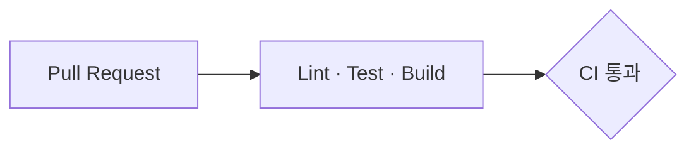

# 블록 패턴 카탈로그 — 섹션 안에서 내용을 담는 정답 모양

세 파트는 같은 종류의 내용(엔드포인트, 테이블, 절차, 규칙, 비교…)을 각자 다른 모양으로 쓴다. 이 파일은 종류마다 모양을 **하나**로 정한다. 변환할 때는 섹션 구조를 두고 그 안의 블록만 이 모양으로 바꾸고, 새로 쓸 때는 처음부터 이 모양으로 쓴다.

공통 원칙 (`conversion-rules.md`):
- 문장은 그대로. 바꾸는 건 그릇(마크업·레이블·순서 아닌 배치)뿐이다.
- 레이블(`**입력**` 등)은 이 파일의 이름으로 통일한다. 문장 안의 단어는 아니다.
- 기준 예시는 세 파트 원본 중 그 종류를 제일 잘 쓴 문서다. 그 문서는 거의 안 바뀐다.

| # | 블록 | 기준 예시 | 주로 바뀌는 파트 |
|---|---|---|---|
| 1 | 엔드포인트 | AI 모델 API 설계 | 풀스택 API 명세 |
| 2 | DB 테이블 | 풀스택 테이블 명세 | - |
| 3 | 기술·개념 설명 | 풀스택 기술 스택 정의서 | AI 설계 문서 |
| 4 | 절차 | 클라우드 3단계 "배포 전 준비" | - |
| 5 | 규칙 나열·깊은 목록 | AI 공통 규약 | 풀스택 테이블 명세, 클라우드 |
| 6 | 표와 각주 | 클라우드 1-2 "Nginx와 Caddy 비교" | AI 엔드포인트 목록 |
| 7 | 다이어그램 | 클라우드 3단계 mermaid | AI |
| 8 | 코드·설정 예시 | 클라우드 2단계 ci.yml | 풀스택(`~~~`), AI(언어 없음) |
| 9 | 참고 링크 | - | 셋 다 |
| 10 | 이미지 | 클라우드 1-2 | 풀스택 기술 스택 |
| 11 | 선택 결과 | 클라우드 1-2 "선택 결과" | - |

---

## 1. 엔드포인트

**언제** API 명세에서 엔드포인트 하나를 설명할 때.

````markdown
<details><summary>① <code>POST /search</code> — AI 검색</summary>

설명 문장. 원문 그대로 1~3문장. 권한: 회원

**입력**

헤더
| 필드 | 타입 | 필수 | 설명 |
|---|---|---|---|

본문
| 필드 | 타입 | 필수 | 설명 |
|---|---|---|---|

**출력** `200 OK`

| 필드 | 타입 | 설명 |
|---|---|---|

**에러**

| 상태 | message | 언제 |
|---|---|---|

**예시**

```json
{ "...": "생략" }
```

</details>
````

- summary: `[참조번호 ]<code>메서드 경로</code> — 이름`. 참조번호(①)는 원문에 있을 때만. `<b>`는 안 쓴다.
- 레이블 순서는 `입력` → `출력` → `에러` → `예시`. 입력이 여러 표면 표 바로 위에 `헤더` `경로` `쿼리` `본문` 캡션 한 줄.
- `권한: 회원` 은 원문에 권한 정보가 있을 때만, 설명 문단 끝에.
- 필드 표 열은 파트 정보에 맞춘다. 헤더 낱말만 통일: `필드` `타입` `필수`(Y/N) `설명`. 풀스택 출력 표의 `NULL` 열, 에러 표의 `코드 | HTTP | 이름 | 메시지` 열은 정보가 다르므로 유지한다.
- 도메인 묶음(`인증 · 3개`)은 바깥 `<details>`가 아니라 `### 인증 · 3개` 제목. 항목 `<details>`는 1단만.
- 예시가 원문에서 표 사이에 끼어 있으면(AI) 그 자리 그대로. 예시 절이 따로 있으면(4장 호출 예시) 그 절 그대로.

| 원본 | 변환 |
|---|---|
| 풀스택 `\| Method \| Path \| 권한 \| 설명 \|` 표 | Method·Path는 summary와 중복이라 뺀다. 설명 셀 문장 → 첫 문단, 권한 → `권한: 회원` |
| 풀스택 `**Request**` `**Header**` `**Path Parameter**` `**Request Body**` | `**입력**` 하나 + 캡션 `헤더` `경로` `본문` |
| 풀스택 `**Response — 성공**` + `HTTP <code>200 OK</code>` | `**출력** \`200 OK\`` |
| 풀스택 `**Response — 실패**` | `**에러**` |
| AI `<b>① AI 검색: <code>POST /search</code></b>` | `① <code>POST /search</code> — AI 검색` |
| AI `> 설명 인용구` | 평문 설명 문단 |
| AI `**출력 (200)**` `**응답 코드**` | `**출력** \`200\`` `**에러**` |

## 2. DB 테이블

**언제** 테이블 명세에서 테이블 하나를 설명할 때. 풀스택 원본이 이미 이 모양이다.

```markdown
### 회원·온보딩 · 6개

<details><summary><code>users</code> — 유저</summary>

**설명**

회원의 서비스 식별 정보와 계정 생명주기를 관리

**컬럼 설명**

- `id`: 유저 레코드를 고유하게 식별하는 기본 키
- `nickname`: 한글 닉네임. 최대 20자 제한을 반영한 VARCHAR(20)

**컬럼 정의**

| 컬럼 | 타입 | NULL | 키 | DEFAULT | UNIQUE |
|---|---|---|---|---|---|

</details>
```

- 레이블 순서 `설명` → `컬럼 설명` → `컬럼 정의`. 컬럼 정의 표는 6열이어도 그대로 (정보).
- 도메인 묶음은 `###` 제목, 테이블 `<details>`는 1단.
- 문서 앞머리의 설계 근거 목록은 #5(깊은 목록)로.

## 3. 기술·개념 설명

**언제** 기술 선택이나 개념을 설명할 때. 풀스택 기술 스택 정의서가 이 모양이라 원본 제목 계층(`####`/`#####`)을 그대로 둔다.

```markdown
#### Virtual Thread

##### 개념 요약
1~3문장.

##### 특징
- 동작 방식·제약을 불릿으로

##### 서비스에 적용할 점
- 우리 서비스 어디에 쓰는지

##### 참고
- https://openjdk.org/jeps/444

##### 주의점
<details><summary>Virtual Thread의 pinning 현상</summary>

자세한 예외·엣지 케이스.

</details>
```

- 항목 사이 `***` 구분선은 뺀다. 제목이 구분한다.
- `주의점`의 `<details>`는 유지 (원본에 있던 접기). `<summary>` 안 `<strong>`은 뺀다 — summary 글자는 이미 굵다.
- 다른 파트가 "왜 이 기술인지"를 쓸 때도 이 순서를 쓴다. 표는 진짜 다열 비교(A안 vs B안)에만.

## 4. 절차

**언제** 순서대로 실행하는 단계.

```markdown
1. Manifest에 지정된 Backend·AI Server Image가 ECR에 있는지 확인
2. Frontend SHA의 코드를 Build
```

- 번호 목록. 단계 수는 원본 그대로 (묶거나 나누지 않는다).
- 원문이 문단이면 문단으로 둔다. 문단을 목록으로 바꾸지 않는다.
- 단계 안 보충 설명은 그 단계 아래 한 단 들여쓴 불릿 하나까지.

## 5. 규칙 나열·깊은 목록

**언제** 각자 독립된 규칙·항목을 나열할 때. 같은 기준으로 비교하는 게 아니라면 표가 아니라 목록이다.

```markdown
- **응답 envelope**: 모든 응답은 `{ "message": …, "data": … }`. /health만 예외
- **시각 기준**: AI DB의 모든 시각 컬럼은 UTC `timestamptz`다
```

- `- **레이블**: 설명` 1단. 레이블은 원문에 있는 것만 쓴다 — 원문이 레이블 없는 불릿이면 불릿 그대로, 레이블을 만들지 않는다.
- "레이블 → 설명" 2단 표인데 설명이 두 문장 이상이면 이 모양으로 (표 틀만 없앤다).
- 3단 이상 들여쓴 목록은 2단으로. 하위 조각은 상위 항목 문장 뒤에 `→` 를 포함해 그대로 이어 붙인다.

```markdown
<!-- 원본 (풀스택 테이블 명세) -->
- 실제 DDL에서는 `active_flag`를 STORED 생성 컬럼으로 도입
  - → InnoDB는 `VIRTUAL` 생성 컬럼에도 `UNIQUE` 인덱스를 지원하지만
    - → 메모리 여유가 있고 성능과 조회 효율이 중요하기 때문에 `STORED`

<!-- 변환 -->
- 실제 DDL에서는 `active_flag`를 STORED 생성 컬럼으로 도입 → InnoDB는 `VIRTUAL` 생성 컬럼에도 `UNIQUE` 인덱스를 지원하지만 → 메모리 여유가 있고 성능과 조회 효율이 중요하기 때문에 `STORED`
```

- 핵심 규칙 목록(공통 규약 등)은 길어도 접지 않는다. 접기는 반복 항목(#1, #2) 전용이다.

## 6. 표와 각주

**언제** 항목 2개 이상을 같은 기준으로 비교하거나(비교 표), 같은 열을 가진 행이 반복될 때(목록·비용·에러 표).

```markdown
| 기준 | Nginx | Caddy |
|---|---|---|
| HTTPS 설정 | Certbot 설정 필요 | 자동 HTTPS 지원 |
```

- 구분선 `|---|`. 숫자 열은 `|---:|` 허용. 빈 셀은 `-`. 셀 안 `<br>`·목록·코드 블록 금지.
- 셀은 한 문장. 두 문장 이상이고 길면(약 60자 초과) 첫 문장 + `¹`, 나머지 문장은 표 바로 아래 각주로 옮긴다. 문장은 그대로. 짧은 조각(`첫 턴은 생략. 30분 지나면 만료`)은 그대로 둔다.

```markdown
<!-- 원본 (AI 엔드포인트 목록) -->
| ① | POST /search | 검색어로 도서를 조회한다. 키워드 검색과 벡터 검색 순위를 합친다. 결과가 0건이면 대화형 추천으로 전환하라는 신호를 함께 반환한다 | V1 |

<!-- 변환 -->
| ① | `POST /search` | 검색어로 도서를 조회한다 ¹ | V1 |

¹ 키워드 검색과 벡터 검색 순위를 합친다. 결과가 0건이면 대화형 추천으로 전환하라는 신호를 함께 반환한다
```

- 열은 5개까지. 원본이 6열이고 열마다 정보가 다르면(컬럼 정의) 그대로 둔다.
- 표 위 캡션 한 줄은 제목이 설명하지 못할 때만.
- 원문이 문단인데 표로 만들고 싶으면 **원문을 두고 표를 추가**한다. 문단을 표로 바꾸지 않는다 (조건이 빠진다).

## 7. 다이어그램

**언제** 구성·흐름을 그림으로 보일 때.

````markdown


| 노드 | 설명 |
|---|---|
| Lint · Test · Build | 원문에 있던 긴 설명 그대로 |
````

- `flowchart LR`/`TB`, `sequenceDiagram`만. 노드 12개 이하, 노드 텍스트 15자 이내.
- 노드 안의 긴 설명은 노드 아래 `노드 | 설명` 표로 옮긴다. 설명이 짧으면 표는 없어도 된다.
- 노드 텍스트의 따옴표(`["…"]`)는 텍스트에 특수문자가 없으면 뺀다.
- `style`·`classDef`·색상 금지. 문서당 2개까지. 넘으면 원본 그대로 두고 보고에 적는다 (구조상 나눌 수 없음).

## 8. 코드·설정 예시

**언제** 명령어·설정 파일·요청/응답 예시.

````markdown
<details><summary>Backend ci.yml</summary>

```yaml
name: backend-ci
# ... 생략
```

</details>
````

- ```` ``` ````+언어(`json` `yaml` `bash` `python` `java` `sql` `mermaid` `text`). `~~~`는 ```` ``` ````로. 언어는 여는 줄에만 붙이고 닫는 줄은 ```` ``` ```` 만 쓴다.
- 20줄을 넘고 접히지 않은 본문에 있으면 `<details><summary>{파일명 또는 한 줄 설명}</summary>` 로 제자리 접기. `<summary>` 다음 줄은 빈 줄.
- 이미 `<details>` 안(엔드포인트·테이블 블록)이면 길이와 상관없이 그대로 둔다. 2단 접기 금지.
- 코드 내용은 한 글자도 바꾸지 않는다. 실제 키·토큰·IP가 있으면 바꾸지 말고 보고에 적는다.

## 9. 참고 링크

**언제** 외부 문서·JEP·RFC·공식 가이드 링크.

```markdown
- [GitHub Actions 배포 환경](https://docs.github.com/…)
- https://openjdk.org/jeps/444
```

- 그 절(가장 가까운 제목 아래) 끝에 `- ` 목록으로 모은다. 문단 사이에 낀 링크 줄은 절 끝으로 옮긴다 (같은 절 안에서만).
- 링크 텍스트가 있으면 그대로. 맨 URL은 맨 URL로 둔다 (텍스트를 지어내지 않는다).
- `> 참고` 인용 블록으로 감싸지 않는다. `>`는 주의 1개에만.

## 10. 이미지

```markdown
<p align="center">
  
</p>
```

- 나란히 놓기·폭 지정이 필요하면 HTML `` 그대로. 아니면 ``.
- 캡션은 원본에 있을 때만. 원본(Figma, draw.io) 링크가 있으면 캡션에 남긴다.

## 11. 선택 결과

**언제** 비교 뒤에 "무엇을 골랐는지"를 쓸 때.

```markdown
Reverse Proxy는 **Nginx + Certbot**을 사용한다.

Caddy는 … 장점이 있다. 하지만 … (이유 문단 원문 그대로)
```

- 결론 문장이 이미 있으면 그 안의 선택지 이름을 굵게 1회. 결론 문장이 없으면 만들지 않는다.
- 비교 표(#6) → 결론 문장 → 이유 문단 순서가 원본에 있으면 그대로. 순서를 바꾸지 않는다.
