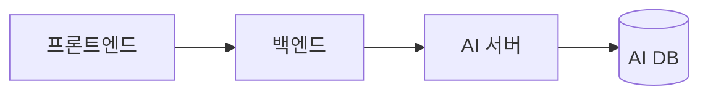

# 위키 가독성 규칙 (11개)

적용 범위: 레포 `docs/` 의 모든 문서 — **새 문서와 변환 문서 모두.** 템플릿과 충돌하면 템플릿의 섹션 구성이 우선하고, 표현 방식은 이 문서를 따른다.

> 변환 문서에서 원문의 **글자**를 바꾸는 규칙은 10번의 문체 어미와 `block-patterns.md` 의 레이블 이름뿐이다. 나머지 규칙은 보이는 방식(마크업·배치·그릇)만 바꾼다. 제목의 글자·순서·계층, 코드 블록 내용, 식별자, 외부 인용문, 숫자는 손대지 않는다 (`conversion-rules.md`). 원문이 규칙을 크게 어기는데 형식만으로 못 고치면 고치지 말고 파트에 알린다.

| # | 분류 | 규칙 (한 줄) |
|---|---|---|
| 1 | 제목 | `##`부터 시작. 새 문서는 `###`까지, 변환 문서는 원본 계층 그대로 |
| 2 | 제목 | 새 제목은 명사형 20자 이내, 한 페이지 안에서 중복 금지. 변환 문서는 원본 제목 글자 그대로 |
| 3 | 표·리스트 | 내용 모양에 따라 표·번호 목록·글머리 기호·문장 중 하나를 고른다 |
| 4 | 표·리스트 | 표는 열 5개, 셀 한 문장 이내 (넘치면 각주) |
| 5 | 강조 | 굵게는 섹션당 3번, 인용 블록은 정해진 용도에만 |
| 6 | 코드 블록 | 언어를 지정하고 20줄 넘으면 제자리에서 접는다 |
| 7 | 다이어그램 | Mermaid는 문서당 2개, 노드 12개 이하 |
| 8 | 용어 | 도구 이름은 원문, 개념어는 한국어 + 첫 등장 시 원문 병기 (새 문장만) |
| 9 | 용어 | 날짜·숫자·단위·파트 이름은 정해진 형식으로 |
| 10 | 문체 | "~한다"체. 새 문장은 한 문장에 한 내용, 조건을 먼저 |
| 11 | 구조 | 항목별로 반복되는 긴 섹션은 `<details>` 1단으로 접는다. 묶음 상자는 제목으로 |

블록별 정답 모양(엔드포인트, 테이블, 절차, 규칙 목록, 표·각주, 다이어그램, 코드, 참고 링크, 이미지, 선택 결과)은 `block-patterns.md` 에 있다.

---

## 1. 제목은 `##`부터

- `#`는 쓰지 않는다. GitHub Wiki가 페이지 이름을 맨 위에 제목으로 이미 표시한다. 원본 첫 줄이 페이지 제목을 반복하면 본문에서 빼고 frontmatter로 기록한다.
- 큰 섹션은 `## 1. 제목`처럼 번호를 붙인다. 번호 없는 `##`를 번호 있는 섹션 사이에 끼우지 않는다. (새 문서. 변환 문서는 원본 번호 그대로)
- **새 문서**는 `###`까지만. `####`가 필요하면 문서를 나눌 신호다.
- **변환 문서**는 원본의 제목 계층을 그대로 두고 최상위만 `##`로 맞춘다. `####`·`#####`가 나와도 문서를 나누지 않는다 (구조 불변).
- 굵은 글씨(`**프로젝트 소개**`)로 제목을 흉내 내지 않는다. 목차와 앵커 링크에 잡히지 않는다. 원본이 그렇게 썼으면 글자 그대로 진짜 제목(`###`)으로 바꾼다. 항목을 묶는 바깥 `<details><summary>인증 · 3개</summary>`도 같은 이유로 `### 인증 · 3개` 제목으로 바꾼다 (안의 항목별 `<details>`는 유지).
- 반복 항목 블록 **안**의 레이블(`**입력**`, `**컬럼 정의**`)은 제목이 아니라 레이블이다. 굵은 줄로 두고 이름은 `block-patterns.md` 를 따른다.

```markdown
<!-- 나쁜 예 (새 문서) -->
## 1. 엔드포인트 목록
## 용어            ← 번호 없는 섹션이 끼어 있음
## 2. 입력/출력 형식

<!-- 좋은 예 -->
## 1. 엔드포인트 목록
## 2. 입력·출력 형식
## 3. 용어
```

## 2. 제목은 명사형 20자 이내, 중복 금지

- "~에 대해", "~하는 방법" 대신 명사로 끝낸다. (`배포 전략 결정` O / `배포 전략을 어떻게 정했는지` X)
- 같은 페이지에 같은 제목이 두 번 있으면 앵커가 `#제목-1`로 바뀌어 링크가 헷갈린다. `### 입력`이 반복되면 `### 3.1 입력`처럼 번호로 구분한다.
- 제목에 `/ : ? #`를 쓰지 않는다. `입력/출력` → `입력·출력`.
- **변환 문서는 이 규칙을 적용하지 않는다.** 원본 제목은 기호까지 글자 그대로 둔다. 앵커 링크를 걸 때 GitHub가 만드는 실제 앵커를 확인한다.

## 3. 내용 모양에 맞는 형식 고르기

| 내용 | 형식 | 조건 |
|---|---|---|
| 항목 2개 이상을 같은 기준으로 비교 | 표 | 기준이 2개 이상일 때 |
| 순서대로 실행하는 절차 | 번호 목록 | 7단계 이내, 넘으면 단계를 묶기 (새 문서) |
| 순서 없는 나열 | 글머리 기호 | 3개 이상일 때. 2개면 문장으로 |
| 이유, 배경, 맥락 | 문장 | 한 문단 3문장 이내 |

- 목록은 두 단계까지만 들여쓴다. 변환 문서에서 3단 이상이면 하위 조각을 상위 항목 뒤에 이어 붙인다 (`block-patterns.md` #5).
- 목록 항목 끝에 마침표를 찍지 않는다. 항목이 두 문장 이상이면 문장 문단으로 바꾼다. (새 문서)
- "용어(레이블) → 설명" 2단 표인데 설명 칸이 2문장 이상이면 표가 아니라 `- **레이블**: 설명` 불릿으로 쓴다. 레이블은 서로 다른 기준으로 비교하는 게 아니라 각자 독립된 규칙 하나씩이라 "표"의 조건(같은 기준으로 비교)에 안 맞는다. 변환 문서에도 적용 — 문장을 줄이는 게 아니라 표 틀만 없애는 것이다.
- 문단을 표나 목록으로 **바꾸지** 않는다. 조건·부정어가 빠진다. 표가 도움이 되면 원문을 두고 표를 추가한다.

## 4. 표는 열 5개, 셀 한 문장

- 열은 5개 이하, 셀은 한 문장(약 40자) 이내로 쓴다. 변환 문서에서 원본이 6열이고 열마다 정보가 다르면(컬럼 정의 표) 그대로 둔다.
- 셀 안에 목록, 줄바꿈(`<br>`), 코드 블록을 넣지 않는다. 설명이 길면(두 문장 이상, 약 60자 초과) 셀에는 첫 문장만 두고 나머지 문장은 표 아래에 번호를 붙여 각주로 옮긴다. 문장은 그대로 옮긴다. 짧은 조각 나열은 그대로 둔다.
- 빈 셀은 비워두지 않고 `-`로 채운다.
- 표 바로 위에 이 표가 무엇인지 한 줄로 쓴다. 제목이 설명하면 생략한다.

```markdown
<!-- 나쁜 예: 셀 하나에 네 문장 -->
| ③ | POST /recommendations/chat | 챗봇이 대화로 책을 추천한다. 사용자 메시지를 읽어 … (V2) 사진을 보내면 … |

<!-- 좋은 예 -->
| ③ | `POST /recommendations/chat` | 챗봇이 대화로 책을 추천한다 ¹ |

¹ 사용자 메시지를 읽어 추천 조건을 갱신하고 카드를 최대 3장 준다. … (V2) 사진을 보내면 같은 요청에서 표지를 인식한다
```

## 5. 강조는 아껴 쓴다

- 굵게는 섹션당 3번 이하. 읽는 사람이 놓치면 문제가 되는 문장에만 쓴다. 변환 문서에서 원문의 굵게가 이보다 많으면 그대로 둔다 (지우지 않는다).
- 기울임, 밑줄, 글자 색은 쓰지 않는다.
- 인용 블록(`>`)은 세 가지 용도에만 쓴다: 문서 첫 줄 상태 헤더(자동 생성), 충돌 문장 아래 `> 기준:` 한 줄, 꼭 알아야 할 주의 1개. 설명 문단·목차·링크 모음을 `>`로 감싸지 않는다.
- 이모지는 상태 표시(⬜ 🚧 ✅ 🗄️ ❌)와 사이드바 분류에만 쓴다.

## 6. 코드 블록은 언어 지정, 20줄 넘으면 접기

- ```` ``` ```` 펜스만 쓴다 (`~~~` 금지). 언어를 반드시 지정한다: `json` `yaml` `bash` `python` `java` `sql` `mermaid` `text`.
- 20줄을 넘는 예시는 `<details><summary>파일명 또는 한 줄 설명</summary>` 로 제자리에서 접는다. 이미 `<details>` 안이면 그대로 둔다. 새 문서는 부록으로 옮겨도 된다.
- 생략한 부분은 `"...": "생략"` 또는 `# ... 생략`으로 표시한다.
- 실제 키, 토큰, 비밀번호, 내부 IP를 넣지 않는다. `$SERVICE_TOKEN`, `<AI_EC2_IP>`처럼 쓴다.
- 문장 안의 경로, 필드명, 명령어, 설정값, HTTP 메서드는 인라인 코드로 쓴다. (`current-release.env`, `user_id`, `POST /search`) `<code>`는 `<summary>` 안에서만 쓴다.

## 7. Mermaid는 문서당 2개, 노드 12개 이하

- `flowchart LR`(좌→우) 또는 `flowchart TB`(위→아래), `sequenceDiagram`만 쓴다.
- 노드는 12개 이하, 노드 이름은 15자 이내. 설명을 노드 안에 쓰지 않고 다이어그램 아래 표로 뺀다.
- 색상·스타일(`style`, `classDef`)은 지정하지 않는다. 다크 모드에서 글자가 안 보일 수 있다.
- 노드가 12개를 넘으면 전체 구조 1개 + 세부 흐름 1개로 나눈다. (새 문서. 변환 문서는 그대로 두고 보고)
- 이미지 파일로 넣을 때는 원본(Figma, draw.io) 링크를 캡션에 남긴다.



| 노드 | 설명 |
|---|---|
| AI 서버 | 검색·추천·취향 프로필 API 제공 |

## 8. 용어 표기 (새 문장)

| 종류 | 규칙 | 예 |
|---|---|---|
| 제품·도구·서비스 이름 | 공식 원문 표기 | GitHub Actions, Docker Compose, Qdrant, Amazon ECR |
| 일반 개념어 | 한국어 우선, 페이지 첫 등장 시 원문 병기 | 멱등 키(idempotency key), 롤백(Rollback) |
| 한국어로 어색한 개념어 | 원문 그대로, 대소문자는 문장 중간이면 소문자 | health check, smoke test |
| 코드에 쓰이는 이름 | 인라인 코드, 원문 그대로 | `reason_long`, `previous-release.env` |

- 한 페이지 안에서 같은 개념은 같은 표기만 쓴다. (`Rollback`과 `롤백` 섞지 않기)
- 여러 파트가 쓰는 용어는 `TEAM 용어집`의 표기를 따른다. 용어집에 없으면 추가한다.
- **변환 문서의 원문 용어는 바꾸지 않는다** (결정 #2, 통일 여부 미결). 섞여 있으면 보고에 적는다.
- 위키 링크 문법(`[[ ]]`)은 쓰지 않는다. docs 상대 경로 링크를 쓴다 (`naming-and-links.md`).

## 9. 날짜·숫자·단위·파트 이름

| 대상 | 형식 | 예 |
|---|---|---|
| 날짜 | `YYYY-MM-DD`, 표와 결정 로그에서는 `MM-DD` 허용 | 2026-09-17, 09-17 |
| 시각 | 24시간, 시간대 명시 | 10:30 KST |
| 금액 | 천 단위 쉼표 + 원 | 13,500원 |
| 단위 | 숫자와 붙여 쓰기 | 30초, 4MB, 0.18RPS |
| 범위 | 물결표 | 1~200자 |
| 파트 | 대문자 약어 또는 한국어 하나로 통일 | FE, BE, AI, Cloud |
| 버전 | 대문자 V + 숫자 | V1, V2 |

변환 문서에서는 표기(쉼표, 붙여쓰기, 물결표)만 맞추고 값은 바꾸지 않는다. `$37.96`처럼 원문 통화는 그대로.

## 10. 문체

- 문장은 "~한다"체로 끝낸다. 한 페이지 안에서 "~합니다"와 섞지 않는다. **변환 문서도 어미만 바꿔 통일한다** (결정 #16): `합니다`→`한다`, `입니다`→`이다`, `됩니다`→`된다`, `있습니다`→`있다`, `없습니다`→`없다`, `않습니다`→`않는다`. 어미 외 단어는 손대지 않는다.
- `message`·메시지 열의 값, 코드 블록 안 문자열, 사용자에게 보이는 안내 문구("원하는 책을 못 찾았어요")는 데이터라 그대로 둔다.
- 아래는 새 문장에만 적용한다 (변환 문서는 3단계 문장 손질을 켰을 때만):
  - 한 문장에 한 내용만 쓰고, 50자를 넘으면 나눈다.
  - 조건을 먼저 쓴다. (`검증에 실패하면 이전 버전으로 되돌린다` O / `이전 버전으로 되돌리는데 검증에 실패한 경우다` X)
  - 주어를 밝힌다. 특히 여러 파트가 얽힌 문장은 누가 하는지 쓴다. (`BE가 긴 이유를 보관한다`)
  - "적절히", "필요시", "등"처럼 판단을 읽는 사람에게 넘기는 말은 기준으로 바꾼다. (`필요시 재시도` → `503이면 Retry-After 뒤 1회 재시도`)

## 11. 항목별 반복 섹션은 접는다

- API 명세의 엔드포인트별 입력·출력·에러, 테이블 명세의 테이블별 컬럼처럼 **같은 모양이 여러 번 반복되는 긴 블록**은 `<details><summary>`로 접는다. 모양은 `block-patterns.md` #1, #2.
- `<summary>`에는 항목 이름(번호 + 경로 + 이름)만 쓰고, 본문은 원문 그대로 그 안에 둔다 — 글자 수를 줄이는 게 아니라 기본으로 숨겨두는 것뿐이다.
- **1단만 접는다.** 항목을 묶는 바깥 상자(`<details>인증 · 3개`)는 `###` 제목으로 바꾸고, 접힌 블록 안에서 또 접지 않는다.
- 핵심 규칙 목록(공통 규약, 설계 원칙)은 길어도 접지 않는다. 가장 많이 읽는 부분이다.
- 원본 위키에 이미 `<details>`가 있었다면 풀어서 평문화하지 않는다. 그대로 옮긴다 (바깥 묶음 상자만 제목으로).
- `<summary>` 다음 줄은 반드시 빈 줄을 하나 둔다. 없으면 안의 마크다운(표 등)이 렌더링되지 않는다.
- 문서 전체가 짧으면(표 하나, 절 3개 이하) 안 써도 된다. 반복되는 하위 항목이 여러 개일 때만 쓴다.

```markdown
<details><summary>① <code>POST /search</code> — AI 검색</summary>

설명 문단

**입력**

| 필드 | 타입 | 필수 | 설명 |
|---|---|---|---|

**출력** `200`
...

</details>
```
