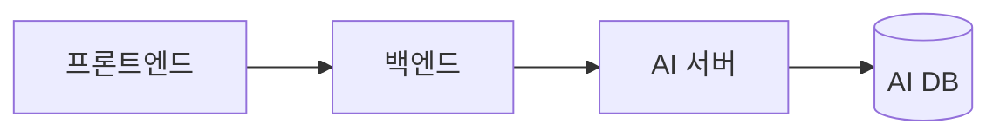

# 위키 가독성 규칙 (10개)

적용 범위: 레포 `docs/` 의 모든 문서. 템플릿과 충돌하면 템플릿의 섹션 구성이 우선하고, 표현 방식은 이 문서를 따른다.

> **변환 문서의 원문 문장에는 적용하지 않는다.** 원문은 문체·용어·표 셀 길이를 그대로 둔다 (`conversion-rules.md`). 이 규칙은 새로 쓰는 문장, 새로 추가하는 요약·표·제목에만 적용한다. 원문이 규칙을 크게 어기면 고치지 말고 파트에 알린다.

| # | 분류 | 규칙 (한 줄) |
|---|---|---|
| 1 | 제목 | `##`부터 시작하고 `###`까지만 쓴다 |
| 2 | 제목 | 제목은 명사형 20자 이내, 한 페이지 안에서 중복 금지 |
| 3 | 표·리스트 | 내용 모양에 따라 표·번호 목록·글머리 기호·문장 중 하나를 고른다 |
| 4 | 표·리스트 | 표는 열 5개, 셀 한 문장 이내 |
| 5 | 강조 | 굵게는 섹션당 3번, 인용 블록은 정해진 용도에만 |
| 6 | 코드 블록 | 언어를 지정하고 20줄 넘으면 부록으로 |
| 7 | 다이어그램 | Mermaid는 문서당 2개, 노드 12개 이하 |
| 8 | 용어 | 도구 이름은 원문, 개념어는 한국어 + 첫 등장 시 원문 병기 |
| 9 | 용어 | 날짜·숫자·단위·파트 이름은 정해진 형식으로 |
| 10 | 문체 | "~한다"체, 한 문장에 한 내용, 조건을 먼저 |

---

## 1. 제목은 `##`부터 `###`까지

- `#`는 쓰지 않는다. GitHub Wiki가 페이지 이름을 맨 위에 제목으로 이미 표시한다.
- 큰 섹션은 `## 1. 제목`처럼 번호를 붙인다. 번호 없는 `##`를 번호 있는 섹션 사이에 끼우지 않는다.
- `####` 이하가 필요하면 문서를 나눌 신호다.
- 굵은 글씨(`**프로젝트 소개**`)로 제목을 흉내 내지 않는다. 목차와 앵커 링크에 잡히지 않는다.

```markdown
<!-- 나쁜 예 -->
## 1. 엔드포인트 목록
## 용어            ← 번호 없는 섹션이 끼어 있음
## 2. 입력/출력 형식

<!-- 좋은 예 -->
## 1. 엔드포인트 목록
## 2. 입력·출력 형식
## 3. 용어
```

## 2. 제목은 명사형 20자 이내, 중복 금지

- "~에 대해", "~하는 방법" 대신 명사로 끝낸다. (`배포 전략 결정` O / `배포 전략을 어떻게 정했는지` X)
- 같은 페이지에 같은 제목이 두 번 있으면 앵커가 `#제목-1`로 바뀌어 링크가 헷갈린다. `### 입력`이 반복되면 `### 3.1 입력`처럼 번호로 구분한다.
- 제목에 `/ : ? #`를 쓰지 않는다. `입력/출력` → `입력·출력`.

## 3. 내용 모양에 맞는 형식 고르기

| 내용 | 형식 | 조건 |
|---|---|---|
| 항목 2개 이상을 같은 기준으로 비교 | 표 | 기준이 2개 이상일 때 |
| 순서대로 실행하는 절차 | 번호 목록 | 7단계 이내, 넘으면 단계를 묶기 |
| 순서 없는 나열 | 글머리 기호 | 3개 이상일 때. 2개면 문장으로 |
| 이유, 배경, 맥락 | 문장 | 한 문단 3문장 이내 |

- 목록은 한 단계만 들여쓴다. 2단계 이상 들여써야 하면 표로 바꾼다.
- 목록 항목 끝에 마침표를 찍지 않는다. 항목이 두 문장 이상이면 문장 문단으로 바꾼다.

## 4. 표는 열 5개, 셀 한 문장

- 열은 5개 이하, 셀은 한 문장(약 40자) 이내로 쓴다.
- 셀 안에 목록, 줄바꿈(`<br>`), 코드 블록을 넣지 않는다. 설명이 길면 셀에는 요약만 두고 표 아래에 번호를 붙여 보충한다.
- 빈 셀은 비워두지 않고 `-`로 채운다.
- 표 바로 위에 이 표가 무엇인지 한 줄로 쓴다. 제목이 설명하면 생략한다.

```markdown
<!-- 나쁜 예: 셀 하나에 네 문장 -->
| ③ | POST /recommendations/chat | 챗봇이 대화로 책을 추천한다. 사용자 메시지를 읽어 … (V2) 사진을 보내면 … |

<!-- 좋은 예 -->
| ③ | `POST /recommendations/chat` | 대화로 추천 카드 최대 3장 반환 ¹ |

¹ 이미지 입력은 V2부터 지원
```

## 5. 강조는 아껴 쓴다

- 굵게는 섹션당 3번 이하. 읽는 사람이 놓치면 문제가 되는 문장에만 쓴다.
- 기울임, 밑줄, 글자 색은 쓰지 않는다.
- 인용 블록(`>`)은 세 가지 용도에만 쓴다: 문서 첫 줄 상태 헤더, 섹션 끝 관련 링크, 꼭 알아야 할 주의 1개.
- 이모지는 상태 표시(⬜ 🚧 ✅ 🗄️ ❌)와 사이드바 분류에만 쓴다.

## 6. 코드 블록은 언어 지정, 20줄 이내

- 언어를 반드시 지정한다: `json` `yaml` `bash` `python` `java` `sql` `mermaid` `text`.
- 20줄을 넘는 예시는 `{문서 이름} 부록` 페이지로 옮기고 본문에는 핵심 필드만 남긴다.
- 생략한 부분은 `"...": "생략"` 또는 `# ... 생략`으로 표시한다.
- 실제 키, 토큰, 비밀번호, 내부 IP를 넣지 않는다. `$SERVICE_TOKEN`, `<AI_EC2_IP>`처럼 쓴다.
- 문장 안의 경로, 필드명, 명령어, 설정값, HTTP 메서드는 인라인 코드로 쓴다. (`current-release.env`, `user_id`, `POST /search`)

## 7. Mermaid는 문서당 2개, 노드 12개 이하

- `flowchart LR`(좌→우) 또는 `flowchart TB`(위→아래), `sequenceDiagram`만 쓴다.
- 노드는 12개 이하, 노드 이름은 15자 이내. 설명을 노드 안에 쓰지 않고 다이어그램 아래 표로 뺀다.
- 색상·스타일(`style`, `classDef`)은 지정하지 않는다. 다크 모드에서 글자가 안 보일 수 있다.
- 노드가 12개를 넘으면 전체 구조 1개 + 세부 흐름 1개로 나눈다.
- 이미지 파일로 넣을 때는 원본(Figma, draw.io) 링크를 캡션에 남긴다.



| 노드 | 설명 |
|---|---|
| AI 서버 | 검색·추천·취향 프로필 API 제공 |

## 8. 용어 표기

| 종류 | 규칙 | 예 |
|---|---|---|
| 제품·도구·서비스 이름 | 공식 원문 표기 | GitHub Actions, Docker Compose, Qdrant, Amazon ECR |
| 일반 개념어 | 한국어 우선, 페이지 첫 등장 시 원문 병기 | 멱등 키(idempotency key), 롤백(Rollback) |
| 한국어로 어색한 개념어 | 원문 그대로, 대소문자는 문장 중간이면 소문자 | health check, smoke test |
| 코드에 쓰이는 이름 | 인라인 코드, 원문 그대로 | `reason_long`, `previous-release.env` |

- 한 페이지 안에서 같은 개념은 같은 표기만 쓴다. (`Rollback`과 `롤백` 섞지 않기)
- 여러 파트가 쓰는 용어는 `TEAM 용어집`의 표기를 따른다. 용어집에 없으면 추가한다.
- 위키 링크 문법(`[[ ]]`)은 쓰지 않는다. docs 상대 경로 링크를 쓴다 (`naming-and-links.md`).

## 9. 날짜·숫자·단위·파트 이름

| 대상 | 형식 | 예 |
|---|---|---|
| 날짜 | `YYYY-MM-DD`, 표와 결정 로그에서는 `MM-DD` 허용 | 2026-09-17, 09-17 |
| 시각 | 24시간, 시간대 명시 | 10:30 KST |
| 금액 | 천 단위 쉼표 + 원 | 13,500원 |
| 단위 | 숫자와 붙여 쓰기 | 30초, 4MB, 0.18RPS |
| 범위 | 물결표 | 1~200자 |
| 파트 | 대문자 약어 또는 한국어 하나로 통일 | FE, BE, AI, Cloud |
| 버전 | 대문자 V + 숫자 | V1, V2 |

## 10. 문체

- 문장은 "~한다"체로 끝낸다. 한 페이지 안에서 "~합니다"와 섞지 않는다.
- 한 문장에 한 내용만 쓰고, 50자를 넘으면 나눈다.
- 조건을 먼저 쓴다. (`검증에 실패하면 이전 버전으로 되돌린다` O / `이전 버전으로 되돌리는데 검증에 실패한 경우다` X)
- 주어를 밝힌다. 특히 여러 파트가 얽힌 문장은 누가 하는지 쓴다. (`BE가 긴 이유를 보관한다`)
- "적절히", "필요시", "등"처럼 판단을 읽는 사람에게 넘기는 말은 기준으로 바꾼다. (`필요시 재시도` → `503이면 Retry-After 뒤 1회 재시도`)
