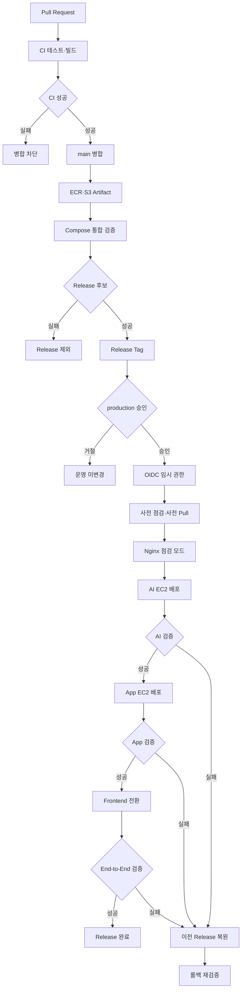

# 3-2. 배포 전략 및 전체 CI/CD Pipeline

## 1. 배포 전략 결정

북적북적 V1은 **App EC2와 AI EC2에서 각각 Application Container만 재생성하는 제어된 Recreate 전략**을 사용합니다.

| 배포 대상 | 처리 방식 |
| --- | --- |
| Frontend | S3 Release Artifact 업로드 후 Root `index.html` 전환 |
| Nginx | 종료하지 않고 배포 중 503 점검 응답으로 Graceful Reload |
| Backend | App EC2에서 신규 Image Digest로 Recreate |
| MySQL | 계속 실행하고 Data Volume은 유지 |
| AI Server | AI EC2에서 신규 Image Digest로 Recreate |
| Qdrant | 계속 실행하고 Data Volume과 기존 Collection은 유지 |

App EC2와 AI EC2가 2대라는 것은 동일한 Application Instance가 2개라는 의미가 아닙니다. 하나는 Backend와 MySQL, 다른 하나는 AI Server와 Qdrant를 담당하는 **역할 분리 구조**이므로 Rolling이나 Blue-Green 배포를 수행할 복제 Instance는 없습니다.

---

## 2. Recreate 전략 선택 근거

- 일반적인 Peak Traffic이 약 0.18 RPS로 낮습니다.
- V1은 약 3주간 운영하는 초기 POC이므로 고가용성 인프라보다 빠른 구축과 저렴한 운영이 우선입니다.
- App·AI EC2에서 신규·구버전 Application을 동시에 실행하면 각 서버의 CPU·Memory 여유가 줄어듭니다.
- 운영 목표에서 배포 중 약 1~2분, 최대 5분 이내의 API 중단을 허용합니다.
- Docker Compose로 반복 가능한 배포·검증·롤백 절차를 구성할 수 있습니다.

### 다른 전략을 선택하지 않은 이유

| 전략 | V1에서 제외한 이유 |
| --- | --- |
| Blue-Green | App·AI의 Blue·Green을 모두 실행하려면 최대 4개의 Application Stack을 동시에 운영해야 합니다. 같은 EC2에 두 Stack을 두면 자원 경쟁만 늘고 Host 장애는 격리하지 못합니다. |
| Canary | 버전별 트래픽 분할과 지표 비교가 필요하지만 저트래픽에서는 짧은 시간 내 의미 있는 표본을 얻기 어렵습니다. |
| Rolling Update | 같은 역할의 복수 Instance와 Load Balancer가 필요합니다. 현재 App EC2와 AI EC2는 서로 다른 역할을 수행합니다. |
| Nginx Traffic Switching | 전환할 Backend Blue·Green Stack이 모두 안정적으로 실행되어야 하므로 현재 서버 자원과 중단 허용치에 비해 복잡도가 큽니다. |
| ECS·Kubernetes | 자동 복구·확장 이점이 있지만 3주 POC에서 이전·운영할 비용과 시간이 더 큽니다. |

---

## 3. 전체 CI/CD Pipeline

---

## 4. 사전 배포 준비

1. GitHub Actions에 `production` 동시 실행을 막는 `concurrency` Lock을 설정합니다.
2. Release Manifest의 Backend·AI Image Digest와 Frontend S3 경로가 실제로 존재하는지 확인합니다.
3. App EC2와 AI EC2가 모두 SSM Online 상태인지 확인합니다.
4. 두 EC2의 Disk 사용률, Memory, Docker Daemon, Data Container 상태를 확인합니다.
5. MySQL Migration이 있다면 최근 Backup과 하위 호환성을 확인합니다.
6. Qdrant Collection 변경이 있다면 신규 Collection의 Vector 차원·Distance 설정과 데이터 준비 여부를 확인합니다.
7. 외부 LLM이 이미 장애 중인지 기존 Release로 검증합니다. 이미 장애 중이면 배포를 시작하지 않습니다.
8. App EC2와 AI EC2의 `current.env`를 `previous.env`로 복사합니다.
9. 서비스가 운영 중인 상태에서 App EC2에 Backend Image, AI EC2에 AI Image를 미리 Pull합니다.

Image를 먼저 다운로드하므로 실제 점검 시간에는 Container 교체와 검증만 수행할 수 있습니다.

---

## 5. 상세 배포 순서

### 5.1 Nginx 점검 모드

App EC2의 Nginx를 종료하지 않고 API에 `503 Service Unavailable`와 `Retry-After`를 반환하는 점검 설정으로 Graceful Reload합니다.

이를 통해 두 EC2의 버전이 전환되는 동안 일부 요청만 성공하거나 우발적인 502가 노출되는 상황을 막습니다. S3·CloudFront의 Frontend 파일은 계속 제공되지만 API 기능은 일시적으로 점검 응답을 받습니다.

### 5.2 AI EC2 배포

1. Qdrant와 Data Volume이 정상인지 확인합니다.
2. Embedding Model이나 Vector 차원이 바뀌지 않았다면 기존 Collection을 그대로 사용합니다.
3. 설정이 바뀌었다면 `books_v2`와 같은 신규 Collection을 만들고 데이터를 적재한 뒤 검증합니다.
4. 기존 Alias가 있다면 검증된 신규 Collection으로 전환합니다. 신규 Collection 전체가 준비되기 전에는 기존 Collection을 수정하지 않습니다.
5. AI Server만 신규 Digest로 `docker compose up -d --no-deps` 방식으로 Recreate합니다.
6. Container Health, Qdrant 연결, 고정 Query의 Vector Search, 외부 LLM 호출을 검증합니다.

AI EC2 검증이 실패하면 App EC2를 변경하지 않고 AI EC2만 이전 Image와 Collection Alias로 롤백합니다.

### 5.3 App EC2 배포

1. MySQL은 계속 실행하며 Data Volume을 재생성하지 않습니다.
2. Migration이 있다면 Backend Image의 일회성 Migration Job을 실행하고 Exit Code 0을 확인합니다.
3. Backend만 신규 Digest로 `docker compose up -d --no-deps` 방식으로 Recreate합니다.
4. Container Health, MySQL 연결, AI Server 연결, 핵심 API를 검증합니다.
5. Backend가 준비되면 Nginx 점검 모드를 해제하고 Graceful Reload합니다.

App EC2 검증이 실패하면 Nginx 점검 모드를 유지한 상태에서 App EC2와 이미 전환된 AI EC2를 이전 Release로 롤백합니다.

### 5.4 Frontend 전환

1. Frontend Build의 JS·CSS·Image는 Git SHA가 포함된 Release 경로에 미리 업로드합니다.
2. App·AI 검증이 완료된 후 해당 Release의 `index.html`을 S3 Root에 복사합니다.
3. CloudFront에서 `/index.html`과 필요한 HTML 경로만 Invalidation합니다.
4. 해시가 포함된 정적 자산은 오래 Cache하고 이전 Release 자산은 롤백 기간이 끝날 때까지 유지합니다.

---

## 6. 배포 성공 처리

- CloudFront Frontend 도메인과 Nginx API 도메인을 이용한 최종 End-to-End Smoke Test를 수행합니다.
- 모든 검증이 성공하면 App·AI EC2의 `current.env`를 신규 Release로 확정합니다.
- GitHub Deployment에 Release ID, Git SHA, Image Digest, 승인자, 시작·종료 시각, 배포 결과를 기록합니다.
- CloudWatch 대시보드에 배포 시점과 Release ID를 표시합니다.
- 실제 API 중단은 약 1~2분, 전체 CD Workflow는 약 3~5분을 초기 목표로 합니다.

위 시간은 Image 크기, EC2 자원, MySQL Migration, Qdrant Collection 생성 유무에 따라 달라질 수 있습니다. 특히 Qdrant의 전체 Re-indexing은 일반 배포 시간 목표에서 제외하고 미리 완료한 뒤 Alias만 전환합니다.

---

[← 이전: 3-1. CD 적용 범위 및 승인 정책](3-1-CD-적용-범위-및-승인-정책) | [3단계 상위 페이지](3단계-CD-지속적-배포-파이프라인-설계) | [다음: 3-3. 배포 검증 및 Rollback →](3-3-배포-검증-및-Rollback)
