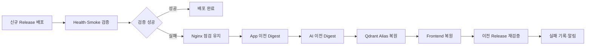

# 3-3. 배포 검증 및 Rollback

## 1. 배포 성공 판단 원칙

배포 성공은 Docker Container가 `running`인지만으로 판단하지 않습니다.

다음 네 단계를 모두 통과해야 신규 Release를 정상 배포로 처리합니다.

1. Container와 Application Process가 정상입니다.
2. MySQL·Qdrant·AI Server 등 필수 의존성에 연결할 수 있습니다.
3. 도서 검색·상세·추천의 핵심 사용자 흐름이 정상입니다.
4. Nginx·CloudFront를 포함한 실제 공개 도메인에서 정상입니다.

---

## 2. Health Check 구성

| 대상 | 검증 종류 | 확인 내용 | 성공 기준 |
| --- | --- | --- | --- |
| Backend | Liveness | JVM과 Application Process 생존 여부 | HTTP 200 |
| Backend | Readiness | MySQL 연결, 필수 설정 로딩 여부 | HTTP 200 |
| AI Server | Liveness | AI Application Process 생존 여부 | HTTP 200 |
| AI Server | Readiness | Qdrant 연결, Prompt·Model 설정 로딩 여부 | HTTP 200 |
| Qdrant | Health | Process·Storage·Collection 접근 여부 | 공식 Health Endpoint 성공 |
| Nginx | Public Health | TLS, Reverse Proxy, Backend 연결 여부 | 공개 HTTPS 도메인 HTTP 200 |

Backend가 Spring Boot라면 `/actuator/health/liveness`와 `/actuator/health/readiness`를 사용할 수 있습니다. Health Endpoint는 인증 없이 최소 상태만 반환하고 DB URL, 비밀번호, API Key, 스택 트레이스를 노출하지 않습니다.

외부 LLM의 일시 장애를 AI Server Liveness에 포함하지 않습니다. 외부 LLM 장애로 AI Container가 계속 재시작되면 오히려 장애 범위가 커집니다. LLM 연동은 별도 추천 Smoke Test와 운영 지표로 확인합니다.

---

## 3. 배포 검증 Gate

| 단계 | 항목 | 초기 통과 기준 |
| --- | --- | --- |
| 사전 | Release 일치 | Git SHA, Backend·AI Digest, Frontend 경로가 Release Manifest와 일치합니다. |
| 사전 | EC2 상태 | App·AI EC2가 모두 SSM Online이고 EC2 Status Check가 정상입니다. |
| 사전 | 자원 여유 | 두 EC2의 Disk 70% 미만, Memory 85% 미만입니다. |
| 사전 | Data 보호 | MySQL Migration 시 최근 Backup을 확인하고, Qdrant Collection 변경 시 기존 Collection을 보존합니다. |
| AI 배포 | Container Health | Qdrant와 AI Server가 `healthy`입니다. |
| AI 배포 | Vector Search | 고정 Query가 기대한 개수의 Book ID와 Score를 반환합니다. |
| App 배포 | Migration | MySQL Migration Job이 Exit Code 0으로 완료됩니다. |
| App 배포 | Container Health | Backend가 `healthy`이고 Liveness·Readiness가 HTTP 200입니다. |
| 기능 | 도서 검색 | 고정 검색어로 정상 응답과 도서 필수 필드가 반환됩니다. |
| 기능 | 도서 상세 | 알려진 Test Book ID의 제목·저자·설명이 반환됩니다. |
| 기능 | AI 추천 | 개인정보가 없는 Test User에게 추천 도서 3권과 추천 이유가 반환됩니다. |
| 외부 | Nginx·HTTPS | 공개 API 도메인이 유효한 인증서와 HTTP 200을 반환합니다. |
| 외부 | Frontend | CloudFront의 `index.html`과 주요 정적 자산이 HTTP 200을 반환합니다. |
| 안정성 | HTTP 5xx | 자동 Smoke Test에서 0건입니다. |
| 안정성 | 응답 시간 | 검색·상세 P95는 2초 이내, 외부 LLM 포함 추천은 15초 이내입니다. |
| 안정성 | 자원 | 배포 후 CPU 80% 미만, Memory 85% 미만, Disk 70% 미만입니다. |

응답 시간과 자원 임계치는 운영 데이터가 부족한 V1의 Planning Assumption입니다. 출시 후 실측 P95·P99와 장애 이력을 기준으로 보정합니다.

일반적인 Peak Traffic이 약 0.18 RPS이므로 배포 직후의 실사용자 요청만으로 오류율을 판단하기에는 표본이 부족합니다. 따라서 V1은 고정된 Test Data로 실행하는 Smoke Test를 주요 배포 Gate로 사용합니다.

---

## 4. Smoke Test 데이터 정책

- 개인정보가 없는 고정 Test User를 사용합니다.
- 검색과 상세 조회에는 삭제되지 않는 Test Book을 사용합니다.
- 추천 결과의 도서 ID, 제목, 추천 이유가 비어 있지 않은지 확인합니다.
- 추천 도서의 정확한 순위는 LLM과 Vector Search 결과에 따라 변할 수 있으므로 배포 Gate로 고정하지 않습니다.
- 운영 Smoke Test는 실제 주문·결제를 생성하지 않습니다. 주문·결제는 CI에서 고정 Fixture와 결제 Sandbox로 검증합니다.

---

## 5. Rollback 흐름

### 자동 Rollback Trigger

다음 중 하나라도 발생하면 자동 롤백합니다.

- MySQL Migration Job이 실패합니다.
- Qdrant 신규 Collection이 검증을 통과하지 못합니다.
- AI Server 또는 Backend가 정해진 시간 내 `healthy`가 되지 않습니다.
- Liveness·Readiness가 연속 검증을 통과하지 못합니다.
- 검색·상세·추천 Smoke Test가 실패합니다.
- Frontend 전환 후 End-to-End Test가 실패합니다.

### 자동 Rollback 순서

1. Nginx 점검 모드를 유지해 요청이 불안정한 버전에 도달하지 않게 합니다.
2. 신규 Backend가 반영되었다면 App EC2의 `previous.env`로 Backend를 먼저 복원합니다.
3. AI EC2의 `previous.env`로 AI Server를 복원합니다.
4. Qdrant Collection Alias가 바뀌었다면 이전 Collection으로 되돌립니다.
5. Frontend이 전환되었다면 S3 Versioning 또는 이전 Release Artifact로 Root `index.html`을 복원하고 CloudFront를 Invalidation합니다.
6. AI Server, Backend, 공개 API, Frontend 순서로 이전 Release를 재검증합니다.
7. 이전 Release가 정상이면 Nginx 점검 모드를 해제합니다.
8. GitHub Deployment를 실패로 표시하고 실패 단계, 원본 Release, 복원 Release를 기록합니다.

자동 Rollback 목표는 실패 감지 시점부터 **10분 이내**입니다.

---

## 6. Data Rollback 정책

### 6.1 MySQL

MySQL은 Image Rollback과 함께 자동으로 Backup을 복원하지 않습니다. 배포 후 생성된 회원·주문·결제 Data가 손실될 수 있기 때문입니다.

Schema Migration은 Expand-Contract 방식으로 진행합니다.

1. Nullable Column·신규 Table·Index를 먼저 추가합니다.
2. 신규 Backend이 이전·신규 Schema를 모두 처리하게 합니다.
3. 필요한 Data를 별도 Job으로 Backfill합니다.
4. 이전 Backend으로 롤백할 필요가 없음을 확인한 후 다음 Release에서 기존 Column을 제거합니다.

Column 삭제·대량 Data 변환은 일반 CD에서 제외하고, 별도 점검 시간과 승인을 지정합니다.

### 6.2 Qdrant

- 기존 Collection을 제자리에서 대량 변경하지 않습니다.
- Embedding Model·Vector 차원이 바뀌면 Version이 포함된 신규 Collection을 만듭니다.
- 신규 Collection을 모두 적재하고 검증한 후 Alias를 전환합니다.
- 이전 Collection은 최소 다음 성공 Release가 안정화될 때까지 보존합니다.
- 롤백은 Data 복사가 아니라 Alias를 이전 Collection으로 되돌리는 방식으로 수행합니다.

---

## 7. 배포 후 모니터링

자동 검증이 끝난 뒤에도 30분을 집중 관찰 시간으로 둡니다. 일반적인 Peak Traffic이 낮으므로 사용자 Traffic만 기다리지 않고 1분 간격의 Public Health Check와 5분 간격의 핵심 Smoke Test를 함께 사용합니다.

| 대상 | 관찰 항목 | 초기 경고 기준 |
| --- | --- | --- |
| 공개 서비스 | Nginx·Backend Public Health | 1분 간격 확인에서 3회 연속 실패 |
| HTTP | 5xx 응답 | 5분 동안 5건 이상 또는 요청 20건 이상일 때 오류율 5% 이상 |
| Container | Backend·AI Server Restart Count | 배포 후 의도하지 않은 재시작 1회 이상 |
| EC2 | CPU·Memory | CPU 80% 또는 Memory 85% 초과가 10분 지속 |
| EBS | Disk 사용률 | 70% 경고, 85% 긴급 대응 |
| MySQL | 연결 오류·Migration·Backup | 반복 연결 오류 또는 Backup 실패 1회 이상 |
| AI·LLM | 추천 실패·Timeout | Synthetic 추천 Test 2회 연속 실패 |
| Qdrant | Health·Collection·Storage | Health 실패, Active Alias 불일치 또는 Disk 70% 초과 |

CloudWatch에는 EC2 기본 Metric과 꼭 필요한 Application Metric만 전송하고, GitHub Deployment 기록에 Release ID와 관찰 결과를 연결합니다. 첫 10분 안에 배포 검증 기준을 위반하면 자동 롤백하며, 배포 완료 후 집중 관찰 중 문제가 발견되면 추가 배포를 중지하고 운영 담당자가 수동 롤백 여부를 결정합니다.

초기 임계치는 운영 데이터가 쌓이면 정상 범위와 실제 장애 사례에 맞춰 조정합니다. 낮은 Traffic에서 비율만 사용하면 요청 1건의 실패로 과도한 경보가 발생할 수 있으므로 요청 건수와 오류율을 함께 확인합니다.

---

## 8. 배포 후 수동 Rollback

자동 검증을 통과한 후 추천 품질 저하나 업무 로직 회귀가 발견되면 권한자가 이전 Release ID를 선택해 수동 Rollback Workflow를 실행합니다.

수동 Rollback도 GitHub `production` Environment 승인을 거치며, 실제 실행 순서는 자동 Rollback과 동일합니다. Rollback까지 실패하면 반복 재시도하지 않고 장애를 선언한 후 SSM Session Manager로 두 EC2의 상태를 확인합니다.

---

[← 이전: 3-2. 배포 전략 및 전체 CI/CD Pipeline](3-2-배포-전략-및-전체-CI-CD-Pipeline) | [3단계 상위 페이지](3단계-CD-지속적-배포-파이프라인-설계) | [다음: 3-4. 배포 보안 및 Secret 관리 →](3-4-배포-보안-및-Secret-관리)
