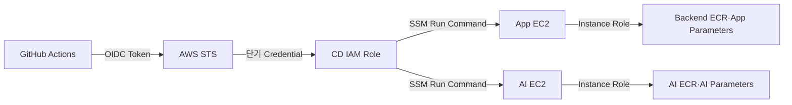

# 3-4. 배포 보안 및 Secret 관리

## 1. 보안 설계 원칙

북적북적 V1의 배포 보안은 별도 보안 제품을 추가하기보다 AWS가 제공하는 임시 권한과 서버 역할을 사용하여 장기 Credential과 공개 관리 Port를 없애는 방향으로 설계합니다.

핵심 원칙은 다음과 같습니다.

1. GitHub에는 장기 AWS Access Key를 저장하지 않습니다.
2. 운영 EC2의 SSH Port를 공개하지 않습니다.
3. GitHub Actions와 각 EC2에는 필요한 Resource만 접근할 수 있는 최소 권한을 부여합니다.
4. Application Secret은 Git Repository, Docker Image, Compose 파일에 포함하지 않습니다.
5. Secret 값은 배포 Log와 Health 응답에 출력하지 않습니다.
6. 운영 배포의 승인자·Release·실행 결과를 추적할 수 있게 기록합니다.

---

## 2. 인증과 배포 명령 전달 방식

### 2.1 GitHub Actions에서 AWS로 접근

GitHub Actions의 OIDC Token을 AWS STS와 교환하여 Workflow 실행 시간에만 유효한 단기 Credential을 발급받습니다. 따라서 `AWS_ACCESS_KEY_ID`와 `AWS_SECRET_ACCESS_KEY`를 GitHub Secret에 저장하지 않습니다.

AWS IAM Role의 Trust Policy는 다음 조건으로 제한합니다.

- 발급자는 GitHub Actions OIDC Provider입니다.
- 대상 Repository가 북적북적 운영 Repository와 일치합니다.
- 운영 배포는 GitHub `production` Environment 또는 `v*` Release Tag에서만 Role을 Assume할 수 있습니다.
- Pull Request Workflow는 운영 CD Role을 Assume할 수 없습니다.
- CI Image Push Role과 운영 CD Role을 분리합니다.

### 2.2 GitHub Actions에서 EC2로 접근

운영 배포 명령은 SSH 대신 AWS Systems Manager Run Command로 전달합니다.

- App EC2와 AI EC2에 SSM Agent와 전용 Instance Profile을 설정합니다.
- Security Group에서 SSH `22` Inbound를 열지 않습니다.
- 긴급 점검도 SSH Key 대신 권한과 실행 이력이 남는 Session Manager를 사용합니다.
- SSM 명령에는 Secret 값을 직접 포함하지 않고 Release ID와 Image Digest만 전달합니다.
- 각 EC2의 배포 Script가 자신의 Instance Role로 필요한 Secret을 읽습니다.

V1에서는 NAT Gateway 비용을 피하기 위해 EC2가 기존 Public Subnet의 Internet Gateway를 통해 AWS Public Endpoint에 Outbound로 접근합니다. Security Group Inbound는 열지 않으며, ECR·SSM·CloudWatch용 VPC Endpoint는 NAT Gateway나 Public IP를 제거하는 단계에서 도입합니다.

---

## 3. IAM 권한 분리

| 주체 | 허용 권한 | 허용하지 않는 권한 |
| --- | --- | --- |
| GitHub CI Role | Backend·AI ECR Repository Push, Frontend Release Prefix Upload, Image Metadata 조회 | SSM 배포 명령, 운영 Secret 조회, EC2 변경 |
| GitHub CD Role | 지정된 App·AI EC2에 SSM 명령, Release Manifest 조회, Frontend Root 전환, CloudFront Invalidation | Image 재빌드·덮어쓰기, Application Secret 평문 조회, 임의 IAM 변경 |
| App EC2 Role | Backend ECR Pull, `/book/app/prod/*`와 공유 Service Token Parameter 조회, 필요한 Log 전송 | AI 전용 Secret, 다른 ECR Repository, S3 전체 접근 |
| AI EC2 Role | AI ECR Pull, `/book/ai/prod/*`와 공유 Service Token Parameter 조회, 필요한 Log 전송 | MySQL Secret, Backend ECR Push, S3 전체 접근 |
| 운영 담당자 | GitHub `production` 승인, 제한된 Session Manager 접속 | 장기 공용 SSH Key 사용, Root Credential 사용 |

IAM Policy의 Resource에는 `*` 대신 대상 ECR Repository, EC2 Instance, SSM Parameter 경로, S3 Bucket과 CloudFront Distribution ARN을 지정합니다. 운영과 개발 AWS Account를 분리할 수 없다면 최소한 IAM Role과 Parameter 경로를 환경별로 분리합니다.

---

## 4. Network 보안

| 구성 요소 | 공개 여부 | 접근 정책 |
| --- | --- | --- |
| CloudFront | 공개 | HTTPS 요청만 허용하고 Private S3 Origin은 OAC로 접근합니다. |
| Nginx | 공개 | App EC2의 `80`, `443`만 허용하며 `80`은 HTTPS로 전환합니다. |
| Backend | 비공개 | App EC2의 Docker Network 안에서 Nginx만 접근합니다. Host Port를 외부에 공개하지 않습니다. |
| MySQL | 비공개 | App EC2의 내부 Docker Network에서 Backend만 `3306`으로 접근합니다. |
| AI Server | 제한된 내부 접근 | AI EC2 Security Group은 App EC2 Security Group에서 오는 Private VPC 통신만 허용합니다. |
| Qdrant | 비공개 | AI EC2의 내부 Docker Network에서 AI Server만 접근하며 `6333`, `6334`를 외부에 공개하지 않습니다. |
| SSM Agent | Outbound | EC2에서 AWS SSM Endpoint로 나가는 HTTPS만 사용합니다. |

AI Server 요청에는 추측하기 어려운 내부 Service Token을 추가하고, App EC2와 AI EC2 사이의 Security Group 참조와 함께 적용합니다. 이는 Private IP만 아는 다른 Workload가 AI API를 임의 호출하는 것을 방지합니다.

---

## 5. Application Secret 관리

### 5.1 저장 위치

초기에는 SSM Parameter Store Standard Tier의 `SecureString`을 사용합니다.

| Parameter 경로 예시 | 사용 주체 | 내용 |
| --- | --- | --- |
| `/book/app/prod/mysql/password` | App EC2 | MySQL Password |
| `/book/app/prod/jwt/signing-key` | App EC2 | JWT Signing Key |
| `/book/app/prod/oauth/kakao-secret` | App EC2 | Kakao OAuth Client Secret |
| `/book/ai/prod/llm/api-key` | AI EC2 | 외부 LLM API Key |
| `/book/shared/prod/ai-service-token` | App·AI EC2 | Backend와 AI Server 간 인증 Token |

Parameter Store Standard Tier는 소규모 V1의 Secret 크기와 개수를 충족하고 추가 저장 비용이 없으므로 적합합니다. 자동 Rotation이나 Secret별 정교한 Lifecycle 관리가 필요해지면 AWS Secrets Manager로 이전합니다. V1에서는 자동 Rotation 편익보다 설정 복잡도와 Secret당 비용이 크므로 Secrets Manager를 기본 구성에서 제외합니다.

### 5.2 EC2 전달 방식

1. 배포 Script가 EC2 Instance Role로 자신의 Parameter 경로만 조회합니다.
2. 값을 Root만 읽을 수 있는 `0600` 권한의 임시 Environment 파일에 기록합니다.
3. 가능하면 `/run/book-service`와 같은 Memory File System에 저장합니다.
4. Docker Compose는 해당 파일을 참조하지만 파일 내용을 출력하지 않습니다.
5. 배포와 재시작이 끝나면 필요 없는 임시 파일을 삭제합니다.

Secret은 GitHub Actions Output, SSM Command Parameter, Docker Build Argument, Docker Image Layer, Git Repository에 넣지 않습니다. `.env.example`에는 Key 이름만 기록하고 실제 값은 비워 둡니다.

### 5.3 암호화와 Rotation

- V1은 Parameter Store용 AWS Managed KMS Key를 사용하여 Key 관리 비용과 운영 절차를 줄입니다.
- 환경 간 복호화 권한 분리나 별도 감사 요구가 생기면 Customer Managed KMS Key를 도입합니다.
- JWT Key, OAuth Secret, LLM API Key, 내부 Service Token은 담당자와 교체 주기를 문서화합니다.
- Secret 교체는 신규 값을 등록하고 Application을 재시작해 검증한 뒤 이전 값을 폐기하는 순서로 수행합니다.
- Secret이 노출된 경우 정기 주기를 기다리지 않고 즉시 폐기하고 배포 Log와 접근 이력을 점검합니다.

---

## 6. Artifact와 Data 보호

### ECR

- ECR Tag Immutability를 적용해 같은 Git SHA Tag를 덮어쓰지 못하게 합니다.
- 운영 Compose는 Tag가 아니라 검증된 Image Digest를 사용합니다.
- Image Scan을 활성화하고 High·Critical 취약점이 확인되면 운영 승인을 차단합니다.
- Lifecycle Policy로 Rollback에 필요한 최근 Release만 남기고 오래된 Untagged Image를 제거합니다.

### S3와 CloudFront

- Frontend Origin Bucket은 Public Access Block을 유지하고 CloudFront OAC만 허용합니다.
- S3 Versioning을 켜서 잘못 전환한 Root `index.html`을 복원할 수 있게 합니다.
- Release Prefix의 Asset에는 긴 Cache를 사용하고 Root `index.html`에는 짧은 Cache 정책을 사용합니다.
- Bucket 배포 권한은 대상 Prefix와 Root 전환에 필요한 Object로 제한합니다.

### MySQL과 Qdrant

- MySQL과 Qdrant Port는 Internet에 공개하지 않습니다.
- EBS Snapshot과 Export 파일은 암호화하고 복구 담당자만 접근할 수 있게 합니다.
- 운영 Data를 개발 환경으로 복제할 때 이름·주소·전화번호 등 개인정보를 비식별화합니다.
- 외부 LLM에는 추천에 필요한 최소 정보만 전달하고 사용자 개인정보와 인증 정보를 Prompt에 포함하지 않습니다.

---

## 7. 감사와 사고 대응

다음 정보를 서로 연결할 수 있어야 합니다.

- GitHub 승인자, Workflow 실행자, Release Tag, Git SHA
- Backend·AI Image Digest와 Frontend Release Prefix
- SSM Command 실행 대상, 시작·종료 시각, 성공 여부
- Parameter Store와 KMS 접근 주체
- 배포 검증 결과와 Rollback 대상 Release

GitHub Deployment History와 CloudTrail을 기본 감사 기록으로 사용합니다. CloudWatch Log에는 Secret과 개인정보가 기록되지 않도록 Application Log Masking을 적용하고, 배포 실패 Log도 제한된 기간만 보관합니다.

---

[← 이전: 3-3. 배포 검증 및 Rollback](3-3-배포-검증-및-Rollback) | [3단계 상위 페이지](3단계-CD-지속적-배포-파이프라인-설계) | [다음: 3-5. 최소 구조·비용 및 현재 한계 →](3-5-최소-구조-비용-및-현재-한계)
