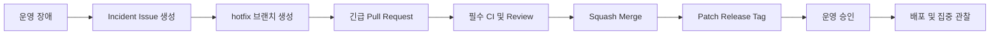

# Git 협업 컨벤션

> 북적북적 V1의 브랜치, 커밋, Pull Request, 머지 및 코드 작성 기준을 정의합니다.

---

## 목차

- [1. Git 브랜치 전략](#1-git-브랜치-전략)
- [2. 커밋 컨벤션](#2-커밋-컨벤션)
- [3. Pull Request 컨벤션](#3-pull-request-컨벤션)
- [4. 머지 컨벤션](#4-머지-컨벤션)
- [5. 코드 컨벤션](#5-코드-컨벤션)

---


## 1. Git 브랜치 전략

북적북적 V1은 `main` 브랜치만 장기간 유지하는 경량 Trunk-based Development 전략을 사용합니다.

별도의 `develop` 또는 장기 `release/*` 브랜치는 운영하지 않습니다. 모든 작업은 최신 `main`에서 짧은 작업 브랜치를 생성하여 진행하고 Pull Request를 통해 `main`으로 병합합니다.

배포 후보는 `main`에 병합된 Git SHA로 관리하며, 실제 운영 배포 버전은 `v1.0.0`과 같은 Release Tag로 구분합니다.

### 1.1 브랜치 종류

| 브랜치 | 용도 | 예시 |
| --- | --- | --- |
| `main` | 항상 배포 가능한 기준 브랜치입니다. | `main` |
| `feature/<issue>-<slug>` | 새로운 기능을 개발합니다. | `feature/123-book-recommendation` |
| `fix/<issue>-<slug>` | 일반적인 결함을 수정합니다. | `fix/241-duplicate-order` |
| `hotfix/<issue>-<slug>` | 운영 중대 장애를 긴급 수정합니다. | `hotfix/318-login-token-expiry` |
| `refactor/<issue>-<slug>` | 외부 동작 변경 없이 구조를 개선합니다. | `refactor/75-recommendation-service` |
| `chore/<issue>-<slug>` | 설정, Dependency, Build 작업을 수행합니다. | `chore/77-add-secret-scan` |
| `docs/<issue>-<slug>` | 문서만 수정합니다. | `docs/82-update-release-guide` |

### 1.2 브랜치 운영 규칙

1. 모든 작업 브랜치는 최신 `main`에서 생성합니다.
2. 브랜치 하나는 하나의 Issue 또는 하나의 명확한 목적만 다룹니다.
3. 작업 브랜치는 가능하면 1~3일 이내에 병합합니다.
4. 기능 변경과 무관한 Refactor 또는 Formatting을 같은 PR에 섞지 않습니다.
5. 작업이 길어지면 최신 `main`을 Rebase하여 충돌을 해결합니다.
6. 병합은 반드시 Pull Request를 통해 수행합니다.
7. 병합된 작업 브랜치는 자동으로 삭제합니다.
8. `main`에 직접 Push하거나 Force Push하지 않습니다.
9. 이미 Push한 Release Tag를 이동하거나 재사용하지 않습니다.
10. 개인 이름만 사용한 브랜치 이름을 사용하지 않습니다.

기능이 완성되기 전에 `main`에 병합해야 한다면 기본적으로 비활성화된 Feature Flag를 사용합니다.

Feature Flag에는 다음 정보를 기록합니다.

- 담당자
- 기본값
- 활성화 조건
- 제거 목표 Release
- 제거 작업을 추적할 Issue

### 1.3 Hotfix 처리



긴급 상황에서도 PR, 필수 CI, 운영 승인 및 변경 기록을 유지합니다.

보호 규칙 우회가 불가피한 경우 다음 내용을 기록합니다.

- 우회 승인자
- 우회 사유
- 생략한 검증
- 예상 위험
- 배포 후 검증 결과
- 후속 조치 Issue

---

## 2. 커밋 컨벤션

각 서비스가 별도의 Repository로 관리되므로 Repository 이름을 Scope로 반복하지 않습니다.

기본 커밋 메시지는 다음 형식을 사용합니다.

```text
<type>: <summary>
```

하나의 Repository 안에서 Domain이나 Module을 구분할 필요가 있을 때만 Scope를 선택적으로 사용합니다.

```text
<type>(<scope>): <summary>
```

### 2.1 Type

| Type | 사용 기준 |
| --- | --- |
| `feat` | 사용자 기능을 추가합니다. |
| `fix` | 결함을 수정합니다. |
| `refactor` | 외부 동작을 변경하지 않고 구조를 개선합니다. |
| `test` | 테스트를 추가하거나 수정합니다. |
| `docs` | 문서만 변경합니다. |
| `chore` | 단순 유지보수와 설정을 변경합니다. |
| `build` | Build System이나 Dependency를 변경합니다. |
| `ci` | CI/CD Workflow를 변경합니다. |
| `perf` | 성능을 개선합니다. |
| `revert` | 기존 변경을 되돌립니다. |

### 2.2 작성 예시

기본적으로 Scope를 생략합니다.

```text
feat: 도서 추천 결과 저장 기능 추가
fix: 만료된 토큰에서 로그인 화면으로 이동
ci: 이미지 digest 검증 단계 추가
docs: 추천 API 오류 응답 예시 보완
refactor: provider 호출 로직을 client 계층으로 분리
```

Repository 내부 영역을 구분해야 할 때만 Scope를 사용합니다.

```text
feat(recommendation): 사용자 선호 기반 추천 기능 추가
fix(auth): 만료된 토큰 처리 수정
refactor(order): 주문 상태 전이 로직 분리
ci(deploy): 자동 rollback 단계 추가
```

다음과 같이 Repository 이름을 Scope로 반복하지 않습니다.

```text
feat(backend): 도서 추천 기능 추가
fix(frontend): 로그인 화면 오류 수정
ci(infra): 배포 workflow 수정
```

### 2.3 작성 규칙

- Summary에는 변경 결과가 드러나게 작성합니다.
- Summary 끝에는 마침표를 붙이지 않습니다.
- `update`, `modify`, `작업`처럼 목적이 불명확한 표현만 사용하지 않습니다.
- 호환성이 깨지는 변경은 본문에 `BREAKING CHANGE:`와 전환 방법을 작성합니다.
- Secret, Token, 개인정보를 커밋 메시지에 포함하지 않습니다.
- 임시 커밋은 PR 병합 전에 정리합니다.
- 최종 Squash Commit 하나가 완결된 변경을 설명할 수 있어야 합니다.

Breaking Change 예시는 다음과 같습니다.

```text
feat: 추천 응답 구조 변경

BREAKING CHANGE: recommendations 필드의 객체 구조가 변경됩니다.
기존 클라이언트는 v1.4.0 이전에 신규 응답 구조를 지원해야 합니다.
```

---

## 3. Pull Request 컨벤션

Pull Request는 코드 변경뿐 아니라 검증 방법, 배포 영향 및 Rollback 방법을 설명하는 기록으로 사용합니다.

### 3.1 PR 제목

PR 제목은 커밋 메시지와 같은 형식을 사용합니다.

```text
feat: 사용자 선호 기반 도서 추천 추가
fix: 중복 주문 요청 방지
ci: 운영 배포 자동 rollback 추가
```

### 3.2 PR 본문 양식

```markdown
## 관련 Issue

- Closes #

## 변경 이유

이 변경이 필요한 이유를 설명합니다.

## 주요 변경

- 주요 변경 사항을 작성합니다.

## 제외 범위

- 이번 PR에서 다루지 않는 범위를 작성합니다.

## 검증

- [ ] Unit Test
- [ ] Integration Test
- [ ] Lint
- [ ] Production Build
- [ ] Docker Image Build
- [ ] 수동 검증

해당 Repository에 적용되는 검증 항목만 선택합니다.

검증 방법과 결과를 작성합니다.

## 위험과 Rollback

- 예상 위험:
- 관찰 지표:
- Rollback 방법:

## 화면 변경

UI 변경이 있다면 Before·After 화면을 첨부합니다.

## Review 순서

변경이 큰 경우 권장 Review 순서를 작성합니다.
```

### 3.3 PR 크기

- PR 하나는 하나의 목적만 다룹니다.
- 권장 변경량은 400줄 이내입니다.
- 생성 코드, Lockfile, Schema처럼 분리하기 어려운 파일은 기준에서 제외할 수 있습니다.
- 권장 크기를 초과하면 분리하지 못한 이유와 Review 순서를 작성합니다.
- 큰 기능은 호환 가능한 작은 기능 단위로 나눕니다.

### 3.4 Review 규칙

- 작성자는 Review 요청 전에 Self Review를 수행합니다.
- 최소 1명의 승인을 받아야 합니다.
- 새 Commit이 추가되면 기존 승인을 무효화합니다.
- 모든 Review 대화를 해결한 뒤 병합합니다.
- 작성자는 자신의 PR을 단독 승인할 수 없습니다.
- 인증, 결제, 개인정보, Migration 및 CI/CD 변경은 해당 영역 담당자가 Review합니다.

Review는 다음 순서로 진행합니다.

1. 기능 정확성과 요구사항 충족 여부를 확인합니다.
2. 보안 문제와 데이터 손실 가능성을 확인합니다.
3. API와 Database의 하위 호환성을 확인합니다.
4. Rollback 가능성을 확인합니다.
5. 운영·배포·관측 가능성을 확인합니다.
6. 테스트 범위와 예외 처리를 확인합니다.
7. 코드 가독성과 유지보수성을 확인합니다.

### 3.5 API·DB·AI 변경 PR

API 변경이 포함되면 다음 내용을 작성합니다.

- 변경 전후 Request·Response 예시
- 기존 Client 호환 여부
- Field 추가·변경·폐기 계획
- 오류 응답 변경
- Repository 간 반영 및 배포 순서

Database 변경이 포함되면 다음 내용을 작성합니다.

- Forward Migration 방법
- 이전 Application과의 호환 여부
- 예상 Lock 시간
- Backfill 필요 여부
- Backup 필요 여부
- Application Rollback 시 영향

AI 설정 변경이 포함되면 다음 내용을 작성합니다.

- Provider
- Model ID
- Prompt Version
- 고정 Dataset 검증 결과
- 응답 시간 및 비용 변화
- Timeout과 Fallback 영향

---

## 4. 머지 컨벤션

V1의 기본 병합 방식은 Squash Merge입니다.

### 4.1 병합 정책

- Squash Merge만 기본적으로 허용합니다.
- Merge Commit과 Rebase Merge는 비활성화합니다.
- Squash Commit 본문에는 PR 번호를 남깁니다.
- 병합 후 작업 브랜치를 자동으로 삭제합니다.
- `main`에 직접 Push하지 않습니다.
- CI를 건너뛴 병합은 중대 장애 대응과 같은 예외 상황에서만 허용합니다.

Squash Merge를 사용하면 작업 중 생성된 작은 수정 커밋을 정리하면서 `main`의 각 Commit을 독립적으로 되돌릴 수 있는 변경 단위로 유지할 수 있습니다.

### 4.2 Squash Commit 예시

```text
feat: 사용자 선호 기반 도서 추천 추가

- 사용자 선호 장르 기반 후보 도서를 조회합니다.
- 외부 AI API 응답을 검증하고 저장합니다.
- AI 장애 시 인기 도서로 대체합니다.

Closes #123
```

---

## 5. 코드 컨벤션

### 5.1 공통 규칙

- 저장소의 Formatter, Linter, Compiler 설정을 최우선 기준으로 사용합니다.
- 이름은 역할과 Domain 의미가 드러나게 작성합니다.
- 함수와 Class는 하나의 책임을 가집니다.
- 사용하지 않는 코드와 주석 처리된 코드는 삭제합니다.
- 빈 `catch`를 사용하거나 오류를 무시하지 않습니다.
- 주석은 코드의 동작보다 제약과 의사결정 이유를 설명합니다.
- 날짜·시간은 저장과 통신 시 Timezone을 명확하게 사용합니다.
- 금액은 부동소수점으로 계산하지 않습니다.
- Secret, Token, 개인정보, AI Prompt·Response 원문을 Log에 기록하지 않습니다.
- `.editorconfig`를 사용하여 UTF-8, LF, 파일 끝 개행과 들여쓰기를 통일합니다.
- CI를 최종 품질 판정 기준으로 사용합니다.

### 5.2 Backend: Java·Spring Boot

#### 구조

- Controller는 입력 검증과 HTTP 변환을 담당합니다.
- Business Rule은 Service 또는 Domain 계층에 작성합니다.
- Repository는 Persistence 책임만 가집니다.
- Controller에서 Repository를 직접 호출하지 않습니다.
- DTO와 Entity를 구분합니다.
- Entity를 API Response로 직접 반환하지 않습니다.
- Transaction 경계는 Service 계층에 명시합니다.
- 외부 AI API 호출을 DB Transaction 내부에서 실행하지 않습니다.
- Domain 간 순환 의존성을 만들지 않습니다.

#### Naming

| 대상 | 규칙 | 예시 |
| --- | --- | --- |
| Class·Interface | `PascalCase` | `RecommendationService` |
| Method·Variable | `camelCase` | `findRecommendedBooks` |
| Constant | `UPPER_SNAKE_CASE` | `MAX_RETRY_COUNT` |
| Boolean | `is`, `has`, `can`, `should` | `isAvailable` |
| Collection | 복수형 | `recommendedBooks` |

#### API와 예외 처리

- 입력 DTO에는 Validation을 선언합니다.
- Business Error와 시스템 장애를 구분합니다.
- Error Response 형식을 일관되게 유지합니다.
- Stack Trace, DB 정보, Secret을 Client에 노출하지 않습니다.
- HTTP Method와 Status Code의 의미를 지킵니다.
- 주문·결제처럼 중복 실행 위험이 있는 API에는 Idempotency를 적용합니다.

#### 테스트

- 테스트 이름에는 조건과 기대 결과를 표현합니다.
- Domain과 Service 규칙은 Unit Test로 검증합니다.
- Query, Transaction, Migration은 MySQL 기반 Integration Test로 검증합니다.
- 인증·인가와 Resource 소유권을 성공·실패 경로 모두 검증합니다.
- 외부 AI API는 일반 CI에서 Stub을 사용합니다.

### 5.3 Frontend: JavaScript·TypeScript·React 계열

#### 구조

- Component는 화면 표현과 사용자 상호작용에 집중합니다.
- API 호출과 복잡한 상태 전이는 Hook 또는 Service로 분리합니다.
- Server State와 Local UI State를 구분합니다.
- 동일한 상태를 여러 위치에 중복 저장하지 않습니다.
- Loading, Empty, Error, Success 상태를 모두 처리합니다.
- 변경 가능한 목록에서 배열 Index를 Key로 사용하지 않습니다.

#### Naming

| 대상 | 규칙 | 예시 |
| --- | --- | --- |
| Component·Type | `PascalCase` | `BookRecommendation` |
| Function·Variable | `camelCase` | `fetchRecommendations` |
| Custom Hook | `use`로 시작 | `useBookSearch` |
| Constant | `UPPER_SNAKE_CASE` | `DEFAULT_PAGE_SIZE` |

TypeScript를 사용하는 영역에서는 `any`를 기본 해결책으로 사용하지 않습니다. 외부 입력은 `unknown`으로 받은 뒤 검증합니다.

#### UI와 접근성

- 의미에 맞는 HTML 요소를 사용합니다.
- Keyboard만으로 주요 기능을 사용할 수 있어야 합니다.
- Form 요소와 Label 및 오류 메시지를 연결합니다.
- 색상만으로 성공·실패 상태를 구분하지 않습니다.
- 사용자용 오류 메시지와 운영 Log를 분리합니다.
- API Key, 내부 Endpoint, Stack Trace를 화면에 노출하지 않습니다.

### 5.4 API 컨벤션

- URL은 Resource 중심의 복수 명사를 사용합니다.
- 동작은 HTTP Method로 표현합니다.
- JSON Field Naming을 하나로 통일합니다.
- 목록 API는 Pagination, 정렬, 빈 결과 형식을 통일합니다.
- Error Response에는 Error Code, 사용자 메시지, Request ID를 포함합니다.
- 내부 오류와 Secret은 Response에 포함하지 않습니다.
- 기존 Client가 사용하는 Field는 즉시 삭제하지 않고 폐기 기간을 둡니다.

권장 API 예시는 다음과 같습니다.

```http
GET /api/books
GET /api/books/{bookId}
POST /api/recommendations
GET /api/users/{userId}/orders
```

다음과 같이 동사를 URL에 직접 표현하는 방식은 지양합니다.

```text
/api/getBooks
/api/createRecommendation
/api/deleteOrder
```

### 5.5 Database 컨벤션

- 모든 Schema 변경은 Migration 파일로 관리합니다.
- 운영 DB에서 수행한 수동 DDL을 기준 상태로 남기지 않습니다.
- Application Rollback을 위해 Expand-Contract 방식을 사용합니다.
- 새 Column은 Nullable 또는 안전한 Default로 먼저 추가합니다.
- Backfill 완료 후 제약 조건을 강화합니다.
- Column 삭제와 대량 데이터 변환은 일반 배포에서 분리합니다.
- Index 추가 전 대상 Query와 쓰기 비용을 확인합니다.
- 개인정보 Field에는 보존 기간, Masking과 접근 권한을 정의합니다.

### 5.6 외부 AI 연동 컨벤션

- Provider Client를 Business Logic에서 분리합니다.
- Provider, Model ID, Prompt Version을 Release Metadata로 기록합니다.
- Connection Timeout과 Read Timeout을 적용합니다.
- Circuit Breaker와 제한된 Retry를 적용합니다.
- 중복 처리나 과금 위험이 있으면 Idempotency가 보장될 때만 재시도합니다.
- AI 응답의 Schema, 길이, 필수 Field와 허용 범위를 검증합니다.
- 개인정보와 인증 정보를 Prompt에 포함하지 않습니다.
- Provider 장애 시 인기 도서, 저장된 큐레이션 또는 일반 검색 결과로 Fallback합니다.

### 5.7 설정과 로그

- 환경별 설정을 코드에 하드코딩하지 않습니다.
- `.env.example`에는 Key 이름과 설명만 작성합니다.
- 실제 Secret은 Parameter Store `SecureString`으로 관리합니다.
- 구조화 Log에는 Timestamp, Level, Service, Release SHA, Request ID와 Error Code를 포함합니다.
- Password, Authorization Header, Cookie, OAuth Code와 API Key를 Masking합니다.
- Health Endpoint는 최소 상태만 반환하고 내부 설정을 노출하지 않습니다.

