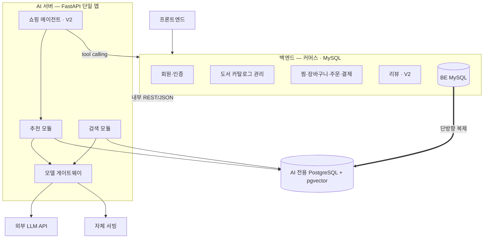

**요약** AI 서버를 별도 FastAPI 서비스로 떼어낸 모듈 경계와 설계 결정 6개, 모듈 간 인터페이스와 기대 효과를 정리한다.

## 왜 모듈화하는가 (북적북적 기준)

하나의 서버 코드 안에 화면 로직, 주문/결제 같은 비즈니스 로직, 그리고 AI 추론 코드가 다 섞여 있음.

이러면 생기는 문제:

- 추천 모델 하나 바꾸려는데 서비스 전체를 다시 배포해야 함
- AI 코드에서 에러 나면 커머스 전체가 같이 죽음
- 여러 명이 같은 파일 만지니까 충돌남
- 모델은 무겁게 서빙되는데, 가벼운 API 서버까지 같이 스케일링됨 (돈 낭비)

그래서 **"모델 서빙"을 독립된 조각으로 분리**하면 위 문제들이 해결됨.

```text
[프론트]
   ↓
[백엔드 (Spring/Node 등) — 주문, 회원, 장바구니 · MySQL]
   ↓  (내부 API 호출)
[AI 서비스 (FastAPI) — 검색 라우터 + 추천 라우터]
   ↓
[AI 전용 PostgreSQL + pgvector]
   ↑ (BE MySQL → AI Postgres 단방향 복제, 역방향 없음)
[BE MySQL (커머스 원본)]
```

즉 **AI 부분 = 별도 FastAPI 마이크로서비스**로 이미 빼기로 결정.

**DB는 공유하지 않는다** — BE는 MySQL, AI는 자기 소유의 PostgreSQL+pgvector를 쓰고, 커머스 데이터는 BE→AI 단방향 복제로만 들어온다(AI 서버에는 BE MySQL로 가는 연결 자체가 없음).

## 제출 항목

| 요구 항목 | 실제로 뭘 내면 되냐 |
|---|---|
| **아키텍처 다이어그램** | AI 서비스 박스를 다른 색으로 강조하여 그림 |
| **각 모듈 책임 설명** | "백엔드 = 커머스 도메인 / AI 서비스 = 검색·추천 추론 전담. 배포 주기랑 자원 요구가 달라서 분리" |
| **모듈 간 인터페이스 설계** | AI 서비스의 API 명세: 엔드포인트(`POST /search`, `GET /recommendations/feed`, `POST /recommendations/chat`), 요청·응답 JSON 포맷, 통신 방식(REST 동기 호출), 타임아웃/에러 처리 |
| **기대 효과** | "모델 교체 시 AI 서비스만 재배포 / 장애 격리 / 팀 병렬 작업 / 독립 스케일링" |
| **시나리오 부합 근거** | 구체 사례 1~2개 ¹ |

¹ 예: "임베딩 모델을 교체해도(예: e5-small → 다른 모델) 커머스 API·프론트는 코드 변경 0. 게이트웨이 어댑터 1개 + 설정 변경, AI 서비스 컨테이너만 재배포. 단, 도서 임베딩 전량 재색인과 BE의 취향 프로필 재호출이 따른다"

## 모듈 경계

| 모듈 | 담당 엔드포인트 | 성격 (왜 분리되나) |
|---|---|---|
| **검색 (Search)** | `POST /search` | 동기·저지연. 임베딩 + 키워드(RRF 결합), LLM 안 씀 |
| **추천 (Recommendation)** | `/recommendations/chat`(V1 텍스트 / V2 이미지 턴 포함), `/recommendations/feed` | chat은 생성형·고지연(504 30초), 카드의 짧은/긴 이유를 **한 번의 LLM 호출**로 함께 생성(별도 이유 엔드포인트 없음) ¹ |
| **취향·프로필 (Preference)** | `/preferences/extractions`(V2, 야간 배치) , `/preferences/profile` | 쓰기·배치성(프로필 재계산). ⑤는 대화 종료 후 처리 |
| **쇼핑 에이전트 (Agent)** | `/agent/act` (V2) | 툴 호출·멱등성·grounding 검증. 추천 모듈의 위임 서브그래프. V2에서만 활성 |
| **공용 어댑터** | `/embeddings`(내부 전용), LLM 게이트웨이, 벡터 인덱스 | 외부 모델 의존을 한 곳에 격리 |
| **AI 전용 데이터 계층** | AI PostgreSQL + pgvector (BE MySQL과 분리, 단방향 복제로 커머스 사본을 받음) | 필터+벡터 정렬을 한 SQL로 처리하기 위한 AI 소유 저장소 |

¹ feed는 규칙+취향 벡터 랭킹, LLM 안 씀. **표지 이미지 인식(V2)은 별도 엔드포인트가 아니라 chat의 `image_ref` 서브플로우**

### 선정 이유 (api 명세)

- `X-Degraded: keyword-only`
    - **임베딩 어댑터**를 분리해서 장애를 모듈 경계에서 흡수 (임베딩 모델 문제시 제외하고 키워드만 사용가능)
- `degraded: true` (chat 본문)
    - **LLM 어댑터** 분리, 추천 모듈은 계약 유지. LLM 장애면 규칙 기반 상위 3권 + `reason_short` 규칙 생성 + `reason_long: null`
- `503 + Retry-After`, `504 generation_timeout`
    - 생성형(추천 chat)과 검색을 **다른 배포·스케일 단위**로 (LLM 호출과다 및 생성 지연)
- `/health`의 `components: {gateway, database, vector_index, llm, embedding}`
    - 이 5개가 곧 내부 컴포넌트 경계. `database`는 **AI 서버 자신의 Postgres**이며 BE MySQL 상태가 아니다

    ```json
    "components":{"gateway":"ok","database":"ok",
    "vector_index":"ok","llm":"unavailable","embedding":"ok"}
    ```

- `replication_lag_seconds` → BE MySQL→AI Postgres 복제 지연을 재는 필드.
    - `status`는 안 바꾸고 별도로 감시(복제가 밀려도 응답은 낡은 값으로 정상 200)

### 인터페이스 방식

- **BE ↔ AI 서비스**: REST 동기 호출 (검색·피드·chat·profile), 공통 응답 봉투 `{message, data}`
- **AI 서비스 ↔ 모델**: 어댑터 인터페이스 (`/embeddings` 내부 호출, LLM 게이트웨이)
- **커머스 데이터 반입**: BE MySQL → AI Postgres **단방향 복제**(배치/CDC, 수단 미정). 실시간 요청 본문으로 오가는 게 아님
- **취향 추출(⑤)**: 야간 배치가 종료된 대화 세션 단위로 호출. 현재 설계는 배치 잡이며, 메시지 큐로 뺄지는 구현 선택지로 열려 있음

## 1. 아키텍처 다이어그램



| 노드 | 설명 |
|---|---|
| BE MySQL | 커머스 원본 |
| 검색 모듈 | /search · /embeddings |
| 추천 모듈 | /chat (V1 텍스트 · V2 이미지 턴) · /feed · /extractions · /profile · 이미지 인식은 chat의 서브플로우 |
| 쇼핑 에이전트 · V2 | /agent/act |
| 모델 게이트웨이 | 어댑터·폴백·서킷·캐시(폴백·서킷·캐시는 V1 미구현) |
| AI 전용 PostgreSQL + pgvector | 복제 사본(v_books·v_user_*·v_book_popularity) · + AI 소유(book_embeddings·취향 프로필·멱등 기록) |
| 외부 LLM API | (V2) OCR·VLM 폴백 API |
| 자체 서빙 | 임베딩(CPU, e5-small) |
| 단방향 복제 | MySQL → PostgreSQL |

## 2. 모듈 책임 (제출 항목 2)

| 모듈 | 책임 | 왜 이 경계인가 | 배포 단위 |
|---|---|---|---|
| **커머스 코어 (BE)** | 회원·인증, 도서 카탈로그 관리, 찜·장바구니·주문·결제, 리뷰 | AI와 무관하게 동작해야 하는 매출 경로 (AI 장애의 영향 X) | 독립 |
| **검색 모듈** | 하이브리드 검색(키워드+벡터), 필터·정렬 규칙 파싱, 쿼리 임베딩 | **LLM을 호출하지 않는 유일한 조회 경로.** 결정적·저지연이어야 하며 LLM 장애와 무관하게 살아 있어야 한다 | AI 서버 내 라우터 |
| **추천 모듈** | 질의 해석(spec 델타), 후보 검색, 취향 스코어링, 이유 생성(짧은/긴 이유 한 호출), 취향 기억 추출, 프로필 재계산, **표지 이미지 인식(V2, chat의 서브플로우 OCR 우선 + VLM 폴백, 별도 엔드포인트·별도 배포 아님)** | LLM 의존·고지연·프롬프트 튜닝이 잦은 영역 ¹ | AI 서버 내 라우터 |
| **쇼핑 에이전트 (V2)** | 대화 중 쇼핑 의도 감지, BE tool 호출, grounding 검증 | 추천 모듈의 서브그래프. **쓰기 작업을 수행하는 유일한 AI 경로**라 권한·멱등성 규칙이 별도로 필요하다 | 추천 모듈 내 |
| **모델 게이트웨이** | 프로바이더 어댑터, 폴백 체인, 서킷 브레이커, 응답 캐시(폴백·서킷·캐시는 V1 미구현) | 모델 교체를 한 계층에 가둔다 | AI 서버 내 계층 |
| **임베딩·벡터 (공유)** | 임베딩 생성과 벡터 인덱스 | 검색·추천이 함께 쓰는 공유 자원. | 자체 서빙(CPU) 별도 프로세스 |
| **BE MySQL (커머스 원본)** | 회원·카탈로그·장바구니·주문·결제의 소유자 | 커머스 트랜잭션 주인은 끝까지 BE | 독립 |
| **AI 전용 Postgres + pgvector** | 복제된 커머스 사본(`v_books`·`v_user_*`·`v_book_popularity`) 조회 + AI 소유 데이터(도서 임베딩·취향 프로필·멱등 기록) 저장 | 필터(WHERE)+벡터 정렬(ORDER BY)을 한 SQL로 처리. BE가 MySQL을 쓰는 이상 별도 Postgres에 복제해 오는 게 유일한 방법 | 독립. BE DB와 절대 공유하지 않음 |

¹ 배포 주기가 검색과 다르다. 이미지 인식은 결과물이 "카드/추천"과 동일해 별도 모듈로 쪼갤 이유가 없다고 판단했다.

### 2-1. 설계 결정과 근거

### 결정 1 — 검색은 LLM을 안 쓴다 (AI 서버 안에 두되 라우터만 따로)

이유: 검색은 "빠르고 항상 똑같은 답"이 나와야 하고, 추천은 "느리지만 말을 만들어주는" 기능이다.

성격이 정반대라 같이 두면 안 된다. LLM이 완전히 죽어도 검색·책 상세·장바구니·결제는 멀쩡히 돌아가야 한다.

**검색 코드를 어디에 둘지 3개 후보를 비교했다:**

| - | A. 백엔드에 | B. 검색 전용 서비스 신설 | C. AI 서버 안, 라우터만 분리 (채택) |
|---|---|---|---|
| 벡터 인덱스 주인 | 백엔드·AI가 나눠 가짐 (지저분) | 검색 서비스 | AI 서버 하나 |
| 임베딩 모델 바꾸면 | **백엔드까지 재배포** | 검색 서비스만 | AI 서버만 |
| 운영 부담 | 낮음 | **높음** (서비스 하나 더, 동기화 파이프라인) | 낮음 (앱 1개) |
| 팀 규모(6인·3개월)에 | 인덱스 지식이 두 팀에 흩어짐 | 과함 | 딱 맞음 |

**A가 안 되는 결정적 이유:** 벡터 인덱스를 백엔드와 AI가 나눠 가지면, 임베딩 모델을 바꿀 때(벡터 차원이 달라짐 → 전체 재색인) 두 팀이 같이 움직여야 한다.

B는 그걸 해결하지만 지금 규모에 서비스를 하나 더 굴리는 게 손해다.

**C는 인덱스 주인을 AI 서버 하나로 모으면서 운영 부담은 안 늘린다.**

### 결정 2 — 모델 호출은 무조건 "게이트웨이" 한 곳을 통한다

검색·추천 어느 모듈이든 모델을 쓸 때 `complete()`(LLM), `embed()`(임베딩) 딱 두 함수만 부른다.

"외부 API를 쓰냐 자체 서버를 쓰냐"는 그 안쪽 어댑터가 알아서 처리.

이유: 나중에 "외부 임베딩 API → 우리가 직접 서빙"으로 바꿀 때, **어댑터 하나만 새로 끼우고 설정값만 바꾸면 끝**.

### 결정 3 — AI 서버는 아무것도 기억하지 않는다 (무상태)

대화 내용을 서버에 저장하지 않는다. "지금까지 뭘 골랐는지" 같은 대화 상태는 **프론트(클라이언트)가 들고 다니면서** 매 요청에 같이 보낸다(spec, V1 기준. V2는 BE가 스레드를 보관).

이유:

- "AI 대화 이력 저장 안 함" 정책이 코드 구조로 자동 보장됨 (저장할 데가 없으니까)
- 서버를 여러 대로 늘려도 "이 사용자는 3번 서버에 붙어야 해" 같은 제약이 없어서 확장이 쉬움
- 진짜 저장해야 하는 것(취향 프로필, 도서 임베딩, 멱등 기록)만 AI 자기 DB에 둔다. **긴 이유(`reason_long`)조차 AI는 저장하지 않고 BE가 보관한다**

### 결정 4 — 벡터는 별도 DB 안 만들고, AI 전용 PostgreSQL 하나로

Pinecone 같은 전용 벡터 DB 대신, AI가 소유한 PostgreSQL에 pgvector 확장을 얹는다. **이 Postgres는 BE와 공유하지 않는다**

BE는 MySQL을 쓰고, AI Postgres에는 커머스 데이터가 **단방향 복제**로만 들어온다.

**이유:** 검색·추천 질의는 "가격 구간 + 재고 있음(필터) + 의미 비슷한 순(벡터 정렬)"을 **한 방에** 해야 한다. BE가 MySQL이라 이 조건을 지키는 유일한 방법은 필터에 쓸 컬럼(도서·이력·인기)까지 AI Postgres로 복제해 벡터 옆에 두는 것이다.

전용 벡터 DB를 따로 두면 두 저장소 동기화 + 질의 2단계 분리가 필요해진다. 우리 규모(수십만 권 이하)면 pgvector로 충분하다.

**대가:** 복제 파이프라인(수단 미정, 배치/CDC)과 신선도 예산(가격·재고 5분 / 신간 1h / 인기 24h / 이력 5분)을 관리해야 한다.

### 결정 5 — AI는 자기 DB만 갖고, 커머스 데이터는 복제로만 받는다

**뭘 정했나:** AI 서버에는 **BE MySQL로 가는 연결 자체가 없다.**

커머스 데이터(카탈로그·구매·나의 도서관·리뷰·인기 집계)는 BE MySQL → AI Postgres **단방향 복제**로 AI 쪽 사본(`v_books`·`v_user_*`·`v_book_popularity`)에 들어오고, AI는 그 사본을 읽기만 한다.

AI가 **자기 Postgres에 쓰는 것은 세 가지:** 도서 임베딩(`book_embeddings`), 취향 프로필, 멱등 기록. 커머스 원본에는 아예 쓸 수 있는 경로가 없다.

**이유:** 추천·검색 코드에 버그가 있어도 주문 데이터나 재고를 **망가뜨릴 수가 없다**(연결 자체가 없으니까).

BE MySQL이 죽어도 AI는 낡은 복제본으로 계속 200 응답한다(복제만 멈춤, AI 응답은 500이 아님) — 반대로 AI Postgres가 죽으면 검색·추천 전체가 500이다.

V2 쇼핑 에이전트가 장바구니에 담는 것도 AI가 DB를 직접 건드리지 않고, BE tool을 호출해서 BE의 검증(권한·재고)을 거친다.

### 결정 6 — 자체 서빙은 임베딩 하나뿐, LLM은 상용 API — GPU 인프라가 필요 없다

**뭘 정했나:** 자체로 서빙하는 모델은 **임베딩(multilingual-e5-small, CPU)** 하나뿐이다. 추천 대화를 만드는 LLM, (V2) 표지 인식의 VLM·OCR은 전부 **상용 API**로 쓴다. GPU를 파티셔닝해서 여러 모델을 얹는 결정 자체가 이 프로젝트엔 해당하지 않는다.

**이유:**

- 자체 학습·GPU 서빙 모델이 없으므로 "모델 크기로 인한 GPU 부하"가 병목이 아니다(추론 최적화 문서에서 확인). 병목은 외부 API 왕복(I/O)이었고, 그중 가장 잦은 호출(임베딩)만 자체 서빙으로 옮겨 해결했다.
- LLM·VLM은 호출 빈도가 낮고(대화 1턴당 1회, 이미지 턴은 V2 저빈도) 자체 GPU 서빙 초기 구축·운영비가 트래픽 대비 과하다.
- 트래픽이 늘어 상용 API 429율·비용이 임계를 넘으면 그때 자체 LLM 서빙(vLLM+GPU)로 전환한다 — 게이트웨이 어댑터 교체만으로 가능하도록 이미 설계했다(결정 2).

## 3. 모듈 간 인터페이스 (제출 항목 3)

| 구간 | 통신 방식 | 데이터 포맷 | 계약 |
|---|---|---|---|
| FE → BE | REST 동기 | JSON | 공개 API, 사용자 인증 포함 |
| **BE → AI** (검색·추천·피드·프로필) | REST 동기 | JSON | API 설계에 따름, 서비스 토큰 |
| **AI → BE** (쇼핑 에이전트 · V2) | **tool calling** | 도구별 스키마 | 커머스 상태를 바꾸는 유일한 방향. 멱등키 필수, **BE가 권한·재고를 재검증** |
| **BE MySQL → AI Postgres** | 단방향 복제(배치/CDC, 수단 미정) | 테이블 사본 (`v_books`·`v_user_*`·`v_book_popularity`) | 실시간 요청이 아니라 인바운드 파이프라인. 신선도 예산으로 허용 지연 관리. 역방향 복제 없음 |
| 카탈로그 신간 → 임베딩 적재 | 복제 완료 후 배치 job이 `/embeddings`를 `book_id` 순 256건씩 호출 | 도서 ID + 텍스트 → 벡터 | 실시간성 불필요. 대량 배치로 처리량 확보. 중단 시 upsert라 재개 가능 |
| 모듈 → 게이트웨이 | 프로세스 내 호출 | 중립 인터페이스 | `complete()` / `embed()` 독립적으로 사용 |
| AI → 자기 DB(AI Postgres) | SQL | — | 복제 사본은 **읽기 전용** ¹ |

¹ AI 소유 데이터(`book_embeddings`·취향 프로필·멱등 기록)만 쓰기. **BE MySQL엔 연결 자체가 없음(권한 문제가 아니라 접속 경로가 없음)**

1. **BE↔AI를 한 줄로 적지 않는 이유** — 두 방향은 신뢰 관계가 반대다.
    1. BE→AI는 조회·생성이라 부작용이 없지만, AI→BE는 장바구니를 바꾸는 쓰기라 **BE가 AI를 신뢰하지 않고** 권한·재고를 다시 검증해야 한다.
    2. V1에는 AI→BE가 없어 의존이 단방향이고, V2 에이전트에서 처음 순환이 생긴다
    3. 멱등키와 grounding 검증이 그때 필요해진다.
2. **호환성 관리**
    1. 내부 API는 필드 추가를 하위 호환으로, 비호환 변경은 신규 경로 병행으로 처리한다.
3. 요청·응답·spec 스키마는 저장소에 단일 정의를 두고 BE·AI가 공유하며 CI에서 검증한다.
4. 임베딩 모델 교체로 **차원이 바뀌면 재인덱싱이 필요**하므로, 응답의 `dim`을 호출자가 검사한다.
5. **복제 계약면**은 대상 테이블·컬럼 집합 + 신선도 예산 + 스키마 변경 통보다.
    1. 복제 수단(배치/CDC)은 계약이 아니라 구현 선택지로 열려 있다.

## 4. 기대 효과 (제출 항목 4)

- **장애 격리** — 외부 LLM 사고가 추천만 강등시키고 검색·상세·장바구니·결제는 살린다. BE MySQL 장애도 AI는 낡은 복제본으로 계속 응답한다(500 아님).
- **독립 배포** — 프롬프트·모델 변경이 AI 서버 단독 배포로 끝난다.
- **독립 스케일링** — 검색(고빈도·저지연)과 추천(저빈도·고지연)의 자원 요구가 달라 각각 늘릴 수 있다.
- **병렬 개발** — 담당이 모듈 경계와 일치한다(검색·추천). API 계약을 먼저 고정해 FE·BE는 목(mock)으로 진행한다.
- **전환 실험의 안전성** — 자체 서빙 전환이 게이트웨이 뒤에서 일어나 실패해도 설정 롤백으로 복구 가능하다.
- **정책의 검증 가능성** — 대화 미저장·기억의 고지·삭제가 특정 모듈의 책임으로 명시돼 확인할 수 있다.
- **데이터 격리** — AI 코드가 아무리 버그가 있어도 BE MySQL(주문·재고·회원)을 건드릴 연결 경로 자체가 없다.

## 5. 서비스 시나리오 부합 근거 (제출 항목 5)

변경·장애가 생겼을 때 영향 범위가 실제로 줄어드는지를 시나리오로 검증한다.

| 시나리오 | 영향 범위 | 격리 근거 |
|---|---|---|
| 외부 LLM 전면 장애 | 추천(chat)만 `degraded: true` + `reason_long: null`. 검색·상세·주문·결제 정상 | 결정 1 — 검색이 LLM을 호출하지 않음 |
| 임베딩 계층 장애 | 검색이 `X-Degraded: keyword-only`로 강등되어도 결과는 나온다. 피드는 `rule-only` | 결정 1·2 — 키워드 경로가 벡터와 독립, 임베딩은 어댑터 뒤 |
| 임베딩을 외부 API → 자체 서빙(e5-small) 전환 | 게이트웨이 어댑터 1개 추가 + 설정 변경. 라우터·BE·FE 무변경 | 결정 2 |
| 추천 프롬프트·모델 변경 | AI 서버 단독 배포 | 결정 2·3 |
| 취향 스코어링 가중치 변경 | 추천 모듈 내부 값. chat·feed 두 경로에 동시 반영돼 기준이 어긋나지 않음 | 추천 모듈이 두 경로를 함께 소유 |
| V2 되묻기·쇼핑 에이전트·표지 인식 추가 | 추천 모듈만 수정(이미지 턴은 chat의 서브플로우로 흡수). 검색·BE 변경 X | 에이전트·비전을 추천 서브그래프로 배치 |
| BE MySQL 장애 | AI는 낡은 복제본으로 검색·추천 계속 200. 복제만 멈춤(`replication_lag_seconds`로 감지) | 결정 5 — AI엔 BE MySQL 연결이 없어 원본 장애가 AI로 전파 안 됨 |
| AI Postgres 장애 | 검색·chat·feed 전면 500. 구매 경로는 정상 | 결정 4·5 — AI 데이터는 이 한 DB에 몰려 있어 여기 죽으면 AI 기능 전체가 죽음(트레이드오프로 명시) |
| 트래픽 증가 | AI 서버 무상태 수평 확장. 커머스와 독립 | 결정 3 |
| AI 코드의 실수로 잘못된 쓰기 시도(BE 데이터) | 애초에 연결 경로가 없어 물리적으로 불가능 | 결정 5 |
