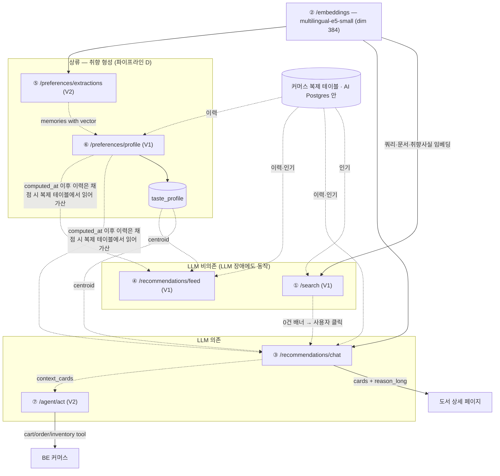
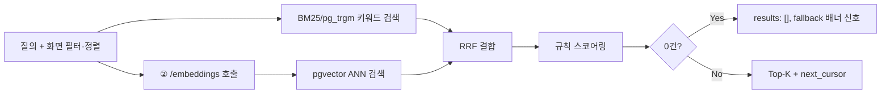
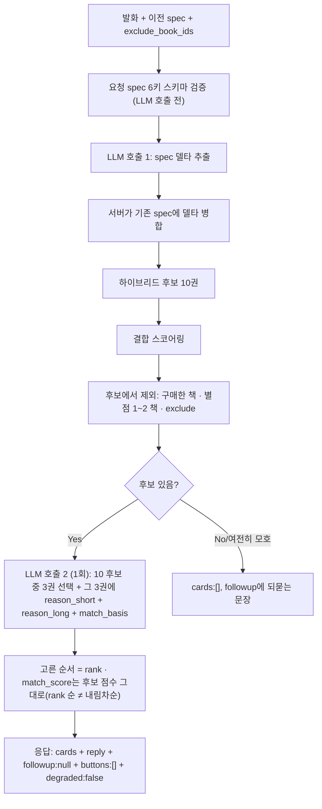
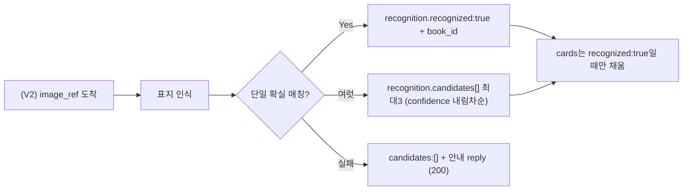
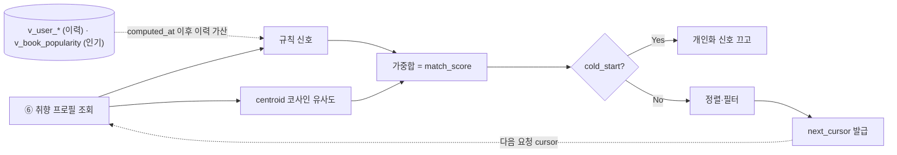
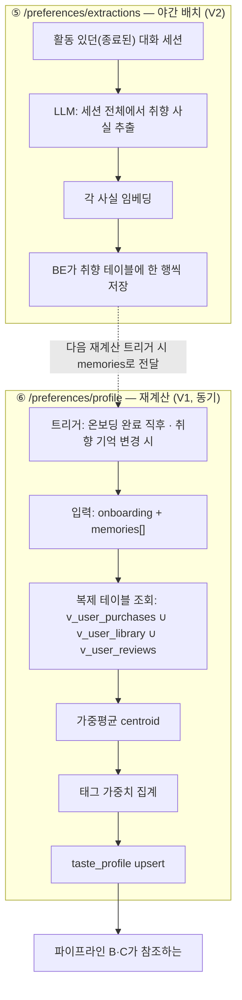
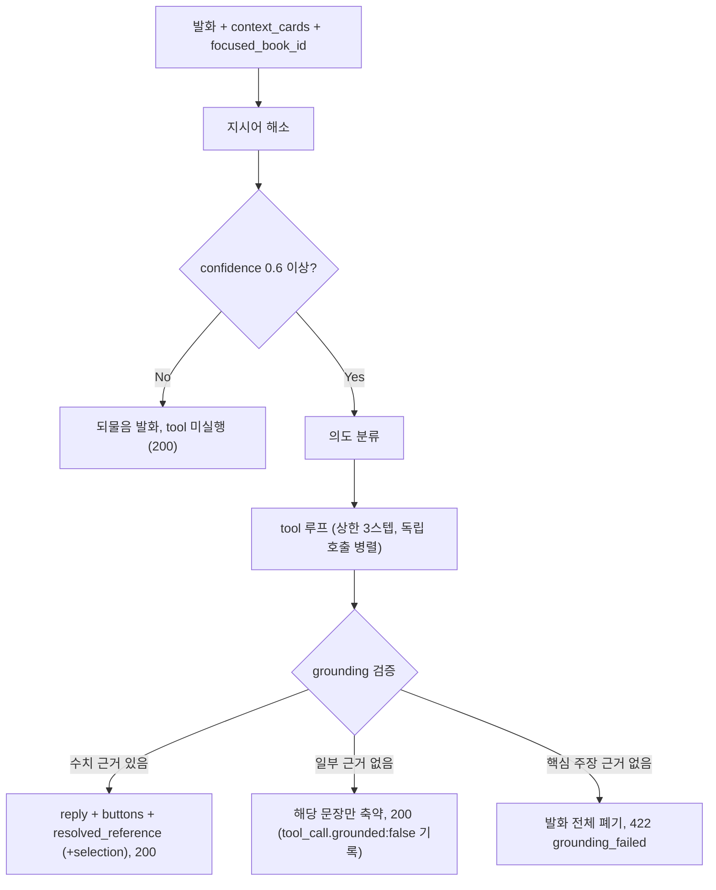

**요약** 검색·대화 추천·홈 피드·취향 형성·쇼핑 에이전트 5개 파이프라인의 스텝 구성과, LLM을 어디에 넣고 어디서 뺐는지의 판단 근거를 정리한다.

> 2026-09-21 팀 논의로 오케스트레이션 프레임워크 결정이 바뀌었다. ③ 대화 추천·⑤ 취향 기억 추출은 LangChain, ⑦ 쇼핑 에이전트는 LangGraph로 구현한다. "프레임워크: LangChain을 V1에 도입하지 않는 결정" 절의 미채택 판정과 재평가 트리거는 이력 참고용이다. 파이프라인 단계 구성과 역할 경계는 이 결정으로 바꾸지 않으며, 코드 전환은 후속 작업이다.
>
> ⑤에서 벡터가 필요할 때는 LangChain의 Embeddings 클래스를 쓰지 않고 모델 게이트웨이 `embed()`로만 부른다. 저장된 벡터와 같은 좌표계(같은 모델·같은 purpose 처리)를 지키기 위해서다.

## 파이프라인 전체 지도



| 노드 | 설명 |
|---|---|
| ② /embeddings — multilingual-e5-small (dim 384) | 모든 벡터의 단일 좌표계 |
| 커머스 복제 테이블 · AI Postgres 안 | v_books · v_user_purchases · v_user_library · v_user_reviews · v_book_popularity · (원본은 BE MySQL · 단방향 복제 · 역방향 없음) |
| ⑤ /preferences/extractions (V2) | 야간배치: 대화→취향사실 LLM추출→임베딩 |
| ⑥ /preferences/profile (V1) | 온보딩·기억변경 트리거 · 벡터 가중평균 집계 (LLM·임베딩 재호출 없음) |
| taste_profile | centroid + tag_weights + computed_at · 개인화 단일 소스 |
| ① /search (V1) | BM25/pg_trgm + 벡터 + RRF + 규칙 · 0건 → fallback 배너 |
| ④ /recommendations/feed (V1) | 규칙신호 + centroid 유사도 가중합 · 목록 비저장, 커서만 |
| ③ /recommendations/chat | V1 텍스트 / V2 이미지 · LLM = spec 델타 + 10 후보 중 3권 선택 + 이유 2종(short+long) · 후보 풀·점수는 결정론 / 최종 3권·순위는 LLM |
| ⑦ /agent/act (V2) | 지시어해소 → 의도분류 → tool루프(≤3) → grounding |
| 도서 상세 페이지 | BE가 보관한 긴 이유 그대로 표시 · (AI 재호출 없음) |
| BE 커머스 | (V1엔 없는 유일한 역방향 호출. · DB 복제는 BE→AI 단방향뿐) |

## 파이프라인 A — 검색 (`POST /search`, V1, LLM 없음)



| 노드 | 설명 |
|---|---|
| ② /embeddings 호출 | multilingual-e5-small, purpose:query |
| 규칙 스코어링 | sort=popular면 v_book_popularity 반영 |
| results: [], fallback 배너 신호 | 'AI 추천에게 물어볼까요?' |

- **LLM을 쓰지 않는다.**
- **개인화하지 않는다.**
- **0건은 에러가 아니라 200 + 배너 신호**다.
- **강등**
    - 벡터 검색 불가(임베딩 업스트림 장애·벡터 인덱스 이상·초기 적재 중) 시 `X-Degraded: keyword-only`로 키워드 결과만 200.
    - 키워드·벡터가 둘 다 안 되면(AI Postgres 장애 등) 500. **BE MySQL 장애는 500이 아니다** — 낡은 복제본으로 계속 응답.
- **`v_book_popularity`에 행이 없으면** 인기 항을 0으로 두고 200.
    - 복제 지연·행 부재는 `X-Degraded`를 붙이지 않는다.
    - AI Postgres 자체가 응답 불능이면 전면 500.

## 파이프라인 B — 대화형 추천 (`POST /recommendations/chat`, V1 텍스트 턴 / V2 이미지 턴)



| 노드 | 설명 |
|---|---|
| 요청 spec 6키 스키마 검증 (LLM 호출 전) | 위반 시 422 spec_schema_violation · → 호출자가 초기 spec으로 1회 재시도 |
| LLM 호출 1: spec 델타 추출 | 6키 고정 스키마 |
| 하이브리드 후보 10권 | (①과 같은 BM25+벡터+RRF 재사용, · spec.semantic/filters 적용) |
| 결합 스코어링 | 질의 유사도 + 취향 유사도 · (centroid + computed_at 이후 이력 가산) |
| 고른 순서 = rank · match_score는 후보 점수 그대로(rank 순 ≠ 내림차순) | reason_short 못 만든 카드는 뺌 (3장 미만 가능) · reason_long만 비면 카드 남기고 reason_long:null |



| 노드 | 설명 |
|---|---|
| (V2) image_ref 도착 | BE presigned URL |
| recognition.recognized:true + book_id | spec.anchor_book을 그 book_id로 갱신 · 유사 도서 카드 + library_add 버튼 |
| recognition.candidates[] 최대3 (confidence 내림차순) | spec.anchor_book은 아직 null 유지 · confirm_book/retake 버튼 |

핵심 설계 포인트:

1. **LLM이 두 번, 목적이 다르게 들어간다.**
    1. (1) 발화 해석(spec 델타 추출), (2) 결정론적 스코어링이 만든 **후보 10권 중 3권을 고르고** 그 3권에 **이유 2종을 한 호출로** 생성(`reason_short` + `reason_long` + `match_basis`).
    2.  후보 풀(10권)과 각 후보의 `match_score`, 제외 규칙은 하이브리드 검색 + 유사도 결합 스코어링이 결정론적으로 만든다
    3.  LLM은 그 위에서 최종 3권과 순위만 정하고(고른 순서 = `rank`, 그래서 `match_score`는 rank 순으로 내림차순이 아닐 수 있다), 그 3권에 자연어 설명을 붙인다.
    4.  LLM이 후보를 새로 검색하거나 점수를 다시 매기지 않으므로 근거 없는 추천을 지어낼 여지를 좁힌다.

- **`reason_long`이 여기서 마지막으로 생성된다.**
    1.  `reason_short`와 같은 호출·같은 `match_basis`에서 나오므로 카드와 상세가 어긋날 수 없고 상세 진입에 LLM 지연이 없으며, 취향 기억을 지웠을 때 옛 취향이 담긴 이유 문장이 AI 서버에 남는 문제가 사라진다.
- **긴 이유의 보관은 BE 몫이다.**
    1. BE가 카드와 함께 `reason_long`을 받아 두었다가 상세 페이지에서 그대로 쓴다. 같은 책을 다시 열어도 AI를 부르지 않는다. `reason_long`이 `null`이면 BE는 상세의 이유 영역을 숨긴다.
- **되묻기는 별도 분기가 아니라 이 파이프라인의 기본 출력 형태다.**
    1. 카드를 못 만들면 `cards:[]` + `followup`에 되묻는 문장. 새 엔드포인트나 판별자가 없다. 다음 턴에 또 spec 델타를 받아 자연스럽게 다턴 대화가 된다.
- **이미지 턴(V2)은 서브플로우이지 별도 엔드포인트가 아니다.**
    1. 단일 매칭이면 AI가 `spec.anchor_book`을 채우지만, 후보가 여럿이면 채우지 않고 사용자가 고르게 한다("확정은 사람이 한다"). 표지를 못 읽은 경우와 읽었으나 카탈로그에 없는 경우를 구분하지 않고 같은 안내 reply를 준다.
- **이력·인기는 요청에 없다.**
    1. 서버가 `user_id`로 `v_user_purchases`·`v_user_library`·`v_user_reviews`를, `book_id`로 `v_book_popularity`를 복제 테이블에서 직접 읽는다. 프로필 `computed_at`(= 반영한 이력 행들의 최대 시각) 이후 이력은 이 채점 스텝에서 복제 테이블을 읽어 같은 가중치 표로 더한다. 단 복제 지연(이력 3종 허용 5분) 동안은 방금 산 책이 아직 사본에 없어 카드에 잠깐 다시 뜰 수 있다 — 명세가 수용한 유일한 체감 지연이다.
- **LLM 장애 강등**: 델타 추출과 이유 생성(호출 1·2)을 건너뛰고 **요청의 spec으로 후보 검색·채점만** 수행해 상위 3권을 낸다.
    1. `degraded:true`, `reason_short`는 규칙으로, `reason_long`은 `null`. 스트리밍이라 헤더를 못 붙여 본문 `data.degraded`로 알린다.
- **스트리밍**:

    이벤트 타입은 `delta`·`done`·`error` 셋이지만 **V1은 `done` 하나만 보낸다**(envelope 전체).

    `error`가 따로 있는 이유는 200 헤더가 나간 뒤엔 상태 코드를 못 바꾸기 때문 — 클라이언트는 `error` 이벤트의 `message`를 상태 코드 자리에 쓴다.

## 파이프라인 C — 홈 피드 (`GET /recommendations/feed`, V1, LLM 없음)



| 노드 | 설명 |
|---|---|
| ⑥ 취향 프로필 조회 | centroid + tag_weights + computed_at |
| 규칙 신호 | 작가·카테고리·태그·이력·인기 |
| v_user_* (이력) · v_book_popularity (인기) | AI Postgres 복제 테이블 |
| 개인화 신호 끄고 | 인기·신간만, match_score=0 |
| 정렬·필터 | (surface=recommend_more일 때만 sort/filters) |
| next_cursor 발급 | (서버는 목록을 저장하지 않음) |

- **목록을 저장하지 않는다.**
    - 커서는 "어디까지 봤는지" 이어붙일 위치만 담고, 서버는 그 지점부터 다시 계산한다.
    - 프로필·인기 집계가 스크롤 도중 바뀌면 410 없이 "지금 값 기준"으로 이어붙인다
    - 순서 재현성은 포기하고 가용성을 택했다. **커서 발급 이후 생긴 조회·구매 이력은 제외 대상에서 뺀다**(카드 보고 돌아와 스크롤해도 목록이 밀리지 않게).
- **LLM이 없다.** 피드 항목에는 추천 이유 문구가 **아예 없다**
    - `reason_short`·`reason_long`·`match_basis` 셋 다 안 낸다.
- **복제 테이블에 행이 없을 때**

    이력이 비면 개인화가 약해지고, 인기 행이 없으면 그 항 0점일 뿐 200(복제 지연·행 부재는 `X-Degraded` 아님).

    벡터 인덱스 이상·모델 교체 구간에만 `X-Degraded: rule-only`로 취향 유사도를 빼고 규칙 점수만으로 정렬. `centroid`가 없으면 이건 `cold_start`다. AI Postgres 응답 불능은 전면 500.

- **`filters`로 0건**이면 `items:[]`·`next_cursor:null`로 200.

     필터를 임의로 풀지 않는다. `filters` 없이 0건인 경우는 없다.

## 파이프라인 D — 취향 형성 (⑤ 야간 배치 V2 + ⑥ 프로필 재계산 V1)

두 단계가 시점이 다르게 이어진다. 무거운 연산(LLM 추출·임베딩)은 ⑤에서 끝나 있고, ⑥은 그 결과와 복제 테이블을 집계하는 단계다.



| 노드 | 설명 |
|---|---|
| 활동 있던(종료된) 대화 세션 | 세션 단위 호출 |
| LLM: 세션 전체에서 취향 사실 추출 | type/value, confidence 0.5 미만은 반환 안 함 |
| 각 사실 임베딩 | multilingual-e5-small |
| BE가 취향 테이블에 한 행씩 저장 | (source_conversation_id로 재처리 시 교체) |
| 트리거: 온보딩 완료 직후 · 취향 기억 변경 시 | (구매·리뷰가 늘었다고 부르지 않음) |
| 입력: onboarding + memories[] | (memories는 이미 vector 포함) |
| 복제 테이블 조회: v_user_purchases ∪ v_user_library ∪ v_user_reviews | (user_id로. 요청 본문에 없음) |
| 가중평균 centroid | 좋아한책 ∪ 카테고리·태그 사전벡터 · ∪ 기억벡터(작가 기억 포함) ∪ 이력 책벡터(구매3 / 리뷰4~5점2 / 담기1) |
| 태그 가중치 집계 | (리뷰1~2점 −2: centroid엔 빼고 카테고리 점수만 깎음) |
| taste_profile upsert | computed_at = 반영한 이력 행들의 최대 시각 (계산 시각 아님) · (user_id 단위 직렬, last-writer-wins) · 순위 영향값 바뀔 때만 profile_version +1 |
| 파이프라인 B·C가 참조하는 | 개인화 단일 소스 |

- **⑥은 "AI 파이프라인"이라기보다 가중평균 계산이다.**

    좋아한 책·이력 책은 적재 시 문서벡터 재사용, 카테고리/태그는 사전 임베딩, 기억은 ⑤가 이미 임베딩(작가 기억도 문장 벡터 그대로 쓴다).

    그래서 ⑥은 LLM도 임베딩 업스트림도 호출하지 않고, **503·504가 없다.**

- **매번 처음부터 다시 계산한다.**

    기억을 지워도 그 몫만 분리해 뺄 수 없기 때문에 남은 것 전체로 재계산.

    그래서 온보딩 응답도 기억만 바뀔 때 함께 다시 보낸다.

    이게 왜 별도 스텝이 필요한지의 근거: 삭제·추가가 뒤섞인 상태에서 일관된 프로필을 유지하려면 "전량 재계산"이 항상 따라와야 한다.

- **`computed_at`은 응답에 안 나가는 내부값이고, "계산 시각"이 아니라 "프로필이 실제로 반영한 이력 행들의 최대 시각"이다.**
    - ③·④가 채점할 때 그보다 나중의 이력만 골라 점수에 더한다(같은 가중치 표).
    - 이력을 복제 테이블에서 읽으므로 계산 시점에 아직 복제되지 않은 이력이 있을 수 있는데, 계산 시각을 기준으로 삼으면 그 이력이 프로필에도 가산 대상에도 없어 **영구 누락된다.**
    - 반영한 이력이 없으면 값이 비고 그때는 이력 전부를 가산한다.
- **멱등**: `idempotency_key`가 같고 본문이 같으면 재계산을 건너뛰고 저장된 결과를 200으로 반환.
    - 그 사이 구매가 생겨 실제 결과가 달라질 수 있어도, 멱등 규약은 "저장된 결과를 그대로 돌려주는 것"이라 응답은 일관된다. 같은 키에 다른 본문이면 409.
- **동시성**: `user_id` 단위 직렬 처리 — 온보딩 완료와 기억 변경이 겹쳐 들어와도 나중에 끝난 요청 결과가 남는다.
- 이 프로필이 파이프라인 B·C의 **개인화 단일 소스**다. 취향이 형성되는 이 파이프라인이 실은 나머지 파이프라인의 입력을 만드는 상류 공정이다.

## 파이프라인 E — 쇼핑 에이전트 (`POST /agent/act`, V2)



| 노드 | 설명 |
|---|---|
| 지시어 해소 | 'N번' → context_cards[N-1], '이거' → focused_book_id |
| 의도 분류 | 담기·수량변경·장바구니조회·주문요약·재고·골라담기·비교 |
| tool 루프 (상한 3스텝, 독립 호출 병렬) | 골라담기: recommendations.candidates(내부) · → inventory.check/book.detail로 가격·재고 재검증 · → 조합 전수열거로 결정적 선택 |

- 검색·피드·에이전트가 하나의 랭킹 로직을 공유한다
    - **후보 생성(`recommendations.candidates`)은 엔드포인트가 아니라 내부 모듈**이고, ④(홈 피드)와 같은 채점 로직을 재사용한다.
- **grounding 검증이 이 파이프라인에서 매우 중요하다**
    - 발화에 들어가는 모든 수치(가격·재고·수량·합계·별점)는 반드시 그 턴에 실행한 `tool_calls[].result`에서만 온다. 근거가 없으면 문장을 축약(부분 실패, 200)하거나 발화 전체를 버린다(핵심 주장이 근거 미확보면 422).
    - `context_cards`의 스냅샷 가격을 그대로 쓰지 않고 `inventory.check`로 재검증하는 것도 같은 이유 — (직전 턴 카드가 최신 가격을 보장하지 않는다.)
    - `selection.chosen[].price`·`total_price`는 재검증된 값이다.
- 선택형("3만원 안에서 2권")은 LLM이 조합을 판단하는 게 아니라 **결정적 알고리즘**(조합 전수 열거 → 예산·재고 필터 → `match_score` 합 최대)이 고른다.
    - 파이프라인 B에서 LLM이 후보 10권 중 3권을 고르는 것과 달리, 여기는 예산·재고 제약이 걸린 조합 최적화라 선택 자체를 코드가 한다.
- **되물음·범위 밖 안내·BE tool 실패 흡수는 모두 200**이다.
    - 답변으로 안내하고 `tool_calls`에 실패를 기록한다. 422는 grounding 전체 실패 하나뿐.
- **멱등키가 tool 단위로 파생된다**(`{idempotency_key}:{tool_call_index}`)
    - 한 턴에 쓰기 tool이 여러 번 나갈 수 있어, 턴 전체 재시도 판정(본문 키)과 개별 쓰기 중복 방지(파생 키)를 분리해야 하는 멀티스텝 특유의 문제가 있다.

### 의사코드 — ⑦ 에이전트 턴

<details><summary>agent_act()</summary>

```python
def agent_act(req: AgentRequest) -> AgentResponse:
    if cached := get_idempotent_result(req.idempotency_key):   # 같은 키·같은 본문 → 저장된 결과
        return cached

    # 1. 지시어 해소 ("N번" → context_cards[N-1], "이거" → focused_book_id)
    ref = resolve_reference(req.message, req.context_cards, req.focused_book_id)
    if ref.confidence < 0.6:
        return AgentResponse(reply=make_reask(ref), tool_calls=[],           # tool 미실행, 200
                             resolved_reference=ref, selection=None,
                             buttons=[confirm_reference_button(ref)])

    # 2. 의도 분류
    intent = classify_intent(req.message)   # add | qty_edit | cart_view | order_preview | stock | select | compare

    # 3. tool 루프 — 상한 3스텝, 독립 호출은 병렬, 쓰기엔 파생 멱등키
    calls: list[ToolCall] = []
    selection = None
    if intent == "select":                                      # "3만원 안에서 2권"
        cands = call_tool("recommendations.candidates", {"size": 20}, calls)      # 내부 모듈, 감사 기록
        verified = call_tool("inventory.check",                                   # 스냅샷 신뢰 안 함
                             {"book_ids": [c.book_id for c in cands.candidates]}, calls)
        selection = deterministic_pick(cands, verified, req.constraints)          # 조합 전수열거, LLM 아님
        buttons = [confirm_selection_button(selection.chosen)]
    elif intent == "add":
        idem = f"{req.idempotency_key}:{len(calls)}"
        call_tool("cart.add", {"book_id": ref.book_ids[0], "qty": 1, "_idem": idem}, calls)
        buttons = [navigate_button("CART-001")]
    elif intent == "qty_edit":                                   # 수량 변경 / 삭제
        idem = f"{req.idempotency_key}:{len(calls)}"
        call_tool("cart.update",                                  # 수량 0 = 삭제
                  {"book_id": ref.book_ids[0], "qty": req.target_qty, "_idem": idem}, calls)
        buttons = [navigate_button("CART-001")]
    elif intent == "compare":
        for bid in ref.book_ids:
            call_tool("book.detail", {"book_id": bid}, calls)                     # 병렬
        buttons = [confirm_reference_button(ref)]
    else:  # stock / cart_view / order_preview / 범위 밖
        buttons = handle_read_or_out_of_scope(intent, ref, calls)

    # 4. grounding — 발화의 모든 수치·상태는 calls[].result에서만
    draft = llm_compose_reply(intent, ref, calls, selection)
    reply, calls = enforce_grounding(draft, calls)
    if core_claim_ungrounded(reply, intent):                    # 축약해도 핵심 주장이 근거 미확보
        raise GroundingFailed(422)                              # 발화 전체 폐기

    result = AgentResponse(reply=reply, tool_calls=calls, resolved_reference=ref,
                           selection=selection, buttons=buttons)
    save_idempotent_result(req.idempotency_key, result)
    return result

def enforce_grounding(draft: str, calls: list[ToolCall]) -> tuple[str, list[ToolCall]]:
    facts = index_numbers_and_states(calls)     # 가격·재고·수량·합계·별점
    kept = []
    for s in split_sentences(draft):
        needed = extract_claims(s)              # 이 문장이 주장하는 수치·상태
        if all(claim in facts for claim in needed):
            kept.append(s)
        else:
            mark_ungrounded(calls, needed)      # 해당 tool_call.grounded = False, 문장 제거
    return " ".join(kept), calls
```

</details>

핵심은 **LLM이 마지막 조립(`llm_compose_reply`)에만 들어가고, 그 출력이 곧바로 `enforce_grounding`을 통과해야 한다**는 것 — 선택·검증·계산은 전부 결정론적 코드가 하고, LLM은 이미 계산된 사실을 문장으로 옮긴다.

### 왜 "추천 이유 상세" 스텝이 파이프라인에서 사라졌나

v3.1까지 독립 파이프라인이던 **'추천 이유 상세'(`/books/{bookId}/match-reason` + `reason_ref` 캐시)** 는 최종 명세에서 통째로 제거됐다(v4에 이 라벨은 없다). 멀티스텝 설계 관점에서 이건 "스텝을 줄이는 것도 설계"라는 사례다.

| - | 캐시 있는 별도 엔드포인트 (v3.1) | ③에 병합 (최종) |
|---|---|---|
| 이유 생성 시점 | 카드 생성 시 `reason_short`, 상세 진입 시 `reason_long` (2회) | 카드 생성 시 둘 다 (1회) |
| 정합성 | `reason_short`와 `reason_long`이 다른 호출 → 어긋날 수 있음 | 같은 호출·같은 `match_basis` → 못 어긋남 |
| 상세 진입 지연 | 캐시 미스면 LLM 지연 | LLM 지연 없음 (BE가 보관한 값 표시) |
| 없어지는 것 | — | 캐시 테이블 · TTL · 권한 규칙 · `llm-off` 캐시 재조립 로직 |
| 대가 | — | 안 열어보는 카드의 `reason_long`도 생성 → 턴당 출력 토큰 증가 |
| 취향 삭제 시 | 옛 취향이 담긴 이유가 AI 캐시에 잔류 | AI는 저장 안 함 → 잔류 문제 없음 |

**판단**: 상세 페이지 조회량이 카드 생성량보다 크게 적지 않고(추천을 거친 조회에만 이유가 있음), 캐시 인프라·정합성·프라이버시 비용이 "안 열어보는 카드의 토큰 몇 개"보다 크다. 그래서 스텝을 하나 없애고 그 산출물의 보관 책임을 BE로 넘겼다.

## 사용 모델·도구·프레임워크

| 구성요소 | 선택 | 선택 이유 | 기대 효과 |
|---|---|---|---|
| 텍스트 임베딩 | `multilingual-e5-small`(dim 384) | API 계약으로 고정. | 인덱스·프로필·기억 벡터가 전부 호환 |
| (별도 트랙) e5-small | 벤치 결과 기준 후보 | 추론 최적화 실험에서 하이브리드 recall·지연·비용 우위 확인 | 계약과 분리된 트랙. |
| 검색 결합 | RRF | 스케일 다른 두 랭킹(BM25·벡터)을 정규화 없이 합치는 표준 기법 | ① 검색과 ③ 후보검색이 같은 로직 재사용 |
| 벡터 저장소 | AI 전용 PostgreSQL + pgvector (HNSW) | BE가 MySQL이라 DB 공유 불가(구 "Postgres 공유" 안 무효). 도서 임베딩·취향 프로필·멱등 기록을 한 Postgres에 둠 → 전용 벡터DB 불필요 | AI 쪽 데이터스토어 1개. 대신 BE→AI 단방향 복제 파이프라인이 필요 |
| 커머스 데이터 접근 | BE MySQL → AI Postgres **단방향 복제된 실제 테이블** AI엔 BE MySQL 연결 없음 | 요청 본문으로 실어 나르기엔 크고, 원본은 어차피 BE가 소유. 컬럼 집합·허용 지연·스키마 변경 통보를 계약면으로 두면 BE 내부 스키마 변경과 무관 | 이력·인기 값의 단일 출처 → 검색 인기순 = 추천 인기 항 ¹ |
| 대화·이유 생성 LLM | 소형 텍스트 LLM, 상용 API 우선 | 스트리밍 필요(③), 초기 구축비용 낮음. 호출 지점이 코드에 2곳(③ 델타·③ 이유)뿐이라 교체 용이 | 빠른 출시. 트래픽 증가 시 자체 서빙 손익분기 재평가 (단계 6) |
| 오케스트레이션 프레임워크 | ~~미채택 (V1 전체)~~ ③⑤ LangChain · ⑦ LangGraph 채택 (2026-09-21) | 이전 판단: ③은 고정 선형 체인(LLM 2회 + 결정론적 검색·채점) ⑦도 최대 3스텝 고정 tool 세트 | ~~의존성 최소화. **⑦의 tool loop이 복잡해지면 재평가**~~ 추상화 뒤 디버깅 난이도는 감수 |
| 표지 인식기 | 생성형 VLM 미채택 이미지 인코더(자체) + OCR + RRF 최근접 검색 | "사진 → book_id" 단일 인식에 생성 모델 불필요. 검색 파이프라인의 RRF를 그대로 재사용 | 단계 5에서 확정. 구체 인코더 모델은 실측 후 선정 |

¹ 허용 지연은 신선도 예산 표(가격·재고 5분 / 신간+임베딩 1h / 인기 24h / 이력 5분). 행 없으면 해당 항 0점 200, AI Postgres 응답 불능은 500

### 프레임워크: LangChain을 V1에 도입하지 않는 결정

과제 1번 예시는 "LangChain으로 질의·검색·응답을 체인으로 구성"을 전제한다. ~~**V1에서 도입하지 않는다.**~~ 2026-09-21 팀 논의로 도입하기로 바꿨다(③·⑤는 LangChain, ⑦은 LangGraph). 아래 판정 표와 재평가 트리거는 미채택 당시의 판단이며 이력 참고용으로 남긴다. 추상화 뒤에서 디버깅·장애 추적이 어려워지는 대가는 감수한다.

| 파이프라인 | 구조 | 프레임워크가 해결할 문제가 있나 | 판정 |
|---|---|---|---|
| ③ 대화 추천 | 델타추출(LLM) → 하이브리드검색 → 결합스코어링 → 3권 선택+이유생성(LLM 1회) → 카드 조립. **고정 선형**, 분기는 "후보 0 → followup" 하나 | 체인이 정적이라 그래프 오케스트레이션 이득 없음. 프롬프트·파서·재시도는 얇은 함수로 충분 | ~~미채택~~ LangChain 채택 |
| ①④·⑥ | LLM이 없거나(①④), 순수 집계(⑥) | 애초에 "체인"이 아님 | 해당 없음 |
| ⑤ 야간 추출 (V2) | 세션당 LLM 1회 + 임베딩 1회 배치 | 선형 2스텝. 배치 스케줄링은 프레임워크 밖 문제 | ~~미채택~~ LangChain 채택 |
| ⑦ 에이전트 (V2) | 지시어해소 → 의도분류 → **tool 루프(≤3스텝)** → grounding → 조립 | 반복 tool 호출·상태 누적·중단조건·부분실패 | ~~**미채택하되 재평가 트리거 명시**~~ LangGraph 채택 |
- **재평가 트리거 (⑦ 한정)** — 도입이 확정돼(2026-09-21) 이 트리거와 아래 기대 효과는 더는 유효하지 않다. 미채택 당시 판단을 이력으로 남긴다.

    ⓐ tool 루프 상한이 3스텝을 넘음,

    ⓑ tool을 동적으로 선택해야 함(고정 7종 밖),

    ⓒ 턴 간 상태를 서버가 들고 있어야 함(현재 무상태),

    ⓓ 스텝별 재시도·롤백이 함수로 관리 불가능해짐. 이 중 둘 이상이면 LangGraph류 상태그래프 도입 — 노드=스텝, 엣지=중단조건, 체크포인트=파생 멱등키.

    - **기대 효과**: V1 의존성 트리를 얇게 유지(FastAPI + 임베딩 SDK + LLM SDK)

        → 배포·디버깅·장애 추적이 단순. LLM 호출 지점이 코드에 2곳으로 명시적으로 드러나 grounding·강등 로직을 그 지점에 직접 붙일 수 있다.

        프레임워크 추상화 뒤로 숨었다면 "LLM은 정해진 후보 위에서만 고르고 검색·채점은 결정론적 코드가 한다"는 파이프라인 B·E의 역할 경계를 코드로 강제하기 어려웠을 것.

## 의사코드

### 검색 + 대화 추천 후보 검색 공유 로직

```python
def hybrid_candidates(text_query: str, filters: dict, size: int) -> list[Book]:
    kw_hits = bm25_search(text_query, filters)
    query_vec = call_embeddings_api([text_query], purpose="query")[0]  # multilingual-e5-small
    vec_hits = pgvector_search(query_vec, filters)
    return reciprocal_rank_fusion(kw_hits, vec_hits, k=60)[:size]

def search(query: str, filters: dict, cursor: str | None, size: int = 15) -> SearchResponse:
    fused = hybrid_candidates(query, filters, size)
    ranked = apply_business_rules(fused, popularity=read_replica("v_book_popularity"))  # 복제 테이블. 행 없으면 인기항 0
    if not ranked:
        return SearchResponse(results=[], next_cursor=None,
                               fallback={"message": "원하는 책을 못 찾았어요. AI 추천에게 물어볼까요?"})
    return SearchResponse(results=ranked, next_cursor=make_cursor(ranked, query, filters))
```

### 대화형 추천 (spec 델타 → 결정론적 채점 → LLM이 10 후보 중 3권 선택 + 이유 하나의 호출로)

<details><summary>recommend_chat()</summary>

```python
def recommend_chat(user_id: int, message: str | None, image_ref: str | None,
                    prev_spec: Spec, recent_turns: list, exclude_book_ids: list) -> ChatResponse:
    if image_ref:
        return handle_image_turn(image_ref, prev_spec, user_id)   # 인식, cards는 recognized일 때만

    validate_spec_schema(prev_spec)   # 요청 spec이 6키 스키마 위반 → 422 spec_schema_violation
                                      # (LLM 호출 전. 호출자가 초기 spec으로 1회 재시도)

    # LLM 호출 1 — 발화 해석
    delta = llm_extract_spec_delta(message, prev_spec, recent_turns)   # 6키만
    spec = merge_spec(prev_spec, delta)                                # 서버가 기존 spec에 델타 병합

    # 결정론적 후보 풀 + 채점 — LLM 아님
    profile = load_user_profile(user_id)                              # centroid + computed_at
    hist = read_history_replica(user_id)                              # 복제 테이블 v_user_purchases/library/reviews
    excluded = set(exclude_book_ids) | set(spec["exclude"]) \
             | hist.purchased | hist.rated_low                        # 산 책·별점 1~2 제외
    cands = hybrid_candidates(spec["semantic"] or "", spec["filters"], size=10)
    cands = [c for c in cands if c.book_id not in excluded]

    scored = {c.book_id: (c, combine_score(
                  query_sim=c.vec_sim,
                  taste_sim=cosine(c.vec, profile.centroid),
                  post_profile_hist=hist.since(profile.computed_at),   # computed_at(반영시각) 이후 이력 가산
                  popularity=read_replica("v_book_popularity", c.book_id)))
              for c in cands}
    if not scored:
        return ChatResponse(reply=..., spec=spec, cards=[],
                            followup=make_reclarify_question(spec),
                            buttons=[], degraded=False)

    # LLM 호출 2 (1회) — 10 후보 중 3권 선택 + 그 3권에 이유 2종
    picked = llm_pick_and_write(scored, spec, profile)
    # → [{book_id, reason_short, reason_long, match_basis}] 최대 3개. 배열 순서가 곧 rank
    cards = []
    for rank, r in enumerate(picked, start=1):
        if r.book_id not in scored or r.reason_short is None:   # 후보 밖이거나 한 줄 이유 실패 → 제외
            continue
        book, score = scored[r.book_id]
        cards.append(Card(book_id=book.book_id, rank=rank,
                          match_score=int(score),               # 후보 점수 그대로. rank 순과 무관
                          reason_short=r.reason_short,
                          reason_long=r.reason_long,             # null 가능 → BE가 상세 이유영역 숨김
                          match_basis=r.match_basis))
    return ChatResponse(reply=compose_reply(cards), spec=spec, cards=cards,
                        followup=None, buttons=[], degraded=False)

    # LLM 장애 강등: 위 두 호출을 건너뛰고 요청의 spec으로 채점만 → 점수 상위 3권,
    # degraded=True, reason_short는 규칙, reason_long=null
```

</details>

### 취향 프로필 재계산 (⑥ — 집계이지 생성이 아님)

<details><summary>rebuild_profile()</summary>

```python
def rebuild_profile(user_id: int, idempotency_key: str, onboarding: dict, memories: list) -> ProfileResult:
    if cached := get_idempotent_result(idempotency_key):   # 24h 보관, 같은 본문이면 재계산 스킵
        return cached
    if any(m["dim"] != INDEX_DIM for m in memories):
        raise InvalidRequest(400)                          # 차원 불일치

    hist = read_history_replica(user_id)                   # 요청 본문에 없음 — user_id로 복제 테이블 조회
    liked_vecs  = [book_doc_vector(b) for b in onboarding.get("liked_book_ids", [])[:50]]
    tag_vecs    = preset_vectors(onboarding.get("categories", []) + onboarding.get("tags", []))
    mem_vecs    = [m["vector"] for m in memories[-500:]]   # 이미 ⑤에서 임베딩 — 재호출 없음. 작가 기억도 여기 포함
    hist_vecs   = hist.weighted_doc_vectors()             # 구매3 / 리뷰4~5점2 / 담기1, 리뷰1~2점 제외

    centroid    = weighted_average(liked_vecs + tag_vecs + mem_vecs + hist_vecs)
    tag_weights = aggregate_tags(onboarding, memories, hist)   # 리뷰1~2점은 여기서 −2

    reflected_at = hist.max_row_ts()   # 실제로 읽어 반영한 이력 행들의 최대 시각. now() 아님 —
                                       # 복제 늦게 온 이력이 프로필·가산 양쪽에서 영구 누락되지 않게.
                                       # 반영한 이력이 없으면 None → ③④가 이력 전부 가산
    version = upsert_user_profile(user_id, centroid, tag_weights, computed_at=reflected_at)  # user_id 직렬
    result = ProfileResult(cold_start=not (liked_vecs or mem_vecs or hist.any()),
                           profile_version=version)
    save_idempotent_result(idempotency_key, result)
    return result
```

</details>

## 기대효과 / 불필요 판단

- **검색·홈 피드**
    - **(①④)**: LLM 없이 설계된 것 자체가 "장애 격리"라는 명확한 서비스 요구를 충족한다 — LLM이 죽어도 책을 찾고 살 수 있어야 한다는 원칙이 명세에 그대로 적혀 있다.
    - 멀티스텝(BM25+벡터+RRF, 규칙+centroid 가중합)은 필수이되,
    - **LLM 단계는 의도적으로 배제**한 것이 이 파이프라인의 핵심 설계 결정.
- **대화 추천**
    - **(③)**: 멀티스텝 필수 — "LLM이 검색하고 순위를 매긴다"가 아니라 "결정론적 검색·스코어링이 후보 10권과 점수를 만들고, LLM은 그중 3권과 순서만 고른 뒤 이유를 붙인다"는 역할 분리가 실제 이점.
    - 후보 밖의 책을 LLM이 끌어오거나 점수를 다시 매길 수 없어 환각이 추천 결과를 왜곡할 여지를 구조적으로 줄인다.
    - 선택과 이유 생성을 한 호출로 합친 것은 스텝 수·인프라를 줄인 별도 설계 결정
- **취향 형성**
    - **(⑤+⑥)**: 배치(⑤, 무거운 LLM+임베딩)와 동기 재계산(⑥, 가벼운 집계)을 시점 자체로 분리한 게 핵심 이점
    - 사용자가 온보딩을 마치자마자 기다리는 ⑥ 경로에는 LLM이 아예 없어 빠르고 503·504가 없다.
    - `computed_at`(반영 시각) 보정으로 "채점 시점에 복제 테이블을 읽어 최신 이력을 더하는" 스텝이 프로필 재계산과 분리돼, 구매·리뷰가 늘 때마다 무거운 재계산을 부를 필요가 없다.
- **쇼핑 에이전트**
    - **(⑦, V2)**: tool loop과 grounding 검증까지 필요한 진짜 멀티스텝
    - ~~여기서 프레임워크(LangGraph류) 도입 여부는 스텝 수·tool 동적성이 늘어날 때 재평가 대상.~~ 2026-09-21 팀 논의로 LangGraph 도입 확정.
- **비전 다단계 파이프라인은 불필요**
    - 표지 인식은 단일 인식 호출(인코더+OCR+RRF)로 ③에 흡수된다.

## 남은 열린 질문

- 표지 인식 인코더의 구체 모델(자체 서빙 이미지 인코더 vs 상용 Vision API)
- ③의 결합 스코어링(질의 유사도 + centroid 유사도 + 프로필 이후 이력 + 인기) 가중치 계수
- ~~⑦ tool loop이 향후 스텝 수·동적 tool 선택으로 복잡해질 경우 프레임워크(LangGraph 등) 도입 재검토~~ **확정 (2026-09-21)**: ⑦은 LangGraph로 구현한다(③⑤는 LangChain).
- BE MySQL → AI Postgres **복제 수단**(CDC / 논리 복제 등)
- 회원 탈퇴 시 취향 프로필 삭제 통지
- 임베딩 벡터 확정 차원
