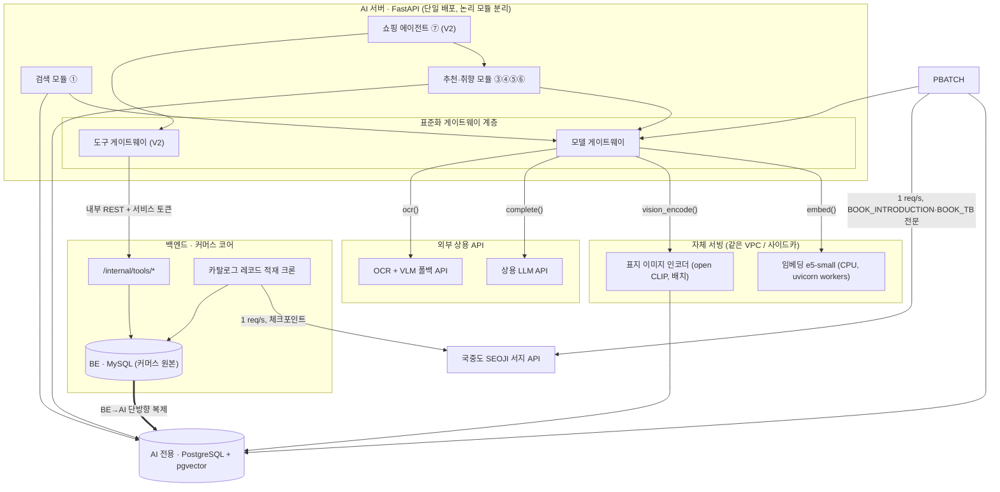

**요약** MCP 전송은 도입하지 않고 디스크립터 형식만 차용한다는 결정과, 모델 게이트웨이·도구 게이트웨이·적재 커넥터로 외부 호출을 모으는 통합 설계를 정리한다.

MCP는 아무 데나 쓰는 게 아니라, "AI가 대화·추론 중에 도구를 골라 부르는" 딱 그 상황을 위한 규격이다.
## 결론

### 1. MCP라는 표준 연결 규격은 안 쓴다

- **표준으로 연결할 곳은 한 지점 존재**
    - V2 쇼핑 에이전트가 BE 기능 7개(장바구니 담기·빼기·조회, 주문 요약, 재고 확인, 책 정보)를 부르는 것.
- **외부 AI 모델**(문장 생성, 벡터 변환)은 이미 우리 자체 창구인 "모델 게이트웨이"로 깔끔하게 정리돼 있다.
- MCP의 장점은 "도구가 계속 늘고, 남이 만든 도구를 갖다 쓰고, 여러 AI가 도구를 나눠 쓸 때" 나온다.
    - 우리는 **도구 7개 고정 + 상대는 우리 BE 팀 하나라 장점이 없음**

### 2. 대신 쇼핑 에이전트 BE tool 기능 목록을 "MCP랑 똑같은 양식"으로만 적어둔다

- 기능마다 **이름 / 설명 / 받는 값 형식 / 성격**(읽기 전용인지, 여러 번 불러도 안전한지)을 적는다. (실제 통신은 그냥 평범한 내부 REST.)
- 나중에 진짜 MCP로 바꿔야 할 일이 생겨도, **부르는 쪽 코드는 안 고쳐도 된다.** 통로만 갈아 끼우면 끝.

### 3. 모델 부르는 건 이미 표준화돼 있다

- 추천·검색 코드는 `complete()`(문장 생성)와 `embed()`(벡터 변환) 두 함수만 부른다.
    - **어느 회사 모델을 쓰는지 몰라도 된다.**
- 과제가 요구하는 "표준 인터페이스 + 권한 관리 + 비용·지연·안정성 제어"는 MCP가 아니라 **이 게이트웨이 계층**이 담당한다.

### 4. 이미지·영상·음성 만드는 기능이 없다

## 1. 외부 시스템·도구·서비스 상호작용 인벤토리

AI 서버가 자기 프로세스 밖과 주고받는 지점

| # | 상대 | 방향 | 성격 | 호출 시점 | 지연 민감도 | 과금 |
|---|---|---|---|---|---|---|
| I1 | **상용 LLM API** (텍스트 생성) | AI → 외부 | 생성 | ③ 델타 + 카드 이유 short·long·match_basis(온라인, **한 호출**), ⑤ 취향 추출(야간 배치), (V2) ③ 표지 VLM 폴백 | 높음(③ SSE) | 토큰 |
| I2 | **임베딩 백엔드** | AI → 자체 서빙(단일. 장애 시 다른 모델로 폴백하지 않고 강등) | 인코딩 | ①③ 쿼리·spec(온라인), ⑤ 취향 문장(야간), ② 문서(배치) | 중간 | 자체=0 |
| I3 | **비전 인코더 + OCR** (V2) | AI → 자체 서빙(인코더) / 외부 API(OCR) | 인코딩·인식 | 표지 색인(배치), ③ 이미지 턴(온라인, V2, 저볼륨) | 색인 낮음 / 질의 중간 | OCR API=이미지당 |
| I4 | **BE 커머스 tool** (7종) | AI → BE | 읽기 5 / 쓰기 2 | ⑦ 에이전트 턴(V2)만. tool 루프 ≤3스텝 | 중간 | 없음(내부) |
| I5 | **국중도 SEOJI 서지 API** | 적재 크론 → 외부 | 조회 | 카탈로그 적재·갱신(오프라인, 1 req/s) | 없음 | 무료(키·한도) |

## 2. MCP 도입 여부 — 결정과 근거

### 2-A. MCP가 값을 내는 조건 vs 우리 상황

| MCP의 강점 | 우리 상황 | 회수되나 |
|---|---|---|
| 도구를 **동적으로 발견**하고 능력을 협상 | tool 7종 고정. `allow_tools` 화이트리스트도 이미 계약에 있음 | ✗ 정적이라 이득 없음 |
| **서드파티 도구 서버**를 표준 방식으로 연결 | 상대는 자체 BE 팀 하나. 결제대행·배송사 등 외부 직결 없음(주문·결제는 시스템 밖) | ✗ 서드파티 없음 |
| 한 도구 서버를 **여러 AI 클라이언트**가 공유 | BE tool의 소비자는 AI 서버 하나 | ✗ 단일 소비자 |
| 모델 ↔ 도구 사이 **전송·인증 표준화** | AI↔BE는 같은 내부망, 방향 전용 서비스 토큰, 소유권은 BE가 `user_id`로 재확인 | △ 이미 단순하게 풀림 |
| LLM SDK의 **네이티브 tool-calling** 연동 | 이건 MCP 없이도 JSON Schema 디스크립터만 있으면 됨 | △ 스키마만 필요 |

> 💡 **판정**: MCP **전송/서버 프로세스**는 미도입.
>
> MCP의 **스키마 관례**(선언적 도구 디스크립터 + 능력 어노테이션)만 차용한다.

### 2-B. 채택안 — "MCP 호환 디스크립터 + 내부 REST 전송"

AI↔BE tool을 아래 형식으로 정의한다.

BE는 이걸 구현하고, AI 서버의 `ToolRegistry`가 그대로 읽어 LLM tool-calling 목록으로 넘긴다.

```json
{
  "name": "cart.add",
  "description": "장바구니에 도서를 담는다. 재고·권한은 BE가 재검증한다.",
  "inputSchema": {
    "type": "object",
    "required": ["user_id", "book_id", "qty"],
    "properties": {
      "user_id": { "type": "integer" },
      "book_id": { "type": "integer" },
      "qty":     { "type": "integer", "minimum": 1 }
    }
  },
  "annotations": {
    "readOnlyHint": false,
    "idempotentHint": true,
    "audience": ["agent"],
    "owner": "backend-commerce"
  }
}
```

- **"성격표시" 칸을 보고 재시도 정책이 자동으로 갈립니다.**

설명서의 성격표시 칸에 "이 도구는 읽기만 함" / "두 번 불러도 안전함" 같은 게 적혀 있습니다. 호출 실패했을 때 우리 코드가 이걸 보고 알아서 판단

- **읽기 도구**(재고 조회 등) → 실패하면 그냥 다시 부름 (여러 번 불러도 아무 일 안 생기니까)
- **쓰기 도구**(장바구니 담기 등) → "이거 두 번 하지 마" 표식(멱등키)이 붙어 있을 때만 다시 부름 (안 그러면 두 번 담길 수 있으니까)
- **이 설명서를 AI 코드에 넣어두고, BE 팀과 "계약서"로 공유한다**

### 2-C. MCP 전송으로 전환하는 재평가 트리거 (하나라도 충족)

1. 에이전트가 **자체 BE 밖의 도구**를 써야 한다
    1. 배송사 추적 API 직결, 외부 예약/티켓, 결제대행.
2. BE tool의 **소비자가 AI 서버 외에 생긴다**
    1. 다른 내부 서비스, 파트너.
3. tool 세트가 **동적·대규모**가 되어 수기 디스크립터 관리가 불가능해진다
    1. (단계 4의 LangGraph 재평가 트리거 ⓑ와 같은 신호)
4. **서드파티가 우리 추천을 도구로 호출**하는 B2B 요구(우리가 MCP 서버가 되는 경우)

전환 비용: `ToolInvoker`의 전송 어댑터 1개 교체(REST → MCP 클라이언트). 디스크립터가 이미 MCP 형식이라 호출부·프롬프트·grounding 로직 무변경.

## 3. 도구·서비스 통합 다이어그램



| 노드 | 설명 |
|---|---|
| 검색 모듈 ① | 파서→BM25+벡터→RRF→랭킹 |
| 추천·취향 모듈 ③④⑤⑥ | 해석·후보검색·재랭킹·이유·취향추출·프로필 |
| 쇼핑 에이전트 ⑦ (V2) | 지시어해소→의도분류→tool루프→grounding |
| 모델 게이트웨이 | complete() · embed() · vision_encode() · ocr() · 어댑터·폴백체인·서킷·응답캐시·레이트리밋 |
| 도구 게이트웨이 (V2) | ToolRegistry(MCP호환 디스크립터) · ToolInvoker(재시도·타임아웃·서킷·파생멱등키·감사) · GroundingEnforcer |
| 표지 이미지 인코더 (open CLIP, 배치) | V2+ · 트리거 관측 시에만 |
| 상용 LLM API | 텍스트 생성 (스트리밍) |
| OCR + VLM 폴백 API | 표지 텍스트·단서 추출 (V2) |
| /internal/tools/* | cart.add · cart.update · cart.view · order.preview · inventory.check · book.detail |
| 카탈로그 레코드 적재 크론 | (제목·저자·가격·ISBN) |
| BE · MySQL (커머스 원본) | 회원 · 카탈로그 · 장바구니 · 주문 · 결제 |
| 국중도 SEOJI 서지 API | BOOK_INTRODUCTION · BOOK_TB · 표지(조건부) |
| AI 전용 · PostgreSQL + pgvector | v_books·v_user_* (복제 사본) · book_embeddings · taste_profile · book_cover_embedding (V2) |
| BE→AI 단방향 복제 | (신선도 예산: 명세 §1) |

### 각 도구·서비스의 역할과 호출 목적

| 노드 | 역할 | 왜 호출하나 | 대체 전략 |
|---|---|---|---|
| **모델 게이트웨이** | 모든 모델 I/O의 단일 창구. provider-neutral 인터페이스 뒤로 자체/외부 차이를 어댑터가 흡수 | 파이프라인·에이전트가 프로바이더를 몰라도 되게. 교체·폴백·비용 제어를 한 곳에 | 계층 자체가 대체 전략의 구현체 |
| **도구 게이트웨이 (V2)** | ⑦ 에이전트의 tool 루프 실행 — 디스크립터 로드, BE 호출, 재시도/서킷, 파생 멱등키, `tool_calls[]` 감사 기록 | LLM이 낸 tool 호출을 안전하게(권한·중복·근거) 실행하려고 | BE tool 장애는 200으로 흡수(발화 안내 + 실패 기록), 서킷 오픈 시 해당 의도만 비활성 |
| **상용 LLM API** | ③ spec 델타 추출 + 카드 `reason_short`·`reason_long`·`match_basis`(**한 호출**), ⑤ 야간 취향 사실 추출, (V2) ③ 표지 VLM 폴백 | 스트리밍 생성 품질을 초기 구축비 없이 확보 | LLM 장애 시 요청 spec으로 점수 상위 3권 + `reason_short` 규칙 생성 + `reason_long: null` + 본문 `degraded:true`(③). |
| **임베딩 e5-small (자체)** | ①③ 쿼리·spec, ⑤ 취향 문장, ② 문서 벡터 | 최다 호출 경로의 왕복·과금 제거(22배). 검색·추천·취향이 같은 좌표계 공유 강제 | 다른 모델로 폴백하지 않는다(모델이 다르면 저장된 벡터와 비교할 수 없다). 장애 시 ① 키워드 전용(`keyword-only`) · ④ 규칙 점수만(`rule-only`) · ⑤ 503 후 다음 날 재처리 |
| **표지 인코더 (자체, V2)** | 카탈로그 표지 벡터 색인 + 질의 표지 인코딩 | "사진으로 책 찾기"는 본질이 이미지 최근접 검색(단계 5) | 오프라인 색인이라 지연 무관. 미색인 책은 lazy 색인 |
| **OCR API (V2)** | 질의 표지 사진에서 제목·저자 텍스트 추출 → BM25 교차검증 | 이미지 임베딩만으로는 유사 디자인 혼동. 저볼륨(이미지 턴만)이라 상용이 저렴 | 자체 OCR(Tesseract/Paddle) 폴백, OCR 실패 시 이미지 최근접 단독 |
| **BE 커머스 tool (7종, 내부)** | 장바구니 담기·수정·조회, 주문 초안 요약, 재고, 도서 메타 | ⑦이 발화의 수치·상태를 **그 턴 tool 결과에서만** 채우려고(grounding) | 배송 문의는 보통 [주문내역] 딥링크로 안내. `recommendations.candidates`는 BE 아님(AI 내부 모듈, 감사만 기록) |
| **BE MySQL (커머스 원본)** | 회원·카탈로그·장바구니·주문·결제의 소유자. tool 쓰기·카탈로그 적재가 여기로 들어감 | AI가 커머스 트랜잭션에 관여하지 않도록 물리적으로 분리 | BE MySQL 장애는 AI 응답에 영향 없음 AI는 낡은 복제본으로 계속 200. 복제만 멈춤 |
| **국중도 SEOJI** | 책소개·목차·표지(조건부) 카탈로그 소스 | 카탈로그 단일 소스(2026-09-05 확정). | 채움율 낮은 신간은 `description`만 짧게 채워짐. 표지 URL 미확보 시 알라딘 lazy fetch |
| **AI 전용 Postgres + pgvector** | 복제된 커머스 테이블(`v_books`·`v_user_*`·`v_book_popularity`) + AI 소유(임베딩·취향 프로필) | 별도 벡터 DB의 동기화 파이프라인(ML 아닌 일)을 안 만들려고. 벡터와 복제 커머스 테이블이 한 DB라 필터(WHERE)+벡터(ORDER BY)가 한 SQL(옵션 C) | HNSW 인덱스 장애 시 전수 스캔(E2 실측 p95 7.5ms). **AI PG 전면 장애만 ①③④ 500**, 복제 지연·행 부재는 낡은 값으로 200 |

## 4. 상용 API — 선택 이유 · 비용 · 성능 · 제약 · 자체 vs API

### 4-A. 텍스트 LLM (상용 API 채택)

- **용도**: ③ spec 델타 추출 · ③ 카드 `reason_short`(≤80자)·`reason_long`(2~4문장, ≤300자)· `match_basis` **한 호출로 함께 생성**(카드 선택과 이유가 어긋나지 않게) ⑤ 야간 취향 사실 추출 (V2) ③ 표지 OCR 실패 시 제목·저자 단서 구조화 추출(VLM 폴백)
- **후보**: Gemini 2.x/3.x flash-lite급, GPT-4.x mini급, Claude Haiku급 **소형·저지연·스트리밍** 클래스. 게이트웨이 어댑터로 교체 가능하게 두고 1차 선정은 한국어 품질·단가·RPD로 결정
- **선택 이유**: (1) ③이 SSE 스트리밍 필수: 자체 소형 LLM 서빙(vLLM/TGI + GPU)은 초기 구축·운영비가 트래픽 대비 과함 (2) 후보 10권 검색·채점은 결정론(단계 4)이고 LLM은 그중 3권 최종 선택 + 이유 문장만 → 소형 모델로 충분 (3) LLM 호출 지점이 온라인 1곳(③) + 야간 1곳(⑤), V2에서 ⑦·표지 → 교체 위험 국소적
- **성능(실측·단계 2)**: 이유 1건 p95 **1.3초**, TTFB p95 1.0초 (한→해외 RTT 포함). ③ chat 1턴 SLO 4초 안에 여유(카드 3장 한 호출이라 출력 토큰↑ 여유분 확인 필요). ⑤는 야간 배치라 지연 무관
- **비용 구조**: 입력+출력 토큰 과금. ③ 1턴 ≈ 입력3400~700 tok(spec + 후보 10권 메타) + 출력 300~600 tok(카드 3장 × short+long+basis). **카드를 다시 열어도 LLM 0회** BE가 `reason_long`을 카드와 함께 보관하고 상세 페이지에서 그대로 렌더(AI측 이유 캐시·이유 엔드포인트 없음). 트레이드오프: 사용자가 안 여는 카드의 긴 이유까지 생성해 턴당 출력 토큰↑
- **제약 / 리스크**: ① RPD/RPM 한도 → 게이트웨이 클라이언트 레이트리밋 + 429 시 `Retry-After` 전파 ② 데이터 경계 이탈 — 발화·spec이 외부로 나감. **완화**: AI 서버는 대화 원문 미저장·로그 마스킹, 프로바이더 **학습 비활성(no-train) 플래그 + DPA** 필수, 가능하면 리전 고정 ③ 크로스보더 지연 변동 → 타임아웃 30초 + 504 `generation_timeout`
- **자체 구축 vs API**: 자체(GPU 상시 A10/L4 ≈ $360~720/월 + 서빙 운영) vs 상용(사용량 과금). **현재 볼륨(텍스트 소형 생성만, 캐시 적중률 높음)에서는 상용이 명백히 저렴.** 손익분기 ≈ 지속 토큰 지출이 GPU 상시비를 넘길 때 → 그 지점에서 소형 LLM 자체서빙 파일럿(단계 2 계획과 동일)
- **캐시 / 폴백**: AI측 이유 캐시 없음(BE가 `reason_long` 보관). LLM 장애 폴백: 요청 spec으로 점수 상위 3권 + `reason_short` 규칙 생성("관심 카테고리 '에세이'에서 골랐어요" 류) + `reason_long: null` + 본문 `degraded: true`. `X-Degraded` 헤더는 ③에 붙지 않는다(계약값 `keyword-only`·`rule-only` 둘뿐). ⑤ 야간 배치는 실패 시 다음 날 재처리

### 4-B. 임베딩 (자체 서빙 — 상용 미채택)

- **결정**: multilingual-e5-small 자체 서빙 확정(`bench/`).
    - 상용 임베딩 API는 **런타임 폴백으로도 쓰지 않는다.** 모델이 다르면 벡터 공간(대개 차원까지)이 달라 `book_embeddings`·취향 프로필·기억 벡터와 비교할 수 없다.
- **근거**: 최다 호출 경로(모든 검색·추천 질의).
    - 자체 서빙으로 p95 467ms→21ms(22배), 건당 과금 제거, 하이브리드 recall 0.90(Gemini 벡터 단독 동급). 인제스트 처리량 5.6→200+ docs/s.
- **제약**: GIL+torch로 스레드 확장 안 됨
    - `uvicorn --workers` 프로세스 복제. CPU 코어가 스케일 단위.
- **자체 vs API**: 이미 자체가 이김.
    - 자체 서빙 장애는 폴백 없이 강등(① `keyword-only` · ④ `rule-only` · ⑤ 503)으로 받는다.
    - 모델 회귀 시 되돌리기는 설정 변경이 아니라 모델 교체 절차를 따른다: 도서 임베딩 전량 재적재 + BE의 전 사용자 ⑥ 재호출 + 기억 벡터 재생성(ERD §7).

### 4-C. 표지 인식 — OCR + VLM 폴백 (V2)

V2의 "사진으로 책 찾기"는 **이미지 임베딩 최근접이 아니라 이미지→텍스트 변환 + 기존 텍스트 검색**이다.

최종 매칭은 항상 `v_books` 검색이 결정하고(카탈로그 밖 반환 불가), 모델은 검색어만 만든다.

| 구성요소 | 채택 | 이유 |
|---|---|---|
| OCR (표지 텍스트 추출) | **상용 API 우선 + 자체 폴백** | 저볼륨(이미지 턴, V2)이라 상용 단가(대략 이미지당 $0.001~0.0015)가 무의미한 수준 ¹ |
| VLM (OCR 실패분 폴백) | **상용 API, 제약된 프롬프트** | 글꼴·각도·가림으로 OCR이 실패한 경우만. 제목/저자/시리즈 단서를 **구조화 텍스트로만** 추출 "무슨 책인지" 답하게 하지 않음 (자유 응답 시 환각 → 최종 매칭은 DB 검색이 결정) |
| 표지 이미지 임베딩 인덱스 | **V2에서도 보류** | 새 인프라(이미지 인코더·벡터 테이블·임계 튜닝) 값어치가 텍스트 안 읽히는 소수 케이스 대비 크지 않음. 국중도 서지에 표지 URL 존재 확인 → 트리거 관측 시 자체 open CLIP 색인으로 확장 (색인·질의 같은 인코더, 상용 멀티모달 API 락인 회피) |
| 생성형 VLM ("이 책 뭐야" 직접 답변) | **미채택** | 카탈로그 밖 환각 + 신간 학습 지연. "검색 결과만 반환"이 ③ grounding 원칙과 동일 |

¹ 대부분 표지는 OCR로 끝. 자체 Tesseract/PaddleOCR를 폴백으로

- **비용·성능**: 질의 = OCR(API, ~수백 ms) + (폴백 시) VLM + `v_books` 텍스트 검색(BM25, ms대). 이미지 턴 SLO에 여유.
- **제약**: OCR·VLM API 모두 데이터 경계 이탈 사용자 사진이 나감 → no-train + 짧은 보관 프로바이더 선택, Pre-signed URL만 넘기고 AI는 이미지 미저장.
- 표지 사진은 BE가 임시 보관함에 올리고 AI엔 만료되는 주소만 전달(명세 ③ V2).

### 4-D. 이미지·영상·음성 생성 API — 도입 불필요

| 시나리오 | 판단 | 근거 |
|---|---|---|
| 이미지 생성 API | 도입 안 함 | 서비스에 생성 기능 없음. "표지 없는 책 표지 생성"은 단계 5에서 상품정보 정확성·저작권 위반으로 기각 → 규칙 기반 타이포 플레이스홀더 |
| 영상 분석/생성 API | 도입 안 함 | 서비스에 영상 자산·기능 없음 |
| 음성 합성 / STT | 도입 안 함 | 음성 입출력 없음(단계 5 §5-C). STT→③ 텍스트 턴은 접근성 백로그 후보로만 도입 시 게이트웨이에 `transcribe()` 어댑터 1개 추가로 흡수 |

→ **과제의 "GPU 자원 부족 시 상용 생성 API" 긴장은 이 서비스에 거의 비해당.** 유일한 상용 의존은 소형 텍스트 LLM이고, 그건 게이트웨이가 관리한다.

## 5. 내부 모듈화 (MCP 미도입 시의 인터페이스 설계)

### 5-A. 모델 게이트웨이 (기존 계층 — 단계 3)

프로바이더 중립 인터페이스. 파이프라인·에이전트는 이것만 호출한다.

```python
class ModelGateway:
    def complete(self, req: CompletionReq) -> CompletionResp | Iterator[Delta]: ...   # LLM, 스트리밍 옵션
    def embed(self, texts: list[str], purpose: str) -> list[Vector]: ...               # e5-small 단일. 다른 모델로 폴백하지 않음
    def ocr(self, image: bytes) -> OcrResult: ...                                      # OCR API(주) / 자체(폴백) → 실패분 VLM 폴백 (V2)
    def vision_encode(self, image: bytes) -> Vector: ...                               # 자체 open CLIP — V2+, 표지 벡터 인덱스 트리거 시에만
```

- **프로바이더 어댑터**: `GeminiAdapter` · `OpenAIAdapter` · `SelfE5Adapter` · `SelfClipAdapter` · `GcpVisionAdapter` … 요청/응답 형식 차이 흡수
- **폴백 체인**: `[llm_primary, llm_secondary]` 설정으로 순서 지정. 앞이 서킷 오픈이면 다음으로. 임베딩은 체인을 두지 않는다(다른 모델 벡터는 기존 인덱스와 섞을 수 없다)
- **서킷 브레이커**: 프로바이더별 실패율·지연 임계 초과 시 오픈 → 폴백 or 강등. 임베딩 장애는 폴백 없이 바로 계약 헤더(`X-Degraded: keyword-only`/`rule-only`), LLM 장애는 ③ 본문 `degraded: true`
- **응답 캐시**: 임베딩은 텍스트 해시 키(선택). **LLM 이유 응답은 캐시하지 않는다** 긴 이유 보관은 BE 몫(명세 §1·③). TTL·스토리지 §8
- **레이트리밋**: 프로바이더별 토큰 버킷(RPM/RPD). 초과 시 429 매핑 + `Retry-After`
- **타임아웃·재시도**: 기본 타임아웃(생성 30s / 임베딩 5s), 재시도는 idempotent 호출만 + 지터 백오프
- **비용 관측**: 호출당 토큰·프로바이더·`purpose` 로깅 → 일일 지출 대시보드, 손익분기 추적

### 5-B. 도구 게이트웨이 (V2 신설 — ⑦ `/agent/act` 전용)

```python
class ToolGateway:
    registry: ToolRegistry          # MCP 호환 디스크립터 로드 (2-B), allow_tools 필터
    def invoke(self, call: ToolCall, turn: AgentTurn) -> ToolResult: ...

class ToolInvoker:
    # 내부 REST: POST {BE}/internal/tools/{name}, Authorization: Bearer <서비스 토큰>
    # - annotations.idempotentHint=false → 파생 멱등키 {idempotency_key}:{tool_call_index}
    # - annotations.readOnlyHint=true    → 재시도 자유 / false → 멱등키 있을 때만 재시도
    # - 타임아웃 3s, 재시도 2회(지터 백오프), tool별 서킷 브레이커
    # - 실패는 예외로 던지지 않고 ToolResult(ok=False, error=...) 로 흡수 → 발화로 안내, 200 유지
    # - 모든 호출을 tool_calls[]에 감사 기록 (name/arguments/result/grounded)
```

- **인증**: 방향 전용 서비스 토큰(BE 발급).
    - 사용자 위임 토큰 없음. 소유권은 BE가 `arguments.user_id`로 tool마다 재확인.
- **권한 모델**: `allow_tools`(턴별 화이트리스트, null이면 전부 허용, 표에 없는 이름은 400) → `registry` 필터 → `user_context.logged_in=false`면 쓰기 tool(`cart.add`·`cart.update`) 원천 차단.
- **grounding**: `GroundingEnforcer`가 발화의 모든 수치·상태(가격·재고·수량·합계·별점)를 `tool_calls[].result`에 대조
    - → 뒷받침 없으면 그 `tool_call`을 `grounded: false`로 기록하고 가능하면 그 문장만 축약(200).
    - 핵심 주장을 못 대면 422 `grounding_failed`(답변 통째 폐기, 클라이언트가 일반 안내로 대체). `context_cards[].price`는 직전 턴 스냅샷이라 쓰지 않고 `inventory.check`/`book.detail`로 재검증한 값만 사용.
- **되물음**: `resolved_reference.confidence < 0.6`이면 tool 미실행하고 되묻는 답변(200, `tool_calls: []`).
- **왜 gRPC가 아니라 REST**
    - BE가 이미 REST, tool 수 적음, 감사 로그·디버깅 가독성, LLM tool-calling이 JSON Schema 네이티브. gRPC는 임베딩 자체서빙 사이드카(고QPS 인제스트)에서만 후보로 남긴다.

### 5-C. 적재 커넥터 (오프라인 — 추론 경로 밖)

```python
class CatalogSource(Protocol):            # 새 소스 추가 시 이 인터페이스만 구현
    def fetch(self, isbn13: str) -> RawRecord: ...
    def list_recent(self, since: date) -> Iterator[str]: ...

class SeojiClient(CatalogSource):
    # rate_limit=1req/s, 체크포인트(마지막 성공 ISBN), 실패 ISBN 데드레터 큐
    # 에러 {RESULT:ERROR,ERR_CODE} → 재시도 or 데드레터, 크론은 계속 진행
```

- **두 적재가 같은 SEOJI 소스를 보지만 쓰는 DB가 다르다**:
    - 카탈로그 레코드(제목·저자·가격·ISBN)는 BE MySQL로 들어가 복제되고,
    - AI는 같은 원본에서 `BOOK_INTRODUCTION`·`BOOK_TB` **전문만** 따로 받아 청킹·②로 임베딩해 AI Postgres `book_passage`에 색인한다.
- 병합은 ISBN-13 조인 키 3계층(`aladin-ingest` 메모
    - raw → `v_books` COALESCE → 서빙). 새 소스는 raw 테이블 + COALESCE 우선순위만 추가.
- **AI가 직접 돌리는 적재는 도서 임베딩(`book_embeddings`) 배치뿐이다.**
    - `v_books.description` 복제가 끝난 뒤 이어서 ②로 임베딩해 upsert한다(카탈로그 복제 크론과 레이트리밋 공유).
    - `v_books.description` 복제가 끝난 뒤 이어서 ②로 임베딩해 upsert한다(카탈로그 복제 크론과 레이트리밋 공유).

### 5-D. 모든 외부 호출의 공통 정책

| 정책 | 모델 게이트웨이 | 도구 게이트웨이 | 적재 커넥터 |
|---|---|---|---|
| 타임아웃 | 생성 30s / 임베딩 5s / OCR 8s | 3s | 10s |
| 재시도 | idempotent만, 지터 백오프 2회 | 읽기 자유 / 쓰기 멱등키 있을 때만 2회 | 3회 후 데드레터 |
| 서킷 브레이커 | 프로바이더별 | tool별 | 소스별(크론 중단 아님) |
| 레이트리밋(아웃바운드) | 프로바이더 토큰 버킷 | BE가 넉넉(내부), 야간 배치 폭주 흡수용 안전장치 | 1 req/s 고정 |
| 에러 매핑 | 429 `rate_limited`+`Retry-After` / 503 `upstream_unavailable` / 504 `generation_timeout` | 실패 흡수 → 200 + `tool_calls` 실패 기록 | 로그 + 데드레터 |
| 강등 신호 | **계약값은 `X-Degraded: keyword-only`(①) `rule-only`(④) 둘뿐.** ③ LLM 장애는 본문 `degraded: true` + `reason_long: null` ¹ | 서킷 오픈 시 해당 의도만 비활성, 발화로 안내 | N/A |
| 상관관계 ID | `X-Request-Id` 전파 | 턴 ID + `tool_call_index` | 크론 실행 ID |
| 캐시 | 임베딩 텍스트 해시(선택). **이유는 캐시 안 함** — BE가 `reason_long` 보관 | 없음(쓰기·실시간 상태) | raw jsonb 원본 보관 |

¹ `rag-off`는 AI 내부 관측 헤더(계약 밖, 단계 5). 복제 지연·행 부재엔 아무 헤더도 안 붙음

## 6. 확장성 계획 — 새 도구·API 추가

| 추가 대상 | 절차 | 호출부 영향 |
|---|---|---|
| **새 모델 프로바이더** (LLM 교체, 소형 LLM 자체서빙) | 게이트웨이 어댑터 1개 + 폴백 체인 설정 | 없음 (LLM 한정. 임베딩 모델 교체는 어댑터 교체에 더해 도서 임베딩 전량 재적재·BE의 ⑥ 재호출·기억 벡터 재생성이 필요하다, ERD §7) |
| **새 모달리티** (STT 접근성, 향후 오디오북) | 게이트웨이에 `transcribe()` 인터페이스 + 어댑터 | 신규 파이프라인만, 기존 무변경 |
| **새 BE tool** (에이전트 스코프 확장) | MCP 호환 디스크립터를 `registry`에 추가 + BE가 `/internal/tools/{name}` 구현 | LLM이 `registry`에서 자동 인식. `allow_tools`로 점진 롤아웃 |
| **자체 BE 밖 도구** (배송사·예약 등) | `ToolInvoker` 전송 어댑터를 MCP 클라이언트로 교체 | 디스크립터가 이미 MCP 형식이라 전송만 스왑 |
| **새 카탈로그 소스** (알라딘 복귀 등) | `CatalogSource` 구현 + raw 테이블 + COALESCE 우선순위 | 서빙·추천 무변경(복제된 `v_books`만 읽음) |
| **우리가 MCP 서버가 되는 경우** (B2B 추천 도구 제공) | ①③ 로직을 MCP `tools/list`+`tools/call`로 래핑한 별도 어댑터 배포 | 코어 파이프라인 무변경, 어댑터 계층 신설 |

## 7. 통합 방식이 확장성·유지보수성·비용 효율에 미치는 영향

### 확장성

- **모든 외부 I/O가 2개 게이트웨이로 수렴**
    - 커넥션 풀링, 레이트리밋 샤딩, 프로바이더별 스케일을 한 곳에서 조정. 파이프라인 수가 늘어도 통합 표면은 안 늘어난다.
- **커머스 데이터는 복제로 들어와** AI가 BE에 매 요청 조회하지 않는다
    - BE 부하·왕복 지연이 추천 트래픽에 비례해 늘지 않고, AI Postgres 하나만 읽기 스케일하면 된다. 대가는 신선도 예산 안의 지연(가격·재고 5분 등).
- tool 세트가 선언적 디스크립터라, 에이전트 능력 확장이 "디스크립터 + BE 엔드포인트" 추가로 끝난다.
- MCP 전송을 안 깔았지만 **디스크립터를 MCP 형식으로 유지**해 전환 옵션을 열어뒀다
    - 서드파티·다중 소비자가 실제로 생기는 시점에 전송만 교체.

### 유지보수성

- 프로바이더·tool 변경이 어댑터/디스크립터로 국소화. LLM 호출 지점이 온라인 1곳(③)·야간 1곳(⑤)으로 명시적(V2에서 ⑦·표지 추가)
    - → grounding·강등 로직을 그 지점에 직접 붙인다(프레임워크 추상화 뒤에 숨지 않음
    - 후보 선택·채점은 결정론, LLM은 최종 3권 + 이유만).
- MCP 서버 프로세스·JSON-RPC 브리지를 안 넣어 의존성 트리가 얇다
    - (FastAPI + 임베딩 SDK + LLM SDK + HTTP 클라이언트). 배포·장애원인 추적이 단순.
- 외부 호출 정책(재시도·타임아웃·서킷)이 한 표로 통일
    - → 신규 통합도 같은 규칙을 따른다.

### 비용 효율

- **자체 서빙 임베딩**이 최다 호출·최다 과금 경로를 제거(건당 과금 0, 22배 지연 개선).
- **긴 이유를 BE가 보관**해 상세 페이지 재진입 시 LLM 0회
    - 이유 캐시 테이블·만료·권한 규칙이 통째로 사라짐(명세 결정). 대가는 안 열어 볼 카드의 긴 이유까지 생성하는 턴당 출력 토큰.
- 상용 LLM은 **진짜 생성이 필요한 텍스트에만**, 소형 모델 클래스로. 유휴 GPU 없음.
- 표지 인식은 V2에서도 텍스트 검색(OCR+VLM 폴백)으로 출시
    - 이미지 벡터 인프라를 트리거 관측 전엔 안 얹음.
- MCP 전송 오버헤드(추가 홉·프로세스)를 값이 안 나오는 곳에 안 넣음.
- 게이트웨이의 호출당 비용 로깅이 **자체서빙 전환 손익분기를 상시 추적**
    - → 트래픽이 임계를 넘으면 데이터에 근거해 소형 LLM 자체서빙으로 전환.
