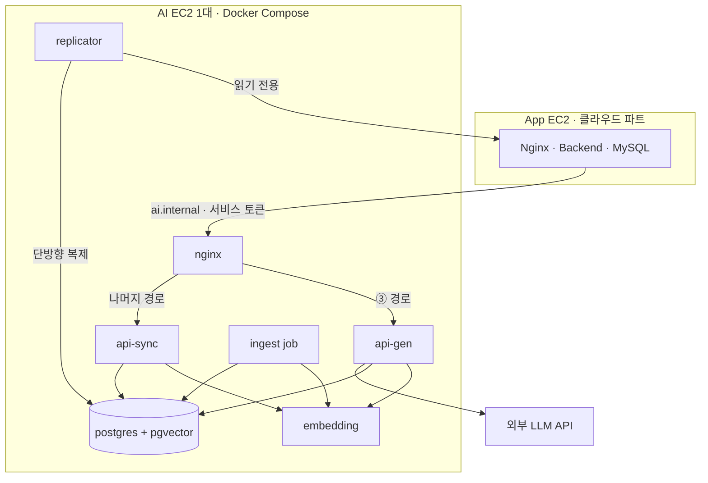
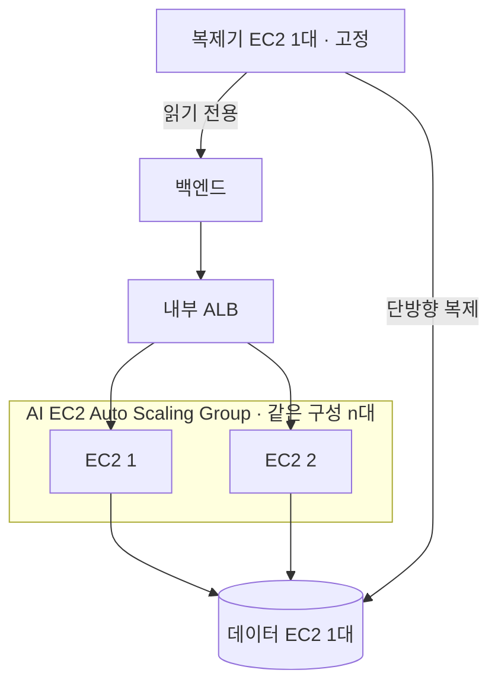
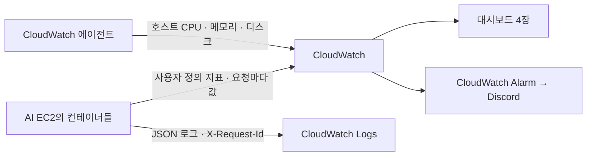

**요약** AI 서버의 배포 단위(조회·생성·임베딩 컨테이너 분리)와 V1 단일 EC2 구성, V2 확장 방향, 장애 시 축소 동작, 모니터링 지표·알림·부하 테스트 계획을 정리한다.

북적북적 AI 서버를 운영 환경에 배포한다고 할 때의 배포 단위, 확장 방식, 장애 대응, 모니터링 계획이다.

설계의 출발점은 둘이다.

**AI 서버는 무상태다.** 대화도, 추천 카드도, 추천 목록도 저장하지 않는다. 추천 조건과 최근 대화를 요청마다 받아 처리하므로 어느 인스턴스로 요청이 가도 결과가 같다. 트래픽이 늘 때 바꿀 것은 EC2 대수뿐이고 세션 고정도 필요 없다.

**임베딩은 자체 서빙한다.** 외부 임베딩 API가 검색 지연의 대부분을 차지하고 처리량이 쿼터에 묶이는데, 자체 서빙으로 바꾸면 지연이 **99배** 빨라진다(4-1). 한국어 검색 품질이 앞서는 오픈 모델을 API로는 살 수 없기도 하다. 그래서 임베딩 컨테이너는 후속 과제가 아니라 **V1 배포 구성에 포함된다.** 모델은 **multilingual-e5-small(384차원)로 확정했다**(2026-09-16, 4-1).

## 1. 확장성을 고려한 배포 아키텍처 다이어그램

(예: 여러 모델 서비스 인스턴스와 로드밸런서 구성, 오토스케일링 정책 등)

### 1-1. 경로별 특성 — 무엇을 어떤 단위로 나눌 것인가

| 성격 | 경로와 하는 일 | 부하 특징 | 컨테이너 |
|---|---|---|---|
| 조회 | ① 검색(검색어 임베딩 1회 + 키워드·벡터 조회 + RRF 병합), ④ 홈 피드, ⑥ 취향 프로필, ⑧ 상태 점검 | 요청이 짧아 CPU 사용률이 부하를 그대로 반영한다 | `api-sync` |
| 생성 | ③ 챗봇 한 턴(LLM 2회 + 임베딩 + 후보 조회, 생성 30초 상한). V2의 ⑤·⑦도 여기로 온다 | 요청 하나가 수 초 동안 외부 LLM을 기다린다. CPU는 낮은데 동시 연결만 쌓인다 | `api-gen` |
| 임베딩 | ② 텍스트를 벡터로 변환. ①③과 적재 배치가 내부에서 부른다 | 순수 CPU 추론이다. 파이썬 추론은 스레드로는 처리량이 늘지 않아 프로세스 수로 늘린다(4-1) | `embedding` |

한 컨테이너에 섞으면 챗봇의 대기가 검색 처리를 밀어내고, 임베딩 추론이 검색 응답을 잡아먹는다. 스케일 신호도 셋 다 달라서(1-6) 셋을 나눈다.

### 1-2. 트래픽 규모

규모와 피크 산식은 클라우드 파트 문서를 따르고, 방문당 AI 호출 수만 우리 API 기준으로 넣었다. 실사용 데이터가 생기면 교체한다.

| 항목 | 가정 |
|---|---|
| 기준 규모 | V1 평균 DAU 36 |
| 설계 상한 | 3년 차 목표 평균 DAU **8,000** (V1의 약 220배) |
| 방문당 AI 호출 | 검색 3회, 홈 피드 2회. 방문의 30%가 챗봇을 쓰고 평균 3턴 |
| 피크 | `DAU × 50% × 방문당 호출 ÷ 1,200초` (DAU의 절반이 20분 안에 몰린다) |

| 경로 | 1회 처리 시간 | V1 피크 | 3년 차 피크 | 3년 차 동시 진행 |
|---|---|---|---|---|
| 검색 | 약 50ms (임베딩 5.8ms 포함) | 0.045 rps | **10 rps** | 1 |
| 홈 피드 | 약 300ms (DB만) | 0.03 rps | **6.7 rps** | 2 |
| 챗봇 | 약 6초 (카드 생성 4,858ms 포함) | 0.014턴/s | **3턴/s** | **18** |

3년 차 피크에서도 조회 경로는 10 rps 안팎이다. 챗봇은 다르다. 초당 3턴이면 턴당 LLM 2회라 호출이 **분당 360회** 나가므로, 인스턴스 수가 아니라 **외부 LLM API 쿼터와 예산(3개월 36만 원)이 실제 상한**이다. 인프라가 할 일은 그 상한을 넘기 전에 429로 막고 예산 소진 속도를 보이게 하는 것이다.

### 1-3. V1 배포 아키텍처 — AI EC2 한 대

클라우드 파트의 1단계 구성에 맞춘다. 오케스트레이터 없이 **AI EC2 한 대에서 Docker Compose로** 컨테이너를 띄운다.

| 노드 | 설명 |
|---|---|
| nginx | 경로 라우팅 |
| api-sync | ① /search · ④ /feed · ⑥ /profile · ⑧ /health |
| api-gen | ③ /chat |
| embedding | ② /embeddings · CPU |
| postgres + pgvector | 데이터는 EBS |
| ingest job | 실행할 때만 |

- BE는 사설 IP 대신 고정 내부 도메인(`ai.internal`)으로 부른다. V2에서는 같은 이름이 내부 ALB를 가리키므로, 호스트를 바꾸거나 늘려도 BE 설정이 바뀌지 않는다.
- AI EC2는 외부에 공개하지 않고, 보안 그룹은 BE(V2에는 내부 ALB) 요청만 받는다. `/embeddings`는 내부 전용이라 `nginx`에 열지 않고, 인증이 없는 `/health`도 이 네트워크 제한으로 막는다.

### 1-4. 컨테이너 구성과 호스트 사양

| 컨테이너 | 담당 | 왜 따로 두나 |
|---|---|---|
| `nginx` | 경로 라우팅 | BE에게 주소 하나만 노출한다. V2에 로드밸런서를 붙여도 BE 쪽 계약이 안 바뀐다 |
| `api-sync` (조회) | ①④⑥⑧ | LLM 장애와 무관하게 살아 있어야 하는 경로다. 검색·홈 피드가 죽으면 커머스 화면이 빈다 |
| `api-gen` (생성) | ③ (V2 ⑤⑦) | 요청 하나가 수 초를 점유한다. 같이 두면 검색 처리를 밀어낸다 |
| `embedding` | ② | 순수 CPU 추론. 모델 가중치를 이미지에 포함해 시작 시 내려받지 않는다 |
| `postgres` | AI 소유 3종 + 복제 5종 | 데이터는 EBS에 둔다. 확장할 때 가장 먼저 호스트에서 떼어낼 대상이다 |
| `replicator` | BE MySQL → AI Postgres | **중복 실행 금지.** BE MySQL 접속 정보는 이 컨테이너만 가진다 |
| `ingest job` | 초기 적재·신간 임베딩 | 실행할 때만 뜬다. 복제 완료 후 `book_id` 순 256건씩 ② 호출 → `dim` 확인 → upsert, 중단되면 빈 곳부터 |

상시 컨테이너의 메모리 합계는 약 2.8GB로 추정한다(`embedding` 1.4GB만 실측). 그래서 AI EC2는 **메모리 4GB 이상, 디스크 gp3 30GiB**로 잡는다. GPU는 두지 않는다. e5-small은 CPU로 151 docs/s가 나와 CPU 컨테이너로 충분하다.

### 1-5. 확장 설계 — V2

V1은 AI EC2 한 대라 분산할 대상이 없고, 확장은 V2에서 한다. 먼저 `postgres`와 `replicator`를 AI EC2에서 떼어내 각각 한 대씩 둔다. DB는 한 벌이어야 하고 복제기는 중복 실행이 금지라, 호스트째 복제하면 안 되는 컨테이너다. 그다음 내부 ALB와 Auto Scaling Group을 붙인다. 넓히는 방향은 두 가지다.

- **A. 같은 구성을 여러 대**: AI EC2를 통째로 복제하고 앞에 내부 ALB를 둔다. 경로 판단은 각 호스트의 `nginx`가 계속 맡는다.
- **B. 역할별로 나눠서**: 조회군과 생성군을 다른 EC2에 두고 ALB가 경로를 보고 갈라 보낸다. 두 군이 각각 Auto Scaling Group을 갖고, `embedding`은 양쪽에 둔다.

방향 A 구성:

| 노드 | 설명 |
|---|---|
| 내부 ALB | ai.internal |
| EC2 1 | nginx · 조회 · 생성 · 임베딩 |
| EC2 2 | 같은 구성 |
| 데이터 EC2 1대 | postgres + pgvector |

| 항목 | A. 같은 구성을 여러 대 | B. 역할별로 나눠서 |
|---|---|---|
| 푸는 문제 | 호스트 한 대가 죽으면 전부 멈추는 것 | 조회와 생성이 한 호스트에서 자원을 뺏는 것 |
| 최소 EC2 대수 | **2대** (+ 데이터 1 + 복제기 1) | **4대** (역할군 2 × 2대, + 데이터 1 + 복제기 1) |
| 스케일 신호 | 호스트 평균 CPU 하나 | 조회군은 CPU, 생성군은 진행 중 요청 수 |
| 늘릴 때 | 필요 없는 역할까지 함께 늘어난다 | 부족한 쪽만 늘린다 |

**지금 우리 규모에서는 A가 맞는다.** 부족한 것이 용량이 아니라 이중화이기 때문이다(4-2).

### 1-6. 스케일링 정책

**V1은 고정 구성이다.** 자동 확장도, 호출 한도(429)도 두지 않는다. V1 피크는 AI 경로를 모두 합쳐 0.1 rps 안팎이라(1-2) 이 구성으로 충분하다.

**V2 확장 후**에는 컨테이너가 아니라 **EC2 대수**를 늘린다.

| 대상 | 스케일 신호 | 목표 | 최소/최대 |
|---|---|---|---|
| AI EC2 ASG (방향 A) | 호스트 평균 CPU 사용률 | 60% | 2 / 6 |
| 조회군 ASG (방향 B) | 호스트 평균 CPU 사용률 | 60% | 2 / 6 |
| 생성군 ASG (방향 B) | **호스트당 진행 중 요청 수** | 50 | 2 / 4 |
| 데이터 EC2 · 복제기 EC2 | 없음. 각각 1대 고정 | — | 1 / 1 |

- 생성군에 CPU를 쓰지 않는 이유: 요청이 외부 API 응답을 기다리는 동안 CPU는 놀기 때문에, CPU가 60%에 닿기 전에 동시 연결이 먼저 찬다.
- 생성군 최대 4는 서버 한계가 아니라 **LLM API 쿼터에 맞춘 값**이다. 쿼터를 넘으면 EC2를 늘려도 503만 늘어난다.

### 1-7. 여러 대로 늘려도 같은 답이 나오려면

무상태라도 EC2 사이에 공유되어야 하는 것이 있다.

| 공유 대상 | 어디에 둘 것인가 |
|---|---|
| 멱등 키 기록(24시간, ⑥⑦) | AI Postgres |
| 커서 서명 키(①④) | 모든 EC2에 같은 값 주입 |
| ⑥의 `user_id` 단위 직렬 처리 | AI Postgres 행 잠금 |
| 임베딩 모델 버전 | 모든 호스트가 같은 이미지 태그 |

### 1-8. 장애 시 동작과 배포

장애가 나도 에러를 내는 대신 기능을 줄여 정상 응답하는 축소 동작이 API마다 정해져 있다. 인프라는 그 동작이 실제로 나오게 하고, 얼마나 자주 나오는지를 지표로 만든다.

| 장애 | 자동 동작 | 사용자 영향 | 감지 지표 | V1 복구 |
|---|---|---|---|---|
| 외부 LLM 장애(오류·타임아웃) | ③은 규칙만으로 3권, `degraded: true`, 긴 이유 `null`. ⑤⑦은 503 + `Retry-After` | 상세 페이지의 긴 이유가 사라지고 카드의 한 줄 이유는 규칙 문장으로 대체. **검색·홈 피드·구매는 정상** | LLM 오류율, `degraded` 비율 | 업스트림 복구 시 자동 |
| 외부 LLM 한도 초과 | ③은 위 행과 동일하게 규칙만으로 3권, `degraded: true`. ⑤⑦은 503 + `Retry-After` | 챗봇은 규칙 응답으로 계속 동작. ⑤⑦은 잠시 응답하지 않고 BE가 재시도를 안내 | `degraded` 비율, ⑤⑦ 503 비율 | 쿼터가 풀리면 자동 |
| `embedding` 중단 · 벡터 인덱스 이상 | ①은 키워드 검색만(`X-Degraded: keyword-only`). 인덱스 이상이면 ④도 규칙 점수만(`rule-only`) | 의미 검색·개인화 약화 | 축소 응답 비율 | 서버는 그대로 뜨고 60초 뒤 요청에서 모델을 다시 읽는다(모델은 이미지에 있음). 인덱스 이상은 재색인 |
| `postgres` 중단 | ①③④⑥ 전면 500 | 검색·추천 불가. **구매 경로는 정상** | 5xx 비율, DB 연결 실패 | 컨테이너 재기동. 데이터는 EBS에 남는다 |
| 복제 중단 | 응답은 전부 정상(낡은 값) | 산 책이 다시 추천에 뜰 수 있다 | **`replication_lag_seconds`뿐** | 복제기 재기동 |
| **AI EC2 자체 장애** | AI 경로 전면 중단 | 검색·추천 모두 불가 | 상태 검사 실패 | **대신 받을 호스트가 없다.** V2 확장에서 해소된다 |
| 트래픽 급증 | V1은 호출 한도를 두지 않는다(429 없음) | 응답이 느려짐 | 응답 시간 | 자동 확장 없음 |
| LLM 예산 소진 | 80%에서 알림, 100%에서 저가 모델로 전환(V1 미구현). 저가 모델도 쓸 수 없으면 규칙 응답(`degraded: true`) | 이유 문장 품질 저하 | 예산 소진율 | 예산 재배분 판단 |

**V1에 남는 약점은 두 가지다.** AI EC2가 죽으면 대신 받을 호스트가 없고, 배포 중에 AI 요청이 끊긴다. 둘 다 V2에서 확장하면 해소된다. V1은 3주짜리 초기 운영이라 이 위험을 안고 간다.

**상태 검사.** `GET /health`의 `status`가 `ok`·`degraded`면 정상으로 보고, `down`(503)일 때만 트래픽에서 뺀다. `degraded`는 일부 구성 요소만 죽은 상태라 호스트를 빼면 줄어든 기능조차 못 준다. 복제 지연은 판정에 쓰지 않는다. 복제가 밀리면 멀쩡한 호스트가 전부 동시에 빠지기 때문이다.

**배포.** V1은 바뀐 컨테이너만 다시 만든다(Recreate). 그 사이 해당 경로가 잠깐 끊긴다. 이미지 태그는 Git 커밋 해시이고, 롤백은 이전 태그로 다시 올린다. V2에서 확장한 뒤에는 호스트를 하나씩 교체하는 롤링으로 바꿔 이 단절을 없앤다.

## 2. 사용한 인프라 기술 및 서비스 명세

| 영역 | 선택 | 이유 | 안 고른 대안 |
|---|---|---|---|
| 호스트·배포 | AWS AI EC2 한 대(메모리 4GB 이상, gp3 30GiB)에 Docker Compose. 오케스트레이터는 없다 | 클라우드 파트 1단계 구성과 같다. 호스트가 한 대라 오케스트레이터가 할 일이 없다 | **ECS·쿠버네티스**: 호스트가 늘어 손으로 감당하기 어려워지면 검토한다 |
| 앞단 | V1은 `nginx` 컨테이너, V2는 내부 ALB. BE는 고정 내부 도메인(`ai.internal`)으로 부른다 | 주소와 경로 계약을 먼저 고정해 두면 앞단을 바꿔도 BE에 안 보인다 | **API Gateway**: 호출자가 BE뿐이라 필요 없다 |
| 확장 | V1 고정. V2에 EC2 Auto Scaling Group | 확장 단위가 EC2 대수다 | **한 호스트에서 컨테이너만 늘리기**: 호스트 한 대의 자원을 넘지 못한다 |
| 임베딩 | 자체 서빙 CPU 컨테이너. e5-small(384차원) 확정(4-1) | 외부 API보다 지연 99배·처리량 20배 개선. 쿼터에서 벗어난다 | **외부 임베딩 API**: 지연 573ms, 쿼터 제한. **GPU**: CPU로 충분하다 |
| DB | PostgreSQL + pgvector. V1은 AI EC2의 컨테이너, 데이터는 EBS | 가격·재고 필터(WHERE)와 의미 유사도 정렬(ORDER BY)을 한 SQL로 처리한다 | **전용 벡터 DB**: 필터와 벡터 정렬을 한 SQL로 할 수 없다. **RDS**: V2에서 DB를 떼어낼 때 검토한다 |
| 복제 | `replicator` 컨테이너 ¹ | 커머스 데이터의 원본은 BE가 갖고, AI는 허용 지연(3-1) 안의 사본을 읽는다 | **양방향 복제**: 원본 주인은 끝까지 BE다 |
| LLM | 외부 API를 게이트웨이 어댑터 뒤에 둔다 | 모델 교체가 설정 변경으로 끝난다 | — |
| (V2) 표지 이미지 | S3 ² | 1단계 명세와 멘토 권고가 Pre-signed URL이다 | — |
| 시크릿 | SSM Parameter Store `SecureString` | 컨테이너별로 필요한 것만 주입한다. MySQL 접속 정보는 `replicator`에만 준다 | **Secrets Manager**: 자동 교체가 필요해지면 옮긴다 |
| CI/CD | GitHub Actions → ECR → SSM → AI EC2. AI 파트는 이미지·테스트, 클라우드 파트는 권한과 배포·롤백 환경을 맡는다 | 이미지 태그(Git 커밋 해시)가 배포 단위라 버전이 어긋나지 않는다 | — |
| 모니터링 | CloudWatch 지표·대시보드·알람, CloudWatch Logs(14일), 알림은 Discord | 팀 공통 도구다. 수집 서버를 따로 운영하지 않는다 | **Prometheus + Grafana**: 지표 규모가 커지면 검토한다 |

¹ 클라우드가 발급한 BE MySQL 읽기 전용 계정으로 AI Postgres에 단방향 복제한다. 동기화 방식·주기는 BE·AI·클라우드가 함께 정한다. **복제 범위는 보류**: 도서 외에 구매·나의 도서관·리뷰·인기 집계까지 필요하다고 회신했고 클라우드 답변을 기다린다

² 버킷과 권한은 클라우드가 관리하고, BE가 Pre-signed URL로 넘긴다. **전달 방식은 보류**: 클라우드 제안(Object Key + `s3:GetObject`)과 비교해 구현 때 BE와 정한다

## 3. 모니터링 대상 지표 목록과 수집/시각화 방법

(예: 응답 시간, Throughput, 에러 로그 등과 Grafana 대시보드 구성안).

### 3-1. 무엇을 판정하려고 보나

| 축 | 판정 기준 |
|---|---|
| 응답 시간 | 검색 p95 200ms, 홈 피드 p95 300ms, 챗봇 턴 p95 8초. 생성 30초 초과는 게이트웨이 타임아웃으로 끊기고 degraded: true로 대체된다(504 아님) |
| 데이터 신선도 | 아래 표의 허용 지연 |
| LLM 예산 | 3개월 36만 원. 실측 기준 턴당 약 $0.003, 약 9만 턴 |

목표는 실측에서 역산했다. 검색 200ms는 임베딩 자체 서빙(5.8ms)을 전제로 한 값이고, 챗봇 8초는 실측 한 턴 약 6초에 여유를 둔 값이다.

BE 원본에서 AI DB로 넘어오는 데이터의 허용 지연이다. 이 값이 복제 감시의 판정선이다.

| 대상 | 허용 지연 |
|---|---|
| 도서 가격·재고 | 5분 |
| 이력 3종(구매·나의 도서관·리뷰) | 5분 |
| 신간 입고(임베딩 포함) | 1시간 |
| 인기 집계 | 24시간 |

복제가 끊겨도 응답은 모두 정상 200으로 나가서, `/health`의 `replication_lag_seconds` 말고는 감지할 방법이 없다.

### 3-2. 지표 목록

모든 지표는 CloudWatch로 모은다(3-3). 앱이 지표를 보내는 부분은 V1 미구현이고, 지금은 JSON 로그와 X-Request-Id만 있다.

| 계층 | 지표 | 출처 | 왜 보나 |
|---|---|---|---|
| 요청 | 엔드포인트별 RPS(Throughput), p50 / p95 / **p99** 응답 시간 | 앱 | 챗봇은 사용자가 기다리는 실시간 경로라 평균이 아니라 꼬리 지연이 체감을 결정한다 |
|  | 상태 코드 비율, 특히 429 · 503 · 504 | 앱 | 429는 우리 한도, 503은 업스트림, 504는 30초 초과. 원인이 다르다 |
|  | **축소 응답 비율** — `keyword-only`, `rule-only`, ③ `degraded: true` | 앱 | 장애가 사용자에게 어디까지 닿았는지. 0이 아니면 어딘가 죽어 있다 |
|  | ① 0건 비율, ④ `cold_start` 비율, ③ 카드 3장 미만 비율 | 앱 | 품질 신호. 0건이 갑자기 늘면 적재·복제 문제일 수 있다 |
| 임베딩 | 요청 지연 p95, 처리량(docs/s), 컨테이너 CPU·메모리 | 임베딩 컨테이너 | 검색 지연의 가장 큰 항이자 스케일 신호 |
| LLM | 호출 수·지연·오류·타임아웃 | 게이트웨이 | 챗봇 지연의 대부분이 여기다 |
|  | **토큰 사용량과 비용 환산, 예산 소진율** | 게이트웨이 | 36만 원 상한 관리 |
| 데이터 | `replication_lag_seconds`, 테이블별 지연 | `/health`, 복제기 | 복제 중단의 유일한 감지 채널. 허용 지연이 테이블마다 다르다 |
|  | AI Postgres 연결 수·쿼리 p95, 벡터 검색 지연 | `postgres`, 앱 | 커넥션 상한과 인덱스 이상을 일찍 잡는다 |
| 자원 | 호스트 CPU·메모리·디스크, 컨테이너 상태 | CloudWatch 에이전트 · Docker | 용량과 디스크(30GiB) 여유 |
|  | 생성 컨테이너의 진행 중 요청 수 | 앱 | 생성군 스케일 신호(1-6) |
| 배치 | 초기 적재 진행률 | `ingest job` | 책 벡터가 한 권도 없을 때만 검색이 `keyword-only`다 |

### 3-3. 수집 방법

| 노드 | 설명 |
|---|---|
| CloudWatch Logs | 14일 보관 |

- V1은 팀 공통 모니터링인 CloudWatch 하나로 모은다. 별도 수집 서버가 없으므로 앱이 지표를 CloudWatch로 직접 보내고, 호스트 자원은 CloudWatch 에이전트가 모은다.
- **p95·p99를 보려면 요청마다 값을 올려야 한다.** 평균이나 합계로 줄여 올리면 CloudWatch가 백분위를 계산하지 못한다.
- 로그는 JSON 한 줄로 남긴다. 필드는 시각, `X-Request-Id`, 엔드포인트, 상태 코드, 지연, 축소 여부, 임베딩·LLM 소요 시간, 토큰 수다. **대화 원문·검색어·이미지는 남기지 않는다.**
- **엔드포인트는 경로만 남기고 쿼리스트링은 버린다.** ④ 피드가 GET이라 `user_id`와 `category`·`match_score_min` 같은 취향 필터가 URI에 실린다. 애플리케이션 로그는 경로만 기록하고, ALB 액세스 로그처럼 URI 전체를 남기는 계층은 쿼리 마스킹을 켜거나 보관 기간을 따로 잡는다. 검색어를 남기지 않기로 한 것과 같은 이유다.
- `X-Request-Id`는 BE가 붙여 보내고, 없으면 AI가 만들어 응답 헤더로 돌려준다. BE 로그와 AI 로그를 이 키로 잇는다.

### 3-4. CloudWatch 대시보드 구성안

| 대시보드 | 패널 | 주 사용자 |
|---|---|---|
| ① 서비스 개요 | 응답 시간(검색·피드·챗봇 p95), 엔드포인트별 RPS·오류율, 축소 응답 비율, 429·503·504 추이 | 전체. 장애·시연 때 첫 화면 |
| ② 모델과 비용 | 임베딩 지연·처리량, LLM 지연·오류, 토큰 사용량, **예산 소진율(누적)** | AI 파트. 주간 비용 점검 |
| ③ 데이터·복제 | `replication_lag_seconds`, 테이블별 지연 대비 허용 지연, DB 연결, 적재 진행률 | AI·BE 공동 |
| ④ 자원 | 호스트 CPU·메모리·디스크, 컨테이너 상태, 진행 중 요청 수 | 클라우드 파트 |

### 3-5. 알림

알림은 CloudWatch Alarm으로 만들어 Discord로 보낸다. **채널과 임계값은 보류**(팀 논의 후 확정)이고, 아래 수치는 AI 파트 잠정안이다.

| 심각도 | 조건 | 뜻 |
|---|---|---|
| 즉시 | 상시 컨테이너 중 하나가 내려감 | 가용성 위협 |
| 즉시 | 5xx 비율 > 1% (5분) | 설계에 없는 오류가 나고 있다 |
| 즉시 | `replication_lag_seconds`가 `null`로 10분 지속 | 복제 중단. 응답으로는 보이지 않는다 |
| 즉시 | LLM 예산 소진율 100% | 저가 모델 전환이 켜졌는지 확인(전환은 V1 미구현) |
| 10분 내 | `replication_lag_seconds` > 300초 | 가격·재고·이력의 5분 허용 지연 위반 |
| 10분 내 | 검색 p95 > 200ms, 챗봇 턴 p95 > 8초 (5분) | 응답 시간 목표 위반 |
| 10분 내 | 축소 응답 비율 > 5% (10분) | 임베딩 컨테이너나 LLM 중 하나가 죽어 있다. 생성 30초 초과(LLM 게이트웨이 타임아웃)도 여기 포함된다 — ③은 504를 내지 않고 degraded로 대체하므로 별도 504 알림은 두지 않는다 |
| 당일 | LLM 예산 소진율 80% | 남은 기간 대비 소진 속도 점검 |
| 당일 | 429 비율 > 2% | 한도 재검토(V1은 429를 내지 않는다) |
| 당일 | 호스트 디스크 여유 < 20% | 이미지·데이터 정리 또는 볼륨 확장 |

## 4. 간이 부하 테스트 또는 시뮬레이션 결과와 그에 따른 시스템 자원 사용량/응답시간 변화 분석

(가능하다면)

### 4-1. 실측 결과

2026-09-09 개발기(Apple Silicon 10코어, CPU, torch 스레드 4)에서 고정 질의 30개 × 3회, 도서 256건으로 쟀다. 예열은 제외했다.

| 모델 | 서빙 | 차원 | 쿼리 1건 p95 | 도서 임베딩 처리량 | 동시 4 워커 | 프로세스 메모리 | 5만 권 적재 |
|---|---|---|---|---|---|---|---|
| gemini-embedding-001 | 외부 API | 3,072 | 573ms | 7.6 docs/s (동시 8) | — | — | 1.8시간 |
| multilingual-e5-small (118M) | 자체 · CPU | 384 | **5.8ms** | **151 docs/s** | 230 RPS | 1.4GB | **5.5분** |
| bge-m3 (568M) | 자체 · CPU | 1,024 | 41ms | 18 docs/s | 38 RPS | 1.7GB | 45분 |

LLM(외부 API)은 카드 3장 생성이 p95 **4,858ms**이고, 턴당 토큰은 입력 398·출력 516이다.

- **gemini-embedding-001은 제외한다.** 3,072차원은 pgvector 인덱스 한도(2,000)를 넘고, 쿼리 왕복만으로 검색 목표 200ms를 넘긴다.
- **e5-small은 지연·처리량·메모리 모두 여유가 크다.** 다만 동시성을 1→4→8로 올리면 175→230→159 RPS로 4에서 꺾여, 컨테이너 수로 늘려야 한다.
- **bge-m3는 품질 기대가 높지만 처리량이 8분의 1이다.** 품질도 하이브리드 기준으로는 차이가 사라져(2단계: e5-small 벡터 단독 recall@10 0.85, 키워드+벡터 RRF 0.90으로 기준선과 동급) **multilingual-e5-small(384차원)로 확정했다**(2026-09-16). 실제 카탈로그로 recall@10을 다시 재는 것은 적재 후 검증 항목이며, 차원을 바꾸려면 `book_embeddings`·`taste_profile` 전량 재생성이 필요하므로 단독 배포로 분리한다.

### 4-2. 용량 시뮬레이션

1-2의 3년 차 피크와 위 실측으로 계산했다.

| 경로 | 3년 차 피크 | 동시 진행 | 예상 자원 사용 | 먼저 닿는 상한 |
|---|---|---|---|---|
| 검색 | 10 rps | 1 | 조회·임베딩 컨테이너 각 한 벌로 충분. 임베딩 한 벌이 175 RPS를 낸다 | DB 연결 수 |
| 홈 피드 | 6.7 rps | 2 | 조회 컨테이너와 공유 | DB CPU |
| 챗봇 | 3턴/s | 18 | 생성 컨테이너 한 벌. CPU는 낮고 연결만 점유 | **LLM API 분당 360회, 예산** |
| 초기 적재 5만 권 | — | 순차 | `ingest job` + 임베딩 컨테이너, 약 5.5분 | 임베딩 처리량 |

**결론: 처리량만 보면 3년 차 목표(V1의 약 220배)까지도 AI EC2 한 대의 컨테이너 한 벌로 감당된다.** 먼저 닿는 한계는 LLM API 쿼터·예산과 DB이고, **진짜 상한은 처리량이 아니라 가용성**이다. 호스트가 한 대라 그 한 대가 죽으면 전부 멈추므로, 확장(1-5)의 값어치는 용량이 아니라 이중화에 있다.

### 4-3. 부하 테스트 계획

위 실측은 개발기 기준이라, 배포 환경 값은 MVP 배포 전에 이 테스트로 다시 잰다. 도구는 k6를 쓰고, 스테이징은 운영과 같은 EC2 사양·컨테이너 구성으로 맞춘다. LLM은 **모의 서버**(앱 자체 한계 측정)와 **실제 API**(응답 시간 측정, 예산 소량 사용) 두 번 돌린다.

| 시나리오 | 부하 | 측정 | 통과 기준 |
|---|---|---|---|
| A. 검색 단독 | 동시 사용자 10 → 50 → 200 → 500 | p95·p99, 오류율, 임베딩 컨테이너 CPU, DB 연결 수, 호스트 CPU | p95 ≤ 200ms, 5xx 0건, 호스트 CPU가 한계에 닿는 지점 확인 |
| B. 홈 피드 | 동시 10 → 200 | A와 동일 + `cold_start` 비율 | p95 ≤ 300ms, 5xx 0건 |
| C. 챗봇 | 동시 5 → 20 → 50턴 | 턴 p95, degraded 비율, 503·429 건수, 진행 중 요청 수 | 턴 p95 ≤ 8초, degraded 비율 ≤ 5% |
| D. 혼합 + 장애 주입 | 검색 10 · 피드 7 · 챗봇 3 rps(3년 차 피크)를 30분 유지하며 **임베딩 컨테이너를 강제 종료** | 오류율, 축소 응답 비율, 복구 시간 | `keyword-only`로 응답 유지, 자동 재기동 |
| E. 적재 중 검색 | 카탈로그 전량 적재 중에 시나리오 A | 적재 소요 시간, 검색 p95, `keyword-only` 비율 | 적재가 검색 지연을 목표 밖으로 밀지 않음 |

E는 적재 배치와 검색이 같은 임베딩 컨테이너를 쓰기 때문에 넣었다. 밀어낸다면 적재에 속도 제한을 걸거나 트래픽이 적은 시간대로 옮긴다.

## 5. 제안한 인프라/모니터링 설계가 팀 서비스의 향후 성장과 안정적 운영에 어떻게 기여하는지에 대한 설명

(예: "사용자 100배 증가 시에도 대응 가능하도록 OOO를 구성하여 서비스 중단 없이 확장 가능").

| 상황 | 이 구성에서 일어나는 일 |
|---|---|
| **사용자 증가 (3년 차 목표, V1의 약 220배)** | 처리량은 AI EC2 한 대로도 감당된다(4-2) ¹ |
| **LLM 장애** | 생성 컨테이너만 축소 응답으로 내려가고 검색·홈 피드·구매는 그대로 된다. 대시보드 ①의 축소 응답 비율로 영향 범위를 바로 안다 |
| **임베딩 모델 교체** | 새 모델이 든 이미지를 배포하고 전량 재색인한다(5만 권 약 5.5분) ² |
| **복제 중단** | 응답이 전부 정상이라 사용자 신고로는 늦다. `replication_lag_seconds` 알림이 5분 허용 지연 안에서 잡는다 |
| **예산 소진** | 임베딩이 자체 서빙이라 호출량에 비례하는 비용이 LLM 하나뿐이다. 80%·100% 알림과 저가 모델 전환(V1 미구현)으로 3개월 36만 원을 넘기지 않는다 |
| **잦은 배포** | 이미지 태그가 배포 단위라 롤백은 이전 태그를 다시 올리면 끝난다(1-8) |

¹ 부족해지면 무상태라 **EC2 대수만 늘리면** 되고 코드나 DB 스키마를 고칠 일이 없다. V2에서 DB·복제기를 떼어내고 내부 ALB와 Auto Scaling Group을 붙이며, BE가 부르는 내부 도메인만 ALB로 돌린다(1-5). 실제 상한은 LLM API 쿼터와 예산이고, 429와 예산 알림이 그 선을 넘지 않게 막는다

² 자체 서빙이라 재색인에 호출 과금이 없다. 취향 벡터는 BE가 전 사용자에 대해 ⑥을 다시 불러 새로 계산한다. 이때 BE가 보관한 기억 벡터는 옛 모델 값이라 그대로 쓸 수 없다(차원이 다르면 400, 같으면 조용히 섞인다). 기억 벡터를 다시 만드는 경로는 ERD §5에서 정한다

이 정도 수준으로 두는 이유는 규모와 팀에 맞추기 위해서다. 3년 차 목표에서도 AI 피크가 20 rps 안팎이라 쿠버네티스·멀티 리전·상시 GPU를 지금 들이면 얻는 것보다 운영 부담이 크다. 대신 **응답 시간의 병목이던 외부 임베딩 호출을 우리 호스트 안으로 들여 우리가 늘릴 수 있는 자원으로 바꾸고**, 각 API의 축소 동작·복제 허용 지연·예산 상한을 전부 지표로 만들어, 문제가 생겼을 때 사용자 응답이 아니라 대시보드에서 먼저 보이게 하는 데 집중했다.
