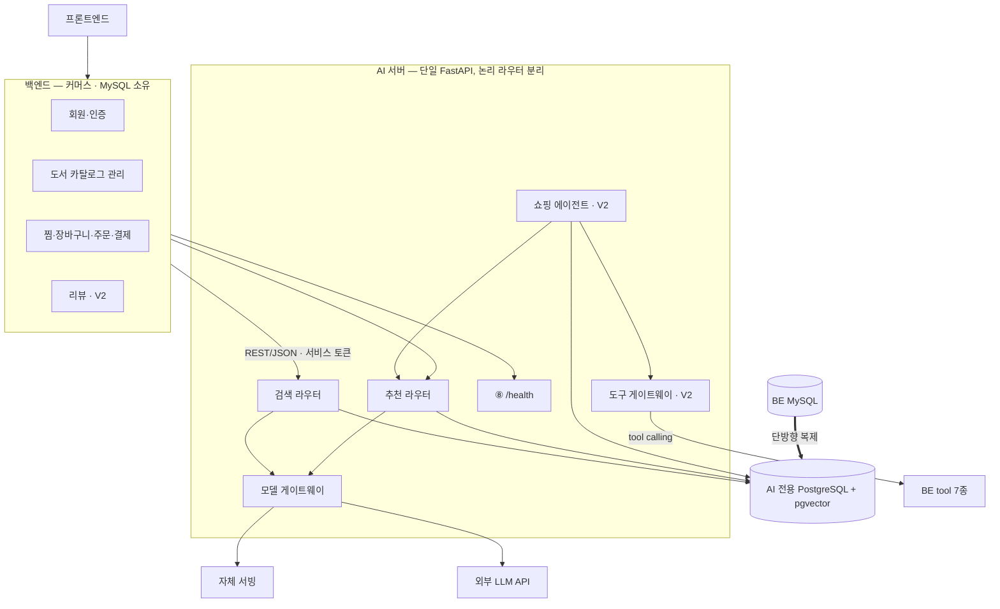
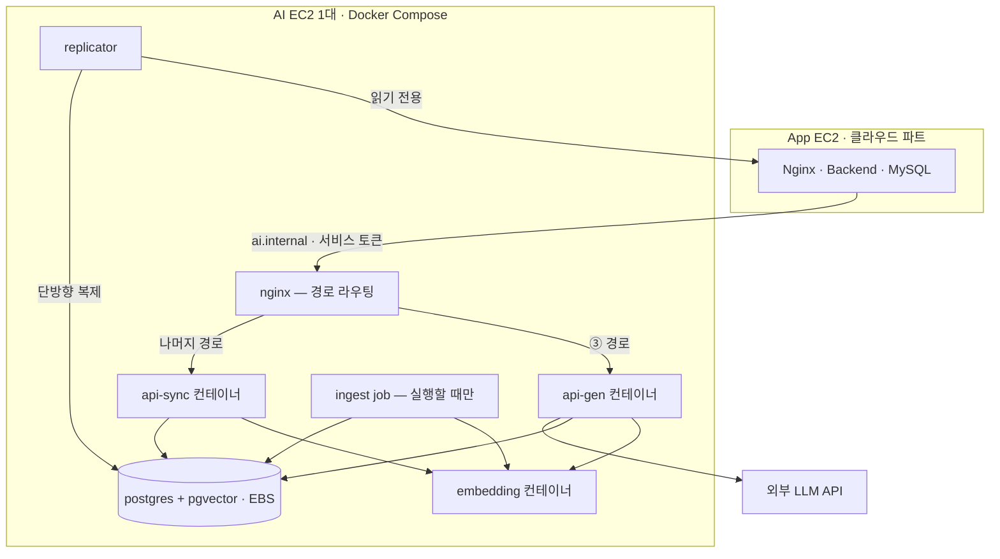

**요약** 단계 2~7의 설계를 논리·물리 구조로 통합하고, 실측과 시뮬레이션을 구분한 성능 평가, 회고, 전환 트리거 통합표를 남긴다.

> 2026-09-21 팀 논의로 오케스트레이션 프레임워크 결정이 바뀌었다(③⑤ LangChain, ⑦ LangGraph). 아래 표·회고 중 "LangChain/LangGraph 미도입"과 LangGraph 전환 트리거 서술은 미채택 당시 기준이며, 근거는 단계 4(AI-4)를 따른다.

## 0. 결론 먼저

북적북적 AI 서버는 **GPU에 얹은 대형 자체 모델 서비스가 아니다.**

자체 서빙은 임베딩 모델(e5-small) 하나뿐이고, 추천 문장은 소형 상용 LLM에 맡기며, 어떤 책을 보여줄지 고르는 일은 전부 결정론(하이브리드 검색, 규칙 스코어링)이 한다. LLM은 **이미 골라진 결과에 설명만 붙인다.**

이 원칙 하나가 단계 2–7 전체를 관통한다.

검색·추천 지연의 실제 원인은 모델 크기가 아니라 외부 API 왕복(I/O)이었고(단계 2), 그래서 가장 잦은 호출인 임베딩만 자체 서빙으로 옮겼다.

그 결정이 서비스 전체에 새지 않도록 AI를 별도 서비스로 분리하고(단계 3), 모델 접근을 게이트웨이 한 계층에 모았다(단계 3·6).

이 경계 덕분에 이후 멀티스텝 체인(단계 4), 도구 연동(단계 6), 인프라 확장(단계 7)이 전부 "어댑터 1개 추가" 수준의 변경으로 흡수됐다

— RAG(단계 5)도 이 경계 덕에 검토 비용이 낮았고, 그래서 도입하지 않기로 한 판단도 가볍게 내릴 수 있었다.

## 1. 최종 통합 아키텍처

### 1-1. 논리 구조 — 모듈과 데이터 소유권

| 노드 | 설명 |
|---|---|
| BE MySQL | 커머스 원본 |
| 검색 라우터 | ① /search · ② /embeddings |
| 추천 라우터 | ③ /chat(V1 텍스트·V2 이미지) · ④ /feed · ⑤ /extractions(V2) · ⑥ /profile |
| 쇼핑 에이전트 · V2 | ⑦ /agent/act (추천 라우터의 서브그래프) |
| 모델 게이트웨이 | complete() · embed() · 어댑터·폴백·서킷·비용관측 |
| 도구 게이트웨이 · V2 | MCP 호환 디스크립터 · 멱등 · grounding 검증 |
| AI 전용 PostgreSQL + pgvector | ─ 복제 사본: v_books·v_user_purchases·v_user_library·v_user_reviews·v_book_popularity · ─ AI 소유: book_embeddings·taste_profile·멱등 기록 |
| 자체 서빙 | 임베딩(CPU, e5-small) |
| 외부 LLM API | (V2) OCR·VLM 폴백 |
| BE tool 7종 | cart.add/update/view·order.preview·inventory.check·delivery.track·book.detail |
| 단방향 복제 | MySQL → PostgreSQL, 역방향 없음 |

#### 왜 이 경계인가

| 결정 | 도입 이유 | 얻은 효과 |
|---|---|---|
| 검색을 LLM 비의존 라우터로 분리 | 검색은 결정적·저지연이어야 하고 추천은 생성형·고지연 | LLM이 전면 장애여도 검색·상세·장바구니·결제는 정상 200 |
| 모델 호출을 게이트웨이 한 계층에 수렴 | `complete()`/`embed()` 두 함수 뒤로 프로바이더 차이를 숨김 | 임베딩 자체 서빙 전환(단계 2), RAG 근거 삽입(단계 5), OCR/VLM 추가가 전부 어댑터 1개로 끝남 |
| AI 서버 무상태 (spec-as-state) | 대화 조건은 클라이언트가 들고 다님, 서버는 취향 프로필·임베딩·멱등 기록만 저장 | "대화 미저장" 정책이 코드 구조로 자동 보장, 세션 고정 없이 수평 확장 |
| AI 전용 Postgres, BE MySQL과 완전 분리 | 필터(WHERE)+벡터 정렬(ORDER BY)을 한 SQL로 처리해야 함 | AI 코드 버그가 주문·재고를 건드릴 연결 경로 자체가 없음. BE MySQL 장애에도 AI는 낡은 복제본으로 계속 200 |
| MCP 미도입, 도구 정의만 MCP 형식 | 표준화할 대상이 BE tool 7개, 상대가 BE 하나뿐이라 전송 프로토콜의 값이 회수 안 됨 | 통로 코드 1개만 나중에 갈아 끼우면 진짜 MCP로 전환 가능 |

### 1-2. 물리 배포 구조 — V1

| 노드 | 설명 |
|---|---|
| api-sync 컨테이너 | ① /search · ④ /feed · ⑥ /profile · ⑧ /health |
| api-gen 컨테이너 | ③ /chat |
| embedding 컨테이너 | ② /embeddings · CPU |

컨테이너를 셋으로 나눈 이유는 부하 성격이 다르기 때문이다

조회(`api-sync`)는 CPU 사용률이 부하를 그대로 반영하고, 생성(`api-gen`)은 CPU는 낮은데 외부 LLM 응답을 기다리며 동시 연결만 쌓이고, 임베딩은 순수 CPU 추론이라 스레드가 아니라 프로세스 수로만 늘어난다(단계 2 실측). 한 컨테이너에 섞으면 챗봇의 대기가 검색 처리를 밀어낸다.

V2에서는 `postgres`·`replicator`를 EC2에서 떼어내고 내부 ALB + Auto Scaling Group을 붙인다.

지금 규모(3년 차 목표까지도 AI EC2 한 대로 처리량 충분)에서는 같은 구성을 여러 대로 복제하는 방향(A)이 역할별 분리(방향 B)보다 운영 부담이 낮아 채택했다

부족한 것이 용량이 아니라 이중화이기 때문이다.

## 2. 단계별 설계 적용 결과 요약표

| 단계 | 설계 의도 | 핵심 결정 | 정량/정성 근거 |
|---|---|---|---|
| **2. 모델 추론 성능 최적화** | 병목이 GPU가 아니라 I/O임을 실측으로 확인 | 임베딩만 자체 서빙(e5-small), 도서 임베딩 사전 계산, 인제스트 배치화, 추천 이유는 카드 생성 1회 호출로 통합(캐시 테이블 없음) | 쿼리 임베딩 p95 **467ms → 5.8~21ms(약 22~80배)**, 인제스트 **5.6 → 151~231 docs/s(CPU, 약 30~40배)**, 하이브리드 recall@10 **0.90**(Gemini 벡터 단독과 동급), 상세 재진입 AI 호출 **0회** |
| **3. 서비스 아키텍처 모듈화** | AI 장애·배포가 커머스 전체에 번지지 않게 | 단일 FastAPI + 논리 라우터 분리(검색/추천), 모델 게이트웨이, 무상태, AI 전용 Postgres(BE MySQL과 분리, 단방향 복제) | 장애 격리 시나리오 8종 검증(외부 LLM 장애·임베딩 장애·BE MySQL 장애 등에서 영향 범위가 실제로 좁아짐을 표로 확인) |
| **4. 멀티스텝 AI 파이프라인** | LLM이 후보를 고르지 않게 해 환각·재현성 문제를 구조로 방지 | ③ 챗봇 추천 4단계(조건 이해 LLM → 후보 검색 코드 → 스코어링 코드 → 3권 선택+이유 생성 LLM), ⑦ 쇼핑 에이전트 4단계(대상 특정 → 의도 판단 LLM → tool 호출 최대 3회 → 숫자 검산). ~~LangChain/LangGraph 미도입~~ ③⑤ LangChain · ⑦ LangGraph 도입(2026-09-21 팀 논의로 변경) | 턴당 LLM 호출 **2회 고정**(③), 카드 3권은 항상 사전에 확정된 후보 안에서만 선택 → 카탈로그 밖 추천이 구조적으로 불가능. ~~재도입 트리거 4개 명시~~ 도입 확정으로 트리거는 이력으로만 남김 |
| **5. 데이터·컨텍스트 보강 (RAG)** | 추천 이유의 근거를 "실제 책 내용"으로 좁혀 환각 방지할지, 자유어 태그를 벡터로 정규화할지 검토 | 둘 다 **미채택**. 원문 조각(`book_passage`) 검색·인용 검증과 `preset_vectors` 벡터 매칭 모두 "몇 개 안 되는 고정 대상"에 벡터 인프라를 쓰는 과설계로 판단 — 이유 생성은 길이 상한·카드 제외 규칙으로, 태그 정규화는 표준 enum 스키마 검증(422)으로 대체 | 추가 테이블·배치 없이 AI 소유 자산은 3종(`book_embeddings`·`taste_profile`·멱등 기록) 유지. `reason_long`은 `v_books.description`만 근거로 계속 생성 |
| **6. 도구 통합 / 외부 API (MCP)** | 외부 연결 지점을 표준화 도구 없이도 안전하게 관리 | MCP 전송 프로토콜 미도입 + 도구 정의만 MCP 호환 형식으로 작성. 모델 게이트웨이·도구 게이트웨이 2창구로 수렴 | 외부 연결 지점 **5곳(LLM·임베딩·OCR/VLM·BE tool·국중도 배치) → 2개 창구**로 수렴. 전환 비용은 통로 코드 1개 |
| **7. 인프라 확장성·모니터링** | 무거운 자체 모델이 없다는 전제를 인프라 크기에 그대로 반영 | AI EC2 1대 + Docker Compose, 컨테이너 3종(조회/생성/임베딩) 분리, CloudWatch+Discord 모니터링, 축소 응답 비율·복제 지연을 1급 지표로 | 3년 차 목표(V1의 약 220배, DAU 8,000)까지 컨테이너 한 벌로 처리량 감당 가능(시뮬레이션). 실제 상한은 처리량이 아니라 **LLM API 쿼터·예산**과 **단일 EC2의 가용성** |
| **8. 최종 통합·회고** | 교차 단계 정합성 확인, 설계 의도 대비 실제 결과 평가 | 3개 레이어(논리/물리/데이터) 통합 뷰, 단계 간 성능 추정 불일치 재정렬(§4-3), 전환 트리거 통합표(§5-3) | 본 문서 |

## 3. 성능/품질 평가

### 3-1. 실측과 시뮬레이션을 구분해서 읽는다

이 프로젝트는 **설계 완료 단계**이며 아직 실사용자 트래픽이 없다. 아래 수치는 두 종류로 나뉜다.

- **컴포넌트 실측**: `bench/` 하니스로 로컬 개발기(Apple Silicon)에서 잰 값. 임베딩·벡터 검색·recall·LLM 지연이 여기 속한다. 절대 배포 성능이 아니라 **모델·백엔드 간 상대 비교**로 읽는다.
- **시뮬레이션 예측**: 위 실측치와 트래픽 가정(3년 차 목표 DAU 8,000)을 조합한 용량 계산. 단계 7의 k6 부하 테스트 5종은 **아직 실행되지 않았고 배포 전 실측 계획**으로만 존재한다.

사용자 만족도, 클릭률, 종단간(end-to-end) 처리량 같은 프로덕션 지표는 배포 이후에만 얻을 수 있어 이번 설계 과제 범위 밖이다. 대신 각 단계가 "무엇을, 어떤 기준으로, 어떻게 측정할지"를 미리 정해 둔 것 자체가 이번 단계의 산출물이다(단계 7 §3-2 지표 목록, §4-3 부하 테스트 계획).

### 3-2. 컴포넌트 실측 요약

| 지표 | 전환 전 | 전환 후 | 개선 | 출처 |
|---|---|---|---|---|
| 쿼리 임베딩 p95 | 467~573ms (외부 API, Gemini) | 5.8~21ms (e5-small, CPU) | 약 22~90배 | 단계 2, 단계 7(4-1) |
| 도서 임베딩 처리량 | 5.6~7.6 docs/s | 151~231 docs/s (CPU) / ~940 (GPU 추정) | 약 20~40배 | 단계 2, 단계 7(4-1) |
| 5만 권 초기 적재 시간 | 1.8~2.5시간 | 4~5.5분 | 약 25~35배 | 단계 2, 단계 7(4-1) |
| 하이브리드 검색 recall@10 | 0.90 (Gemini 벡터 단독, 기준선) | 0.90 (e5-small + BM25 RRF) | 동급 (품질 회귀 없음) | 단계 2 |
| 카드 3장 생성(LLM, 1회 호출) p95 | — | 4,858ms | SLO(턴 p95 8초) 안에서 여유 | 단계 7(4-1) |
| 챗봇 한 턴 전체 (조건 이해 + 후보 검색 + 스코어링 + 카드 생성) | — | 약 6초 | 목표 8초 통과 | 단계 7 |
| 검색 목표 p95 | — | 목표 200ms (임베딩 5.8ms + 벡터 2~7.5ms가 대부분을 차지) | 여유 확보 | 단계 2, 단계 7 |

### 3-3. 비용

| 항목 | 값 |
|---|---|
| 임베딩 비용 | 자체 서빙 전환으로 **호출량 비례 종량 → 고정비(CPU 상주, 추가 비용 0)** |
| LLM 예산 | 3개월 36만 원, 턴당 약 $0.003 → 예산 안에서 **약 9만 턴** 처리 가능(단계 7) |
| 예산 방어선 | 80% 소진 시 알림, 100%에서 저가 모델 자동 전환, 그마저 불가하면 규칙 기반 축소 응답(`degraded: true`) |

### 3-4. 3년 차 목표 용량 (시뮬레이션)

| 경로 | V1 피크 | 3년 차 피크(DAU 8,000, V1의 약 220배) | 먼저 닿는 상한 |
|---|---|---|---|
| 검색 | 0.045 rps | 10 rps | DB 연결 수 |
| 홈 피드 | 0.03 rps | 6.7 rps | DB CPU |
| 챗봇 | 0.014턴/s | 3턴/s (분당 LLM 호출 360회) | **LLM API 쿼터·예산** |

**결론**: 처리량만 보면 3년 차 목표까지도 AI EC2 한 대의 컨테이너 한 벌로 감당된다(단계 7, 4-2).

그러나 이건 "용량이 남는다"는 뜻이지 "안전하다"는 뜻이 아니다

진짜 상한은 처리량이 아니라 **가용성**(호스트가 한 대라 죽으면 전부 멈춤)과 **LLM API 쿼터·예산**이며, 둘 다 이번 설계에서 인프라를 키우는 대신 **429/503 + 예산 알림으로 명시적으로 막는 방식**을 택했다(단계 7).

## 4. 회고

### 4-1. 배운 것

- **병목을 추정하지 않고 실측했다.**
    - "모델이 무거워서 느리다"고 가정했다면 엉뚱한 곳(GPU 서빙)에 시간을 썼을 것이다. 벤치 하니스로 재보니 벡터 검색은 20만 건 전수 스캔에서도 p95 7.5ms였고, 실제 지연의 60배 차이는 임베딩 API 왕복에서 났다(단계 2). 이후 모든 단계의 우선순위가 이 실측 위에서 정해졌다.
- **경계 하나에 투자하면 회수된다.**
    - 단계 3에서 모델 게이트웨이(`complete()`/`embed()`)를 그어두니, 임베딩 자체 서빙 전환(단계 2)·OCR/VLM 추가(단계 6)가 전부 "어댑터 1개 + 설정"으로 끝났다.
    - 도구 게이트웨이도 같은 논리로, MCP를 지금 안 쓰더라도 도구 정의를 MCP 형식으로 맞춰 두어 전환 비용을 통로 코드 1개로 줄였다.
- **"요구를 그대로 구현" 대신 "요구가 우리 맥락에서 의미 있는가"를 먼저 물었다.**
    - 과제 예시(GPU 파티셔닝, MCP, LangGraph, 음성/이미지 생성 RAG)의 상당수는 우리 서비스(자체 학습 모델 없음, 도구 6~7개 고정, 생성 기능 없음)에는 해당하지 않았다.
    - 다만 LangChain·LangGraph는 2026-09-21 팀 논의로 ③⑤⑦에 도입하기로 바꿔, 위 문장의 LangGraph는 더는 해당하지 않는다.
    - 매 단계 `예시 → 우리 서비스 매핑 → 채택/배제 근거` 표로 판단을 남겼다.

### 4-2. 어려움과 대응

| 어려움 | 대응 | 남은 상태 |
|---|---|---|
| 확정 API 명세(`ai-server-api-spec-final.md`)가 여러 차례 문서의 추정과 어긋난 부분이 드러났다 (예: 별도 `match-reason` 엔드포인트 삭제, 복제본이 "읽기 전용 뷰"가 아니라 "복제 테이블"이라는 정정, 홈 피드 캐싱 여부) | 확정 명세를 단일 진실원천으로 고정하고, 이미 쓴 단계 2~6 문서를 명세 기준으로 역산해 개정일을 남기며 정정 | 정정 이력 자체가 각 문서 머리말에 남아 있어 추적 가능 |
| 단계 3의 "AI 전용 Postgres, BE MySQL과 완전 분리" 결정이 단계 7(인프라)에 복제 파이프라인이라는 숙제를 남겼다 | 복제 계약(대상 컬럼 집합 + 신선도 예산 + 스키마 변경 통보)만 먼저 고정하고, 복제 **수단**(배치 vs CDC)은 구현 선택지로 열어 둠 | **미해결** — 클라우드 파트 회신 대기 |
| 단계 2와 단계 7이 챗봇 턴 성능을 서로 다른 전제로 측정해 수치가 어긋났다 | 더 늦게, 더 현재 설계(카드 3장 통합 생성)에 가깝게 실측한 단계 7 수치를 기준으로 재정렬 | 본 문서에 반영 완료 |

### 4-3. 단계 간 발견된 긴장 사례 — 챗봇 턴 시간 재정렬

단계 2는 "추천 1턴 완료 p95 1.5초 (326ms)을 기준으로 추정한 것이었다. 하지만 단계 4·5에서 설계가 "카드 3장의 짧은/긴 이유를 한 번의 LLM 호출로 함께 생성"하는 방식으로 확정되면서, 단계 7이 그 방식 그대로(카드 3장 통합 생성) 다시 측정하니 p95 **4,858ms**가 나왔다. 그 결과 턴 전체는 약 6초로 늘었고, 단계 7은 SLO를 **8초**로 다시 잡았다.

두 수치는 틀린 게 아니라 **측정 대상이 달랐다**(카드 1장 대 카드 3장 통합 호출). 이 문서에서는 더 늦게, 더 현재 설계에 가깝게 측정된 단계 7의 수치를 기준으로 삼는다.

이 사례가 남기는 교훈은, **설계가 확정되기 전에 낸 성능 추정치는 설계가 바뀌면 반드시 재검증해야 한다**는 것이다

특히 "여러 항목을 한 호출로 합친다"는 최적화는 호출 수를 줄이는 대신 그 한 번의 호출을 무겁게 만든다는 트레이드오프가 있었다.

### 4-4. 아직 열려 있는 질문

- BE MySQL → AI Postgres 복제 **수단과 주기** (배치 vs CDC) — 클라우드 파트 협의 대기
- **리뷰 본문**을 RAG 근거로 쓸 통로 — 지금 명세엔 리뷰 본문을 읽는 뷰가 없어 V1은 소개·목차·요약만 근거로 씀
- 표지 이미지 전달 방식(Object Key + `s3:GetObject` vs Pre-signed URL, V2) — 클라우드 제안과 비교 후 구현 시점에 BE와 확정
- ⑤ 취향 추출(V2)을 야간 배치로 유지할지 메시지 큐로 뺄지 — 현재는 배치로 설계, 구현 선택지로 열어 둠
- OCR/VLM "확실하다" 판정 임계값 — 실제 카탈로그·골드셋으로 실측 후 확정

## 5. 향후 개선 제안 및 계획

### 5-1. 배포 전 단기 과제

1. **k6 부하 테스트 5종 실행**
    1. (단계 7 §4-3: 검색 단독, 홈 피드, 챗봇, 혼합+장애 주입, 적재 중 검색) — 배포 환경 실측치로 시뮬레이션을 재검증한다.
2. **복제 수단 확정과 신선도 예산 실측 검증**
    1. 클라우드 파트 협의 완료 후, 표에 적어 둔 허용 지연(가격·재고 5분, 신간 1시간, 인기 24시간)이 실제로 지켜지는지 `replication_lag_seconds`로 확인한다.
3. **임베딩 모델 실측 재검증** (모델은 multilingual-e5-small 384차원으로 확정, 2026-09-16)
    1. 실제 카탈로그를 적재한 뒤 고정 질의 세트로 recall@10을 다시 재어 확정값을 검증한다. 차원 변경은 `book_embeddings`·`taste_profile` 전량 재생성이 필요하므로 단독 배포로 분리한다.
4. **표지 이미지 전달 방식, 리뷰 본문 뷰**
    1. BE·클라우드와 협의해 V2 착수 전 확정한다.

### 5-2. V2 확장 시 고려사항

- 표지 인식(③ 이미지 턴), 취향 추출(⑤), 쇼핑 에이전트(⑦) 활성화에 맞춰 `postgres`·`replicator`를 EC2에서 분리하고 내부 ALB + Auto Scaling Group을 붙인다(단계 7, 방향 A).
- 리뷰 본문 RAG 근거 추가, 표지 이미지 유사도 비교(텍스트 검색 위에 얹는 형태)는 V1 출시 후 인식 실패율을 보고 판단한다.

### 5-3. 전환 트리거 통합표

V1에서 의도적으로 안 한 것들 — 언제, 무엇으로 전환하는지 이미 각 단계에서 명시했다. 다음 설계 리뷰에서 이 표부터 확인한다.

| V1 결정 | 전환 대상 | 트리거 |
|---|---|---|
| 상용 소형 LLM API | 자체 LLM 서빙(vLLM+GPU) | 토큰 지출이 GPU 상시비를 넘거나, 429율이 지속적으로 임계를 넘을 때 |
| 단일 FastAPI(논리 분리) | 물리 서비스 분리(검색/추천) | 트래픽이 크게 늘어 조회·생성의 스케일 신호 충돌이 실제로 관측될 때 |
| ~~직접 코드로 짠 멀티스텝 체인~~ | ~~LangGraph 등 프레임워크~~ → ③⑤ LangChain · ⑦ LangGraph (전환 결정, 코드 반영은 후속) | ~~단계 반복 3회 초과 · 동적 도구 선택 · 대화 상태 서버 보관 · 복잡한 되돌리기 중 2개 이상 충족 시(단계 4)~~ 팀 논의로 2026-09-21 결정 |
| MCP 호환 디스크립터만 사용 | MCP 전송 프로토콜 실도입 | BE 밖 도구가 필요하거나, BE 도구를 AI 아닌 다른 서비스도 쓰게 되거나, 우리가 MCP 서버가 될 때(단계 6) |
| AI 전용 Postgres + pgvector 단일 | 전용 벡터 DB 분리 | 카탈로그가 수십만 권을 크게 넘거나 HNSW 인덱스 지연이 SLO를 넘을 때 |
| AI EC2 한 대(V1) | 내부 ALB + Auto Scaling Group(V2) | 이중화가 필요해지거나 3년 차 목표 트래픽에 근접할 때(단계 7) |
| 같은 구성을 여러 대(방향 A) | 역할별 분리(방향 B) | 조회와 생성이 한 호스트에서 자원을 다투는 것이 실측으로 확인될 때 |

## 6. 결론 — 이 아키텍처가 지금 타당한 이유

북적북적은 자체 학습 모델이 없는 커머스 서비스다.

이 전제에서 출발해 **자체 서빙은 임베딩 하나로 좁히고, 나머지는 결정론과 소형 상용 LLM으로 처리한다**는 원칙을 세웠고, 8단계 설계 전체가 이 원칙의 일관된 적용이었다.

- **장애 격리가 구조로 보장된다.**
    - 검색·홈 피드·구매는 LLM이나 외부 임베딩이 죽어도 정상 응답한다(단계 3). AI 코드에 버그가 있어도 BE MySQL(주문·재고)로 가는 연결 자체가 없어 커머스 원본을 훼손할 수 없다.
- **환각 방지가 파이프라인 구조에 내장돼 있다.**
    - LLM은 후보를 고르지 않고, 이미 결정론으로 확정된 후보에만 설명을 붙이며(단계 4), 그 설명조차 실제 책 내용 조각에서 문장 단위로 근거를 검증받는다(단계 5). 추천이 카탈로그 밖의 책을 지어낼 경로가 없다.
- **실측이 결정을 뒷받침한다.**
    - "병목은 GPU가 아니라 I/O"라는 판단은 추정이 아니라 벤치 하니스 실측(22, 40배 개선)으로 검증됐다.
    - 3년 차 목표까지의 용량도 실측치에 기반한 시뮬레이션으로 사전에 확인했다(단계 2·7).
- **과잉설계를 피하면서도 방어 논리를 남겼다.**
    - MCP·LangGraph·전용 벡터 DB·물리 서비스 분리·EC2 이중화를 지금 안 들이는 이유와, 나중에 무엇을 신호로 도입할지를 표로 명시했다.
    - 다만 LangGraph는 2026-09-21 팀 논의로 ⑦에 도입하기로 바꿔, 위 목록에서는 더는 해당하지 않는다.
- **정직하게 남은 한계도 명시했다.**
    - 복제 수단 미정, 단일 EC2의 가용성, 리뷰 본문 근거 부재, k6 실측 미실행
    - 이 넷은 설계의 허점이 아니라 **V1의 범위와 트리거를 의도적으로 좁혀 둔 결과이다.**

이 조합이 지금 시점에서 타당한 이유는 단순하다

**문제의 크기에 아키텍처의 크기를 맞췄고, 그 맞춤의 근거를 매 단계 실측과 표로 남겼기 때문이다.**
