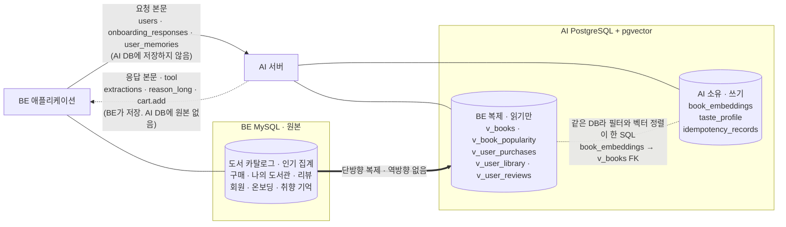

**요약** 본문에서 옮긴 ERD 다이어그램(배치도·관계도).

## 1. ERD 다이어그램

**배치도.** 무엇이 어느 DB 안에 있는지, 무엇이 저장되지 않고 지나가는지를 먼저 본다.

**관계도.** 아래 ER 다이어그램은 조인 축과 컬럼을 그린다. 관계선 중 DB FK인 것은 라벨에 FK라고 적었고 나머지는 조인 축이다. `USERS`, `ONBOARDING_RESPONSES`, `USER_MEMORIES`는 AI DB에 없고 요청 본문으로만 오지만, `user_id` 조인 축의 출처를 보이기 위해 함께 그린다.

```mermaid
erDiagram
    USERS ||--o| TASTE_PROFILE : "챗봇, 피드, 에이전트 후보 채점이 user_id로 조회"
    USERS ||--o| ONBOARDING_RESPONSES : "요청으로 전달"
    USERS ||--o{ USER_MEMORIES : "요청으로 전달"
    USERS ||--o{ V_USER_PURCHASES : "user_id"
    USERS ||--o{ V_USER_LIBRARY : "user_id"
    USERS ||--o{ V_USER_REVIEWS : "user_id"
    V_BOOKS ||--o| BOOK_EMBEDDINGS : "book_id (FK, cascade)"
    V_BOOKS ||--o| V_BOOK_POPULARITY : "book_id"
    V_BOOKS ||--o{ V_USER_PURCHASES : "book_id"
    V_BOOKS ||--o{ V_USER_LIBRARY : "book_id"
    V_BOOKS ||--o{ V_USER_REVIEWS : "book_id"

    BOOK_EMBEDDINGS {
        int book_id PK "AI 소유. v_books FK"
        vector embedding "차원 N은 5절에서 확정"
        int dim "벡터 길이"
        string model "생성 모델"
    }
    TASTE_PROFILE {
        int user_id PK "AI 소유"
        vector centroid "null 허용. 차원 N"
        jsonb tag_weights "태그 가중치"
        bool cold_start "개인화 비활성 여부"
        int profile_version "순위 영향 값 변경 시 증가"
        timestamptz computed_at "반영한 이력의 최대 시각. null 허용"
    }
    IDEMPOTENCY_RECORDS {
        string idempotency_key PK "AI 소유"
        string body_hash "본문 대조"
        jsonb stored_response "저장 응답"
        timestamptz created_at "최소 24시간 보관"
    }
    V_BOOKS {
        int book_id PK "BE 복제"
        string title ""
        string author "null 허용"
        string publisher "null 허용"
        int price "판매가 원"
        bool in_stock ""
        string cover_url "null 허용"
        string category "null 허용"
        int pub_year "null 허용"
        text description "null 허용"
    }
    V_BOOK_POPULARITY {
        int book_id PK "BE 복제"
        int sales "최근 판매 수"
        float rating_avg "null 허용"
        int rating_count "리뷰 수"
        timestamptz as_of "집계 시각"
    }
    V_USER_PURCHASES {
        int user_id "BE 복제"
        int book_id ""
        timestamptz purchased_at "computed_at·커서 발급 시각 비교 축"
    }
    V_USER_LIBRARY {
        int user_id "BE 복제"
        int book_id ""
        timestamptz added_at "computed_at·커서 발급 시각 비교 축"
    }
    V_USER_REVIEWS {
        int user_id "BE 복제"
        int book_id ""
        numeric rating "0.5-5.0"
        timestamptz created_at "computed_at 비교 축"
    }
    USERS {
        int user_id PK "요청 본문. AI DB에 없음"
        bool consented "취향 수집 동의"
    }
    ONBOARDING_RESPONSES {
        int user_id PK "요청 본문. AI DB에 없음"
        string[] reading_times "최대 5"
        string[] criteria "최대 3"
        string[] categories "최대 3"
        string[] tags "최대 9"
        int[] liked_book_ids "앞 50권 사용"
    }
    USER_MEMORIES {
        int user_id "요청 본문. AI DB에 없음"
        string type "mood topic author condition"
        string value "한두 문장"
        float confidence "0-1"
        float[] vector "value 문장 벡터. AI DB에 저장하지 않음"
        int dim "벡터 길이"
        string source_conversation_id "출처 세션"
    }
```

