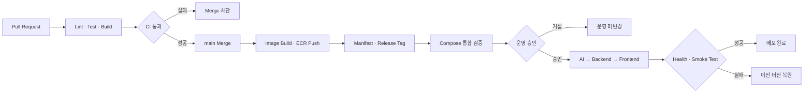

**요약** V1의 배포 후보 검증과 운영 승인, Recreate 배포, Rollback 및 보안 방식을 설계한다.

## 3단계 - CD(지속적 배포) 파이프라인 설계

북적북적 V1은 약 3주간 운영하는 초기 POC이다.

배포할 때마다 담당자가 EC2에 접속해 명령어를 직접 실행하면 배포 순서나 버전을 잘못 선택할 수 있다.

이를 방지하기 위해 배포 후보 준비부터 검증, 승인, 운영 반영과 Rollback까지 동일한 절차로 진행한다.

현재 사용자와 트래픽 규모에서는 복잡한 무중단 배포보다 적은 비용으로 배포 과정을 자동화하고, 실패 시 이전 버전으로 복구할 수 있는 구조가 적합한다.

### 1. CD 적용 범위 및 방식 결정

#### 배포 대상

| 구분 | 배포 대상 |
|---|---|
| Frontend | Private S3 + CloudFront |
| App EC2 | Nginx, Backend, MySQL |
| AI EC2 | AI Server, Qdrant |
| Image Registry | Amazon ECR |
| 배포 실행 | GitHub Actions + AWS Systems Manager |

Frontend, Backend, AI Server는 별도의 Repository에서 개발한다. CD Workflow는 Cloud Repository에서 통합 관리한다.

각 Repository에서 배포를 따로 실행하지 않고, 하나의 Release에 포함된 AI Server, Backend, Frontend를 정해진 순서대로 배포한다.

#### Continuous Delivery 선택

운영 환경까지 승인 없이 배포하는 Continuous Deployment는 사용하지 않다.

배포 후보는 자동으로 준비하되, 운영 배포는 GitHub `production` Environment의 승인 후 실행하는 **Continuous Delivery** 방식을 사용한다.

북적북적은 약 2주 단위로 완성된 기능을 배포하므로 승인 단계가 배포 속도에 미치는 영향이 크지 않다. 반면 잘못된 배포는 도서 검색과 추천 등 사용자 기능에 직접 영향을 줄 수 있으므로 운영 반영 전에 확인한다.

#### 환경 구성

별도의 상시 Staging EC2는 운영하지 않다.

다만 Frontend는 S3와 CloudFront로 제공하므로 `staging.example.com` 서브도메인을 별도로 운영한다.

Frontend Staging에서는 화면 렌더링, 라우팅과 정적 파일을 확인하며, 운영 데이터가 변경되는 API는 연결하지 않고 Mock API 또는 읽기 전용 API만 사용한다.

배포 전에 GitHub Actions Runner에서 Backend, AI Server, MySQL, Qdrant를 Docker Compose로 실행하고 서비스 간 연결을 검증한다. 외부 LLM은 Mock으로 대체하며, 검증이 끝나면 해당 환경을 제거한다.

상시 Staging보다 운영 환경과의 차이는 있지만, 추가 EC2 비용 없이 서로 다른 Repository 사이의 연동 오류를 확인할 수 있다.

#### 배포 전략 요약

현재 예상 Peak Traffic은 약 0.18 RPS이며, V1에서는 일시적인 서비스 중단을 허용한다.

따라서 추가 서버가 필요한 Blue-Green이나 Rolling 대신 Application 컨테이너만 교체하는 **Recreate 전략**을 사용한다.

배포는 사용자 이용이 집중되는 점심과 저녁 시간을 피해 진행하며, 계획된 API 중단은 최대 5분 이내를 목표로 한다. 단, 주문·거래 데이터 유실은 허용하지 않다.

### 2. EC2 + Docker Compose CD Pipeline 설계

#### CD Trigger

운영 담당자는 Cloud Repository의 Release Manifest에 배포할 버전을 기록한다.

```yaml
release: v1.2.0
frontend_sha: abc1234
backend_sha: def5678
ai_sha: ghi9012
```

Cloud Repository에 `v1.2.0`과 같은 `v*` Release Tag가 생성되면 CD Workflow를 시작한다.

Release Tag는 여러 서비스의 버전을 하나의 운영 배포 단위로 묶기 위해 사용한다. Docker Image Tag는 CI에서 지정한 Commit SHA를 그대로 사용한다.

#### 승인 정책

- 배포 후보 검증 후 GitHub `production` Environment에서 승인
- Release를 준비한 사람과 다른 클라우드 담당자 1명이 승인
- 사용자 이용이 집중되는 점심과 저녁 시간을 피해 배포
- 긴급 Rollback도 동일한 승인 절차 적용
- 동시에 두 Release가 배포되지 않도록 운영 CD를 하나씩 실행

운영 배포 과정에서 승인은 한 번만 받다. Pull Request의 리뷰 승인은 코드 Merge를 위한 절차이고, `production` 승인은 운영 반영을 위한 절차이다. 배포 직후 자동 Rollback에는 별도 승인이 필요하지 않으며, 배포 후 문제를 발견해 수동 Rollback할 때만 운영 승인을 다시 받다.

- [GitHub Actions 배포 환경](https://docs.github.com/en/actions/how-tos/deploy/configure-and-manage-deployments/control-deployments)

#### 전체 CI/CD Pipeline



#### 배포 전 준비

1. Manifest에 지정된 Backend·AI Server Image가 ECR에 있는지 확인
2. Frontend SHA의 코드를 Build
3. Frontend 결과물을 SHA별 S3 Release 경로에 업로드
4. `staging.example.com`에서 Frontend 화면과 라우팅 확인
5. GitHub Actions Runner에서 일회성 Docker Compose 환경 실행
6. Backend·AI Server·MySQL·Qdrant 연결 확인
7. 핵심 API Smoke Test 실행
8. 검증 완료 후 일회성 환경 제거
9. 운영 승인 대기

Frontend 파일은 `releases/<frontend-sha>/` 경로에 저장한다. 서비스의 `index.html`을 전환하기 전에는 신규 파일이 사용자에게 노출되지 않다.

일회성 통합 검증에서는 다음 흐름을 확인한다.

- Backend가 MySQL에 연결되는지 확인
- Backend가 AI Server를 호출할 수 있는지 확인
- AI Server가 Qdrant에 연결되는지 확인
- 로그인 후 검색·상세·추천 API가 정상 응답하는지 확인
- 외부 LLM은 Mock 응답으로 대체

#### 배포 순서

```text
AI Server 배포·검증
→ Backend 배포·검증
→ Frontend 전환
→ 최종 Smoke Test
```

AI Server 검증에 실패하면 App EC2와 Frontend는 변경하지 않다. AI Server가 정상일 때만 Backend를 배포하고, 두 서버가 모두 정상이면 Frontend를 전환한다.

신규 AI Server는 순차 배포 중에도 기존 Backend 요청을 처리할 수 있도록 기존 API 형식을 함께 지원한다.

MySQL과 Qdrant 컨테이너 및 Docker Volume은 일반 배포에서 재생성하지 않다.

#### SSM 배포 Script의 역할

GitHub Actions는 Secret 값을 EC2로 전달하지 않고 Release ID와 Image Digest만 SSM Run Command로 전달한다.

각 EC2의 배포 Script는 다음 순서로 실행한다.

1. 현재 Release 정보를 `previous-release.env`에 저장
2. 지정된 Image Digest를 ECR에서 Pull
3. 기존 Application Container만 신규 Image로 Recreate
4. Container Health와 의존 서비스 연결 확인
5. 성공하면 `current-release.env`를 신규 Release로 갱신

MySQL과 Qdrant Container 및 Volume은 이 과정에서 재생성하지 않다. Script가 실패하면 `current-release.env`를 변경하지 않아 이전 Release 정보를 유지한다.

#### 이전 Release 관리

배포 전에 현재 Release 정보를 이전 Release로 보관한다.

```text
.env.production       # DB 비밀번호와 API Key
current-release.env   # 현재 Image Digest와 Frontend 경로
previous-release.env  # 직전 Release 정보
```

Secret과 Release 정보를 분리하고, Rollback 시 `previous-release.env`에 기록된 버전을 사용한다.

#### GitHub Actions YAML 예시

Cloud Repository의 `.github/workflows/cd.yml`에서 CD를 관리한다. 실제 명령은 Script로 분리하고 Workflow에는 실행 순서만 작성한다.

<details>
<summary>Production CD.yml</summary>

```yaml
name: Production CD

on:
  push:
    tags: ["v*"]

permissions:
  contents: read
  id-token: write

concurrency:
  group: production-cd
  cancel-in-progress: false

jobs:
  verify:
    runs-on: ubuntu-latest
    steps:
      - uses: actions/checkout@v4
      - name: AWS authentication
        uses: aws-actions/configure-aws-credentials@v4
        with:
          role-to-assume: ${{ vars.AWS_CANDIDATE_ROLE_ARN }}
          aws-region: ap-northeast-2
      - name: Verify release
        run: ./scripts/verify-release.sh
      - name: Prepare frontend
        run: ./scripts/prepare-frontend.sh
      - name: Compose integration test
        run: ./scripts/integration-test.sh

  notify_approval:
    needs: verify
    runs-on: ubuntu-latest
    steps:
      - uses: actions/checkout@v4
      - name: Notify approval
        run: ./scripts/notify.sh approval

  deploy:
    needs: [verify, notify_approval]
    runs-on: ubuntu-latest
    environment: production
    steps:
      - uses: actions/checkout@v4
      - name: AWS authentication
        uses: aws-actions/configure-aws-credentials@v4
        with:
          role-to-assume: ${{ vars.AWS_CD_ROLE_ARN }}
          aws-region: ap-northeast-2
      - name: Deploy and verify
        run: ./scripts/deploy.sh
      - name: Rollback
        if: failure()
        run: ./scripts/rollback.sh
      - name: Notify success
        if: success()
        run: ./scripts/notify.sh success
      - name: Notify failure
        if: failure()
        run: ./scripts/notify.sh failure
```

`production` Environment에는 승인 규칙을 적용한다. `concurrency`는 운영 배포가 겹치는 것을 막되, 진행 중인 배포를 새로운 실행이 취소하지 않도록 설정한다.

</details>

#### 배포 방식 비교

**SSH 배포**는 EC2에 직접 접속해 명령을 실행하기 쉽지만 SSH Key와 `22`번 Port를 관리해야 한다.

**SSM 배포**는 초기 IAM·SSM 설정이 필요하지만 SSH Key와 공개 관리 Port 없이 배포할 수 있고 실행 기록도 남길 수 있다. 이미 CI에서 OIDC와 AWS IAM을 사용하므로 CD에서도 OIDC와 SSM을 사용한다.

**Continuous Deployment**는 승인 없이 운영에 바로 반영할 수 있지만, 주문·거래 기능이 있는 서비스에서 잘못된 변경이 즉시 사용자에게 노출될 수 있다. 따라서 배포 후보를 자동으로 준비하고 운영 반영만 승인하는 **Continuous Delivery**를 선택한다.

### 3. 배포 전략 결정

#### Recreate 선택

App EC2와 AI EC2에서 Application 컨테이너만 교체하는 **Recreate 전략**을 사용한다.

| 대상 | 처리 방식 |
|---|---|
| AI Server | 기존 컨테이너를 신규 Image로 교체 |
| Backend | 기존 컨테이너를 신규 Image로 교체 |
| Frontend | 검증된 Release의 `index.html` 전환 |
| MySQL | 계속 실행하고 Volume 유지 |
| Qdrant | 계속 실행하고 Volume 유지 |
| Nginx | 계속 실행 |

App EC2와 AI EC2는 같은 서비스의 복제 환경이 아니라 서로 다른 역할을 담당한다. 따라서 현재는 Rolling이나 Blue-Green 배포에 필요한 기존·신규 복제 환경을 별도로 운영하지 않다.

기존·신규 컨테이너를 같은 EC2에 실행하거나 별도 EC2 Instance를 추가하는 방식 모두 가능하지만, 현재 `t3.small` 구성에서는 자원 경쟁 또는 추가 비용이 발생한다. 또한 두 환경 사이의 요청 전환과 데이터 연결을 별도로 구성해야 한다.

현재 사용자와 트래픽 규모에서는 무중단 배포를 위한 서버를 추가하는 것보다 짧은 중단을 허용하고 배포와 복구 절차를 단순하게 유지하는 편이 적합한다.

#### 다른 전략을 제외한 이유

- **Blue-Green**: 같은 EC2에 두 Application Container를 실행하거나 별도 Instance를 추가할 수 있지만, 자원·비용과 별도 트래픽 전환 구성이 필요
- **Rolling Update**: Container 또는 Instance를 여러 개 운영해야 하며, 요청을 분산할 Load Balancer나 Reverse Proxy 설정과 복제 데이터 관리가 필요
- **Canary**: 현재 트래픽으로는 짧은 시간 안에 의미 있는 비교가 어려움
- **Nginx Traffic Switching**: 전환할 두 Backend 환경을 동시에 실행해야 하므로 현재 EC2 자원과 중단 허용 수준에 비해 복잡함

무중단 배포보다 단순한 배포 절차와 빠른 Rollback을 우선한다.

### 4. 배포 검증 및 Rollback 설계

#### 배포 성공 기준

Container가 실행 중인지만으로 배포 성공을 판단하지 않다.

##### Health Check

- Backend와 AI Server 실행 상태 확인
- Backend와 MySQL·AI Server 연결 확인
- AI Server와 Qdrant 연결 확인

##### HTTP 및 Smoke Test

- Frontend Staging(`staging.example.com`)에서 화면 렌더링과 라우팅 확인
- Frontend와 주요 정적 파일의 HTTP 응답 확인
- 공개 API의 HTTP 응답 확인
- 도서 검색 API 확인
- 도서 상세 API 확인
- 개인정보가 없는 테스트 사용자의 AI 추천 응답 확인
- 검증 과정의 `5xx` 오류 확인

Smoke Test는 `로그인 → 도서 검색 → 도서 상세 조회 → AI 추천 조회` 범위로 수행한다. 주문·결제처럼 운영 데이터를 변경하는 기능은 포함하지 않다.

배포 전 일회성 검증에서는 외부 LLM을 Mock으로 대체한다. 운영 배포 후에는 실제 LLM과 연결된 추천 API를 한 번 확인한다.

#### DB 변경

- DB 변경이 있으면 Backend 배포 전에 Migration 실행
- Migration 실패 시 Backend 배포 중단
- 컬럼 삭제처럼 되돌리기 어려운 변경은 자동 CD에서 제외
- Application Rollback 시 MySQL Backup을 자동 복원하지 않음
- MySQL 데이터와 Docker Volume 유지

#### 자동 Rollback

배포 직후 Health Check 또는 Smoke Test가 실패하면 변경된 범위만 이전 버전으로 복원한다.

```text
신규 버전 배포
→ Health Check 및 Smoke Test
→ 검증 실패
→ previous-release.env 확인
→ 이전 Image Digest 또는 Frontend 경로 복원
→ Health Check 및 Smoke Test 재실행
```

- AI Server 검증 실패: AI Server만 복원
- Backend 검증 실패: Backend와 먼저 배포한 AI Server 복원
- Frontend 전환 후 최종 검증 실패: Frontend, Backend, AI Server 복원
- DB Migration 실패: Application을 변경하지 않고 배포 중단

MySQL과 Qdrant의 컨테이너 및 Volume은 Rollback 과정에서 재생성하지 않다. MySQL 데이터는 신규 배포 이후 생성된 데이터가 사라질 수 있으므로 자동으로 이전 Backup을 복원하지 않다.

#### 수동 Rollback

배포 검증을 통과한 뒤 기능 문제가 발견되면 운영 담당자가 이전 Release를 선택해 수동 Rollback을 실행한다.

수동 Rollback도 `production` Environment 승인을 거치며, 이전 버전을 복원한 후 같은 Health Check와 Smoke Test를 실행한다.

#### 모니터링과 알림

- GitHub Actions에서 Health Check와 Smoke Test 결과 확인
- CloudWatch에서 EC2 상태와 애플리케이션 오류 로그 확인
- 배포 후 문제가 발견되면 추가 배포 중단
- 운영 담당자가 수동 Rollback 여부 판단

CD는 운영 환경을 변경하므로 승인 대기, 성공, 실패 결과를 Discord로 알립니다.

```text
✅ 운영 배포 완료

Release: v1.2.0
배포 대상: AI Server, Backend, Frontend
승인자: @담당자
완료 시각: 2026-09-05 10:30 KST
Workflow: <실행 링크>
```

```text
🚨 운영 배포 실패

Release: v1.2.0
실패 단계: Backend Health Check
Rollback: 성공
담당자: @담당자
Workflow: <실행 링크>
```

세부 응답시간과 오류율 임계치는 운영 데이터가 쌓인 후 실제 사용자 요청을 기준으로 설정한다.

### 5. 배포 보안 설계

#### AWS 인증

GitHub Actions는 OIDC를 사용하여 Workflow가 실행되는 동안만 유효한 AWS 권한을 발급받다. 장기 AWS Access Key는 GitHub에 저장하지 않다.

AWS Access Key를 GitHub Secret에 저장하는 방식은 설정이 간단하지만, Key가 유출되면 만료 전까지 계속 사용할 수 있고 교체도 직접 해야 한다. OIDC는 별도 Key를 저장하지 않고 Workflow 실행 시 임시 권한을 발급하므로 초기 IAM 설정은 필요하지만 장기 Credential 관리 부담이 적다.

IAM Role의 신뢰 정책은 Cloud Repository와 `production` Environment로 제한한다.

- 배포 후보 준비 Role: ECR Image 확인, Frontend Release 경로 업로드
- 운영 CD Role: SSM 배포 명령, Frontend 전환, CloudFront Cache Invalidation

- [GitHub Actions의 AWS OIDC 설정](https://docs.github.com/en/actions/how-tos/secure-your-work/security-harden-deployments/oidc-in-aws)

#### EC2 배포

GitHub Actions는 SSH 대신 SSM Run Command로 App EC2와 AI EC2에 배포 명령을 전달한다.

SSH Key를 GitHub에 저장하거나 EC2의 SSH Port를 공개하지 않아도 되며, 배포 대상과 실행 결과를 확인할 수 있다.

App EC2와 AI EC2는 각 Instance Role을 사용하여 담당 ECR Repository에 로그인하고 Image를 가져옵니다.

#### Registry Credential

ECR 로그인 정보는 고정된 값으로 저장하지 않다. GitHub Actions와 EC2는 각각 OIDC Role과 Instance Role로 필요한 시점에 ECR 인증 정보를 발급받다.

#### Application Secret

DB 비밀번호, JWT Key, OAuth Secret과 LLM API Key는 각 EC2의 `.env.production` 파일에 저장한다.

- Git Repository와 Docker Image에 포함하지 않음
- GitHub Actions와 SSM 명령에 Secret 값을 전달하지 않음
- 배포 계정만 읽을 수 있도록 파일 권한 제한
- 배포 시 서버에 저장된 환경변수 사용

V1에서는 별도의 Secret 관리 서비스를 도입하지 않다. 서버와 운영 기간이 늘어나면 Parameter Store 또는 Secrets Manager 도입을 검토한다.

### 현재 CD 구조가 가진 한계

- App EC2와 AI EC2가 각각 한 대이므로 서버 장애 시 자동으로 복구되지 않음
- Recreate 배포 중 최대 5분의 서비스 중단이 발생할 수 있음
- 상시 Staging 환경이 없어 운영 환경과 완전히 같은 조건으로 검증하기 어려움
- MySQL과 Qdrant를 직접 운영하므로 자동 장애 복구가 없음
- 여러 Repository의 연동 문제는 일회성 통합 검증 범위에서만 확인
- 배포 이후 발견된 문제는 운영 담당자가 수동으로 Rollback 여부를 판단
- 서버 수가 늘어나면 Docker Compose와 SSM 배포 Script 관리가 복잡해짐

현재는 높은 가용성보다 적은 비용으로 배포 과정을 표준화하는 것이 중요한다. 사용자와 배포 빈도가 증가하면 상시 Staging 환경, 다중 Instance, Load Balancer와 Container Orchestration 도입을 검토한다.
