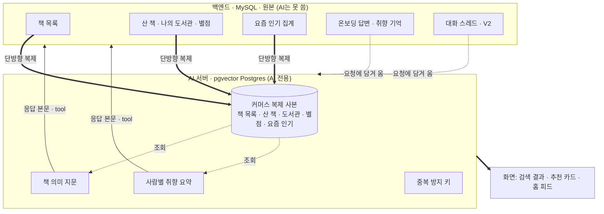
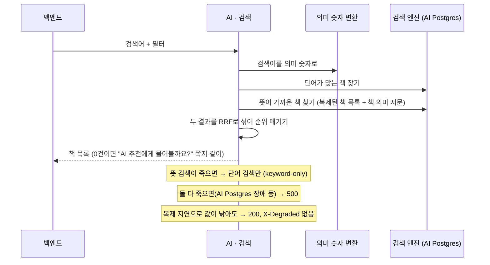
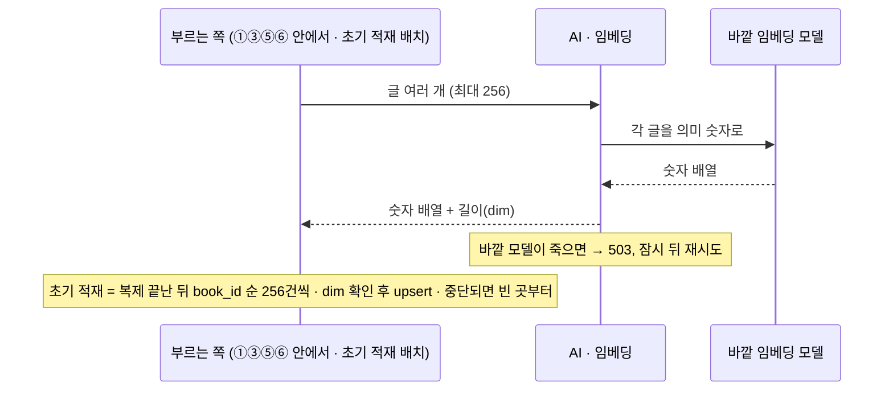
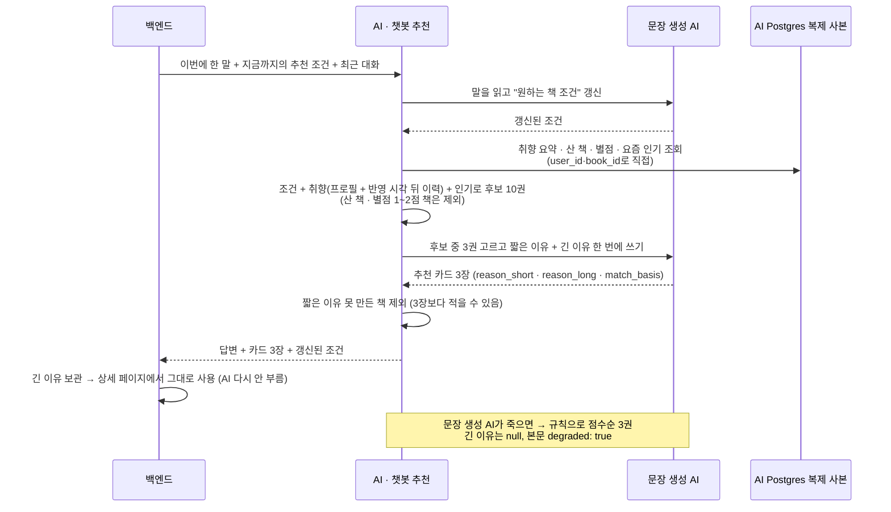
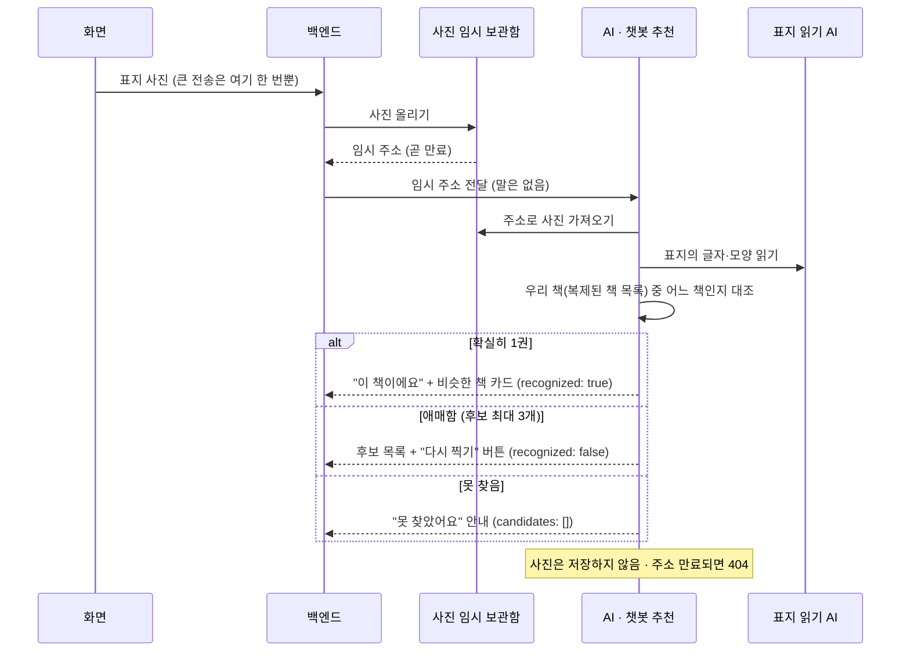
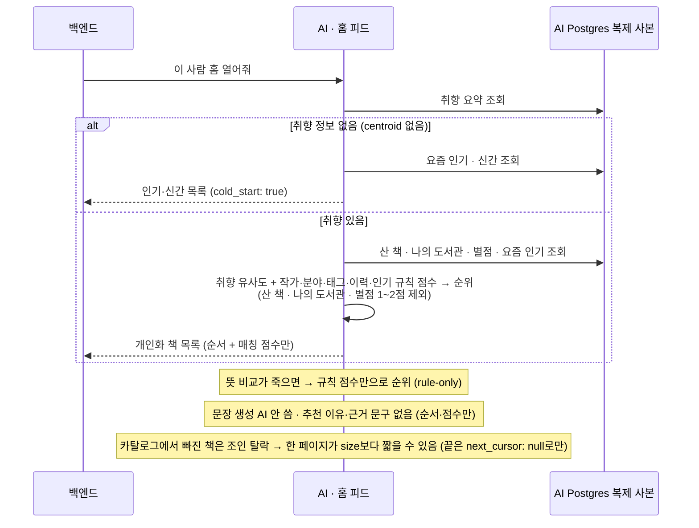
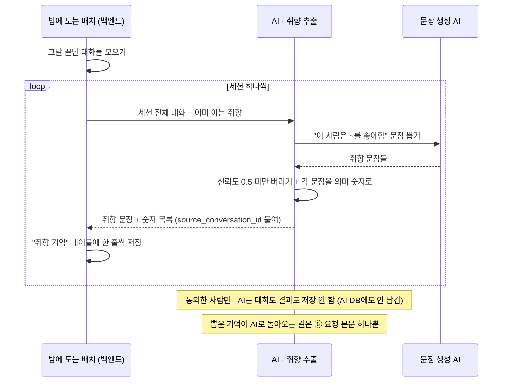
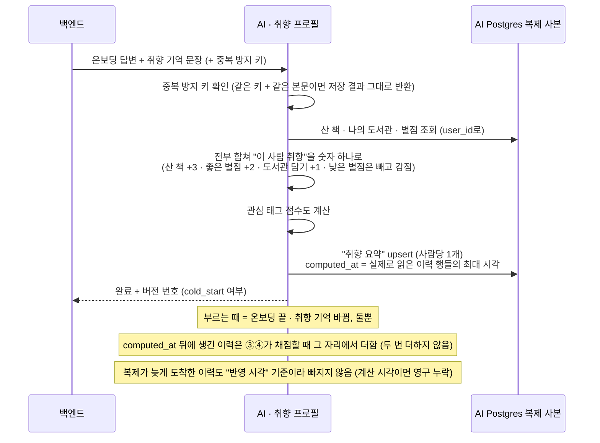
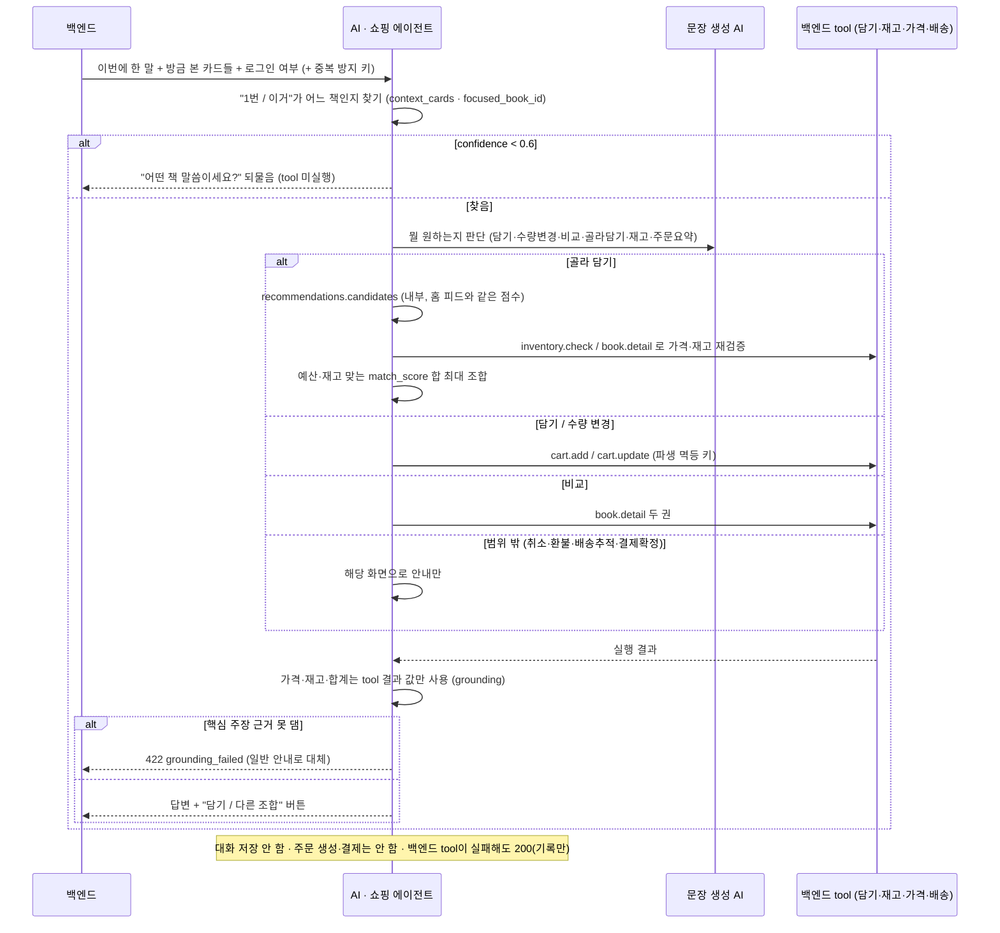

# 북적북적 AI 서버 — 데이터 소유권과 호출 흐름 (다이어그램)

> [ai-server-api-spec-final.md](ai-server-api-spec-final.md)의 §1·§2를 그림으로 다시 본 것이다. **새 규칙은 없다.** 계약면의 단일 소스는 명세 문서이고, 여기서 명세와 어긋나는 게 보이면 명세가 맞다.
>
> 다이어그램은 표·키 이름 대신 **쉬운 말**로 그렸고, 명세 용어와의 대응은 아래 표에 있다.

## DB 배치 (2026-09-09 확정)

- **BE 원본 = MySQL.** 회원·카탈로그·장바구니·주문·결제.
- **AI 저장소 = pgvector를 얹은 PostgreSQL(AI 전용 인스턴스).** 도서 임베딩·취향 프로필·멱등 기록, 그리고 아래 커머스 복제 사본.
- **커머스 데이터는 BE MySQL → AI PostgreSQL 단방향 복제.** 역방향 복제 채널은 없다. AI 서버 애플리케이션에 BE MySQL로 가는 연결이 아예 없다.
- 예전 "BE와 Postgres 공유" 안은 BE가 MySQL로 확정되며 폐기. 예전 "읽기 전용 뷰" 표현도 복제 테이블로 대체.

**이전 초안(공유 Postgres · `reason_cache` · `/books/{id}/match-reason` · 읽기 전용 뷰)과 달라진 점**

- 추천 이유 캐시도, 이유 전용 엔드포인트도 없다. 긴 이유는 ③ 응답에 실려 나가고 **BE가 보관**한다.
- AI가 쓰기 권한을 갖는 것은 **책 의미 지문**, **취향 요약**, **중복 방지 키** 셋뿐(그 외는 사전 계산 숫자 같은 정적 데이터).
- 커머스 데이터는 뷰 조회가 아니라 **AI Postgres 안의 복제 사본**을 읽는다. 복제 지연·행 부재는 오류가 아니고, AI Postgres 자체가 죽으면 전면 500이다.

---

## 쉬운 말 ↔ 명세 용어

| 다이어그램의 쉬운 말 | 명세 용어 | 한 줄 설명 |
| --- | --- | --- |
| 책 목록 | `v_books` | 제목·저자·가격·재고·분야·소개 (복제 사본) |
| 산 책 · 나의 도서관 · 별점 | `v_user_purchases` / `v_user_library` / `v_user_reviews` | 뭘 샀나 · 서재(나의 도서관)에 담았나 · 몇 점 줬나 (복제 사본) |
| 온보딩 관심 책 | `liked_book_ids` | 가입할 때 고른 마음에 드는 책 (최대 50). ⑥ 요청 본문으로만 옴 — `v_user_library`와 별개 |
| 요즘 인기 | `v_book_popularity` | 최근 판매 수 · 리뷰 평점 · 리뷰 건수 (`sales, rating_avg, rating_count, as_of`). BE가 원본을 집계해 갱신, 그 결과가 복제됨. 조회 수·랭킹은 안 받음 |
| 취향 기억 | `preference_memory` / `memories` | 대화에서 뽑은 "이 사람은 ~를 좋아함" 문장들 |
| 책 의미 지문 | `book_embeddings` | 책 소개를 "뜻이 가까운지 계산되는 숫자(벡터)"로 바꿔둔 것. AI 소유 |
| 취향 요약 | `taste_profile` / `centroid` | 이 사람 취향을 숫자 하나로 뭉친 것. 개인화의 기준. AI 소유 |
| 추천 조건 | `spec` | 챗봇이 지금까지 파악한 "무슨 책 원하는지" (6칸 메모) |
| 짧은 이유 · 긴 이유 | `reason_short` / `reason_long` | 챗봇 카드(③) 전용. 카드 한 줄 / 상세페이지용 2~4문장. ④ 피드에는 없음 |
| 반영 시각 | `computed_at` | 프로필이 실제로 반영한 이력 행들의 최대 시각. 이 시각 뒤에 생긴 이력은 ③④가 채점할 때 그 자리에서 더함 (계산 시각이 아님) |
| 복제 사본 | 복제 테이블 (`v_` 접두사) | BE MySQL → AI Postgres 단방향 복제. view가 아니라 AI Postgres 안의 실제 테이블 |
| 복제 지연 | lag | 원본 변경이 사본에 도착하기까지의 시간. 오류·축소 응답 아님. 허용 지연(신선도 예산)은 명세 §1 표 |
| 중복 방지 키 | `idempotency key` | 같은 요청이 두 번 와도 한 번만 실행 |
| 축소 모드 | `degraded` / `X-Degraded` | 일부 기능이 죽어도 에러 대신 줄여서 정상 응답 |
| 문장 생성 AI | LLM | 조건 해석·카드 문장 작성에 쓰는 외부 모델 |
| 의미 숫자 변환 | 임베딩 | 글을 벡터로 바꾸는 것(②) |

---

## 0. 데이터 소유권 — 누가 뭘 읽고 쓰나

**AI가 데이터를 얻는 길은 둘뿐이다.**

| 길 | 무엇 | 어떻게 |
| --- | --- | --- |
| AI Postgres 복제 사본 조회 | 책 목록, 산 책·나의 도서관·별점, 요즘 인기 | AI가 사람 번호·책 번호로 자기 DB의 사본을 조회. 행이 없으면 그 항 0점 + 정상 응답. 사본 DB 자체가 죽으면 전면 500 |
| 요청에 담겨 옴 (BE가 실어 보냄) | 온보딩 답변·취향 기억(⑥), 대화(③⑤), 추천 조건(③), 방금 본 카드(⑦), 사진 주소(③ V2) | BE가 원본을 갖고 있으므로 필요한 만큼만 담아 보냄 |

**AI가 만들어 저장하는 것 (전부 AI Postgres).**

| 무엇 | 내용 | 언제 |
| --- | --- | --- |
| 책 의미 지문 | 책 소개의 벡터 (검색·추천에서 "뜻이 가까운 책" 찾을 때 씀) | 초기 적재 배치가 ②로 만들어 저장. 복제 완료 후 |
| 취향 요약 | 사람별 취향 벡터 + 관심 태그 점수 + 반영 시각 (사람당 1개) | ⑥ 호출 시 |
| 중복 방지 키 기록 | 키 → 저장 결과 (24시간 보관) | ⑥·⑦ |
| 사전 계산 숫자 | 작가·분야·태그의 대표 벡터 | 미리 만들어 둠(정적) |

**AI가 만든 값이 BE로 가는 길 (복제가 아니라 반환값).**

| 무엇 | 경로 | 왜 |
| --- | --- | --- |
| 긴 이유(`reason_long`) | ③ 응답 본문 → BE가 카드와 함께 보관 | 상세 페이지에서 재호출 없이 그대로 표시 |
| 취향 기억(`extractions[]`) | ⑤ 응답 본문 → BE가 취향 테이블에 저장 | 다음 ⑥ 요청에 실려 다시 들어옴 |
| 장바구니 변경 | ⑦의 tool 호출(cart.add 등) | BE가 재고·권한 재확인 후 자기 테이블에 씀 |

---

## 기능별 한눈에 — 읽기·쓰기·문장 생성 AI

| # | 기능 | 읽는 것 | 쓰는 것 | 문장 생성 AI | 대화 저장 | 축소 모드 |
| --- | --- | --- | --- | --- | --- | --- |
| ① | 검색 | 책 목록 · 책 의미 지문 · (인기순 시) 요즘 인기 | — | ✕ | — | 단어 검색만 (keyword-only) |
| ② | 임베딩 | — | — | ✕ | — | 잠시 뒤 재시도 |
| ③ | 챗봇 추천 | 취향 요약 · 산 책/도서관/별점 · 요즘 인기 · 책 목록 · 책 의미 지문 | — (긴 이유는 응답에만, BE가 보관) | ✓ (조건 갱신 + 카드 1회) | ✕ | 규칙으로 점수순 3권 (본문 degraded) |
| ④ | 홈 피드 | 취향 요약 · 산 책/도서관/별점 · 요즘 인기 · 책 목록 · 책 의미 지문 | — | ✕ | — | 규칙 점수만 (rule-only) |
| ⑤ | 취향 추출 | — (대화는 요청에 담겨 옴) | — (BE가 저장, AI DB에도 안 남김) | ✓ | ✕ | — |
| ⑥ | 취향 프로필 | 산 책/도서관/별점 · 책·작가·태그 대표 벡터 | 취향 요약 · 중복 방지 키 | ✕ | — | — |
| ⑦ | 쇼핑 에이전트 | 취향 요약 · (tool로) 장바구니·재고·책 정보 | 중복 방지 키 (장바구니는 BE가) | ✓ | ✕ | — |
| ⑧ | 상태 점검 | 부품 상태 · 복제 지연 | — | ✕ | — | 일부 장애 표시 |

- **복제 지연·행 부재는 어느 기능에서도 축소 모드가 아니다.** 낡은 값 그대로 200, `X-Degraded` 안 붙음.
- **AI Postgres가 응답 불능이면 ①③④는 전면 500.** 부분 축소 안 함.

---

## ① `POST /search` — 검색

- **읽는 것**: 책 목록, 책 의미 지문, (인기순 고를 때만) 요즘 인기 — 전부 AI Postgres 복제 사본
- **쓰는 것**: 없음 · **문장 생성 AI**: 안 씀 · **개인화**: 안 함 (누가 검색하든 같은 순위)
- `filters.in_stock_only`·가격 구간은 조회 조건이라, 복제 전이면 그 책이 결과에서 아예 빠진다(재검증으로 복구 안 됨). 누락은 허용 지연 5분을 넘지 않는다.

## ② `POST /embeddings` — 임베딩 (속 부품)

- **읽기/쓰기**: 없음 (순수 변환) · 검색어도 책 소개도 "뜻이 가까운지" 비교하려면 전부 이걸 거침
- 확정 차원은 ERD §7. 예시의 `dim`·`model`은 자리표시자.

## ③ `POST /recommendations/chat` — 챗봇 추천 (말로 물어볼 때)

- **읽는 것**: 취향 요약, 산 책·나의 도서관·별점, 요즘 인기, 책 목록, 책 의미 지문 — 전부 복제 사본
- **쓰는 것**: 없음 — 긴 이유는 응답으로 나가고 BE가 보관 (AI 쪽 캐시 없음)
- **대화 저장**: ✕ — 조건·최근 대화를 BE가 매 턴 보냄

## ③ `POST /recommendations/chat` — 챗봇 추천 (사진을 보낼 때, V2)

- **읽는 것**: 책 목록, 책 의미 지문, (1권 확정 시 비슷한 책 채점에) 취향 요약
- **쓰는 것**: 없음 · **사진 저장**: ✕

## ④ `GET /recommendations/feed` — 홈 피드

- **읽는 것**: 취향 요약, 산 책·나의 도서관·별점, 요즘 인기, 책 목록, 책 의미 지문 — 전부 복제 사본
- **쓰는 것**: 없음
- 피드 항목엔 `reason_short`·`reason_long`·`match_basis`가 **없다.** 상세 페이지의 이유는 챗봇 카드(③)로 들어온 경우에만.

## ⑤ `POST /preferences/extractions` — 취향 추출 (매일 밤, V2)

- **읽는 것**: 없음 (대화는 요청에 담겨 옴)
- **쓰는 것**: 없음 — 반환만. "취향 기억" 저장은 백엔드 몫

## ⑥ `POST /preferences/profile` — 취향 프로필 만들기

- **읽는 것**: 산 책·나의 도서관·별점(복제 사본), 책·작가·태그 대표 벡터, (요청에 담겨 옴) 온보딩 답변·취향 기억
- **쓰는 것**: 취향 요약, 중복 방지 키
- **문장 생성 AI·임베딩 안 씀** → 이 기능엔 그쪽 장애(503·504)가 없음

## ⑦ `POST /agent/act` — 쇼핑 에이전트 (V2)

- **읽는 것**: 취향 요약(후보 고를 때, 복제 사본), tool로 장바구니·재고·책 정보
- **쓰는 것**: 중복 방지 키 — 장바구니 변경은 AI가 직접 안 하고 **tool 호출로만** (BE가 권한·재고 재확인)

## ⑧ `GET /health` — 상태 점검

입력 없음. 부품들(게이트웨이·AI Postgres·벡터 인덱스·문장 생성 AI·임베딩)이 살아있는지 확인해 전체 상태 + 부품별 상태 + **복제 지연(`replication_lag_seconds`)**을 반환한다.

- 일부 장애면 `status: degraded`, 서버 전체가 응답 불능이면 `down`.
- `replication_lag_seconds`는 `components` 밖에 있고 **`status`를 바꾸지 않는다** — 복제가 밀렸다고 인스턴스가 로드밸런서에서 빠지면 안 되므로. `lag > N`으로 지연을, `null이 계속됨`으로 복제 중단을 잡는다.
- `components.database`는 **AI Postgres**이지 BE MySQL 상태가 아니다.
- 인증 없이 내부망에서만 접근.
