# 북적북적 AI 서버 — 데이터 소유권과 호출 흐름 (API 명세 버전)

> [ai-server-api-spec-final.md](ai-server-api-spec-final.md)의 §1·§2·§3을 실제 필드명 기준 시퀀스로 옮긴 것이다. **새 규칙은 없다.** 계약면의 단일 소스는 명세 문서이고, 여기와 어긋나면 명세가 맞다.
>
> 쉬운 말 버전은 [ai-server-api-다이어그램.md](ai-server-api-다이어그램.md).

## DB 배치 (2026-09-09 확정)

- BE 원본 = **MySQL**. AI 저장소 = **pgvector를 얹은 PostgreSQL(AI 전용 인스턴스)**.
- 커머스 데이터는 **BE MySQL → AI PostgreSQL 단방향 복제**. `v_*`는 SQL view가 아니라 AI Postgres 안의 실제 복제 테이블(이름 접두사일 뿐). AI 서버엔 BE MySQL 연결이 없다.
- 역방향 복제 없음. AI→BE는 응답 본문(⑤ `extractions[]`·③ `reason_long`)과 V2 tool 호출뿐 — 둘 다 복제가 아니라 BE가 검증 후 자기 테이블에 쓰는 것.

**허용 지연(신선도 예산) — 계약**

| 대상 | 허용 지연 |
| --- | --- |
| v_books 가격·재고 | 5분 |
| v_books 신간 입고(임베딩 포함) | 1시간 |
| v_book_popularity | 24시간 |
| 이력 3종(구매·도서관·리뷰) | 5분 |

- 복제 지연·행 부재는 **오류가 아니다** — 낡은 값 그대로 200, `X-Degraded` 안 붙음. 행이 없으면 그 항 0점 + 200.
- **AI Postgres 자체가 응답 불능이면 전면 500**(부분 축소 없음). BE MySQL 장애는 500이 아니다(복제만 멈추고 사본으로 계속).
- 인기 신호는 **판매 + 리뷰 둘뿐**. 조회 수·BE 랭킹은 복제받지 않는다.

---

## 0. 데이터 소유권 — 누가 뭘 읽고 쓰나

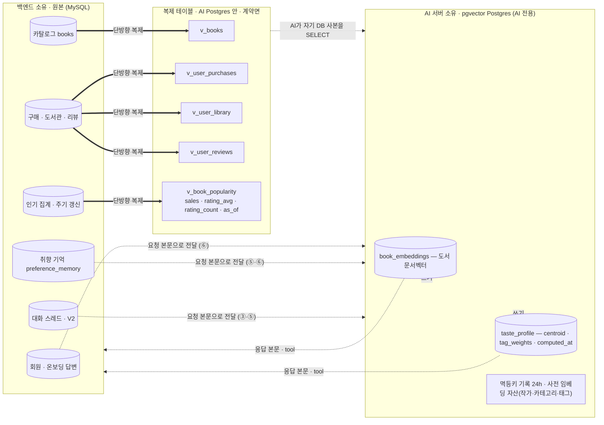

**AI가 데이터를 얻는 경로는 둘뿐이다.**

| 경로 | 무엇 | 어떻게 |
| --- | --- | --- |
| 복제 사본 조회 (AI가 자기 DB에서 SELECT) | `v_books`, `v_user_purchases`, `v_user_library`, `v_user_reviews`, `v_book_popularity` | `user_id`·`book_id`로 SELECT. **행 없으면** 그 항 0점 + 200 / **복제 지연**이면 낡은 값 + 200 / **AI Postgres 다운**이면 전면 500 |
| 요청 본문 (BE가 실어 보냄) | 온보딩 답변·`memories`(⑥), 대화(`recent_turns` ③ / `conversation` ⑤), `spec`(③), `context_cards`·`user_context`(⑦), `image_ref`(③ V2) | BE가 원본을 갖고 있으므로 필요한 만큼만 담아 보냄 |

**AI가 쓰는 것 (전부 AI Postgres).**

| 저장소 | 무엇 | 언제 |
| --- | --- | --- |
| `book_embeddings` | 도서 소개 문서벡터 (벡터 인덱스에 적재) | 초기 적재 배치가 ②로 만들어 저장 (복제 완료 후) |
| `taste_profile` | `centroid` · `tag_weights` · `cold_start` · `computed_at` · `profile_version` (유저당 1행 upsert) | ⑥ 호출 시 |
| 멱등키 기록 (24h) | `idempotency_key` → 저장 결과 매핑 | ⑥·⑦ |
| 사전 임베딩 자산 | 작가 대표벡터, 카테고리·태그 벡터 | 미리 만들어 둠(정적) |

---

## ① `POST /search`

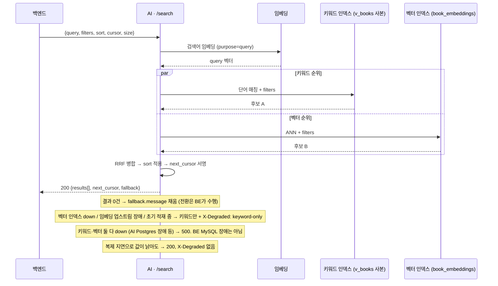

- **읽기**: `v_books`(복제 사본), `book_embeddings`, (`sort=popular`) `v_book_popularity` — 판매·리뷰 집계
- **쓰기**: 없음 (커서는 서명 문자열, DB 아님) · **LLM**: 안 씀 · **개인화**: 안 함 (이력 안 읽음)
- `filters.in_stock_only`·가격 구간은 조회 조건이라, 복제 전이면 그 도서가 결과에서 아예 빠진다(재검증으로 복구 안 됨). 누락은 허용 지연 5분을 넘지 않는다.

## ② `POST /embeddings`

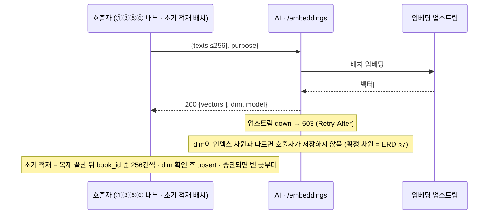

- **읽기/쓰기**: 없음 (순수 변환) · **LLM**: 안 씀 · 내부 전용

## ③ `POST /recommendations/chat` — 텍스트 턴

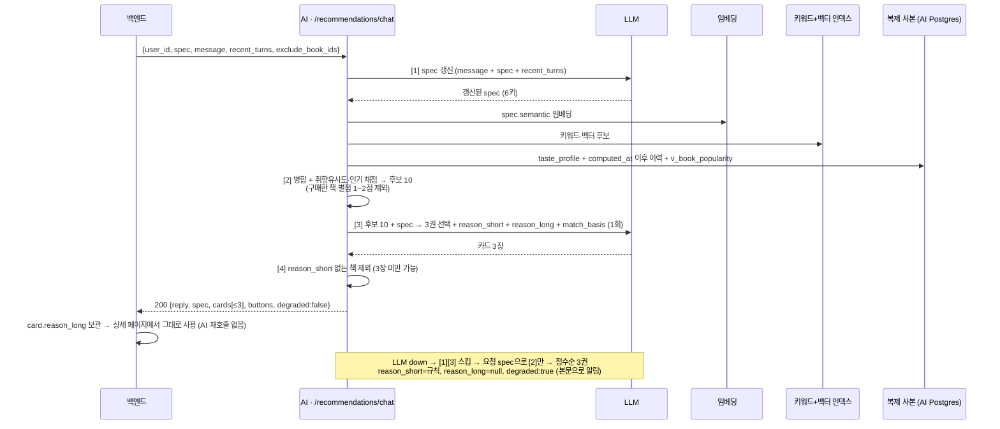

- **읽기**: `taste_profile`, `v_user_purchases`/`library`/`reviews`, `v_book_popularity`, `v_books`, `book_embeddings` — 전부 복제 사본
- **쓰기**: **없음** — `reason_long`은 응답에 실려 나가고 BE가 보관 (AI 쪽 캐시 없음)
- **대화 저장**: ✕ — `spec`·`recent_turns`를 BE가 매 턴 보냄

## ③ `POST /recommendations/chat` — 이미지 턴 (V2)

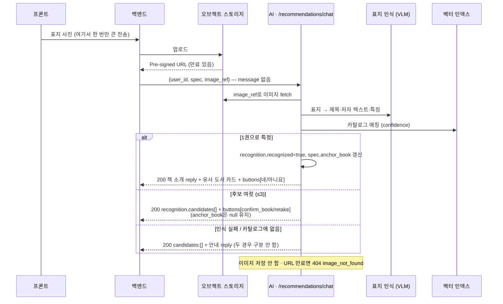

- **읽기**: `v_books`, `book_embeddings`, (`recognized` 시 유사 카드 채점) `taste_profile` 등
- **쓰기**: 없음 · **이미지 저장**: ✕

## ④ `GET /recommendations/feed`

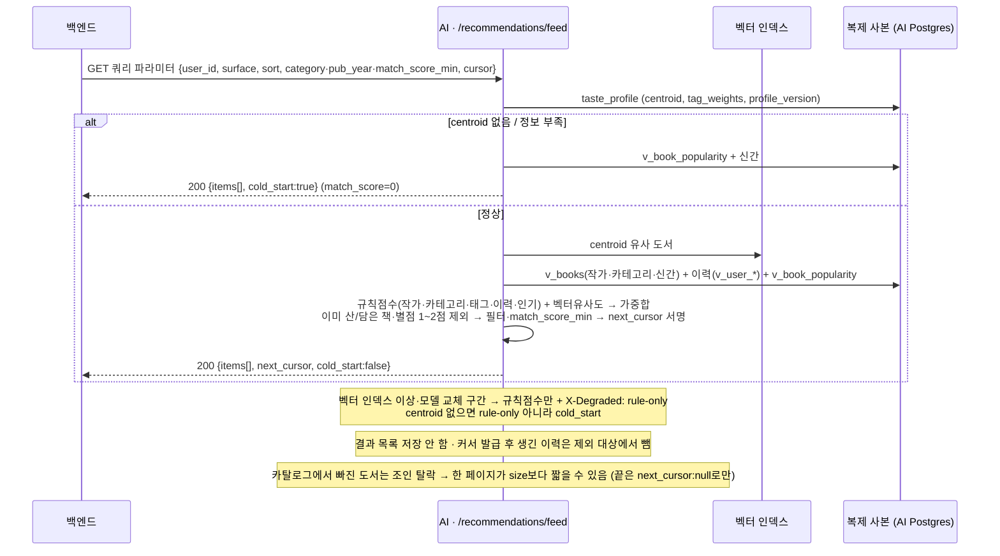

- **읽기**: `taste_profile`, `v_books`, `v_user_purchases`/`library`/`reviews`, `v_book_popularity`, `book_embeddings` — 전부 복제 사본
- **쓰기**: 없음 · **LLM**: 안 씀 · **이유 문구**: 없음 (순서 + `match_score`만, 긴 이유는 ③에서만)
- **요청**: 요청 본문 없이 쿼리 파라미터만 받는다 — `user_id`·`surface`·`sort`·`category`·`pub_year_from`·`pub_year_to`·`match_score_min`·`size`·`cursor`가 허용 목록 전부이고 그 밖의 키는 400 · **응답 헤더**: `Cache-Control: private, no-store`

## ⑤ `POST /preferences/extractions` (V2 · 야간 배치)

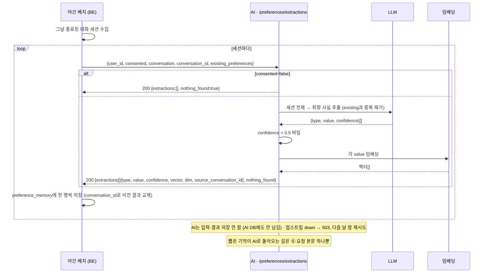

- **읽기**: 없음 (대화는 요청 본문)
- **쓰기**: **없음** — 반환만. `preference_memory` 저장은 BE 몫

## ⑥ `POST /preferences/profile`

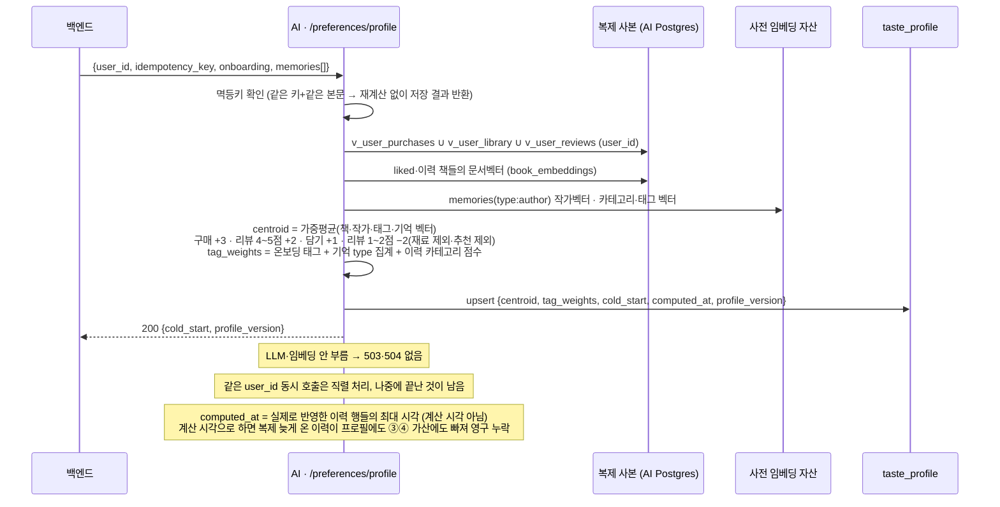

- **읽기**: `v_user_purchases`/`library`/`reviews`(복제 사본), `book_embeddings`, 사전 임베딩 자산, (요청 본문) `onboarding`·`memories`
- **쓰기**: `taste_profile` (upsert), 멱등키 기록
- **트리거**: 온보딩 완료 · 취향 기억 변경 — 그 외엔 호출 안 함 (이후 이력은 ③④가 `computed_at` 기준으로 그 자리에서 더함)

## ⑦ `POST /agent/act` (V2)

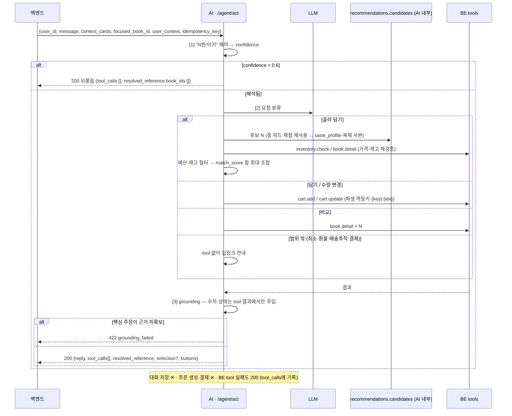

- **읽기**: `taste_profile` (candidates 경유, 복제 사본), BE tool로 장바구니·재고·도서 메타
- **쓰기**: 멱등키 기록 — 장바구니 변경은 AI가 직접 안 함, **BE tool 호출로만** (BE가 `user_id`로 권한·재고 재확인)

## ⑧ `GET /health`

입력 없음. 각 구성요소(`gateway`·`database`·`vector_index`·`llm`·`embedding`) 상태를 취합해 `200 {status, version, replication_lag_seconds, components}` 반환.

- 일부 장애면 `status: degraded`, 서버 전체 응답 불능이면 `503 {"status":"down"}` (envelope 없음). 인증 없이 내부망에서만 노출.
- `replication_lag_seconds`(BE MySQL → AI Postgres 복제 지연, 초, 측정 불가면 null)는 `components` 밖에 있고 **`status`를 바꾸지 않는다** — 복제가 밀렸다고 인스턴스가 로드밸런서에서 빠지면 안 되므로. `lag > N`으로 지연을, `null이 계속됨`으로 복제 중단을 잡는다.
- `components.database`는 **AI Postgres**이지 BE MySQL 상태가 아니다.

---

## 시나리오 흐름

### 시나리오 A — 검색 0건 → 대화형 추천 전환

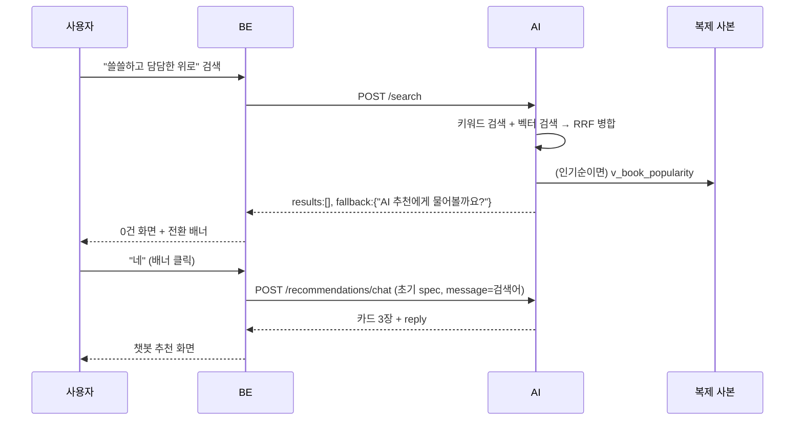

### 시나리오 B — 온보딩 완료 → 프로필 생성 → 홈 피드

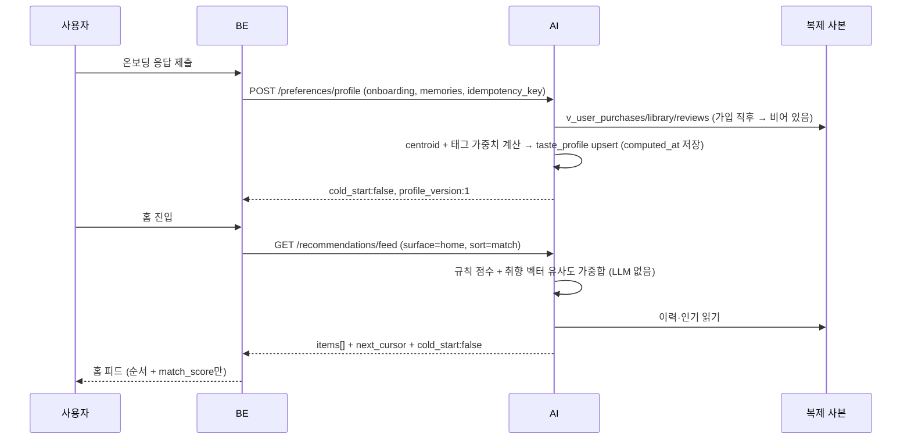

### 시나리오 C — 대화형 추천 한 턴 (정상 / LLM 장애)

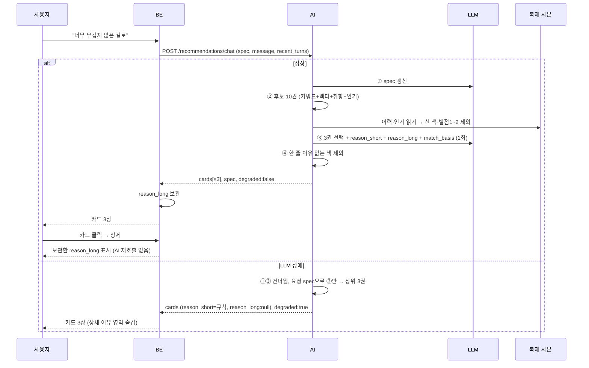

### 시나리오 D — 표지 사진 인식 (V2)

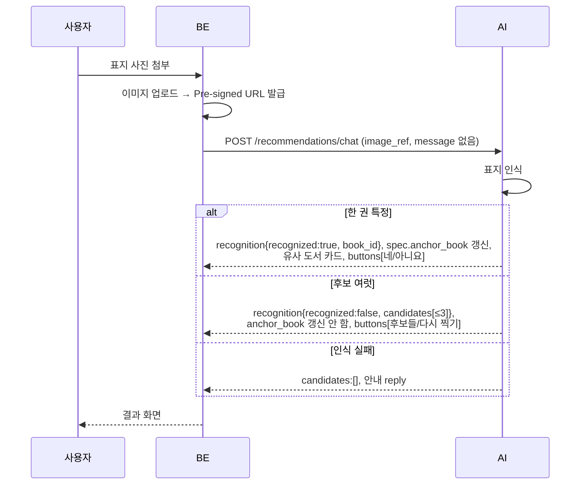

### 시나리오 E — 야간 배치 취향 추출 (V2)

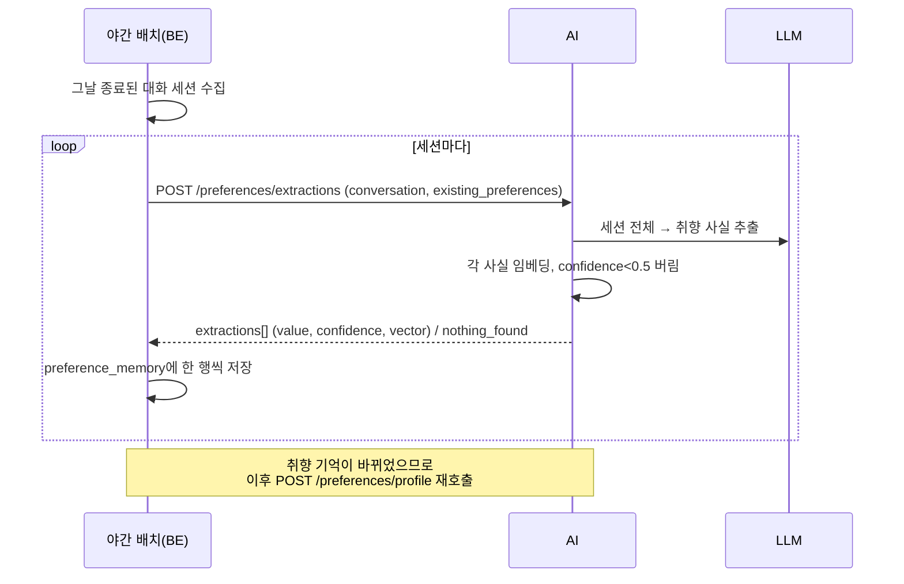

### 시나리오 F — 쇼핑 에이전트 "3만원 안에서 2권 골라 담아줘" (V2)

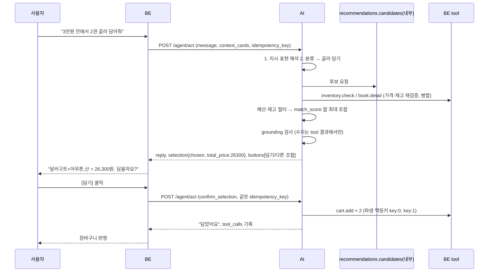

### 시나리오 G — 프로필 이후 생긴 이력이 다음 추천에 반영되는 원리

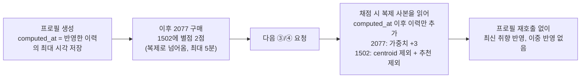

- `computed_at`이 **계산 시각**이 아니라 **반영한 이력 행의 최대 시각**인 이유가 여기 있다 — 복제가 계산 시점 이후에 도착한 이력도, 그 행의 실제 시각이 `computed_at`보다 뒤이므로 다음 채점에서 빠짐없이 더해진다.
