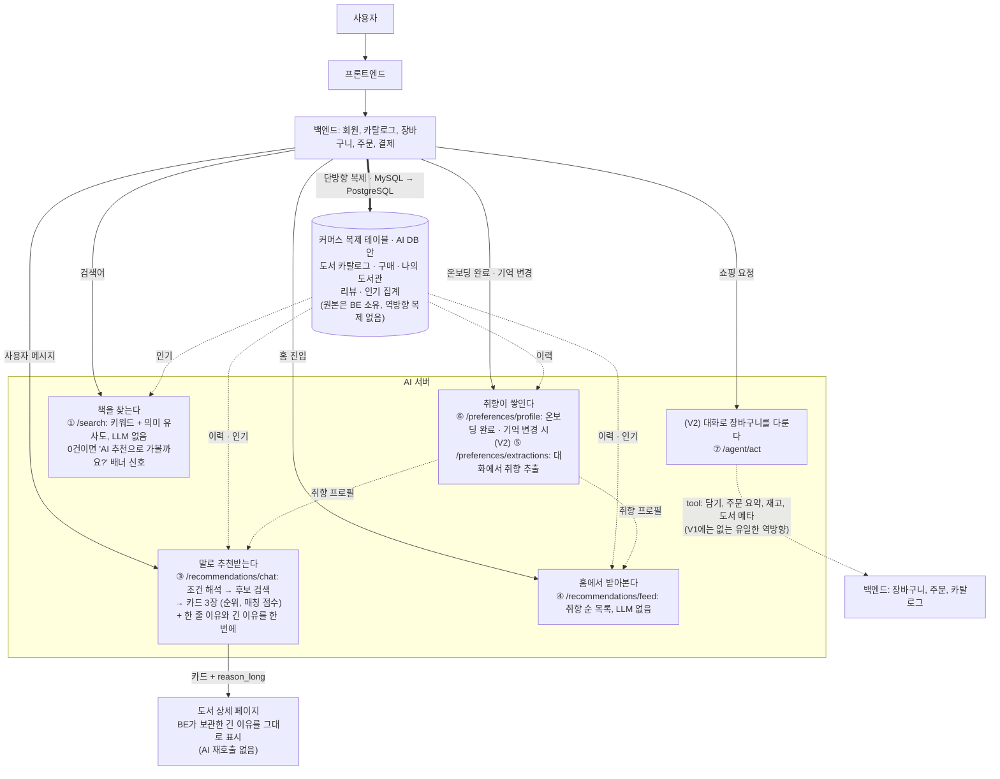

책 커머스 "북적북적"의 AI 서버 API 명세다.


## **목차**

1. 엔드포인트 목록
2. 입력/출력 형식 명세
3. 서비스 구조에서의 역할과 연동
4. API 호출 예시와 예시 응답
5. 공통 규약

## **1. 엔드포인트 목록**

**BE → AI**. 백엔드가 호출한다.

| # | 메서드/경로 | 기능 | 버전 |
| --- | --- | --- | --- |
| ① | POST /search | 검색어로 도서를 조회한다. 키워드 검색과 벡터 검색 순위를 합친다. 결과가 0건이면 대화형 추천으로 전환하라는 신호를 함께 반환한다 | V1 |
| ② | POST /embeddings | 글을 벡터로 바꾼다. 검색어와 도서 정보 모두 이 API를 쓴다(내부 전용) | V1 |
| ③ | POST /recommendations/chat | 챗봇이 대화로 책을 추천한다. 사용자 메시지를 읽어 추천 조건을 갱신하고 카드를 최대 3장 준다. 카드마다 한 줄 이유와 상세 페이지용 긴 이유를 한 번의 LLM 호출로 함께 만든다. (V2) 사진을 보내면 같은 요청에서 표지를 인식한다 | V1 (이미지 턴 V2) |
| ④ | GET /recommendations/feed | 사용자 취향 프로필로 개인화 추천 목록을 만든다. 검색어를 받지 않는다 | V1 |
| ⑤ | POST /preferences/extractions | 밤에 한 번, 그날 끝난 대화에서 취향을 뽑아낸다(동의한 사용자만) | V2 |
| ⑥ | POST /preferences/profile | 온보딩 응답과 취향 기억으로 취향 프로필을 생성한다. 구매·도서관·리뷰는 아래 복제 테이블에서 직접 읽는다. 호출할 때마다 전체를 다시 계산한다 | V1 |
| ⑦ | POST /agent/act | 사용자 메시지에서 쇼핑 의도를 해석해 백엔드 tool을 실행한다 | V2 |
| ⑧ | GET /health | 서버와 구성 요소의 가용 상태를 반환한다 | 공통 |

**AI → BE**. 반대 방향의 **호출**은 엔드포인트가 아니라 **tool**이다 (V2 쇼핑 에이전트 전용). 호출 외에 ⑤의 `extractions[]`와 ③의 `reason_long`이 **응답 본문**으로 나가 BE가 저장한다. **DB 복제는 BE→AI 한 방향뿐이고 역방향 복제 채널은 없다.**

| tool | 기능 | 성격 | 제약 |
| --- | --- | --- | --- |
| cart.add | 장바구니 담기 | 쓰기 | 멱등 키 필수. 재고, 권한은 BE가 다시 확인 |
| cart.update | 장바구니 수량 변경, 삭제(수량 0 = 삭제) | 쓰기 | 멱등 키 필수. 본인 장바구니만 |
| cart.view | 장바구니 목록 요약(썸네일, 수량, 합계) | 읽기 | 본인만 |
| order.preview | 주문 초안 요약(수량, 배송지, 결제수단, 금액). 주문을 생성하지 않는다 | 읽기 | 본인만 |
| inventory.check | 재고 조회 | 읽기 |  |
| delivery.track | 배송 조회 | 읽기 | 본인 주문만 |
| book.detail | 도서 정보 조회(가격, 별점, 재고, 소개). 비교, 담기 요청에서 수치 근거로 씀 | 읽기 |  |
- **`recommendations.candidates`는 BE tool이 아니다.** 쇼핑 에이전트가 “예산 안에서 N권” 같은 요청에서 후보를 고를 때 쓰는 AI 서버 안의 모듈이고, 홈 피드와 같은 점수 계산을 재사용한다. `tool_calls[]`에 기록은 되지만 BE로 나가는 호출은 아니다.
- **인증**. AI→BE tool 호출은 방향 전용 서비스 토큰으로 인증하고, 누구 장바구니인지는 BE가 `user_id`로 tool마다 다시 확인한다. “본인만”, “본인 주문만”은 그 확인을 뜻한다.

---

## 용어

> 이 문서에서만 쓰는 말과, 뜻을 좁혀 쓴 말만 모았다.
> 

| 용어 | 뜻 |
| --- | --- |
| 턴(turn) | 사용자 메시지 한 번과 그에 대한 응답 한 번. 텍스트 턴 = 글, 이미지 턴 = 사진 |
| spec(추천 조건) | 챗봇이 지금까지 파악한 추천 조건. 6개 키를 가진 객체다. 서버가 대화를 저장하지 않으므로 클라이언트가 매번 함께 보내고 돌려받는다 |
| 공통 응답 형식(envelope) | 모든 응답을 같은 모양으로 감싼다. { message, data } |
| 커서(cursor) | 목록에서 “여기까지 봤다”를 가리키는 표식. 서버가 만들어 주며 클라이언트는 내용을 해석하지 않고 그대로 되돌려 보낸다 |
| 멱등 키(idempotency key) | 같은 요청이 재시도로 두 번 와도 한 번만 실행되게 하는 키 |
| 축소 응답(degraded) | 일부 기능이 죽었을 때 에러를 내지 않고 기능을 줄여서라도 정상(200)으로 응답하는 것. X-Degraded 헤더로 알린다 |
| 업스트림(upstream) | AI 서버가 호출하는 외부 모델 서비스(LLM, 임베딩) |
| centroid(취향 벡터) | 사용자 취향을 대표하는 벡터. 좋아한 책, 태그, 기억 벡터의 가중평균이다 |
| Pre-signed URL | 만료 시간이 있는 임시 접근 URL. 이미지 업로드에 쓴다 |
| tool | AI가 백엔드에 요청하는 기능 단위(장바구니 담기 등). V2 쇼핑 에이전트 전용 |
| 복제 테이블 | BE MySQL의 커머스 데이터를 AI PostgreSQL로 단방향 복제한 사본. 도서 카탈로그, 구매, 나의 도서관, 리뷰, 인기 집계. 원본의 주인은 BE이고 AI는 자기 사본을 읽기만 한다. 이름의 `v_` 접두사는 표기일 뿐 view가 아니다 |
| 복제 지연(lag) | BE 원본의 변경이 AI 복제본에 도착하기까지의 시간. 지연 중에는 아직 도착하지 않은 행이 있을 수 있다. 오류가 아니고 축소 응답도 아니다 |
| 신선도 예산 | 복제본이 원본보다 얼마나 늦어도 되는지 테이블마다 정한 값. ERD §3에 전체 목록이 있다 |
| 이력 | 한 사용자의 구매, 나의 도서관 담기, 리뷰를 묶어 부르는 말. 피드 규칙 점수의 항 이름이기도 하다 |
| 인기 | 도서 단위 집계값. 최근 판매 수와 리뷰 평점·건수 둘뿐이다. v_book_popularity 하나에서만 읽는다 |

---

## **2. 입력/출력 형식 명세**

### **① AI 검색: `POST /search`**

> 키워드 검색과 벡터 검색을 각각 수행한 뒤 두 순위를 RRF로 합쳐 최종 순위를 만든다. LLM을 호출하지 않는다. 요청에 담긴 필터와 정렬만 적용하며, 검색어에서 조건을 추출하지 않는다.
> 

#### **입력**

```json
{
  "query": "김영하 여행의 이유",
  "filters": {
    "category": "에세이",
    "price_min": 10000,
    "price_max": 20000,
    "pub_year_from": 2020,
    "pub_year_to": 2026,
    "in_stock_only": true
  },
  "sort": "relevance",
  "cursor": null,
  "size": 15
}
```

| 필드 | 타입 | 필수 | 설명 |
| --- | --- | --- | --- |
| query | string | Y | 검색어. 1–200자 |
| filters | object | N | 조회 조건. 이 값만 적용하고 검색어에서 조건을 추출하지 않는다 |
| filters.category | string | N | 카테고리명 |
| filters.price_min, .price_max | int | N | 판매가 구간(원) |
| filters.pub_year_from, .pub_year_to | int | N | 출간연도 구간 |
| filters.in_stock_only | bool | N | 품절 도서 제외 |
| sort | enum | N | relevance(기본, 관련도), newest, price_asc, price_desc, popular(판매·리뷰 집계) |
| cursor | string? | N | 페이지 커서. 직전 응답의 next_cursor를 그대로 싣는다. 첫 턴은 생략. 30분 지나면 만료 |
| size | int | N | 한 페이지 개수. 기본 15, 최대 50 |

#### **출력 (200)**

```json
{
  "message": "search_success",
  "data": {
    "results": [
      {
        "book_id": 2077,
        "title": "여행의 이유",
        "author": "김영하",
        "publisher": "문학동네",
        "price": 13500,
        "in_stock": true,
        "cover_url": "https://…/2077.jpg"
      }
    ],
    "next_cursor": "eyJ…(서명됨)",
    "fallback": null
  }
}
```

**0건 응답**. 대화형 추천으로 전환할 수 있다는 신호를 함께 반환한다. 서버는 전환을 수행하지 않는다.

```json
{
  "message": "search_success",
  "data": {
    "results": [],
    "next_cursor": null,
    "fallback": {
      "message": "원하는 책을 못 찾았어요. AI 추천에게 물어볼까요?"
    }
  }
}
```

| 필드 | 타입 | 설명 |
| --- | --- | --- |
| results | object[] | 검색 결과. 없으면 [] |
| results[].book_id | int | 도서 ID |
| results[].title, .author, .publisher | string | 제목, 저자, 출판사 |
| results[].price | int | 판매가(원). 할인 적용 후 |
| results[].in_stock | bool | 재고 여부 |
| results[].cover_url | string | 표지 이미지 URL |
| next_cursor | string? | 다음 페이지 커서. 마지막이면 null. 다음 요청의 cursor에 그대로 싣는다 |
| fallback | object? | 결과가 0건일 때만 값이 있고 그 외 null |
| fallback.message | string | 호출자에게 전달할 안내 문구 |

#### **응답 코드**

| 상태 | message | 언제 |
| --- | --- | --- |
| 400 | invalid_request | 형식, 길이, 범위 위반(query 1–200자, size 최대 50 등) |
| 401 | unauthorized | 서비스 토큰 없음, 불일치 |
| 410 | cursor_expired | 커서가 만료됐거나, 검색어, 필터, 정렬, 축소 모드가 커서 발급 시점과 다름. 첫 페이지부터 다시 요청 |
| 429 | rate_limited | 호출 한도 초과. Retry-After 헤더(대기 초)를 함께 보냄 |
| 500 | internal_server_error | 서버 내부 오류. 키워드, 벡터 검색이 둘 다 안 될 때(AI Postgres 장애 등)도 500. BE MySQL 장애는 해당하지 않는다 |
| 200 | search_success, X-Degraded: keyword-only | 벡터 검색 불가. 키워드 검색 결과만 반환한다. 임베딩 업스트림 장애, 벡터 인덱스 이상, 초기 적재 중일 때 나온다. 복제 지연·행 부재는 해당하지 않는다 |
- `popular`(인기순)은 `v_book_popularity`의 최근 판매 수와 리뷰 평점·건수로 산출한다. 챗봇의 후보 채점, 피드의 인기 항, cold_start 목록도 같은 테이블을 읽는다.
- 검색은 개인화하지 않으므로 사용자 이력(구매, 도서관, 리뷰)을 읽지 않는다. 누가 검색하든 같은 순위다. 인기는 사용자와 무관한 도서 단위 값이라 이 원칙을 깨지 않는다.

---

### **② 텍스트 임베딩: `POST /embeddings`**

> 텍스트를 벡터로 변환한다. 내부 전용이며 검색어와 도서 정보 모두 이 API를 쓴다. 한 번에 최대 256건이므로 대량 적재는 나눠서 호출한다.
> 
> 
> 벡터 길이는 응답의 `dim`으로 알려준다. 호출자는 이 값이 자신이 쓰는 벡터 인덱스의 차원과 같은지 확인한 뒤 저장해야 한다.
> 
> 예시의 `dim`과 `model`은 자리표시자다. 확정 차원은 ERD §7을 따른다.
> 

#### **초기 적재**

서비스 시작 시점과 임베딩 모델 교체 시점에 카탈로그 전체의 벡터를 한 번에 만든다.

1. BE 카탈로그가 `v_books`로 전량 복제된다. **복제가 끝나기 전에는 임베딩을 만들지 않는다** — 대상 목록이 확정되지 않는다.
2. `description`이 있는 행을 `book_id` 순으로 256건씩 나눠 호출한다. 카탈로그 N권이면 `ceil(N / 256)`회.
3. 응답의 `dim`을 확인한 뒤 `book_embeddings`에 upsert한다. `description`이 없는 도서는 벡터 검색 대상에서 빠지고 키워드 검색으로만 조회된다.
4. 중단되면 행이 없는 `book_id`부터 다시 시작한다. upsert라 중복 실행이 결과를 바꾸지 않는다.

적재 중에도 검색은 응답한다. 벡터 결과가 부족한 동안 `X-Degraded: keyword-only`가 나가며, 이는 임베딩 장애 때와 같은 상태라 BE가 추가로 할 일은 없다. 신간도 복제 후 같은 절차를 타며, 두 단계를 합친 허용 지연은 `ERD §3의 신선도 예산`을 따른다.

#### **입력**

```json
{ "texts": ["쓸쓸하고 담담한 위로"], "purpose": "query" }
```

| 필드 | 타입 | 필수 | 설명 |
| --- | --- | --- | --- |
| texts | string[] | Y | 임베딩할 텍스트. 1–256개, 각 8,192토큰 이하 |
| purpose | enum | N | query(검색어), document(도서 소개). 기본 document. 용도에 따라 벡터를 다르게 만들기 때문에 구분 |

#### **출력 (200)**

```json
{
  "message": "embed_success",
  "data": {
    "vectors": [[0.0123, -0.0456, "…"]],
    "dim": 1024,
    "model": "bge-m3-2026q3"
  }
}
```

| 필드 | 타입 | 설명 |
| --- | --- | --- |
| vectors | float[][] | 입력과 같은 순서의 벡터 |
| dim | int | 벡터 길이. 호출자가 쓰는 인덱스 차원과 다르면 저장하지 않는다 |
| model | string | 어떤 모델로 만들었는지 기록용. 이 값으로 모델을 고르지는 않는다 (bge-m3-2026q3) |

#### **에러**

| 상태 | message | 언제 |
| --- | --- | --- |
| 400 | invalid_request | texts 개수, 길이 한도 위반 등 형식 오류 |
| 401 | unauthorized | 서비스 토큰 없음, 불일치 |
| 413 | payload_too_large | 요청 본문이 약 4MB 초과 |
| 429 | rate_limited | 호출 한도 초과. Retry-After 헤더(대기 초)를 함께 보냄 |
| 500 | internal_server_error | 서버 내부 오류 |
| 503 | upstream_unavailable | 외부 임베딩 업스트림 장애, 한도. Retry-After 뒤 재시도 |

---

### **③ 대화형 도서 추천: `POST /recommendations/chat`**

> 사용자 메시지로 추천 조건(spec)을 갱신하고 그 조건으로 도서를 조회한다. 갱신된 조건, 추천 카드 최대 3장, 답변 문장을 함께 반환한다.
> 
> 
> **카드의 한 줄 이유(`reason_short`)와 상세 페이지용 긴 이유(`reason_long`)를 한 번의 LLM 호출로 함께 만든다.** 상세 페이지를 열 때 이유를 다시 생성하는 별도 엔드포인트는 두지 않는다. 카드를 고른 근거와 이유 문장이 같은 호출에서 나오므로 둘이 어긋나지 않고, 상세 진입에 LLM 지연이 없으며, 이유 캐시 테이블과 그 만료, 권한 규칙이 통째로 사라진다. 대신 사용자가 열어 보지 않는 카드의 긴 이유도 만들게 되어 턴당 출력 토큰이 늘어난다. **긴 이유의 보관은 BE 몫이다** — 카드와 함께 받아 두었다가 상세 페이지에서 그대로 쓴다.
> 
> (V2) image_ref가 있으면 이미지 요청으로 처리한다. message와 배타이며, 표지를 인식해 recognition을 채우고 spec.anchor_book을 갱신한다. 인식 전용 엔드포인트는 두지 않는다.
> 
> 서버는 대화를 저장하지 않는다. V1에서는 호출자가 spec과 최근 대화를 요청마다 실어 보낸다. V2에서는 백엔드가 대화 스레드를 보관한다.
> 

#### 처리(참고)

1. 이번 메시지로 spec을 갱신한다. LLM이 한다
2. 갱신된 spec으로 후보 10권을 뽑는다. 키워드와 벡터 순위를 합치고 취향 유사도로 점수를 매긴다. 취향은 취향 프로필에 **프로필이 반영한 이력 이후에 생긴 이력**(구매, 담기, 리뷰)을 더한 것이고, 인기는 `v_book_popularity`에서 읽는다. 이미 산 책과 별점 1–2점을 준 책은 후보에서 뺀다
3. LLM이 후보 중 3권을 고르고 카드마다 한 줄 이유(`reason_short`), 긴 이유(`reason_long`), 근거(`match_basis`)를 **한 번의 호출로** 쓴다. 고른 순서가 곧 rank이며,
match_score는 후보 점수 그대로라 내림차순이 아닐 수 있다
4. 한 줄 이유를 못 만든 책은 뺀다. 그래서 3장보다 적을 수 있다. 긴 이유만 비면 카드는 남기고 `reason_long: null`로 둔다(BE는 상세 페이지의 이유 영역을 숨긴다)

LLM 장애면 1과 3을 건너뛰고 요청의 spec으로 2만 돌려 점수 상위 3권을 낸다. degraded: true. 이때 `reason_short`는 규칙으로 만들고 `reason_long`은 `null`이다

#### **입력**

```json
{
  "user_id": 123,
  "consented": true,
  "spec": { "…": "현재 추천 조건(6키 전체)" },
  "message": "너무 무겁지 않은 걸로",
  "recent_turns": [{ "role": "user", "text": "비 오는 날 읽을 책 추천해줘" }],
  "exclude_book_ids": [4021],
  "image_ref": null
}
```

| 필드 | 타입 | 필수 | 설명 |
| --- | --- | --- | --- |
| user_id | int | Y | 사용자 ID |
| consented | bool | Y | 취향 수집 동의 여부. false면 (V2) 대화에서 취향을 뽑지 않음. V1에서는 동작에 영향 없음 |
| spec | object | Y | spec(추천 조건 객체, 6개 키). 서버가 대화를 저장하지 않으므로 클라이언트가 직전 응답의 spec을 그대로 돌려보내야 대화가 이어짐(V2는 BE가 보관). 첫 턴은 초기 spec |
| message | string | N | 이번 턴의 사용자 메시지. 1–200자. 텍스트 턴에는 필수, 이미지 턴(image_ref 있음)에는 보내지 않음 |
| recent_turns | object[] | N | 최근 대화(role, text). 서버가 대화를 기억하지 않아 매 턴 같이 보냄. 최대 20턴(초과분은 최근 20턴만 사용), text 각 200자 이하 |
| exclude_book_ids | int[] | N | 이 대화에서 이미 보여준 도서 ID. 같은 책이 또 나오지 않게 검색에서 제외(사용자가 뺀 spec.exclude와 합쳐서) |
| image_ref | string? | N | (V2) 표지 사진의 Pre-signed URL(BE가 업로드 후 발급). 1장, JPG, PNG, 10MB 이하. 있으면 이미지 턴이 됨 |

**`spec` 스키마**. 서버가 이 형식을 검증한다.

```json
{
  "intent": "semantic",
  "exact": { "title": null, "author": null, "publisher": null },
  "filters": {
    "category": "에세이",
    "price_max": 20000,
    "in_stock_only": true
  },
  "semantic": "비 오는 날 카페에서 읽을 잔잔한 책",
  "anchor_book": null,
  "exclude": [4021]
}
```

**6개 키는 요청, 응답 모두 항상 존재한다.** 빈 값은 `null`, `{}`, `[]`로 채운다. 아래 **초기 spec**이 그 기본형이다.

| 키 | 타입 | 필수 | 설명 |
| --- | --- | --- | --- |
| intent | enum | Y | exact(제목, 저자를 지정한 요청), semantic(분위기, 상황 요청) |
| exact.title, .author, .publisher | string? | Y | 지정된 제목, 저자, 출판사. 없으면 null |
| filters | object | Y | 검색 API와 같은 필터 키. 재고 조건은 in_stock_only |
| semantic | string? | Y | 분위기, 상황 설명 문장 |
| anchor_book | int? | Y | 기준 도서 ID(“이 책과 비슷한”). 이미지 턴에서 인식된 책이 들어감 |
| exclude | int[] | Y | 사용자가 직접 뺀 도서 ID |

**초기 spec**. 새 스레드의 첫 턴, 그리고 422 이후 초기화할 때 BE가 보내는 값이다.

```json
{
  "intent": "semantic",
  "exact": { "title": null, "author": null, "publisher": null },
  "filters": {},
  "semantic": null,
  "anchor_book": null,
  "exclude": []
}
```

#### **출력 (200). 일반 추천 턴**

```json
{
  "message": "recommend_success",
  "data": {
    "reply": "비 오는 날 분위기에 맞춰 골라봤어요.",
    "spec": { "…": "갱신된 추천 조건(6키 전체)" },
    "recognition": null,
    "cards": [
      {
        "book_id": 1088,
        "rank": 1,
        "match_score": 87,
        "title": "달러구트 꿈 백화점",
        "author": "이미예",
        "price": 12420,
        "cover_url": "https://…/1088.jpg",
        "reason_short": "비 오는 날의 차분한 분위기와 어울리는 따뜻하고 가벼운 판타지예요.",
        "reason_long": "비 오는 날에 어울리는 책을 찾으셨죠. 꿈을 사고파는 상점이라는 설정을 따뜻한 문장으로 풀어내서, 창밖 빗소리와 같이 읽기 좋아요. 한 편이 짧게 끊겨 부담 없이 읽히고, 말씀하신 가격대도 넘지 않습니다.",
        "match_basis": [
          { "label": "분위기", "detail": "잔잔함" },
          { "label": "가격", "detail": "조건 충족" }
        ]
      }
    ],
    "followup": null,
    "buttons": [],
    "degraded": false
  }
}
```

> **`buttons`, `degraded`는 V1 일반 턴에도 항상 존재한다.** 일반 턴은 보통 `buttons: []`, `degraded: false`.
> 

#### **출력 (200). 이미지 턴 (`image_ref` 있음) (V2)**

표지를 한 권으로 특정한 경우. 도서 소개 문장, 유사 도서 카드, 후속 동작 목록을 함께 반환한다.

```json
{
  "message": "recommend_success",
  "data": {
    "reply": "이 책은 《달러구트 꿈 백화점》(이미예)예요. 잠든 사이 꿈을 사고파는 상점 이야기예요. 비슷한 결의 책도 함께 골라봤어요.",
    "spec": { "…": "anchor_book이 1088로 갱신된 추천 조건" },
    "recognition": { "recognized": true, "book_id": 1088, "candidates": [] },
    "cards": [{ "book_id": 4021, "rank": 1, "…": "일반 턴과 같은 카드 형식" }],
    "followup": null,
    "buttons": [
      { "label": "네", "action": "library_add", "book_id": 1088 },
      { "label": "아니요", "action": "dismiss" }
    ],
    "degraded": false
  }
}
```

**인식 후보가 여럿인 경우**. 확정하지 않고 후보를 최대 3개 제시해 사용자가 고르게 한다.

```json
{
  "message": "recommend_success",
  "data": {
    "reply": "이 책이 맞을까요? 비슷한 표지가 몇 권 있어요.",
    "spec": { "…": "anchor_book은 아직 갱신하지 않은 추천 조건(null 유지)" },
    "recognition": {
      "recognized": false,
      "book_id": null,
      "candidates": [
        {
          "book_id": 1088,
          "title": "달러구트 꿈 백화점",
          "author": "이미예",
          "cover_url": "https://…/1088.jpg",
          "confidence": 0.62
        },
        {
          "book_id": 4021,
          "title": "…",
          "author": "…",
          "cover_url": "…",
          "confidence": 0.55
        }
      ]
    },
    "cards": [],
    "followup": null,
    "buttons": [
      {
        "label": "달러구트 꿈 백화점",
        "action": "confirm_book",
        "book_id": 1088
      },
      { "label": "다시 찍기", "action": "retake" }
    ],
    "degraded": false
  }
}
```

인식 실패면 200에 `candidates: []`와 안내 `reply`로 응답한다.

| 필드 | 타입 | 설명 |
| --- | --- | --- |
| reply | string | 말풍선 1–2문장(이미지 턴은 책 소개). 최대 200자. 스트리밍 시 이 필드만 흘려보냄 |
| spec | object | 업데이트된 spec(6개 키). 다음 턴 요청에 그대로 싣는다 |
| cards | object[] | 추천 카드 최대 3장, 배열 순서가 순위. 한 줄 이유를 못 만든 책은 뺌(긴 이유만 비면 카드는 남고 reason_long이 null). 이미지 턴은 책이 매칭된 경우(recognized: true)에만 채우고 그 외 [] |
| cards[].book_id | int | 도서 ID |
| cards[].rank | int | 추천 순위 1–3. 배열 순서와 같다 |
| cards[].match_score | int | 매칭 점수 0–100. 이번 요청 조건(spec.semantic) 유사도와 취향 유사도(취향 프로필 + 프로필 이후의 이력)를 함께 쓴다. 개인화 추천 목록의 점수와 계산식이 다르다 |
| cards[].title, .author | string | 제목, 저자 |
| cards[].price | int | 판매가(원) |
| cards[].cover_url | string | 표지 이미지 URL |
| cards[].reason_short | string | 한 줄 추천 이유(카드용). 최대 80자. 근거 없는 내용은 넣지 않음 |
| cards[].reason_long | string? | 긴 추천 이유(도서 상세 페이지용) 2–4문장, 최대 300자. reason_short와 같은 LLM 호출에서 같은 근거로 만든다. 못 만들면 null(degraded일 때 포함) |
| cards[].match_basis | object[] | 근거 항목 {label, detail}. 두 이유 문장과 같은 근거다 |
| followup | string? | 텍스트 턴에서 카드가 없으면 되묻는 문장, 있으면 null. 이미지 턴은 항상 null(안내는 buttons로) |
| buttons | object[] | 호출자가 제시할 후속 동작 목록. 없으면 []. action 값은 5장 action 표 참고 |
| recognition | object? | 이미지 턴에만 값이 있고 그 외 null |
| recognition.recognized | bool | 카탈로그의 책 한 권으로 매칭했는지 |
| recognition.book_id | int? | 매칭된 도서 ID. 못 하면 null. 나의 도서관 추가 여부는 BE가 이 값으로 판단 |
| recognition.candidates | object[] | recognized: false일 때 후보 최대 3개, confidence 내림차순. 항목: book_id, title, author, cover_url, confidence(0–1, 내부 판정용). 그 외 [] |
| degraded | bool | true면 LLM 장애로 규칙만으로(직전 조건으로 검색만) 만든 응답. 다른 API는 헤더로 알리지만 이 API는 스트리밍 때문에 본문에 넣음 |
- **긴 이유는 이 응답이 마지막 생성 지점이다.** AI 서버는 카드를 캐시하지 않으므로, BE가 `reason_long`을 카드와 함께 보관했다가 상세 페이지에서 그대로 보여준다. 같은 책을 다시 상세로 열어도 AI를 부르지 않는다.
- 두 이유는 같은 근거(`match_basis`)에서 나온다. 한 줄 이유는 카드 한 줄, 긴 이유는 그 근거를 질의와 취향에 붙여 2–4문장으로 푼 것이다.
- **이력과 인기는 요청에 담기지 않는다.** 서버가 `user_id`로 `v_user_purchases`, `v_user_library`, `v_user_reviews`를, book_id로 `v_book_popularity`를 복제 테이블에서 직접 읽는다. 호출자가 모아 보낼 것이 없다. 복제 지연만큼 값이 늦게 반영될 수 있으며 그건 오류가 아니다(ERD §3 신선도 예산).
- 표지를 읽지 못한 경우와 읽었으나 카탈로그에 없는 경우를 구분하지 않는다. 두 경우 모두 같은 안내 reply를 반환한다.

#### **에러**

| 상태 | message | 언제 |
| --- | --- | --- |
| 400 | invalid_request | 형식, 길이 위반. message와 image_ref가 둘 다 있거나 둘 다 없어도 400 |
| 401 | unauthorized | 서비스 토큰 없음, 불일치 |
| 422 | spec_schema_violation | 요청의 spec이 형식 위반. 호출자가 초기 spec으로 되돌려 1회 재시도 |
| 429 | rate_limited | 호출 한도 초과. Retry-After 헤더(대기 초)를 함께 보냄 |
| 500 | internal_server_error | 서버 내부 오류 |
| 503 | upstream_unavailable | 업스트림 LLM 장애, 한도. Retry-After 뒤 재시도 |
| 504 | generation_timeout | 생성 30초 초과. 재시도 안내 |
| 404 | image_not_found | (V2) image_ref로 이미지를 못 찾음(URL 만료 포함) |
| 413 | payload_too_large | (V2) 이미지 10MB 초과. 재촬영, 압축 안내 |
| 422 | image_unreadable | (V2) 이미지가 깨졌거나 JPG, PNG 외 형식 |

---

### **④ 개인화 추천 목록: `GET /recommendations/feed`**

> 취향 프로필로 개인화 추천 목록을 만든다. 검색어를 받지 않는다. 점수는 규칙 기반 점수(작가, 카테고리, 태그, 이력, 인기)와 취향 벡터 유사도의 가중합이며 LLM을 호출하지 않는다.
> 
> 
> 규칙 점수의 두 항은 각각 출처가 있다. **이력**은 `v_user_purchases`, `v_user_library`, `v_user_reviews`를 `user_id`로 읽은 것이고, **인기**는 `v_book_popularity`(최근 판매 수, 리뷰 평점·건수)다. 둘 다 요청에 담기지 않고 서버가 복제 테이블에서 읽는다. 행이 없는 도서는 인기 항 0점으로 계산한다.
> 
> 개인화가 없는 판매량 순위 목록은 이 API의 범위가 아니다.
> 
> 서버는 결과 목록을 보관하지 않는다. 커서는 이어 붙일 위치만 담으며 같은 순서의 재현을 보장하지 않는다. 프로필이나 인기 집계가 바뀌면 갱신된 값으로 이어 붙인다. 커서 발급 이후에 생긴 조회, 구매 이력은 제외 대상에서 뺀다.
> 

#### **입력**

쿼리 파라미터로 받는다. 요청 본문은 없다.

```
# 첫 요청 또는 정렬, 필터를 바꿔 처음부터 다시 조회. cursor 없음
GET /recommendations/feed?user_id=123&surface=home&sort=match&size=15

# 이어서 조회. 직전 응답의 next_cursor를 그대로 싣는다(값은 URL 인코딩)
GET /recommendations/feed?user_id=123&surface=recommend_more&sort=match
    &category=에세이&pub_year_from=2020&match_score_min=70&size=15&cursor=eyJ…
```

| 파라미터 | 타입 | 필수 | 설명 |
| --- | --- | --- | --- |
| user_id | int | Y | 사용자 ID. 비로그인은 호출 안 함 |
| surface | enum | Y | 요청 맥락. home은 정렬, 필터를 받지 않고 recommend_more는 받는다 |
| sort | enum | N | 정렬 기준. match(기본), newest, price_asc. surface가 recommend_more일 때만 유효 |
| category | string | N | 필터. 카테고리명 |
| pub_year_from, pub_year_to | int | N | 필터. 출간연도 구간 |
| match_score_min | int | N | 필터. 매칭 점수 하한 0–100. 이 값 미만은 목록에서 제외한다 |
| size | int | N | 한 페이지 개수. 기본 15, 최대 50 |
| cursor | string? | N | 페이지 커서. 직전 응답의 next_cursor 그대로. 첫 턴은 생략. 30분 만료 |
- **위 아홉 개가 허용 파라미터 전부이며, 그 밖의 키가 오면 400이다.**(`pub_year_from`과 `pub_year_to`는 표에서 한 행이지만 별개 파라미터다.) 필터 세 종류(`category`, 출간연도 구간, `match_score_min`)는 `surface`가 `recommend_more`일 때만 유효하다.
- 값은 **URL 인코딩**해서 싣는다. 특히 `cursor`는 서버가 서명한 문자열이라 `+`·`/`·`=`가 섞이고, `category`는 한글이다.

#### **출력 (200)**

```json
{
  "message": "feed_success",
  "data": {
    "items": [
      {
        "book_id": 3310,
        "title": "아무튼, 산",
        "author": "장보영",
        "price": 9900,
        "cover_url": "https://…/3310.jpg",
        "in_stock": true,
        "match_score": 84
      }
    ],
    "next_cursor": "eyJ…(서명됨)",
    "cold_start": false
  }
}
```

| 필드 | 타입 | 설명 |
| --- | --- | --- |
| items | object[] | 추천 목록. 없으면 [] |
| items[].book_id | int | 도서 ID |
| items[].title, .author | string | 제목, 저자 |
| items[].price, .in_stock | int, bool | 판매가(원), 재고 여부 |
| items[].cover_url | string | 표지 이미지 URL |
| items[].match_score | int | 규칙 점수와 취향 유사도의 가중합, 0–100. 정렬과 필터에 쓴다. cold_start가 true면 0 |
| next_cursor | string? | 다음 페이지 커서. 마지막이면 null |
| cold_start | bool | true면 취향 정보가 없어 개인화를 끄고 인기, 신간으로 채운 목록 |
- **피드 항목에는 추천 이유 문구가 없다.** 순서와 `match_score`만 낸다. 이유는 대화형 추천 카드에서만 나온다(③의 `reason_short`·`reason_long`). 피드가 LLM을 호출하지 않는다는 원칙을 지키기 위해서다.
- 커서 제외 규칙의 ’조회, 구매 이력’은 `v_user_purchases`, `v_user_library`를 말한다. 이미 산 책과 담은 책, 별점 1–2점을 준 책은 목록에서 빼되, 커서 발급 이후에 생긴 것은 제외 대상에서 뺀다(카드를 보고 돌아와 스크롤해도 목록이 밀리지 않게).
- 카탈로그에서 사라진 도서(삭제·비공개)는 `v_books` 조인에서 빠지므로 **한 페이지가 `size`보다 짧을 수 있다.** 짧은 페이지는 목록의 끝이 아니며, 끝은 `next_cursor: null`로만 판정한다.
- 필터 없이 후보가 0건인 경우는 없다. 필터로 0건이면 `items: []`, `next_cursor: null`로 200을 돌려준다. 에러가 아니며 필터를 임의로 풀지 않는다.
- 응답에 `Cache-Control: private, no-store`를 붙인다. 개인화 목록인 데다 서버가 결과를 보관하지 않아 같은 URL이라도 호출할 때마다 본문이 달라진다. 중간 캐시가 응답을 재사용하면 남의 목록이 다른 사용자에게 나갈 수 있다.

#### **응답 코드**

| 상태 | message | 언제 |
| --- | --- | --- |
| 400 | invalid_request | 형식 오류, 허용 목록에 없는 쿼리 파라미터, size 50 초과 |
| 401 | unauthorized | 서비스 토큰 없음, 불일치 |
| 410 | cursor_expired | 커서가 만료됐거나 필터, 정렬, 축소 모드가 발급 때와 다름. 첫 페이지부터 다시 |
| 429 | rate_limited | 호출 한도 초과. Retry-After 헤더(대기 초)를 함께 보냄 |
| 500 | internal_server_error | 서버 내부 오류. 프로필이 없는 건 오류가 아니라 200 + cold_start: true |
| 200 | feed_success, X-Degraded: rule-only | 벡터 조회 불가. 취향 유사도를 빼고 규칙 기반 점수만으로 정렬한다. 벡터 인덱스 이상과 모델 교체 구간에만 나온다. `centroid`가 없으면 이 값이 아니라 `cold_start: true`이고, 복제 지연·행 부재도 해당하지 않는다 |

---

### **⑤ 취향 기억 추출: `POST /preferences/extractions` (V2)**

> **야간 배치**가 그날 활동이 있었던(종료된) 대화 세션을 모아 **세션 단위로** 호출한다. 세션의 메시지 전체를 LLM에 넣어 취향 사실을 뽑고, 각 사실을 임베딩해 벡터와 함께 돌려준다. 저장은 BE가 한다(취향 테이블에 한 행씩). AI 서버는 입력도 결과도 저장하지 않으며 **AI DB에도 남기지 않는다.** 뽑은 기억이 AI로 되돌아오는 경로는 ⑥ 요청 본문 하나뿐이다.
> 

#### **입력**

```json
{
  "user_id": 123,
  "consented": true,
  "conversation": [
    { "role": "user", "text": "비 오는 날 읽을 책 추천해줘" },
    { "role": "assistant", "text": "잔잔한 소설 위주로 골라봤어요." },
    { "role": "user", "text": "이별 후에 위로가 될 만한 걸로" }
  ],
  "conversation_id": "cv_20260903_a1",
  "existing_preferences": [
    { "type": "mood", "value": "잔잔한 에세이를 선호함" }
  ]
}
```

| 필드 | 타입 | 필수 | 설명 |
| --- | --- | --- | --- |
| user_id | int | Y | 사용자 ID |
| consented | bool | Y | 취향 수집 동의 여부. false면 뽑지 않고 nothing_found: true |
| conversation | object[] | Y | 대화 세션 한 개의 전체 턴(role, text). 최대 40턴(초과분은 최근 40턴만 사용), text 각 4,000자 이하 |
| conversation_id | string | Y | 세션 ID. 뽑은 취향의 출처로 기록하고, 세션을 다시 처리하면 이 ID로 이전 결과를 교체 |
| existing_preferences | object[] | N | 이미 저장된 취향 전체({type, value}). 같은 취향을 또 뽑지 않기 위해 보냄 |

#### **출력 (200)**

```json
{
  "message": "extract_success",
  "data": {
    "extractions": [
      {
        "type": "mood",
        "value": "이별 후 위로되는 잔잔한 소설을 찾음",
        "confidence": 0.82,
        "vector": [0.01, -0.04, "…"],
        "dim": 1024,
        "source_conversation_id": "cv_20260903_a1"
      }
    ],
    "nothing_found": false
  }
}
```

| 필드 | 타입 | 설명 |
| --- | --- | --- |
| extractions | object[] | 뽑은 취향 사실. 없으면 [] |
| extractions[].type | enum | mood, topic, author, condition |
| extractions[].value | string | 한두 문장 요약 |
| extractions[].confidence | float | 신뢰도 0–1. 0.5 미만은 반환하지 않는다. 호출자의 임계 판정용이다 |
| extractions[].vector | float[] | value 문장의 벡터. BE가 함께 저장하고 프로필 계산에 씀 |
| extractions[].dim | int | 벡터 길이. 임베딩 API가 돌려주는 값과 같다 |
| extractions[].source_conversation_id | string | 요청의 conversation_id 그대로 |
| nothing_found | bool | true면 뽑을 게 없거나 전부 이미 있거나 동의 안 함. 이때 extractions는 [] |

#### **에러**

| 상태 | message | 언제 |
| --- | --- | --- |
| 400 | invalid_request | 형식, 길이 위반(text 4,000자 초과 등) |
| 401 | unauthorized | 서비스 토큰 없음, 불일치 |
| 413 | payload_too_large | 요청 본문이 상한 초과 |
| 429 | rate_limited | 호출 한도 초과. Retry-After 헤더(대기 초)를 함께 보냄 |
| 500 | internal_server_error | 서버 내부 오류 |
| 503 | upstream_unavailable | 외부 LLM 또는 임베딩 업스트림 장애. 배치는 다음 날 밤 다시 돌리면 됨 |
| 504 | generation_timeout | 생성 30초 초과 |

---

### **⑥ 취향 프로필 생성: `POST /preferences/profile`**

> 온보딩 응답과 취향 기억으로 취향 프로필(취향 벡터와 태그 가중치)을 만들어 저장한다. 개인화를 쓰는 모든 API가 이 프로필을 참조한다.
> 
> 
> **구매, 나의 도서관, 리뷰는 요청으로 받지 않는다.** 서버가 `user_id`로 복제 테이블 `v_user_purchases`, `v_user_library`, `v_user_reviews`를 읽어 계산에 넣는다. 호출자가 이력을 모아 보낼 필요가 없다. 복제 직전에 생긴 이력은 이번 계산에서 빠질 수 있으나 결과에서 누락되지는 않는다 — 아래 `computed_at` 설명 참고.
> 
> 호출 시점은 **온보딩 완료 직후**와 **취향 기억이 바뀔 때** 둘뿐이다. 구매나 리뷰가 늘었다고 다시 부르지 않아도 된다 — 프로필이 반영한 이력 이후에 생긴 이력은 ③, ④가 채점할 때 그 자리에서 읽어 더한다(아래 처리 참고).
> 
> 호출할 때마다 전체를 다시 계산한다. 취향 기억을 지웠을 때 그 몫만 분리해 뺄 수 없기 때문이다.
> 
> 동시 호출은 user_id 단위로 직렬 처리하며 나중에 끝난 요청의 결과가 남는다.
> 
> 이 경로는 LLM과 임베딩을 호출하지 않으므로 503, 504가 없다.
> 

#### **입력**

```json
{
  "user_id": 123,
  "idempotency_key": "prof_20260904_a1b2",
  "onboarding": {
    "reading_times": ["밤"],
    "criteria": ["베스트셀러"],
    "categories": ["에세이", "한국소설"],
    "tags": ["힐링", "성장"],
    "liked_book_ids": [1088, 3310]
  },
  "memories": [
    {
      "type": "author",
      "value": "김영하의 문장을 좋아함",
      "vector": [0.02, -0.01, "…"],
      "dim": 1024
    },
    {
      "type": "mood",
      "value": "이별 후 위로되는 잔잔한 소설을 찾음",
      "vector": [0.01, -0.04, "…"],
      "dim": 1024
    }
  ]
}
```

| 필드 | 타입 | 필수 | 설명 |
| --- | --- | --- | --- |
| user_id | int | Y | 사용자 ID |
| idempotency_key | string | Y | 이 요청의 고유 키. 같은 키, 같은 본문이면 다시 계산하지 않고 저장 결과를 200으로 반환. 응답이 유실돼 재시도해도 프로필이 두 번 바뀌지 않게 |
| onboarding | object | Y | 온보딩 응답 전체. 매번 처음부터 다시 만들기 때문에 기억만 바뀌어도 온보딩 응답을 다시 보냄. 건너뛴 사용자는 {} |
| onboarding.reading_times | string[] | N | 읽는 시간대. 최대 5개 |
| onboarding.criteria | string[] | N | 책 고르는 기준. 최대 3개(보기: 좋아하는 출판사 / 베스트셀러 / 리뷰, 별점) |
| onboarding.categories | string[] | N | 관심 대분류. 최대 3개. 검색, 피드 필터의 카테고리와 같은 값 |
| onboarding.tags | string[] | N | 세부 태그. 최대 9개 |
| onboarding.liked_book_ids | int[] | N | 마음에 드는 책 ID. 0권 가능, 상한 없음. 서버는 앞 50권만 씀 |
| memories | object[] | N | 저장된 취향 기억 전체 {type, value, vector, dim}. 매번 전체를 보내 처음부터 다시 계산. 작가 취향은 이 경로로만 들어옴(type: author). 최대 500건(넘으면 최근 500건만) |
- memories[].dim이 서버가 쓰는 벡터 인덱스 차원과 다르면 400 invalid_request로 거절한다.
- 이력은 요청 필드가 아니라 복제 테이블에서 읽으므로, 같은 `idempotency_key`에 같은 본문이어도 그 사이 구매가 생겼거나 복제가 도착하면 결과가 달라질 수 있다. 멱등 규약은 **재계산을 건너뛰고 저장된 결과를 그대로 돌려주는 것**이라 이 경우에도 응답은 일관된다.

#### **출력 (200)**

```json
{
  "message": "profile_success",
  "data": {
    "cold_start": false,
    "profile_version": 3
  }
}
```

| 필드 | 타입 | 설명 |
| --- | --- | --- |
| cold_start | bool | true면 취향 정보가 부족해 개인화를 끌 상태 |
| profile_version | int | 추천 순위에 영향을 주는 값이 바뀔 때만 +1. 피드의 커서에 실려 어느 프로필 기준이었는지 기록 |

#### **처리(참고)**

```python
이력 = v_user_purchases ∪ v_user_library ∪ v_user_reviews  (복제 테이블, user_id로 조회)

centroid = 가중평균( liked 책 문서벡터 ∪ memories(type:author) 작가벡터
                   ∪ 카테고리, 태그 사전임베딩 벡터 ∪ memories[].vector
                   ∪ 이력 책들의 문서벡터(구매 3, 리뷰 4~5점 2, 담기 1) )
태그 가중치 = 온보딩 태그 + 기억 type 집계 + 이력 책들의 카테고리 점수
→ {centroid, tag_weights, cold_start, computed_at} 을 취향 프로필 테이블에 upsert
   (computed_at = 위에서 실제로 읽은 이력 행들의 시각 중 최댓값. 계산 시각이 아니다)
```

| 취향 조각 | 벡터 출처 | 언제 |
| --- | --- | --- |
| 좋아한 책 (liked_book_ids) | 책 적재 때 만든 벡터 재사용 | 이미 있음 |
| 구매, 도서관, 리뷰 책 (이력 3종) | 같은 도서 임베딩 재사용 | 이미 있음 |
| 관심 작가 (memories type: author) | 작가 대표 벡터(그 작가 책들의 평균 등) | 미리 만들어 둠 |
| 관심 카테고리, 태그 | 종류가 적어 미리 벡터로 | 미리 만들어 둠 |
| 기억 문장 | 취향 추출 때 벡터로 | 야간 배치, 문장당 1번 |
| reading_times, criteria | 벡터 없음. 태그 신호로만 |  |

**이력 가중치**. 카테고리 점수와 centroid 가중평균에 같은 값을 쓴다.

| 이력 | 출처 테이블 | 가중치 | 비고 |
| --- | --- | --- | --- |
| 구매 | v_user_purchases | 3 | 돈을 쓴 신호라 가장 세게 본다 |
| 리뷰 4–5점 | v_user_reviews | 2 | 만족한 책 |
| 나의 도서관 담기 | v_user_library | 1 | 관심 표시 |
| 리뷰 1–2점 | v_user_reviews | −2 | 싫다는 신호. centroid 재료에서는 빼고(가중평균에 넣지 않는다) 카테고리 점수만 깎는다. 그 책 자체는 추천에서 제외한다 |
| 리뷰 3점 | v_user_reviews | 0 | 중립. 쓰지 않는다 |
- 같은 책이 여러 테이블에 있으면(구매한 책에 리뷰까지 쓴 경우) **가장 큰 가중치 하나만** 쓴다. 더하지 않는다.
- 이력이 하나도 없고 온보딩도 건너뛰었으면 `cold_start: true`다. 구매나 리뷰가 하나라도 있으면 개인화를 켠다.
- **`computed_at`은 응답에 나가지 않는 내부 값이다.** 프로필이 **실제로 반영한 이력 행들의 최대 시각**을 저장해 두고, ③·④가 채점할 때 그보다 나중의 이력만 골라 점수에 더한다(같은 가중치 표). 프로필을 다시 만들지 않아도 방금 산 책이 다음 추천에 반영되고, 이미 녹아든 이력을 두 번 더하지 않는다. 보정은 AI 서버 안에서 끝나 호출자가 할 일은 없다.
- **계산 시각이 아니라 반영 시각이어야 한다.** 이력을 복제 테이블에서 읽으므로 계산 시점에 아직 도착하지 않은 이력이 있을 수 있는데, 계산 시각을 기준으로 삼으면 그 이력이 프로필에도 가산 대상에도 없어 **영구히 누락된다.** 반영한 이력이 없으면 값이 비고 그때는 이력 전부를 가산한다.

#### **에러**

| 상태 | message | 언제 |
| --- | --- | --- |
| 400 | invalid_request | 형식 오류, onboarding 누락, 배열 상한 초과(reading_times 5, criteria 3, categories 3, tags 9), memories[].dim 불일치 |
| 401 | unauthorized | 서비스 토큰 없음, 불일치 |
| 409 | idempotency_conflict | 같은 idempotency_key에 다른 본문. 재시도 중단 |
| 413 | payload_too_large | 요청 본문이 상한 초과 |
| 429 | rate_limited | 호출 한도 초과. Retry-After 헤더(대기 초)를 함께 보냄 |
| 500 | internal_server_error | 서버 내부 오류 |

---

### **⑦ 쇼핑 에이전트: `POST /agent/act` (V2)**

> 대화 중에 나온 쇼핑 요청(“담아줘”, “빼줘”, “3만원 안에서 골라줘”, “재고 있어?”, “1번이랑 3번 뭐 달라”, “배송 언제?”)을 알아듣고 백엔드 기능(tool)을 대신 실행한다. **서버에 대화를 저장하지 않는다**. 대화 맥락은 요청에 담겨 온다. 주문 생성, 결제는 범위 밖이며 결제 화면으로의 이동만 안내한다.
> 
> 
> 다루는 요청: **시키는 대로 실행**(담기, 수량 변경, 장바구니 조회, 주문 요약, 재고), **조건 걸고 골라 담기**(예산, 권수, 무료배송 안에서 조합을 골라 줌. 가능한 조합을 전부 따져 본다), **비교**, **“이거, 1번”이 어느 책인지 찾기 + 애매하면 되묻기**. 제외: ‘제일 취향인 거’, 선물 의도, 단건 Q&A, 취소, 환불, 결제수단, 결제 확정, 실시간 배송 추적.
> 

#### **입력**

```json
{
  "user_id": 123,
  "conversation_id": "cv_…",
  "message": "3만원 안에서 2권 골라 담아줘",
  "context_cards": [
    {
      "book_id": 1088,
      "rank": 1,
      "price": 13500,
      "match_score": 92,
      "in_stock": true
    },
    {
      "book_id": 4021,
      "rank": 2,
      "price": 14000,
      "match_score": 87,
      "in_stock": true
    },
    {
      "book_id": 3310,
      "rank": 3,
      "price": 12800,
      "match_score": 81,
      "in_stock": true
    }
  ],
  "focused_book_id": 1088,
  "user_context": { "logged_in": true, "has_default_address": true },
  "allow_tools": null,
  "idempotency_key": "idem_…"
}
```

| 필드 | 타입 | 필수 | 설명 |
| --- | --- | --- | --- |
| user_id | int | Y | 사용자 ID. BE 기능을 누구 이름으로 실행할지 |
| conversation_id | string | N | 대화 ID. 로그, 중복 대조용. AI는 저장 안 함 |
| message | string | Y | 이번 턴의 사용자 메시지(1–200자) |
| context_cards | object[] | N | 직전 턴에 보여준 추천 카드. “1번, 이거” 같은 지시 표현를 풀고 후보를 고르는 재료. 항목: book_id, rank, price, match_score, in_stock. 최대 10개, 초과는 400 |
| focused_book_id | int? | N | 사용자가 지목한 도서 ID. 지시 표현 해석에 쓴다 |
| user_context.logged_in | bool | Y | 로그인 여부. false면 쓰기 tool을 실행하지 않는다 |
| user_context.has_default_address | bool | Y | 기본 배송지 여부. 없으면 주문 요약에서 주소 입력으로 안내 |
| allow_tools | string[]? | N | 이번 턴에 허용할 tool 이름. null이면 전부 허용. 위 tool 표에 없는 이름은 400 |
| idempotency_key | string | Y | 멱등 키(idempotency key). 재시도로 같은 요청이 두 번 와도 장바구니에 두 번 담기지 않게. 읽기만 하는 턴에서는 무시 |

#### **출력 (200)**

```json
{
  "message": "agent_success",
  "data": {
    "reply": "《달러구트 꿈 백화점》 + 《아무튼, 산》 = 26,300원. 이 둘 담을까요?",
    "tool_calls": [
      {
        "name": "recommendations.candidates",
        "arguments": { "size": 20 },
        "result": {
          "count": 20,
          "candidates": [
            { "book_id": 1088, "match_score": 92 },
            { "book_id": 3310, "match_score": 81 },
            { "book_id": 4021, "match_score": 87 }
          ]
        },
        "grounded": true
      },
      {
        "name": "inventory.check",
        "arguments": { "book_ids": [1088, 3310, 4021] },
        "result": {
          "1088": { "price": 13500, "in_stock": true },
          "3310": { "price": 12800, "in_stock": true },
          "4021": { "price": 14000, "in_stock": true }
        },
        "grounded": true
      }
    ],
    "resolved_reference": {
      "ref": "3만원 2권",
      "book_ids": [1088, 3310],
      "confidence": 0.9
    },
    "selection": {
      "goal": "budget_pick",
      "constraints": { "budget_total": 30000, "count": 2, "in_stock": true },
      "chosen": [
        { "book_id": 1088, "price": 13500, "match_score": 92 },
        { "book_id": 3310, "price": 12800, "match_score": 81 }
      ],
      "total_price": 26300,
      "alternatives_considered": 3
    },
    "buttons": [
      {
        "label": "담기",
        "action": "confirm_selection",
        "book_ids": [1088, 3310]
      },
      { "label": "다른 조합", "action": "reselect" }
    ]
  }
}
```

| 필드 | 타입 | 설명 |
| --- | --- | --- |
| reply | string | 답변 문장. 가격, 재고, 수량, 합계는 tool 실행 결과에서만 채운다 |
| tool_calls | object[] | 실행한 tool과 결과. 없으면 []. 내부 후보 추천(recommendations.candidates)도 기록용으로 포함 |
| tool_calls[].name | string | tool 이름(위 표) 또는 recommendations.candidates |
| tool_calls[].arguments | object | tool에 넘긴 인자. 권한, 재고는 BE가 다시 확인 |
| tool_calls[].result | object | tool 실행 결과. 내부 후보 추천은 { count, candidates[]: {book_id, match_score} }. 나머지 형식은 예시이며 BE와 합의해 확정 |
| tool_calls[].grounded | bool | false면 그 결과가 답변 내용을 뒷받침하지 못함. 판정 규칙은 아래 |
| resolved_reference | object? | “이거, 1번”이 가리키는 책을 찾은 결과 { ref, book_ids, confidence }. confidence(0–1, 내부 판정용) 0.6 미만이면 되물음(tool_calls: []). 해석할 게 없으면 null |
| selection | object? | “예산 안에서 N권”처럼 조건 걸고 골라 담을 때만 { goal, constraints, chosen[], total_price, alternatives_considered }. 아니면 null |
| buttons | object[] | 호출자가 제시할 후속 동작 목록. 없으면 []. action 값은 5장 action 표 참고 |

#### **grounding 규칙**

1. 답변에 담긴 **수치, 상태**(가격, 재고, 수량, 합계, 별점)는 반드시 `tool_calls[].result`에서만 주입한다.
2. 특정 수치를 뒷받침한 tool 결과가 없으면 → 그 tool_call의 `grounded: false`로 기록하고, **가능하면 해당 문장만 축약, 제거**해 200으로 응답한다.
3. 줄여도 답변의 핵심 주장(사용자가 요청한 행동의 결과)이 근거 미확보로 남으면 → **답변 전체를 버리고 422 `grounding_failed`**. 클라이언트는 답변을 표시하지 않고 일반 안내로 대체한다.
4. 되물음(1단계 confidence 미달), 범위 밖 안내, BE tool 실패 흡수는 **모두 200**이다(답변으로 안내, `tool_calls`에 실패 기록).

#### **출력 예시. 유형별**

**시키는 대로 실행, 담기**

```json
{
  "message": "agent_success",
  "data": {
    "reply": "《달러구트 꿈 백화점》을 장바구니에 담았어요.",
    "tool_calls": [
      {
        "name": "cart.add",
        "arguments": { "book_id": 1088, "qty": 1 },
        "result": { "cart_count": 3 },
        "grounded": true
      }
    ],
    "resolved_reference": {
      "ref": "1번",
      "book_ids": [1088],
      "confidence": 0.97
    },
    "selection": null,
    "buttons": [
      { "label": "장바구니 보기", "action": "navigate", "target": "CART-001" }
    ]
  }
}
```

**되물음 (confidence 낮음, tool 미실행)**

```json
{
  "message": "agent_success",
  "data": {
    "reply": "어떤 책 말씀이실까요? 방금 추천한 1번 《달러구트 꿈 백화점》이 맞을까요?",
    "tool_calls": [],
    "resolved_reference": {
      "ref": "그 책",
      "book_ids": [],
      "confidence": 0.41
    },
    "selection": null,
    "buttons": [
      { "label": "네, 1번", "action": "confirm_reference", "book_id": 1088 },
      { "label": "아니요", "action": "dismiss" }
    ]
  }
}
```

**비교** (`book.detail` 읽기 tool 사용)

```json
{
  "message": "agent_success",
  "data": {
    "reply": "1번은 문장이 담백해 부담이 적고, 3번은 화제작인데 호흡이 무거워요. 가격은 700원 차이(1번 13,500 / 3번 12,800), 별점은 1번 4.6, 3번 4.4예요.",
    "tool_calls": [
      {
        "name": "book.detail",
        "arguments": { "book_id": 1088 },
        "result": { "price": 13500, "rating_avg": 4.6 },
        "grounded": true
      },
      {
        "name": "book.detail",
        "arguments": { "book_id": 3310 },
        "result": { "price": 12800, "rating_avg": 4.4 },
        "grounded": true
      }
    ],
    "resolved_reference": {
      "ref": "1번, 3번",
      "book_ids": [1088, 3310],
      "confidence": 0.95
    },
    "selection": null,
    "buttons": [
      { "label": "1번 담기", "action": "confirm_reference", "book_id": 1088 }
    ]
  }
}
```

**배송 문의, 범위 밖 (tool 없음, 딥링크)**

```json
{
  "message": "agent_success",
  "data": {
    "reply": "주문 상태는 주문내역에서 확인하실 수 있어요.",
    "tool_calls": [],
    "resolved_reference": null,
    "selection": null,
    "buttons": [
      { "label": "주문내역", "action": "navigate", "target": "ORDER-LIST-001" }
    ]
  }
}
```

#### **응답 코드**

| 상태 | message | 언제 |
| --- | --- | --- |
| 200 | agent_success | 정상 처리. 되물음, 범위 밖 안내, tool 실행 실패도 200으로 반환하고 tool_calls에 결과를 기록한다 |
| 401 | unauthorized | 서비스 토큰 없음, 불일치 |
| 409 | idempotency_conflict | 같은 idempotency_key에 다른 본문. 재시도 중단 |
| 422 | grounding_failed | 답변의 핵심 주장을 tool 결과로 뒷받침하지 못해 답변을 통째로 버림. 클라이언트는 일반 안내로 대체 |
| 429 | rate_limited | 호출 한도 초과. Retry-After 헤더(대기 초)를 함께 보냄 |
| 503 | upstream_unavailable | 업스트림 LLM 장애, 한도. Retry-After 뒤 재시도 |
| 504 | generation_timeout | 생성 30초 초과 |
| 400, 500 | invalid_request, internal_server_error | 형식 오류, 서버 내부 오류 |

#### **내부 처리 (요청 1건에 끝남)**

1. **“이거, 1번”이 어느 책인지 찾기**. `"N번"` → `context_cards[N-1]`, `"이거, 그 책"` → `focused_book_id`. `confidence < 0.6` → 되묻는 답변, tool 미실행
2. **요청 분류**. 담기 / 수량 변경 / 장바구니 조회 / 주문 요약 / 재고 / 골라 담기 / 비교
3. **tool 루프**. 상한 3스텝, 독립 호출은 병렬. 쓰기 tool엔 파생 멱등 키(`{idempotency_key}:{tool_call_index}`) 전달
- 골라 담기 → `recommendations.candidates`(내부) → `inventory.check`/`book.detail`로 가격, 재고 재검증 → 예산, 재고 필터 후 `match_score` 합이 최대인 조합 → `[담기]` 확인 버튼. `selection.chosen[].price`, `total_price`는 재검증된 값이다(`context_cards[].price`는 직전 턴 스냅샷이라 쓰지 않는다)
1. **grounding**. 위 “grounding 규칙” 적용
2. `reply` + `buttons` + `resolved_reference`(+ `selection`) 조립

---

### **⑧ 서버 상태 점검: `GET /health`**

> 배포, 모니터링용 상태 점검. 요청 본문과 인증이 없으며, 응답 envelope의 유일한 예외다. **인증이 없는 대신 네트워크 레벨에서 내부망에만 노출한다**. 커밋 해시, 구성 요소 상태가 밖으로 나가지 않도록.
> 

#### **입력**

요청 본문, 쿼리 파라미터 없음.

#### **출력 (200)**

```json
{
  "status": "degraded",
  "version": "a1b2c3d",
  "replication_lag_seconds": 4,
  "components": {
    "gateway": "ok",
    "database": "ok",
    "vector_index": "ok",
    "llm": "unavailable",
    "embedding": "ok"
  }
}
```

| 필드 | 타입 | 설명 |
| --- | --- | --- |
| status | enum | ok, degraded(일부 장애), down(503일 때) |
| version | string | 배포된 커밋 해시 7자 |
| replication_lag_seconds | int? | BE MySQL → AI Postgres 복제 지연(초). 측정 불가면 null. **`status`를 바꾸지 않는다** — 값이 낡아도 응답은 정상이다 |
| components | object | 항상 있음. 각 값은 ok, unavailable |
| components.gateway, .llm, .embedding | enum | 모델 게이트웨이, LLM, 임베딩 백엔드 상태 |
| components.database, .vector_index | enum | **AI Postgres**, 벡터 인덱스 상태. `database`는 AI 서버 자신의 DB이며 BE MySQL 상태가 아니다 |
- 복제 중단은 조회가 전부 정상이라 응답만 봐서는 감지되지 않는다. 감지 채널이 `/health`뿐이라 이 필드를 둔다. `lag > N`으로 지연을, `null이 계속됨`으로 중단을 잡는다.
- `components` 밖에 두고 `status`를 바꾸지 않는다. `status`는 배포 게이트와 로드밸런서가 읽는 값이라, 복제가 밀렸다고 `degraded`가 되면 멀쩡한 인스턴스가 트래픽에서 빠진다.

#### **에러**

| 상태 | message | 언제 |
| --- | --- | --- |
| 503 | (envelope 없이) 본문 {“status”:“down”} | 일부 장애를 넘어 서버 전체가 응답 불능일 때 |

인증 예외 엔드포인트라 401은 발생하지 않으며, 요청 본문이 없어 400도 해당 없다.

---

## **3. 서비스 구조에서의 역할과 연동**

**연동 구조 설명**

북적북적은 **책을 파는 커머스**다. 회원, 카탈로그, 장바구니, 주문, 결제는 전부 백엔드가 한다. AI 서버는 그 위에 “무엇을 보여줄지”를 얹는다. 검색 순위, 챗봇이 골라주는 3권과 그 이유(카드용 한 줄, 상세용 긴 문장), 홈 피드, 그 바탕인 취향 프로필. 재고, 가격, 결제에는 관여하지 않는다. 구매, 나의 도서관, 리뷰, 인기 집계는 백엔드가 주인이고, AI는 도서 카탈로그를 읽던 것과 같은 자리 — BE MySQL에서 AI PostgreSQL로 단방향 복제된 **커머스 복제 테이블** — 에서 순위 계산에 필요한 만큼만 읽는다.



**핵심 설계 원칙**

- 프론트엔드는 AI 서버를 직접 호출하지 않는다.
    - 모든 호출이 백엔드를 거치며 AI 서버는 서비스 토큰만 검증한다.
- 검색과 개인화 추천 목록은 LLM을 호출하지 않는다.
    - LLM 장애 시에도 조회와 구매 경로가 유지된다. 영향을 받는 것은 대화형 추천 하나이며, 규칙만으로 만든 축소 응답(`degraded: true`)으로 대체한다. 이때 긴 이유는 만들지 못해 `null`이다.
    - **추천 이유는 카드를 만든 그 호출에서만 나온다.**
        - 한 줄 이유와 긴 이유를 한 번의 LLM 호출로 함께 만들어 카드에 실어 보내고, 상세 페이지는 BE가 보관한 그 문장을 그대로 쓴다. 이유를 다시 만드는 엔드포인트도, AI 쪽 이유 캐시도 없다. 카드와 상세의 근거가 어긋날 수 없고, 취향 기억을 지웠을 때 옛 취향이 담긴 이유 문장이 AI 서버에 남는 문제도 사라진다.
- 취향 프로필이 개인화의 단일 소스다.
    - 대화형 추천과 개인화 목록이 같은 프로필을 참조한다. 온보딩이나 취향 기억이 바뀌면 프로필을 다시 계산하고, 프로필을 만든 뒤에 생긴 이력은 채점할 때 그 자리에서 읽어 더한다.
- **이력과 인기는 새 경로로 받지 않는다.**
    - 도서 카탈로그를 읽던 것과 같은 복제 테이블에서 읽으므로 호출자가 이력을 모아 보낼 일이 없다. 인기 값의 출처가 하나뿐이라 검색의 인기순과 추천의 인기 항이 같은 값을 본다.
- **필터와 벡터 정렬은 한 SQL이다.**
    - 복제된 `v_books`와 AI 소유 `book_embeddings`가 같은 PostgreSQL 안에 있어 “가격 구간 + 재고 있음”(WHERE)과 “의미 유사도 순”(ORDER BY)을 한 질의로 처리한다. **BE가 MySQL을 쓰는 이상 필터 컬럼을 벡터 옆으로 복제하는 것이 이 조건을 지키는 유일한 방법이다.**
- AI는 커머스 원본에 쓰지 않는다.
    - 커머스 데이터의 주인은 끝까지 백엔드이고, AI가 자기 DB에 쓰는 것은 도서 임베딩, 취향 프로필, 멱등 기록 셋뿐이다.
- AI 서버는 대화를 저장하지 않는다.
    - 추천 조건과 최근 대화를 요청마다 받는다. 사용자별 상태가 없어 어느 인스턴스로 요청이 가도 결과가 같다.
- V1의 호출 방향은 백엔드에서 AI 서버로 한 방향이다.
    - 역방향 호출은 V2 쇼핑 에이전트에만 있다. ⑤의 취향 기억과 ③의 긴 이유는 응답 본문으로 나가 BE가 저장하는데, 이는 복제가 아니라 반환값이며 **BE의 재고·권한 검증을 지나가게 하려는 것**이다.

**호출 시점별 엔드포인트**

| 호출 시점 | 엔드포인트 |
| --- | --- |
| 검색어 조회 | /search |
| 검색 결과 0건 | /search 응답의 fallback |
| 개인화 추천 목록 조회 | /recommendations/feed |
| 대화형 추천 요청 | /recommendations/chat |
| 대화형 추천에 이미지 첨부 (V2) | /recommendations/chat, image_ref 포함 |
| 추천 근거 상세 조회 | 없음. ③ 응답의 cards[].reason_long을 BE가 보관했다가 표시 |
| 대화 세션 종료 후 야간 배치 (V2) | /preferences/extractions |
| 온보딩 완료, 취향 기억 변경 | /preferences/profile |
| 구매, 담기, 리뷰 발생 | 호출 없음. 복제로 넘어오고, AI가 채점할 때 복제 테이블에서 읽는다. 반영까지 최대 5분 |
| 판매, 평점 집계 갱신 | 호출 없음. BE가 원본을 갱신하고 복제가 도착하면 다음 요청부터 반영. 허용 지연 24시간 |
| 대화에서 쇼핑 의도 감지 (V2) | /agent/act |

판매량 순위 목록은 개인화가 없어 이 API의 범위가 아니다. 도서 상세의 추천 이유는 추천을 거친 조회에만 존재한다 — 챗봇 카드로 들어온 경우에만 긴 이유가 있고, 검색이나 카테고리로 바로 들어온 상세 페이지에는 이유 영역이 없다.

---

## **4. API 호출 예시와 예시 응답**

서버 구현 전이라 응답은 **명세 기준 예상 응답**이다. 구현 직후 고정 질문 30개 × 3회로 실측해 실제 응답으로 교체한다.

### **예시 1: AI 검색 `POST /search`**

```bash
curl -X POST <https://ai.internal.bookjeok.com/search> \
  -H "Authorization: Bearer$SERVICE_TOKEN" -H "Content-Type: application/json" \
  -H "X-Request-Id: req_20260907_0001" \
  -d '{"query":"쓸쓸하고 담담한 위로","filters":{"category":"에세이"},"sort":"relevance","size":15}'
```

```json
{
  "message": "search_success",
  "data": {
    "results": [
      {
        "book_id": 2091,
        "title": "슬픔을 아는 사람",
        "author": "유진목",
        "publisher": "문학동네",
        "price": 14400,
        "in_stock": true,
        "cover_url": "https://…/2091.jpg"
      }
    ],
    "next_cursor": "eyJ…(서명됨)",
    "fallback": null
  }
}
```

### **예시 2: 텍스트 임베딩 `POST /embeddings`**

```bash
curl -X POST <https://ai.internal.bookjeok.com/embeddings> \
  -H "Authorization: Bearer$SERVICE_TOKEN" -H "Content-Type: application/json" \
  -d '{"texts":["쓸쓸하고 담담한 위로"],"purpose":"query"}'
```

```json
{
  "message": "embed_success",
  "data": {
    "vectors": [[0.0123, -0.0456, "…"]],
    "dim": 1024,
    "model": "bge-m3-2026q3"
  }
}
```

### **예시 3: 챗봇 도서 추천 `POST /recommendations/chat`**

```bash
curl -X POST <https://ai.internal.bookjeok.com/recommendations/chat> \
  -H "Authorization: Bearer$SERVICE_TOKEN" -H "Content-Type: application/json" \
  -d '{"user_id":123,"consented":true,"spec":{"intent":"semantic","exact":{"title":null,"author":null,"publisher":null},"filters":{},"semantic":"퇴근길에 읽을 짧은 소설","anchor_book":null,"exclude":[]},"message":"유머 있으면 좋겠어","recent_turns":[],"exclude_book_ids":[],"image_ref":null}'
```

```json
{
  "message": "recommend_success",
  "data": {
    "reply": "퇴근길에 가볍게 읽히는 쪽으로 골라봤어요.",
    "spec": {
      "intent": "semantic",
      "exact": { "title": null, "author": null, "publisher": null },
      "filters": { "in_stock_only": true },
      "semantic": "퇴근길에 읽을 짧고 유머 있는 소설",
      "anchor_book": null,
      "exclude": []
    },
    "recognition": null,
    "cards": [
      {
        "book_id": 1088,
        "rank": 1,
        "match_score": 87,
        "title": "…",
        "author": "…",
        "price": 12420,
        "cover_url": "https://…/1088.jpg",
        "reason_short": "짧은 호흡에 유머가 섞인 연작이라 퇴근길 한 편씩 읽기 좋아요.",
        "reason_long": "퇴근길에 읽을 짧은 소설을 찾으셨고, 유머가 있으면 좋겠다고 하셨죠. 한 편이 지하철 몇 정거장이면 끝나는 연작이라 끊어 읽기 좋습니다. 웃기려 애쓰지 않는 건조한 유머라 피곤한 저녁에도 부담이 없어요.",
        "match_basis": [
          { "label": "분위기", "detail": "유머" },
          { "label": "분량", "detail": "짧은 호흡" }
        ]
      }
    ],
    "followup": null,
    "buttons": [],
    "degraded": false
  }
}
```

### **예시 4: 표지 사진 인식 (V2). `POST /recommendations/chat` 이미지 턴**

```bash
curl -X POST <https://ai.internal.bookjeok.com/recommendations/chat> \
  -H "Authorization: Bearer$SERVICE_TOKEN" -H "Content-Type: application/json" \
  -d '{"user_id":123,"consented":true,"spec":{"intent":"semantic","exact":{"title":null,"author":null,"publisher":null},"filters":{},"semantic":null,"anchor_book":null,"exclude":[]},"recent_turns":[],"exclude_book_ids":[],"image_ref":"<https://s3>.…/up_20260903_abc?X-Amz-Signature=…"}'
```

응답. 한 권으로 특정한 경우:

```json
{
  "message": "recommend_success",
  "data": {
    "reply": "이 책은 《달러구트 꿈 백화점》(이미예)예요. 잠든 사이 꿈을 사고파는 상점 이야기예요. 비슷한 결의 책도 함께 골라봤어요.",
    "spec": {
      "intent": "semantic",
      "exact": { "title": null, "author": null, "publisher": null },
      "filters": {},
      "semantic": null,
      "anchor_book": 1088,
      "exclude": []
    },
    "recognition": { "recognized": true, "book_id": 1088, "candidates": [] },
    "cards": [
      {
        "book_id": 4021,
        "rank": 1,
        "match_score": 79,
        "title": "…",
        "author": "…",
        "price": 13800,
        "cover_url": "https://…/4021.jpg",
        "reason_short": "같은 결의 따뜻한 판타지예요.",
        "reason_long": "찍어 보내신 《달러구트 꿈 백화점》과 같은 결의 따뜻한 판타지예요. 일상에 작은 환상을 하나 얹는 방식이 닮았고, 분량과 호흡도 비슷해서 이어 읽기 좋습니다.",
        "match_basis": [{ "label": "분위기", "detail": "따뜻함" }]
      }
    ],
    "followup": null,
    "buttons": [
      { "label": "네", "action": "library_add", "book_id": 1088 },
      { "label": "아니요", "action": "dismiss" }
    ],
    "degraded": false
  }
}
```

응답. 후보가 여럿이라 확정하지 못한 경우(`spec.anchor_book`은 업데이트하지 않는다):

```json
{
  "message": "recommend_success",
  "data": {
    "reply": "이 책이 맞을까요? 비슷한 표지가 몇 권 있어요.",
    "spec": {
      "intent": "semantic",
      "exact": { "title": null, "author": null, "publisher": null },
      "filters": {},
      "semantic": null,
      "anchor_book": null,
      "exclude": []
    },
    "recognition": {
      "recognized": false,
      "book_id": null,
      "candidates": [
        {
          "book_id": 1088,
          "title": "달러구트 꿈 백화점",
          "author": "이미예",
          "cover_url": "https://…/1088.jpg",
          "confidence": 0.62
        },
        {
          "book_id": 4021,
          "title": "…",
          "author": "…",
          "cover_url": "…",
          "confidence": 0.55
        }
      ]
    },
    "cards": [],
    "followup": null,
    "buttons": [
      {
        "label": "달러구트 꿈 백화점",
        "action": "confirm_book",
        "book_id": 1088
      },
      { "label": "다시 찍기", "action": "retake" }
    ],
    "degraded": false
  }
}
```

### **예시 5: 개인화 추천 피드 `GET /recommendations/feed`**

```bash
curl -G <https://ai.internal.bookjeok.com/recommendations/feed> \
  -H "Authorization: Bearer$SERVICE_TOKEN" \
  --data-urlencode "user_id=123" --data-urlencode "surface=home" \
  --data-urlencode "sort=match" --data-urlencode "size=15"
```

```json
{
  "message": "feed_success",
  "data": {
    "items": [
      {
        "book_id": 3310,
        "title": "…",
        "author": "…",
        "price": 9900,
        "cover_url": "…",
        "in_stock": true,
        "match_score": 84
      }
    ],
    "next_cursor": "eyJ…(서명됨)",
    "cold_start": false
  }
}
```

### **예시 6: 취향 기억 추출 (V2) `POST /preferences/extractions`**

```bash
curl -X POST <https://ai.internal.bookjeok.com/preferences/extractions> \
  -H "Authorization: Bearer$SERVICE_TOKEN" -H "Content-Type: application/json" \
  -d '{"user_id":123,"consented":true,"conversation":[{"role":"user","text":"비 오는 날 읽을 책 추천해줘"},{"role":"assistant","text":"잔잔한 소설 위주로 골라봤어요."},{"role":"user","text":"이별 후에 위로가 될 만한 걸로"}],"conversation_id":"cv_20260903_a1","existing_preferences":[{"type":"mood","value":"잔잔한 에세이를 선호함"}]}'
```

```json
{
  "message": "extract_success",
  "data": {
    "extractions": [
      {
        "type": "mood",
        "value": "이별 후 위로되는 잔잔한 소설을 찾음",
        "confidence": 0.86,
        "vector": [0.01, -0.04, "…"],
        "dim": 1024,
        "source_conversation_id": "cv_20260903_a1"
      }
    ],
    "nothing_found": false
  }
}
```

### **예시 7: 취향 프로필 생성 및 재계산 `POST /preferences/profile`**

온보딩 완료. 응답만으로 프로필을 만들고 200 동기로 즉시 끝난다. 작가 취향은 `memories`(`type: author`)로만 들어온다. **구매, 도서관, 리뷰는 본문에 없다** — 서버가 `user_id`로 복제 테이블에서 읽는다. 가입 직후라 읽어도 비어 있다.

```bash
curl -X POST <https://ai.internal.bookjeok.com/preferences/profile> \
  -H "Authorization: Bearer$SERVICE_TOKEN" -H "Content-Type: application/json" \
  -d '{"user_id":123,"idempotency_key":"prof_20260904_a1b2","onboarding":{"reading_times":["밤"],"criteria":["베스트셀러"],"categories":["에세이","한국소설"],"tags":["힐링","성장"],"liked_book_ids":[1088,3310]},"memories":[{"type":"author","value":"김영하의 문장을 좋아함","vector":[0.02,-0.01,"…"],"dim":1024}]}'
```

```json
{
  "message": "profile_success",
  "data": { "cold_start": false, "profile_version": 1 }
}
```

한 달 뒤. 취향 기억이 늘어 다시 부른다. 본문은 여전히 온보딩과 기억뿐이고, 그 사이의 구매·리뷰는 서버가 복제 테이블에서 읽어 centroid에 넣는다.

```bash
curl -X POST <https://ai.internal.bookjeok.com/preferences/profile> \
  -H "Authorization: Bearer$SERVICE_TOKEN" -H "Content-Type: application/json" \
  -d '{"user_id":123,"idempotency_key":"prof_20261004_c3d4","onboarding":{"reading_times":["밤"],"criteria":["베스트셀러"],"categories":["에세이","한국소설"],"tags":["힐링","성장"],"liked_book_ids":[1088,3310]},"memories":[{"type":"author","value":"김영하의 문장을 좋아함","vector":[0.02,-0.01,"…"],"dim":1024},{"type":"mood","value":"이별 후 위로되는 잔잔한 소설을 찾음","vector":[0.01,-0.04,"…"],"dim":1024}]}'
```

```json
{
  "message": "profile_success",
  "data": { "cold_start": false, "profile_version": 4 }
}
```

이 사용자가 그 사이 2077을 사고 1502에 별점 2점을 줬다면, 2077은 가중치 3으로 centroid에 들어가고 1502는 centroid에서 빠진 채 추천에서도 제외된다. **호출자는 그 사실을 몰라도 된다.** 이 호출 이후에 생긴 구매·리뷰는 프로필을 다시 만들지 않아도 ③, ④가 채점할 때 반영한다.

### **예시 8: 쇼핑 에이전트 턴 (V2) `POST /agent/act`**

```bash
curl -X POST <https://ai.internal.bookjeok.com/agent/act> \
  -H "Authorization: Bearer$SERVICE_TOKEN" -H "Content-Type: application/json" \
  -d '{"user_id":123,"conversation_id":"cv_20260904_x1","message":"이거 장바구니에 담아줘","context_cards":[{"book_id":1088,"rank":1,"price":13500,"match_score":92,"in_stock":true},{"book_id":4021,"rank":2,"price":14000,"match_score":87,"in_stock":true}],"focused_book_id":1088,"user_context":{"logged_in":true,"has_default_address":true},"allow_tools":null,"idempotency_key":"idem_a1b2c3"}'
```

```json
{
  "message": "agent_success",
  "data": {
    "reply": "담았어요. 장바구니에서 확인해 보세요.",
    "tool_calls": [
      {
        "name": "cart.add",
        "arguments": { "book_id": 1088, "qty": 1 },
        "result": { "cart_count": 3 },
        "grounded": true
      }
    ],
    "resolved_reference": {
      "ref": "이거",
      "book_ids": [1088],
      "confidence": 0.96
    },
    "selection": null,
    "buttons": [
      { "label": "장바구니 보기", "action": "navigate", "target": "CART-001" }
    ]
  }
}
```

### **예시 9: 서버 상태 점검 `GET /health`**

```bash
curl <https://ai.internal.bookjeok.com/health>
```

```json
{
  "status": "ok",
  "version": "a1b2c3d",
  "replication_lag_seconds": 2,
  "components": {
    "gateway": "ok",
    "database": "ok",
    "vector_index": "ok",
    "llm": "ok",
    "embedding": "ok"
  }
}
```

---

## **5. 공통 규약**

| 규약 | 내용 |
| --- | --- |
| 응답 envelope | 모든 응답은 { “message”: <상태 문자열>, “data”: <내용 또는 null> }. /health만 예외 |
| 시각 기준 | AI DB의 모든 시각 컬럼은 UTC `timestamptz`다. MySQL `DATETIME`은 시간대가 없으므로 복제 시 UTC로 해석해 적재한다. computed_at 비교가 이중 반영 차단의 유일한 장치라, 어긋나면 예외도 로그도 없이 **점수만 조용히 틀린다** |
| 필드 완결성 | 문서에 적힌 응답 필드는 항상 존재. 빈 값은 null, [], {}. 조건부 필드도 해당 없을 땐 null. 빈 결과(0건, 카드 없음, 인식 실패, 추출 없음)는 오류가 아니라 200 |
| 오류 본문 | 성공과 같은 envelope에 data: null. 사유는 message의 문자열 |
| 인증 | BE→AI는 서비스 토큰(Authorization: Bearer). 없거나 틀리면 401. /health는 예외이며 내부망에서만 접근 |
| 메서드 선택 | 부수효과가 없는 읽기는 GET, 상태를 바꾸거나 요청 본문이 필요한 것은 POST. ④ 피드와 ⑧ /health가 GET이다. ④는 읽기 전용이라 재시도가 자유롭고 멱등 키가 필요 없다 |
| 메서드 선택, ①의 예외 | ① /search는 읽기지만 POST다. 검색어가 사용자 자유 텍스트라, GET이면 쿼리스트링에 실려 access log·프록시 로그·APM 트레이스의 URI에 그대로 남는다. "대화 원문·검색어는 로그에 남기지 않는다"(인프라 설계)와 충돌해 본문으로 받는다. ④가 싣는 것은 ID와 enum뿐이라 같은 제약을 받지 않는다 |
| 캐시 | 목록 응답은 Cache-Control: private, no-store. 개인화 결과이고 서버가 목록을 보관하지 않아 같은 URL이라도 호출마다 본문이 달라진다 |
| 인증, V2 역방향 | AI→BE tool 호출도 같은 내부망 안이며 방향 전용 서비스 토큰(BE가 AI에 발급)으로 인증. 사용자 위임 토큰은 따로 쓰지 않음. 누구 장바구니인지는 BE가 tool 인자의 user_id로 다시 확인. 영향 범위가 장바구니 담기, 수정, 조회 수준이고 주문, 결제는 이 시스템 밖이라 이 정도로 둠 |
| 상관관계 ID | 모든 요청에 X-Request-Id 헤더 권장. 없으면 서버가 만들어 응답 헤더로 돌려줌. 로그를 이어 붙이는 키 |
| 상한 초과 처리 | 개수 상한 초과는 최근 N개만 쓰고 200(recent_turns 20, conversation 40, liked_book_ids 50, memories 500). 항목 길이, 형식, 값 범위 위반과 size 50 초과는 400. 예외. context_cards(최대 10)는 초과 시 400(앞을 자르면 “N번” 해석이 어긋남) |
| 점수 필드 | 사용자에게 보이는 점수는 match_score(0–100)뿐. 인기 집계(판매, 평점, 리뷰 수)는 순위 계산 입력이며 그대로 노출하지 않는다 |
| 점수 필드 예외 | 응답에 싣되 사용자에게 노출하지 않는 0–1 값: 취향 추출 confidence, 지시 표현 해석 confidence, 표지 후보 confidence |
| 축소 알림 헤더 | X-Degraded. 축소 응답일 때만 붙는다. keyword-only(검색), rule-only(피드). BE가 FE로 전달. **값은 이 둘뿐이며 복제 지연·행 부재에는 붙이지 않는다** |
| 축소 알림, 본문 | 챗봇 추천은 헤더 대신 본문 data.degraded로 알림. 스트리밍이면 200 헤더가 먼저 나가 헤더를 못 붙이기 때문 |
| 재시도 헤더 | Retry-After. 429, 503에만 |
| 대화 원문 | AI 서버는 저장하지 않고 로그에서도 가림. V1은 세션 안에서만, V2 스레드 보관은 BE 몫. **V2 대화 스레드는 복제 대상이 아니다** |
| 식별자 | book_id, user_id는 커머스의 정수 ID |
| 추천 이유의 보관 | 한 줄 이유와 긴 이유는 ③ 응답에서 한 번에 나오고 AI 서버는 저장하지 않는다. 상세 페이지에 쓸 긴 이유는 BE가 카드와 함께 보관한다. 이유 재생성 엔드포인트는 없다 |
| 복제 방향 | DB 복제는 BE MySQL → AI PostgreSQL 한 방향이며 역방향 복제는 없다. AI가 만든 값이 BE에 저장되는 경로는 응답 본문과 tool 호출 둘뿐이고, 어느 쪽도 복제가 아니라 BE가 검증한 뒤 자기 테이블에 쓰는 것이다 |
| 커머스 데이터의 주인 | 도서 카탈로그, 구매, 나의 도서관, 리뷰, 인기 집계의 원본 주인은 BE다. AI는 복제받은 사본을 조회만 하고 원본에는 쓰지 않으며, AI 서버에는 BE MySQL로 가는 연결이 없다. 요청 본문으로도 받지 않는다 |
| 복제 계약면 | 복제 대상 다섯 테이블과 그 컬럼 집합. 컬럼명·타입·의미 변경과 삭제는 복제를 끊으므로 BE가 사전에 알린다. 대상 목록과 테이블별 허용 지연은 ERD §3에 있다 |
| 복제 지연·행 부재·장애 | 지연과 행 부재는 오류가 아니다. 지연이면 낡은 값 그대로 200, 행이 없으면 그 항을 0점으로 두고 200이며 X-Degraded는 붙지 않는다. AI Postgres 장애는 전면 500이고, BE MySQL 장애는 500이 아니라 복제만 멈춘다 |
| 카탈로그 조인 | 목록 응답의 book_id는 모두 도서 카탈로그에 있는 것이다. 카탈로그에서 사라진 도서는 조인에서 빠지므로 한 페이지가 size보다 짧을 수 있다. **짧은 페이지는 목록의 끝이 아니며** 끝은 next_cursor: null로만 판정한다 |
| 탈퇴 사용자의 취향 프로필 | AI가 소유하는 사용자 데이터는 취향 프로필 하나다. 회원 탈퇴 시 이 행도 지워야 하며, AI는 탈퇴 사실을 스스로 알 수 없어 BE가 알려 줘야 한다. 방법은 미정(ERD §7) |
| 이력 이중 반영 방지 | 프로필 행의 computed_at(내부 값)은 그 프로필이 **반영한 이력 행들의 최대 시각**이다. ③·④는 그보다 나중의 이력만 채점 때 더한다. 계산 시각이 아니라 반영 시각이라 복제가 늦게 도착한 이력도 빠지지 않는다. 반영한 이력이 없으면 이력 전부를 더한다 |
| 이미지 입력 | BE가 올리고 Pre-signed URL을 image_ref로 넘김. AI 서버는 이미지를 저장하지 않음 |
| 멱등 키(idempotency key) | /preferences/profile, /agent/act의 idempotency_key는 같은 규약. 같은 키, 같은 본문 = 저장 결과 200, 같은 키, 다른 본문 = 409. 키, 결과 매핑은 최소 24시간 보관 |
| 멱등 키, tool 파생 | 한 턴에 쓰기 tool이 여러 번 나갈 수 있어, BE로 넘기는 tool별 키는 {idempotency_key}:{tool_call_index}(그 턴에서의 순번, 0부터). 턴 전체 재시도는 본문 키로, 개별 쓰기 중복은 파생 키로 막음 |
| 커서, 방식 | 목록 API(검색, 피드)는 커서 방식. 요청 cursor / 응답 next_cursor, 마지막은 null |
| 커서, 불투명 | 서버가 서명한 문자열이라 클라이언트는 해석, 생성하지 않음. 위조, 변조는 410 |
| 커서, 만료 | 발급 후 30분. 만료됐거나 검색어, 필터, 정렬, 축소 모드가 다르면 410 |
| 커서, 이어 붙이기 | 피드만, 커서 발급 이후 생긴 조회, 구매 이력은 제외 대상에서 뺌(스크롤이 밀리지 않게) |

### **action 값 목록**

응답 buttons[].action에 올 수 있는 값의 전체 목록이다.

| action | 쓰는 곳 | 동반 필드 | 의미 |
| --- | --- | --- | --- |
| library_add | 챗봇 (이미지 턴) | book_id | 사용자 서재에 추가 |
| confirm_book | 챗봇 (이미지 턴, 인식 후보) | book_id | 인식 후보 중 이 책으로 확정 |
| retake | 챗봇 (이미지 턴) |  | 이미지를 다시 받는다 |
| confirm_reference | 쇼핑 에이전트 | book_id | 되물음, 비교에서 지목한 책 확정 |
| confirm_selection | 쇼핑 에이전트 (골라 담기) | book_ids | 고른 조합을 장바구니에 담기 |
| reselect | 쇼핑 에이전트 (골라 담기) |  | 다른 조합으로 다시 고르기 |
| confirm_order | 쇼핑 에이전트 |  | 주문 요약을 확인하고 결제 절차로 넘긴다 |
| open_book | 쇼핑 에이전트 | book_id | 해당 도서 조회 |
| navigate | 챗봇, 쇼핑 에이전트 | target | 호출자가 정의한 이동 대상 식별자 |
| dismiss | 챗봇, 쇼핑 에이전트 |  | 제안 닫기 |

### **공통 에러 (모든 엔드포인트)**

| 상태 | message | 언제 |
| --- | --- | --- |
| 400 | invalid_request | 입력 형식, 길이, 범위 위반 |
| 401 | unauthorized | 서비스 토큰 없음, 불일치(/health 제외) |
| 413 | payload_too_large | 요청 본문이 엔드포인트별 상한을 초과 |
| 429 | rate_limited | 호출 한도 초과. Retry-After 헤더(대기 초)를 함께 보냄 |
| 500 | internal_server_error | 서버 내부 오류 |

### **스트리밍 전송 (SSE)**

챗봇 추천은 `Content-Type: text/event-stream`으로 응답할 수 있다. 이벤트는 셋뿐이다.

| 이벤트 | data | 언제 |
| --- | --- | --- |
| delta | {“text”: “…”} | reply의 글자 조각. 0회 이상 |
| done | {message, data} envelope 전체. cards, spec, buttons, degraded 포함 | 정상 종료. 반드시 1회 |
| error | 오류 envelope 그대로 ({message, data: null}) | 실패 종료 |
- **V1은 `done`만 보낸다.**
- `error` 이벤트가 따로 있는 이유는 **200 OK 헤더가 나간 뒤에는 상태 코드를 바꿀 수 없기 때문**이다. 상태 코드로 판정하던 클라이언트는 `error` 이벤트의 **`message`** 값을 같은 자리에 쓰면 된다(에러 식별자는 응답 envelope의 `message` 필드 하나로 통일한다. 별도 `code` 필드는 없다).
- `EventSource`는 끊기면 재연결해 LLM을 다시 부르므로, `fetch` + `ReadableStream`으로 읽는다.