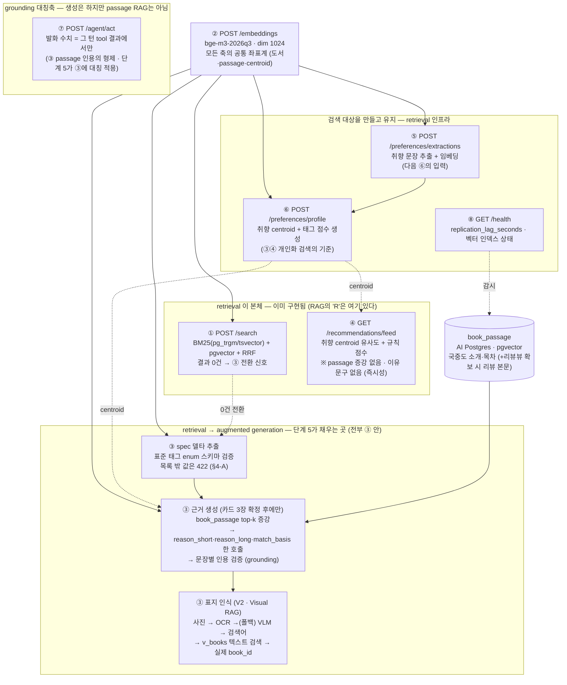
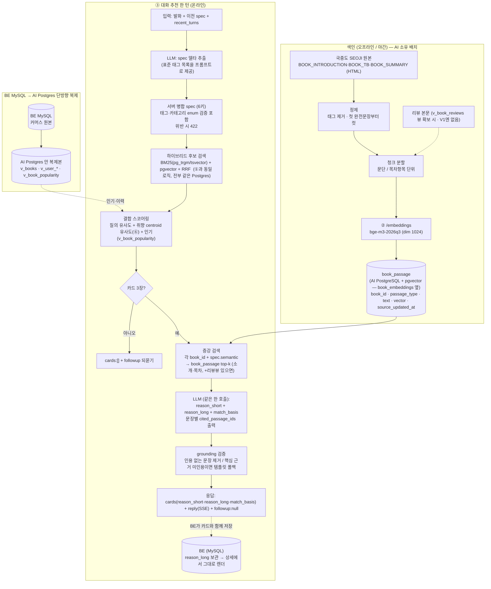
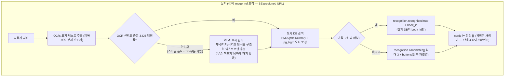

# **데이터/컨텍스트 보강 설계 (RAG · Visual RAG · RA-IS)**

---

> **⚠️ 2026-09-15 최종 결정 — `book_passage` 원문조각 RAG 폐기**
>
> 아래 §2-0·§2-A·§4-A에 서술된 `book_passage`(국중도 소개·목차 passage) 검색·인용 검증 RAG는 재검토 후 **폐기**됐다 — 고정 카드 3장의 이유 문구 생성에 벡터 인프라를 쓸 근거가 약하다는 과설계 판단. **최종안**: `reason_long`은 `v_books.description`만 근거로 ③ 카드 생성 한 호출에서 생성하며, 별도 passage 검색·인용 파이프라인이나 `book_passage` 테이블 자체를 두지 않는다. `preset_vectors`도 같은 결론(2026-09-14 결정과 동일)으로 미채택. **AI 소유 테이블은 `book_embeddings`·`taste_profile`·멱등 기록 3종만 유지한다.** Visual RAG(§2-B·§4-B, 표지 인식)는 이 결정과 무관하며 그대로 유효하다.
>
> 아래 본문 중 `book_passage` 인덱싱·검색·grounding 검증 관련 서술(§2-0의 `BP` 노드, §2-A, §4-A 상단)은 **폐기된 설계를 이력 추적용으로 남긴 것**이며 현재 구현 대상이 아니다.

---

## **0. 이 문서가 답하는 것**

### **제출 항목 매핑**

| **제출 항목** |
| --- |
| 우리 API·기능 정의 ↔ 검색 증강 매핑 (기능 정의 다이어그램) |
| 전체 데이터 흐름도 (입력 → 검색 → 증강 → 응답/생성) |
| 사용 데이터/지식 소스와 선택 이유 |
| 검색·임베딩·인덱싱 구현 + 모델 통합(프롬프트·입력 포맷) |
| 도입 전후 예상 효과·검증 계획 / 불필요 판단 |

### **모델 유형 매핑 (단계 4와 같은 방식)**

단계 5의 5개 하위 과제 중 북적북적에 **실제로 해당하는 것은 1번(텍스트/LLM)과 2번(비전) 둘**이다. 나머지는 배제 근거를 답으로 적는다.

| **하위 과제** | **우리 서비스에서** | **판정** |
| --- | --- | --- |
| **1. 텍스트 RAG** | ③ 대화 추천의 근거 생성(`reason_short`+`reason_long`+`match_basis`, 한 호출) · ③ spec 델타 추출 | **2026-09-15 폐기** — `book_passage` RAG는 미채택, `reason_long`은 `v_books.description`만 근거로 생성. 상세는 상단 배너·§4-A 참고 |
| **2. Visual RAG** | V2 표지 인식("사진으로 책 찾기") | **해당** — V1은 사진을 OCR+VLM으로 검색어로 바꿔 **도서 DB(텍스트)를 검색**. 표지 이미지 임베딩은 V2+ 확장(국중도에 표지 URL 있음). 단계 4 "VLM 모델 미정"의 답 |
| 3. Speech RAG | 서비스에 음성 기능 없음 | **배제** — §5-C |
| 4. RA-IS / RA-VG | 서비스에 생성 기능 없음 | **배제** — §5-C |
| 5. 기타 / 재학습 | 임베딩 재적재 · 택소노미 enum 갱신 · 캐시 무효화 · 도메인 파인튜닝 | 해당 — §4-D, §5-D |

---

## **1. 배경 — 현재 파이프라인에서 컨텍스트가 얇은 지점**

| **지점** | **지금 LLM이 받는 컨텍스트** | **문제** |
| --- | --- | --- |
| ③ `cards[].reason_short` + `reason_long` + `match_basis` 생성 (**한 번의 LLM 호출**) | 카드 메타(`v_books`: 제목·저자·분야·판매가·`description`) + 그 턴 `spec` | 책 "내용" 근거가 `description`(출판사 도입부, ~14% 공백) 하나뿐 → 분위기·문체·주제 주장이 환각 가능. `reason_long`(최대 300자)은 근거 대비 길어 수사로 채워지기 쉬움 |
| ③ spec 델타 추출 | 발화 + 이전 spec + `recent_turns` | 자유어("힐링되는")를 표준 태그로 정규화하는 사전이 없음 → `spec_schema_violation`(422) 유발 |
| V2 표지 인식 | 사용자 사진 | 표지 판독 결과를 카탈로그와 대조 안 하면 카탈로그 밖 답변 가능 |

---

## **2. 전체 데이터 흐름도**

### **2-0. 우리 API에서 RAG가 꽂히는 자리 (기능 정의 ↔ 검색 증강 매핑)**



| **#** | **기능 (명세)** | **절** |
| --- | --- | --- |
| ① `POST /search` | 하이브리드 retrieval 그 자체 (BM25 + 벡터 + RRF). RAG의 "R"이 여기 이미 있다 | **변경 없음** |
| ② `POST /embeddings` | 모든 검색축(도서 문서·passage·centroid)의 공통 임베딩. 별도 모델 금지 | **변경 없음** (passage도 `purpose=document`로 색인) |
| ③ `POST /recommendations/chat` | 단계 5의 핵심. (a) spec 델타의 태그·카테고리를 표준 enum으로 스키마 검증(422, `preset_vectors` 벡터 매칭은 미채택), (b) 카드 3장 확정 후 `book_passage` 증강 → 이유 한 호출 생성 + 문장 인용 검증, (c) V2 표지 인식(Visual RAG) | **입력 컨텍스트만 확장.** 계약 필드 불변, `cited_passage_ids`는 내부 감사 로그 전용 |
| ④ `GET /recommendations/feed` | 취향 centroid 유사도 기반 retrieval 채점. **passage 증강·이유 문구 없음** — 즉시성 요구(단계 4 파이프라인 C) | **변경 없음** |
| ⑤ `POST /preferences/extractions` | 추출한 취향 문장을 ②로 임베딩해 검색 공간에 편입. retrieval 대상을 만드는 쪽 | **변경 없음** |
| ⑥ `POST /preferences/profile` | 개인화 검색의 기준(centroid·태그 점수) 생성. 온보딩 태그·카테고리는 호출 시점에 ②로 즉시 임베딩(사전계산 테이블 없음) | **변경 없음** |
| ⑦ `POST /agent/act` | passage 인용 grounding의 형제 — "발화 수치 = tool 결과에서만". 단계 5는 이 원리를 ③ 근거 생성에 대칭 적용 | **변경 없음** |
| ⑧ `GET /health` | `book_passage` 인덱스 상태·`replication_lag_seconds` 감시. `X-Degraded: rag-off`는 AI 내부 헤더(명세 `degraded`와 별개) | AI 내부 헤더 1개 추가 (계약 밖) |

---

### **2-A. 텍스트 RAG — 입력 → 검색 → 증강 → 응답**



- **긴 이유(`reason_long`)는 이 한 호출이 마지막 생성 지점이다.**
    - 캐시 테이블·`context:feed`·`llm-off` 강등은 명세에서 삭제됐다. BE가 `reason_long`을 카드와 함께 보관했다가 상세 페이지에서 그대로 보여준다 — 같은 책을 다시 열어도 AI를 부르지 않는다.
- **④ 피드는 RAG는 물론 이유 자체가 없다**
    - `items[]` 는 `book_id·title·author·price·in_stock·cover_url·match_score` 뿐. 피드→상세도 이유 영역 없음
- **`cited_passage_ids` 는 ③ 내부 grounding 검사용이며 계약에 실리지 않는다.**
    - BE가 화면에 근거를 보여줄 재료는 `match_basis`. 감사 로그에는 남긴다.

### **2-B. Visual RAG — 표지 인식 (V2)**

**이미지 벡터 DB는 두지 않는다.** 
사진을 OCR+VLM으로 **검색어(텍스트)로 변환**한 뒤, 기존 도서 DB(제목·저자 텍스트 인덱스)를 검색한다. 

Visual RAG의 정의를 "이미지 쿼리로 텍스트 KB를 검색"으로 잡으면 정확히 이 구조다 
— 이미지 임베딩 최근접이 아니라 이미지→텍스트 변환 + 텍스트 검색.



- **OCR 먼저, VLM은 폴백.**
    - 대부분의 표지 사진은 제목이 읽히므로 OCR로 끝난다. OCR이 실패하거나(글꼴·각도·가림) DB 매칭이 안 되면 VLM에 넘긴다.
- **VLM의 역할은 "책 이름 대답"이 아니라 "사진 → 검색어 추출"** 로 제한한다.
    - VLM이 자유롭게 답하면 카탈로그 밖 책을 지어낼 수 있다 
    — 최종 매칭은 항상 DB 검색이 결정하고, VLM은 검색에 넣을 텍스트만 만든다.
- **결과는 무조건 실제 `book_id`.**
    - 검색으로 못 찾으면 `candidates: []` + 재촬영/직접 입력 안내. "우리 서점에 있는 책만" 이 구조적으로 보장된다.

---

## **3. 사용 데이터 / 지식 소스와 선택 이유**

### **3-A. 텍스트 지식 베이스**

| **소스** | **내용** | **선택 이유** | **위험 / 처리** |
| --- | --- | --- | --- |
| **국중도 `BOOK_INTRODUCTION`** (책소개) | 출판사 제공 책 소개 전문 | 카탈로그 단일 소스(2026-09-05 확정)에서 이미 적재됨. 분위기·주제·독자층 근거의 1차 재료 | HTML → 정제 필요. 신간·수험서 채움율 낮음(국중도는 CIP/납본 거친 책만) → 없으면 `description`만으로 강등 |
| **국중도 `BOOK_TB`** (목차) | 장·절 제목 | "실용서에서 무엇을 다루는지", "소설 챕터 구성" 근거. 논픽션 추천 이유에 특히 유효 | HTML 리스트 → 항목별 청크. 소설은 목차가 빈약 → passage_type 가중치 낮춤 |
| **국중도 `BOOK_SUMMARY`** | 짧은 요약 | 소개문이 빈 책의 폴백 | 길이 짧음 — 단독으로는 근거 부족, 보조로만 |
| **리뷰 본문** | 구매자 작성 텍스트 | "다른 독자평" 근거 — `match_basis`에 "독자 반응" 라벨을 열 수 있음 | **명세에 리뷰 본문 뷰가 없다.** 노출된 건 `v_user_reviews`(내 별점 1–5, ⑥ 취향용)와 `v_book_popularity.rating_avg/count`(집계)뿐. 본문을 passage로 쓰려면 **새 읽기전용 뷰 `v_book_reviews`(book_id·body·rating) BE 합의 필요** — V1은 없이 출시, 확보되면 추가 |
| **태그·카테고리 택소노미** | ONBOARD-003 관심 카테고리 / 004 세부 태그의 표준 값 | spec 델타 추출 시 enum 스키마 검증 기준(§4-A) | 값이 개정되면 서버 상수만 갱신(재계산 불필요) |
| `v_books` · `book_embeddings` · `taste_profile` | 기존 자산 | 이미 색인·벡터화됨 — 재사용 | — |

**`book_passage` 를 어디에 두는가** (DB 구조 확정 2026-09-09):

- **AI 서버 = pgvector 얹은 PostgreSQL.**
    - BE 커머스 원본(MySQL)은 **BE MySQL → AI Postgres 단방향 복제**로 AI 쪽에 `v_books`·`v_user_*`·`v_book_popularity` 로 들어온다(역방향 없음). AI가 만든 값이 BE로 가는 경로는 **응답 본문 + tool 호출뿐**
- `book_passage`·`book_embeddings`·`taste_profile` 는 전부 **이 AI Postgres 한 곳**에 둔다. 복제돼 들어온 커머스 테이블도 같은 DB에 있으므로:
    - **하이브리드 검색이 한 엔진**이다 — BM25(`pg_trgm`/`tsvector`) + `pgvector` ANN 을 같은 Postgres에서 돌리고 RRF만 앱에서(①③ 공통). 별도 검색 스토어 불필요.
    - `book_passage.book_id` 는 복제된 도서 테이블을 **실제 FK로** 참조 가능. 도서 삭제 전파도 복제로 처리
- 색인 배치가 읽을 원문(`BOOK_INTRODUCTION`/`BOOK_TB` 전문)은 복제본 `v_books`에 없다(`description` 도입부만) → **AI 소유 야간 배치가 국중도 SEOJI 원본을 직접** 받아 청킹·임베딩한다. 이건 커머스 복제 흐름과 무관한 AI 파생 데이터.

### **3-B. 표지 인식용 데이터 — 새 저장소 없음**

| **재료** | **선택 이유** | **위험 / 처리** |
| --- | --- | --- |
| **기존 도서 DB의 제목·저자 텍스트 인덱스** (`v_books`, BM25/pg_trgm) | "사진으로 책 찾기"의 대부분은 제목이 읽히는 사진 

→ 텍스트 검색으로 해결된다. 

이미 있는 인덱스를 그대로 검색 대상으로 씀 | 동명이서 → 저자·출판사로 좁힘, 그래도 애매하면 candidates 3개 |
| OCR (표지 텍스트) | 1차 신호. 가볍고 대부분 케이스를 커버 | 스타일 글꼴·각도·부분 가림 시 실패 → VLM 폴백 |
| VLM (표지 판독 폴백) | OCR 실패분만. 제목/저자/시리즈 단서를 **구조화 텍스트로 추출**하는 용도 (책 이름을 "답"하게 하지 않음) | 자유 응답 시 카탈로그 밖 환각

→ 최종 매칭은 DB 검색이 결정, VLM은 검색어만 생성 |
| (향후) 국중도 표지 이미지 URL | 이미지 임베딩 인덱스 확장 시 색인 소스. 

**국중도 서지에 URL 존재 확인됨** | V2+ 옵션. 

트리거·설계는 하단에 |

**V1에서 표지 이미지를 색인하지 않는 이유**: 

(1) 새 인프라(이미지 인코더·벡터 테이블·유사도·임계 튜닝)를 얹는 값어치가, 텍스트가 안 읽히는 소수 케이스에 비해 V1 시점엔 크지 않다. 

(2) OCR+VLM+텍스트 검색만으로도 "실제 DB에 있는 책만 반환" 이라는 요구는 이미 만족된다.

**단, 표지 이미지 URL은 국중도 서지에 있다**

 — 이미지 임베딩 인덱스로의 확장 경로는 열려 있다. V1은 텍스트 검색으로 출시하고, 아래 트리거가 관측되면 표지 벡터 인덱스를 얹는다.

### **3-C. 음성 / 생성 데이터 — 없음**

음성 데이터베이스, 이미지/영상 예제 DB는 **구축하지 않는다.** 서비스에 음성 입출력·생성 기능이 없다(§5-C).

---

## **4. 구현 — 검색 · 임베딩 · 인덱싱 · 모델 통합**

### **4-A. 텍스트 RAG**

> **폐기 공지 (2026-09-15)** — 아래 인덱싱·검색·모델 통합·grounding 검증 절(§4-A 상단, "spec 델타 추출의 태그 정규화" 절 이전까지)은 `book_passage` RAG 폐기 결정으로 적용하지 않는다. 실제 구현은 `reason_long`을 `v_books.description`만으로 ③ 카드 생성 한 호출에서 생성한다. 원문은 폐기 이력 추적용으로 그대로 둔다.

#### **인덱싱**

```python
# 야간 배치 — AI 소유 카탈로그 적재(국중도 SEOJI) 크론 뒤에 이어 실행
def index_passages(book_id: int, seoji: dict, reviews: list[Review] | None):
    passages= []
    intro= clean_html(seoji.get("BOOK_INTRODUCTION", ""))     # 태그 제거 + 첫 완전문장부터
    for parain split_paragraphs(intro):
        if len(para) >= 40:
            passages.append(("intro", para))
    for itemin parse_toc(seoji.get("BOOK_TB", "")):            # 목차 항목별
        passages.append(("toc", item))
    if not intro:
        passages.append(("summary", clean_html(seoji.get("BOOK_SUMMARY", ""))))
    for rvin filter_quality(reviewsor [])[:20]:               # v_book_reviews 뷰 확보 시에만
        passages.append(("review", rv.body[:300]))

    vectors= call_embeddings_api([tfor _, tin passages], purpose="document")  # ② 재사용
    upsert_book_passage(book_id, [                              # AI PostgreSQL (book_embeddings 옆)
        Passage(book_id, ptype, text, vec, source_updated_at=now())
        for (ptype, text), vecin zip(passages, vectors)
    ])
```

- **임베딩 = ② `/embeddings` (`bge-m3-2026q3`, dim 1024) 재사용.** 도서 문서 벡터·취향 centroid·passage 벡터가 같은 좌표계여야 `spec.semantic` 하나로 셋 다 검색 가능. 별도 모델 금지. `purpose` 는 명세 enum(`query`/`document`)만 있으므로 passage도 `document` 로 색인.
- **저장소**: `book_passage` 는 **AI PostgreSQL**에 `book_embeddings` 와 나란히. `vector(1024)` 컬럼 + HNSW 인덱스. BM25용 `tsvector`/`pg_trgm` 도 같은 테이블/DB.
- **규모**: passage 수 ≈ 도서 수 × 8~~15 → 5만 종이면 40~~75만 행. E2 실측(전수 스캔 N=20만 p95 7.5ms) 근거로 ANN이면 여유.

#### **검색 (증강용)**

```python
def retrieve_passages(book_id: int, spec: Spec, k: int = 5) -> list[Passage]:
    axis= spec["semantic"] or " ".join(spec["filters"].get("tags", []))
    if not axis:
        return top_passages_by_type(book_id, prefer=["intro", "toc"], k=k)   # spec 의미축 없음
    qv= call_embeddings_api([axis], purpose="query")[0]
    hits= ann_search(qv, table="book_passage", filter={"book_id": book_id}, limit=k* 2)
    # passage_type 가중치: intro 1.0 / review 0.9 / toc 0.7 / summary 0.5
    return rerank_by_type_weight(hits)[:k]
```

- 카드 3장이 **결정된 뒤에만** 호출된다 — 후보 검색·스코어링(단계 4 파이프라인 B)은 그대로.
- 3장 각각에 대해 병렬로 `retrieve_passages` → 한 번의 ③ LLM 호출 입력에 3카드 × k passage 를 함께 싣는다(`reason_short`+`reason_long`+`match_basis` 를 카드별로 한 번에 생성).

#### **모델 통합 — 입력 포맷 (③ 근거 생성, 한 호출에 3카드)**

LLM 입력은 JSON 블록으로 고정한다. `passages[]`에 `id`를 붙여 출력이 그 id로 인용하게 강제한다. 한 호출이 카드 3장의 짧은 이유·긴 이유·근거를 모두 낸다.

```
[SYSTEM]
너는 이미 선정된 책 카드에 "추천 이유"를 붙이는 편집자다. 카드마다 다음을 만든다:
- reason_short : 1문장, 카드 배지용
- reason_long  : 2~4문장, 최대 300자, 도서 상세 페이지용
- match_basis  : 근거 항목 {label, detail}
규칙:
- passages 에 있는 내용만 근거로 쓴다. passages 밖 사실(수상·판매량·저자 이력 등)은 쓰지 않는다.
- 각 문장이 근거로 삼은 passage id를 sentences[].cited 로 함께 낸다. 근거가 없으면 그 문장을 쓰지 마라.
- match_basis 의 detail 은 passages 에서 인용한 표현이어야 한다.
- reason_long 을 근거만으로 못 채우면 억지로 늘리지 말고 짧게 둔다(뒤에서 null 처리될 수 있음).

[USER]
{
  "spec": {"semantic": "이별 후 위로가 되는 잔잔한 소설", "filters": {"tags": ["에세이"], "page_max": 300}},
  "cards": [
    {"book_id": 8842, "title": "...", "author": "...", "category": "에세이", "price": 13500,
     "passages": [
       {"id": "p1", "type": "intro", "text": "이별 이후의 계절을 담담한 문장으로 ..."},
       {"id": "p2", "type": "toc",   "text": "3장 — 혼자 남은 방의 온도"},
       {"id": "p3", "type": "review","text": "울고 싶을 때 읽었는데 과하지 않아서 좋았다"}
     ]}
  ]
}

[ASSISTANT]  ← 기대 출력
{
  "cards": [
    {
      "book_id": 8842,
      "reason_short": "이별 이후를 담담하게 다뤄 과하지 않게 위로가 되는 산문이에요.",
      "reason_long": "이별 이후의 계절을 담담한 문장으로 따라갑니다. 감정을 몰아붙이지 않아 '울고 싶을 때 읽어도 과하지 않았다'는 반응이 있고, 짧은 호흡이라 부담이 적어요.",
      "match_basis": [
        {"label": "분위기", "detail": "담담한 문장", "cite": "p1"},
        {"label": "독자 반응", "detail": "과하지 않은 위로", "cite": "p3"}
      ],
      "sentences": [
        {"text": "이별 이후의 계절을 담담한 문장으로 따라갑니다.", "cited": ["p1"]},
        {"text": "감정을 몰아붙이지 않아 ... 반응이 있고", "cited": ["p3"]},
        {"text": "짧은 호흡이라 부담이 적어요.", "cited": ["p2"]}
      ]
    }
  ]
}
```

#### **grounding 검증 (⑦ 에이전트 `enforce_grounding`의 텍스트판)**

```
def enforce_citations(card_gen: LlmCard, passages: list[Passage]) -> ReasonSet:
    valid= {p.idfor pin passages}
    kept= [sfor sin card_gen.sentencesif s.citedand set(s.cited) <= valid]
    basis= [bfor bin card_gen.match_basisif b.citein valid]

    if not kept:                                        # 근거 문장이 하나도 안 남음
        # reason_short 는 규칙 템플릿으로 최소 1줄 확보(명세: 못 만든 책은 카드에서 제외)
        short= template_short(card_gen.card, card_gen.spec) or None
        return ReasonSet(reason_short=short, reason_long=None, match_basis=basis)

    short= join(kept[:1])[:120]
    long_= join(kept)[:300] if len(kept) >= 2 else None  # 2문장 미만이면 긴 이유 null
    return ReasonSet(reason_short=short, reason_long=long_, match_basis=basis,
                     cited_passage_ids=sorted({cfor sin keptfor cin s.cited}))  # 감사 로그용
```

- **`reason_short` 를 못 만든 카드는 명세대로 응답에서 제외**(그래서 3장보다 적을 수 있음). `reason_long` 만 비면 카드는 남기고 `null`.
- `X-Degraded: rag-off` — `book_passage` 인덱스 장애 시 passage 없이 메타데이터(`v_books.description`)만으로 생성, 200 유지. (명세의 `degraded` 와 별개인 AI 내부 헤더)
- `cited_passage_ids` 는 **감사 로그에만** 남긴다 — 계약 필드도, 저장 테이블도 없다(캐시 삭제됨).

#### **spec 델타 추출의 태그 정규화 — 미채택 (벡터 검색 → enum 검증으로 대체, 2026-09-14)**

당초 자유어를 `preset_vectors`(태그·카테고리별 사전계산 벡터) 최근접 검색으로 표준 태그에 매핑하는 "얕은 RAG"를 제안했으나, 재검토 후 도입하지 않기로 했다. 

표준 태그·카테고리는 ONBOARD-003/004가 정한 **몇십 개짜리 고정 목록**이라 벡터 유사도로 "비슷한 걸 찾는" 문제가 아니라 "목록에 있는 값인지 아닌지"를 가리는 문제다 

— 벡터 인프라(임베딩 호출 + 별도 테이블 + ANN 검색)를 둘 근거가 약하고, 유사도 매칭은 "비슷하지만 틀린" 태그를 확정값처럼 돌려줄 위험도 있다.

```
STANDARD_TAGS= load_onboarding_taxonomy()   # ONBOARD-003/004 고정 목록, 배포 시 상수로 로드(재계산 불필요)

def build_spec_delta_prompt(message: str, prior_spec: dict) -> str:
    return SPEC_DELTA_PROMPT.format(standard_tags=STANDARD_TAGS, message=message, prior_spec=prior_spec)
    # "categories/tags는 반드시 이 목록 중에서만 골라라" 를 프롬프트로 강제

def validate_spec_delta(delta: dict) -> dict:
    bad= [tfor tin delta.get("filters", {}).get("tags", []) + delta.get("filters", {}).get("categories", [])
           if tnot in STANDARD_TAGS]
    if bad:
        raise SpecSchemaViolation(422, detail=f"표준 목록 밖 값:{bad}")   # 호출자가 초기 spec으로 1회 재시도
    return delta
```

**대체 근거**: LLM에게 표준 목록을 프롬프트로 주고 "이 중에서만 골라라"고 지시하는 것만으로는 강제가 안 된다(LLM이 프롬프트를 무시할 수 있음). 

그래서 프롬프트 지시 뒤에 **목록 밖 값을 스키마 검증에서 걸러 422로 거부**하는 단계를 반드시 둔다 

— 이미 있는 `spec_schema_violation`(422) 경로에 태그·카테고리 값 검증만 추가하는 것이라 새 에러 코드도 필요 없다. 벡터 유사도(근사치)보다 이쪽이 "표준값이거나 에러" 라는 더 확실한 보장이다.

### **4-B. Visual RAG — 표지 인식 (V2)**

**새 인덱스 없음.** 검색 대상은 이미 있는 `v_books` 의 제목·저자 텍스트 인덱스(BM25 + pg_trgm). 명세상 표지 인식 결과는 `recognition{recognized, book_id, candidates[]}` 이고 `candidates[]` 는 `confidence` 내림차순 최대 3개 — 아래 흐름의 출력이 그 형태다.

#### **질의 + 모델 통합**

```python
def recognize_cover(image_ref: str) -> Recognition:
    img= fetch_presigned(image_ref)                    # BE presigned URL (multipart 아님)

    # 1) OCR 먼저 — 대부분의 표지 사진은 여기서 끝난다
    ocr= run_ocr(img)                                  # {title?, author?, publisher?, raw_lines[]}
    hits= search_books(ocr, limit=10) if ocr.textelse []

    # 2) OCR 실패 or DB 매칭 실패 → VLM 폴백 (검색어 추출 전용)
    if not confident(hits):
        vlm= vlm_extract_cover_fields(img)             # 프롬프트로 "제목/저자/시리즈만 뽑아라" 강제
        hits= search_books(vlm, limit=10)              # 최종 매칭은 여전히 DB 검색

    if confident_single(hits):
        return Recognition(recognized=True, book_id=hits[0].book_id, candidates=[])
    return Recognition(recognized=False, book_id=None,
                       candidates=[h.book_idfor hin hits[:3]])   # + buttons(선택·재촬영)

def search_books(fields, limit) -> list[BookHit]:
    # 제목 BM25 + 저자/출판사 필터 + pg_trgm 오타 보정. 전부 book 테이블.
    q= fields.get("title") or " ".join(fields["raw_lines"])
    return bm25_trgm_search(q, author=fields.get("author"), limit=limit)
```

VLM 폴백 프롬프트 (입력 포맷) — **"무슨 책인지" 를 묻지 않는다**:

```
[SYSTEM]
표지 사진에서 아래 필드만 그대로 옮겨 적어라. 사진에 없으면 null.
책 제목을 "추측"하지 마라 — 표지에 인쇄된 글자만.
{ "title": ..., "subtitle": ..., "author": ..., "publisher": ..., "series": ... }
```

- **OCR → (실패 시) VLM → DB 검색** 순서. VLM은 OCR이 못 읽는 소수 케이스(스타일 글꼴·각도·부분 가림)만 담당하고, 하는 일은 "사진 → 검색 필드" 변환뿐이다.
- **최종 매칭은 항상 DB 검색이 결정한다.** VLM/OCR은 검색어만 만든다 → 결과는 무조건 실제 `book_id`, "우리 서점에 있는 책만" 이 구조적으로 보장된다(③ 근거 생성의 grounding과 같은 원리).
- V1에서 이미지 임베딩 인덱스를 두지 않는 이유는 §3-B.
- 인식 성공해도 `cards`는 항상 `[]`, `spec.anchor_book`은 사용자가 후보를 고른 뒤 BE가 채운다(AI 재호출 없음) — "확정은 사람이 한다"(단계 4 파이프라인 B).
- 이게 단계 4 "VLM 모델 미정" 열린 질문의 V1 답이다 — **무거운 생성형 VLM은 불필요**, OCR + (경량) 표지 판독 VLM 폴백 + 기존 텍스트 검색으로 충분.

#### **향후 확장 — 표지 이미지 임베딩 인덱스 (V2+)**

국중도 서지에 표지 이미지 URL이 있으므로, 아래가 관측되면 이미지 벡터 검색을 **텍스트 검색 위에 얹는다**(대체가 아니라 추가 신호).

| **재평가 트리거** | **방식** |
| --- | --- |
| ⓐ OCR+VLM 폴백에도 인식 실패율이 목표(예: recall@3 90%) 미달 | 카탈로그 표지 URL → 이미지 인코더(CLIP류) → `book_cover_embedding`(AI PostgreSQL). 야간 배치 + lazy(미색인 후보 나오면 그 시점 색인) |
| ⓑ VLM 폴백 호출 비율이 높아 비용·지연이 문제 | 사진 임베딩 최근접을 OCR과 **RRF 결합**(①의 RRF 재사용) → VLM 호출 자체를 줄임 |
| ⓒ 표지 리커버(개정판 표지)·굿즈 세트 등 텍스트만으로 구분 안 되는 케이스 다수 | 이미지축이 이 구분을 담당 |
- 확장해도 **최종 후보는 여전히 DB의 `book_id`** — 이미지 최근접도 카탈로그 표지에 대해서만 계산하므로 "DB에 있는 책만" 은 유지된다.
- 이미지 인코더는 임베딩 모델 교체(§4-D)와 **별도 재적재 트랙** — `book_cover_embedding`만 재계산.

### **4-C. 음성 / 생성 — 구현 없음 (§5-C)**

### **4-D. 재적재·재학습 (운영)**

| **대상** | **트리거** | **방식** |
| --- | --- | --- |
| passage 재색인 | 국중도 소개문 개정 (`source_updated_at` 변화) · (리뷰뷰 확보 시) 리뷰 CRUD | 해당 book_id만 재청크·재임베딩 |
| 임베딩 전량 재계산 | 임베딩 모델 교체 (e5-small 트랙 채택 시) | `model`+`dim` 동시 변경 → **shadow 인덱스** 빌드 후 원자 스위치(무중단). AI PostgreSQL의 `book_embeddings`·`book_passage`·`taste_profile`(centroid) 전부 대상 |
| 표준 태그 enum | 태그·카테고리 택소노미 개정 | 서버 상수 갱신 + 배포 (재계산·재색인 불필요) |
| 캐시 무효화 | — | **해당 없음** — 명세에서 `reason_cache`/`reason_ref` 삭제됨. 긴 이유는 BE가 카드와 함께 보관, 재생성은 다음 추천 턴에서 자연히 새로 만들어짐 |
| 임베딩 도메인 파인튜닝 | 분기별 | 질의–클릭 도서 쌍으로 한국어 도서 도메인 적응. bench recall 게이트 통과가 배포 조건 |
| reason few-shot 풀 | 주간 | 체류·클릭률 높은 `reason_long` 축적 → **retrieval-augmented few-shot**: 유사 도서의 우수 근거문을 스타일 예시로 검색해 프롬프트에 첨부 (Re-Imagen이 이미지–텍스트 쌍을 검색하는 것의 텍스트판) |

---

## **5. 도입 전후 효과 · 검증 계획 / 불필요 판단**

### **5-A. 텍스트 RAG — 예상 효과**

| **지표** | **전 (메타데이터만)** | **후 (passage 증강)** | **측정 방법** |
| --- | --- | --- | --- |
| 근거 문장의 사실성 | 근거가 `description`(도입부, 14% 공백) 하나뿐 → 분위기·문체 주장 검증 불가 | 모든 문장에 인용 passage, 미인용 문장 자동 제거 | LLM-judge: 문장 ↔ 인용 passage 함의 판정 (샘플 200) |
| `reason_long` 사실성 | 근거 대비 길어 수사로 채워짐 | 목차·(리뷰뷰 있으면)독자평이라는 새 근거 유입, 없으면 `null` | 사람 평가: "이 책 안 읽고도 왜 추천인지 알겠다" 리커트 5점 |
| spec 추출 422율 | 자유어 → 비표준 태그 | 표준 태그 힌트로 정규화 | `bench/`에 자유어 30질의 추가, 422 발생률 |
| 카드 누락율 (`reason_short` 못 만듦) | 근거 부족 시 억지 생성 | 근거 없으면 규칙 템플릿 최소 1줄, 그래도 안 되면 카드 제외 | 카드 3장 대비 실제 반환 수, 제외율 SLO 15% |

**검증 계획 (bench 확장)** — `bench/`에 이미 `eval_gold.json`(29질의)·`bench_hybrid.py`·LLM-judge 하니스(`make_gold_llm.py`)가 있다.

1. **passage recall@k**: 골드셋에 "이 질의–책 쌍의 근거가 될 passage id" 라벨 추가 → `retrieve_passages`가 그 passage를 top-k에 넣는 비율.
2. **인용 정확도**: 생성된 각 문장과 인용 passage를 LLM-judge로 함의 판정(entailed / neutral / contradicted). contradicted = 0 을 게이트로.
3. **A/B**: `X-Degraded: rag-off`(메타만) vs 정상(passage 증강)을 같은 질의셋에 돌려 카드 CTR·상세 진입율·상세 체류시간 비교.
4. **강등 회귀**: passage 인덱스 죽여도 ③이 200으로 응답하는지 (rag-off 경로 — `reason_long`은 `null` 가능, `reason_short`는 규칙).

### **5-B. Visual RAG (표지 인식) — 예상 효과 · 검증**

| **지표** | **VLM에 "무슨 책?" 직접 질문 (가정)** | **OCR → VLM 폴백 → DB 검색** | **측정** |
| --- | --- | --- | --- |
| 카탈로그 밖 답변 | 가능 (환각으로 없는 책 이름) | 구조적으로 0 — 결과는 DB 검색이 낸 `book_id`뿐 | 인식 결과가 항상 유효 `book_id`인지 |
| 신간 인식 | 모델 학습 시점 의존 | DB에 책만 있으면 즉시 | 최근 30일 신간 표지 100장 top-1 |
| 인프라 비용 | 큰 VLM 상시 호출 | OCR 상시 + VLM은 실패분만 (호출량 대폭↓) | VLM 호출 비율 |

**검증 계획**: 표지 사진 골드셋 구축(사내 도서 200종, 조건별 3장씩 — 정면/각도/부분가림) →

- top-1 accuracy, recall@3
- **`recognized:true` 오발동률** (잘못된 책을 확신) — 이걸 최우선 지표로. 임계는 오발동률 낮추는 쪽으로 보수적 설정, 애매하면 candidates로 떨어뜨려 사람이 고르게.
- OCR 단독으로 끝난 비율 vs VLM 폴백까지 간 비율 — VLM 폴백률이 낮으면 큰 VLM이 정말 불필요함을 뒷받침.

### **5-C. 음성 / 이미지·영상 생성 — 도입 불필요**

| **과제** | **판단** | **근거** |
| --- | --- | --- |
| **Speech RAG** | 도입 안 함 | 서비스에 음성 입출력이 없다. 음성 질의 입력(STT → ③ 텍스트 턴)은 접근성 백로그 후보지만, SpeechRAG의 본질(음성 KB를 ASR 없이 공통 임베딩으로 검색)은 **검색 대상 음성 자산이 없어** 성립하지 않는다. 오디오북이 카탈로그에 편입되면 재검토 |
| **RA-IS / RA-VG** | 도입 안 함 | 서비스에 이미지·영상 생성 기능이 없다. 유일한 유혹은 "표지 없는 책의 표지 생성"인데, 생성 이미지를 실제 표지로 오인시키면 **상품 정보 정확성·저작권 위반** → 규칙 기반 타이포 플레이스홀더로 대체한다. 외부 이미지/영상 예제 DB도 구축하지 않는다 |

### **5-D. 재학습 주기 — 요약**

- **passage 재색인**: 이벤트 기반(소개문·리뷰 변경 시 해당 책만).
- **임베딩 파인튜닝 / 전량 재적재**: 분기 단위, shadow 인덱스로 무중단, bench recall 게이트가 배포 조건. 파인튜닝은 model 식별자 도입(ERD §7) 뒤에만 한다.
- **택소노미 enum**: 값 개정 시 서버 상수만 갱신(재계산 불필요).
- **reason few-shot 풀**: 주간.
- **캐시 무효화**: 해당 없음(명세에서 이유 캐시 삭제 — 긴 이유는 BE 보관, 다음 턴에 자연 재생성).

---

## **6. 남은 열린 질문**

- ~~AI 벡터 저장소~~ **확정 (2026-09-09)**: AI = pgvector PostgreSQL 전용. `book_embeddings`·`book_passage`·`taste_profile`·(향후)`book_cover_embedding` + 커머스 복제본이 한 DB. (`preset_vectors`는 재검토 후 미채택 — §4-A) → **남은 것**: BE MySQL → AI Postgres **복제 수단**(Debezium/CDC vs 논리복제 vs 배치)과 **복제 지연 허용치** — passage 색인은 국중도 직접이라 영향 없고, `v_book_popularity`·`v_user_*` 신선도에만 영향.
- ~~`book_passage` 원문조각 RAG~~ **폐기 (2026-09-15)**: 카드 이유 생성에 벡터 인프라를 쓸 근거가 약하다는 과설계 판단 — `reason_long`은 `v_books.description`만 근거로 생성, `book_passage` 테이블 자체를 만들지 않는다. AI 소유 테이블은 `book_embeddings`·`taste_profile`·멱등 기록 3종만 유지(위 줄의 `book_passage`·`book_cover_embedding`은 이 결정 이전 서술 — 상단 배너 참고). 아래 열린 질문 중 `book_passage` 청크 크기·리뷰 본문 뷰 신설 관련 항목은 이 폐기로 더 이상 유효하지 않다.
- 리뷰 **본문** 읽기전용 뷰(`v_book_reviews`) 신설을 BE와 합의할지 — 없으면 passage 소스는 국중도 소개·목차만.
- `book_passage` 청크 크기·passage_type 가중치 실측 튜닝.
- OCR 엔진 · 표지 판독 VLM 폴백 모델(경량) 선정, 인식 확신 임계값.
- 표지 이미지 임베딩 인덱스로 확장할지 — V1 출시 후 인식 실패율·VLM 폴백률 관측으로 판단(§4-B 향후 확장). 국중도 표지 URL은 확보 가능.
- 인용 정확도 LLM-judge 골드셋 구축 비용 (bench `make_gold_llm.py` 확장).
- e5-small 트랙으로 임베딩을 바꿀 경우 passage 포함 전량 재적재 리허설.